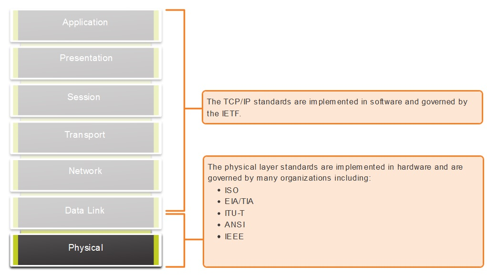
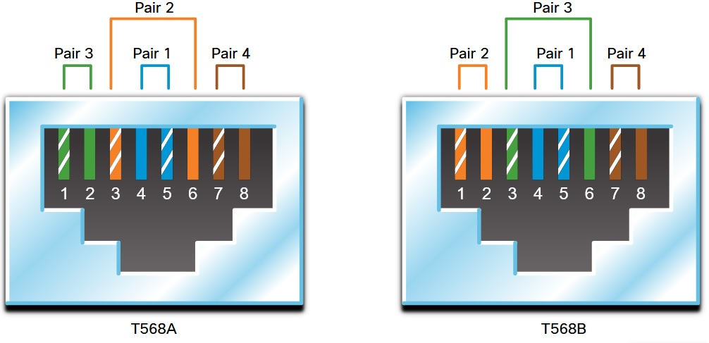
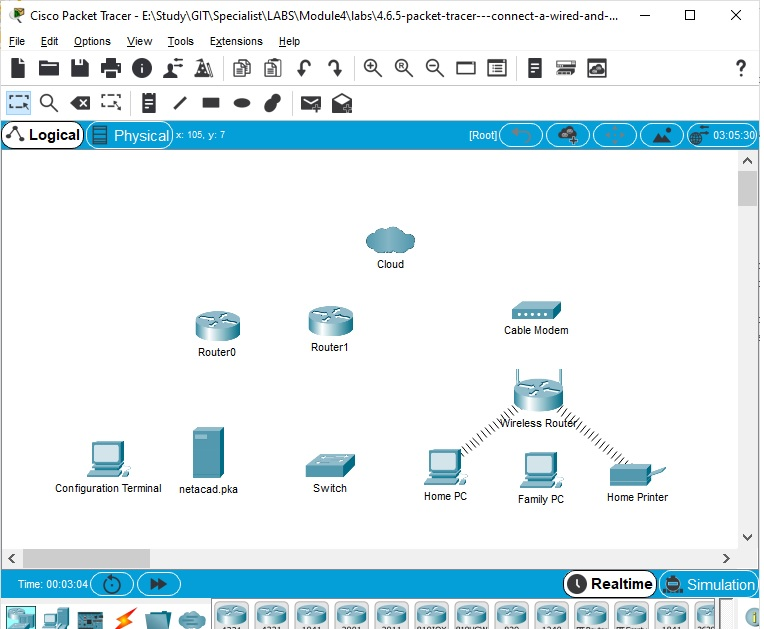
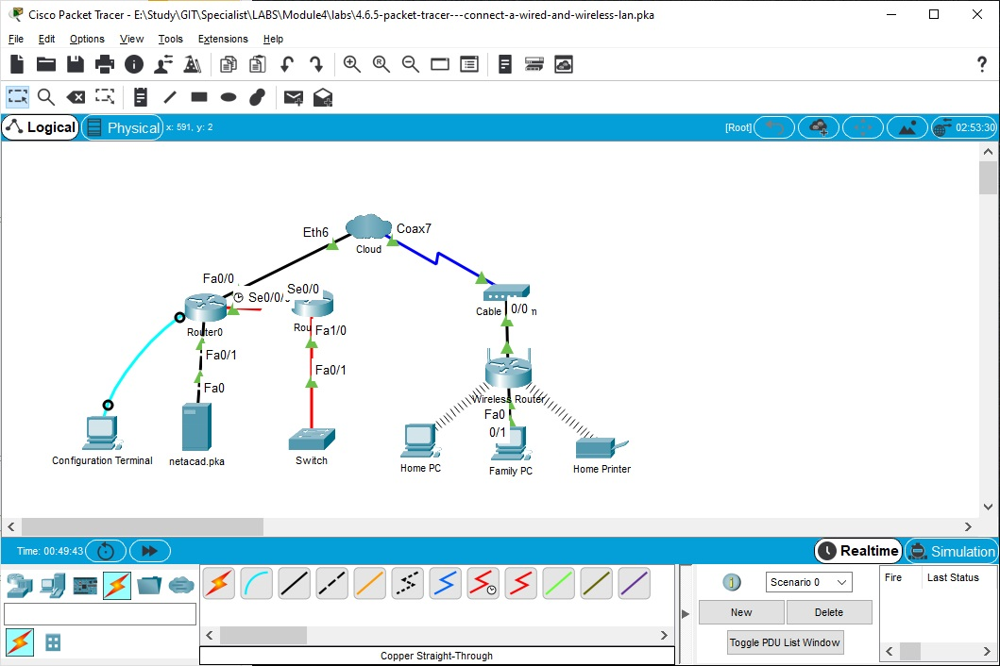
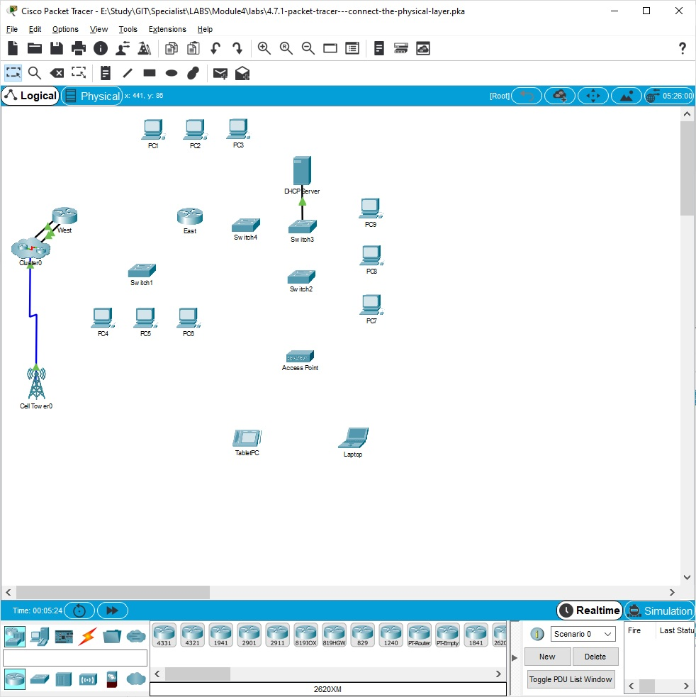
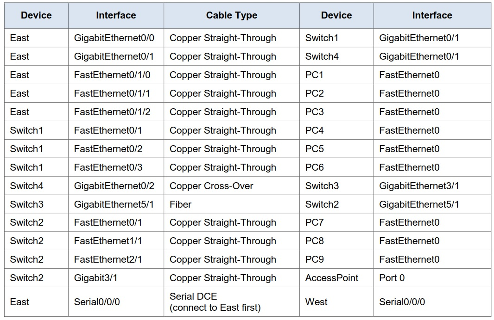
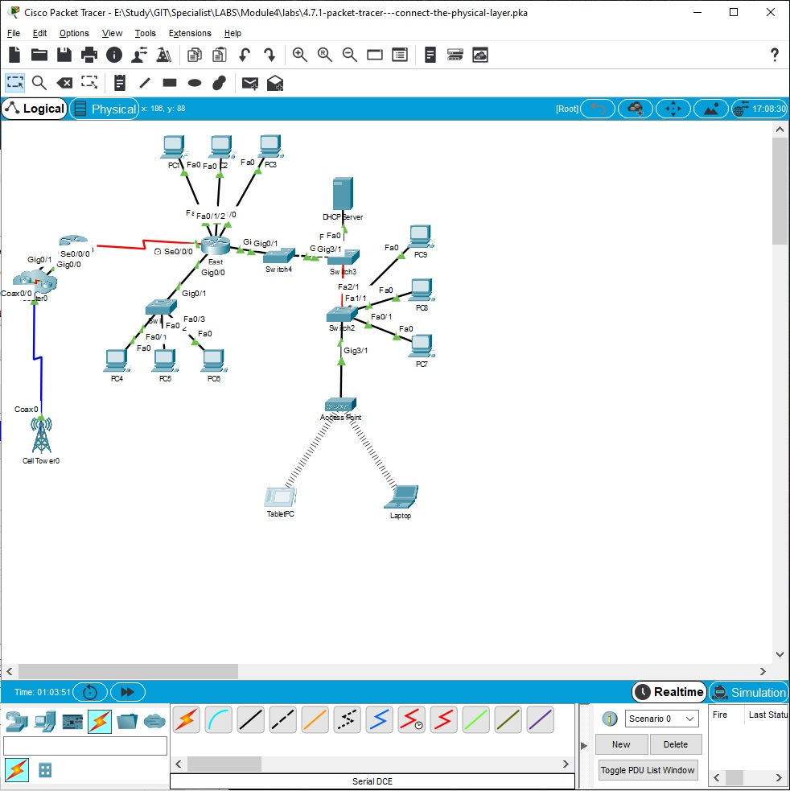

# 4.2.1 Physical Layer Standards
Маньяки, поддерживающие стандарты физического уровня (hardware, media, encoding, and signaling ) в актуальном состоянии:
   * International Organization for Standardization (ISO)
   * Telecommunications Industry Association/Electronic Industries Association (TIA/EIA)
   * International Telecommunication Union (ITU)
   * American National Standards Institute (ANSI)
   * Institute of Electrical and Electronics Engineers (IEEE)
   * National telecommunications regulatory authorities including the Federal Communication Commission (FCC) in the USA and the European Telecommunications Standards Institute (ETSI)

Также поблагодарим региональных участников:
   * CSA (Canadian Standards Association)
   * CENELEC (European Committee for Electrotechnical Standardization)
   * JSA/JIS (Japanese Standards Association)

Заметьте, среди них - ни одного российского ((
Для сравнения, всеми вышележащими уровнями управляется IETF:


Итак, вся эта куча народу трется вокруг следующих областей:
   * ___Physical Components___ - аппаратные составляющие/коннекторы/NIC, среда. Часть безумных коннектров, которые до сих пор используются в Cisco 1941 - результат деятельности этих отморозков
   * ___Encoding___ - кодирование - метод превращения потока бит в определенный "код". Этот "код" может быть представлен каким-либо шаблоном электрических импульсов на передатчике/отправителе и распознан оборудованием приемника/получателя, не смотря на достаточно веселую картину помех в передающей линии. Помним, что дошедший сигнал часто бывает бледной тенью отправленного сигнала. Поэтому у радиста такие большие уши - чтобы лучше слышать, а  у аппаратной части отправителя и получателя - сложные алгоритмы кодирования/декодирования, которые позволяют добиться уверенной приемопередачи на зашумленной линии.
   Пример  - ___Манчестерское кодирование___, в котором за единицу времени передается определенное число бит (битрейт - величина обратная периоду передачи одного бит, чем выше битрейт - тем выше скорость передачи):
      * 0 - перепад от высокого напряжения к низкому
      * 1 - перепад напряжения от низкого значения к высокому
   * ___Signaling___ - сигналы передаются по среде в виде электромагнитных импульсов (свет, электричество или по-воздуху). Виды импульсов и определяют сигналинг, то способ передачи закодированных ранее нулей и единиц.

## Bandwidth
Передача по среде не может вестись бесконечно быстро, хотя при помощи кодирования можно большое число бит заменить небольшим числом сигналов. Скорость измеряется в bps [bit pes second]
   * 1 bps
   * kbps = 1 000 bps
   * Mbps = 1 000 000 bps
   * Gbps = 1 000 000 000 bps
   * Tbps = 1 000 000 000 000 bps

При этом, качество связи вызывает к жизни ряд дополнительных характеристик: 
   * ___latency/латентность___ - время, затраченное на доставку данных от отправителя к получателю
   * ___Throughput/пропускная способность___ - переданных bit в единицу времени, как правило меньше теоретической, заявленной скорости канала (bandwidth)
   * ___Goodput___ - дополнительный запутывающий параметр, демонстрирующий разностью  между суммарно переданным и служебным трафиком, хрупкость кажущейся стабильной передачи данных.

# 4.4 стандарты UTP кабелей
   * Category 3 (voice communication, but later used for data transmission).
   * Category 5 and 5e (supports 100Mbps and Category 5e supports 1000 Mbps).
   * Category 6 (with added separator between each pair to support higher speeds. Up to 10 Gbps.)
   * Category 7 (also 10 Gbps).
   * Category 8 (up to 40 Gbps).

Оконечники UTP - RJ-45, розетки/кейстоуны в патчпанелях. Класс кабеля должен соответствовать классу кейстоунов патчпанелей. 
Which procedure is used to reduce the effect of crosstalk in copper cables?
Topic 4.4.0 - In copper cables, crosstalk is a disturbance caused by the electric or magnetic fields of a signal on one wire interfering with the signal in an adjacent wire. ___Twisting opposing circuit wire pairs together can effectively cancel the crosstalk___. The other options are effective measures to counter the negative effects of EMI and RFI, but not crosstalk.

Which characteristic describes crosstalk?
Topic 4.4.0 - EMI and RFI can distort network signals because of interference from fluorescent lights or electric motors. Attenuation results in deterioration of the network signal as it travels along copper cabling. Wireless devices can experience loss of signals because of excessive distances from a access point, but this is not crosstalk. ___Crosstalk is the disturbance caused by the electric or magnetic fields of the signal carried on an adjacent wire within the same cable.___


Кабели обжимаются/прошиваются неграми в определенном порядке, называемом кроссировкой (T568-A, T-568B). 
Неопытные мамбы часто путаются и потом переделывают только что обжатое со словами: "Ааааа", под твой возмущенный вопль "Твоюж мать, 568 раз вам сказал что  Бээээ"

В середине всегда первая, синяя пара С-БС (телефонисты попросили чтобы их не трогали, поскольку им надоело все переучивать), 4-я пара БК-К - в конце, 3-я пара БЗ-З - в начале у T568A, 2-я пара БО-О - в начале у T568B
   * Если с обеих сторон кабеля A или B, то все ПРЯМО скучно (Straight-through) - подключались раньше только ПК
   * Если смешать в одном патче A и B, то чудо называется Crossover (не путать с недоДжипом). По Crossover раньше гоняли данные между парой сетевых устройств: SW-SW или R-R
   * Rollover - изврат Cisco, цвета кабелей зеркально расположены - для подключения переходниками к железякам Cisco.
   
https://admin-gu.ru/network/tsvetovaya-raspinovka-kontsov-patchkordov-dlya-obzhima-raz-emov-rj-45

# 4.5 Оптические кабели
Их реально много: что цветов кабеля, что коннектров, что полировок коннектров. 
Суть кабелей: есть ___SM (single mosw)/одномод___, есть ___MM (multi vode)/многомод___. MM раньше использовался чаще, ибо на него было дешевле приемо-передающее оборудование (диоды  light emitting diodes (LEDs),  вместо лазеров у SM, которые выжигали глаза любящим по свету в пигтейлах искать работающие линки.
Суть количества линков в патчкорде: Симплекс(один линк в обе стороны), дуплекс (по одному линку в каждую сторону)
По расстояниям: MM - до 500 метров или кампус (коки на камбузе общаются только по мультимоду), SM - до 100 км

# 4.6 Wireless
Проблемы: 
   * ___Coverage area___: уверенная работа только на открытом пространстве).
   * ___Interference___: Сигналы различных устройств невозможно изолировать друг от друга и получается что они глушат соседей своей передачей + радиотелефоны, микроволновки и сигнал искажается до невозможности
   * ___Security___: Поскольку средой пользоваться никому не запретить, то хакеры все слушают, потом пытаются взломать.
   * ___Shared medium___: WLANs работает в режиме half-duplex, только 1 участник обмена может использовать среду для передачи, все остальные должны заткнуться. Чем больше участников, тем хуже.

Стандарты передачи разрабатываются IEEE, по следующим аспектам: ___кодирование отправляемых данных___, ___частоты и сила сигнала___, ___Получение и расшифровка сигналов___, ___Антенны и их конструкции___. 

Текущие стандарты: 
   * ___Wi-Fi (IEEE 802.11)___- используется CSMA/CD алгоритм, когда отправитель слушает среду перед отправкой]; 
   * ___Bluetooth (IEEE 802.15)___ - wireless PAN для пары учатсников на дистанции до 100 метров]; 
   *___WiMAX (IEEE 802:16)___ - Worldwide Interoperability for Microware Access (WiMAX), this wireless standard uses a point-to-multipoint topology to provide wireless broadband access.; 
   * ___Zigbee (IEEE 802.15.4)___ - Zigbee is a specification used for low-data rate, low-power communications. It is intended for applications that require short-range, low data-rates and long battery life. Zigbee is typically used for industrial and Internet of Things (IoT) environments such as wireless light switches and medical device data collection.


## Лабораторка 4.6.5
[4.6.5-packet-tracer---connect-a-wired-and-wireless-lan.pdf](./labs/4.6.5-packet-tracer---connect-a-wired-and-wireless-lan.pdf)

[4.6.5-packet-tracer---connect-a-wired-and-wireless-lan.pka](./labs/4.6.5-packet-tracer---connect-a-wired-and-wireless-lan.pka)




Задачи:
   * Part 1: Connect to the Cloud 
   * Part 2: Connect Router0 
   * Part 3: Connect Remaining Devices 
   * Part 4: Verify Connections 
   * Part 5: Examine the Physical Topology 

### Part 1: Connect to the Cloud 
    * R0 Fa0/0 -> Cloud Eth6: Straight
    * Cloud coax7 -> Modem Port0: Coaxial
### Part 2: Connect Router0 
    * R0 S0/0/0 -> R1 S0/0: Serial DCE to portt R0 s0/0/0
    * R0 F0/1 -> netacad.pka: Cross-over
    * Configuration Terminal RS232 -> R0 Console: console    
### Part 3: Connect Remaining Devices 
    * R1 F1/0 -> SW: Optical
    * Cable Modem P1 -> Wireless Internet: Straight
    * Wireless Eth1 -> FamilyPC fa0/1

    

### Part 4: Verify Connections 
Проверка пингом netacad.pka с Family PC успешна:
```
C:\>ping netacad.pka

Pinging 10.0.0.254 with 32 bytes of data:

Reply from 10.0.0.254: bytes=32 time=1ms TTL=126
Reply from 10.0.0.254: bytes=32 time=1ms TTL=126
Reply from 10.0.0.254: bytes=32 time=2ms TTL=126
Reply from 10.0.0.254: bytes=32 time=1ms TTL=126
```
На Switch выясним его ip ```sho ip int br``` = 172.16.0.2 и после этого выполним проверку связности: 
Проверка пингом netacad.pka с Family PC успешна:
```
C:\>ping 172.16.0.2

Pinging 172.16.0.2 with 32 bytes of data:

Request timed out.
Request timed out.
Reply from 172.16.0.2: bytes=32 time=2ms TTL=252
Reply from 172.16.0.2: bytes=32 time=2ms TTL=252
```
IP-адреса роутера:
```
Router0#sho ip int br
Interface              IP-Address      OK? Method Status                Protocol 
FastEthernet0/0        192.168.2.1     YES manual up                    up 
FastEthernet0/1        10.0.0.1        YES manual up                    up 
Serial0/0/0            172.31.0.1      YES manual up                    up 
Serial0/0/1            unassigned      YES unset  administratively down down 
Vlan1                  unassigned      YES unset  administratively down down
```
### Part 5: Examine the Physical Topology 
Переключение между логической и физической топологиями через Shift+P и Shift+L. При просмотре физичяеской топологии можно "войти" в каждый шкаф:
     - Cloud ([хитрый SW-cloud)
     -  Primary Network (сервер, R, на столе PC)
     - Secondary (R1, SW, соединенных оптикой)

# ___Задание выполнено___

## Лабораторка 4.7.1




Задачи
   * Part 1: Identify Physical Characteristics of Internetworking Devices 
   * Part 2: Select Correct Modules for Connectivity 
   * Part 3: Connect Devices 
   * Part 4: Check Connectivity 

### Part 1: Identify Physical Characteristics of Internetworking Devices 
mgm порты R EAST: MGM, AUX, mini-USB - 3 штуки
IF R EAST: GE0/0, GE0/1, 2Serial: s0/0/0, S0/0/1, итого 4 штуки
Не видны виртуальные IF, в данной лабе - 1: Vlan1
```
East#sho ip int br
Interface              IP-Address      OK? Method Status                Protocol 
GigabitEthernet0/0     172.30.1.1      YES NVRAM  up                    down 
GigabitEthernet0/1     172.31.1.1      YES NVRAM  up                    down 
Serial0/0/0            10.10.10.1      YES NVRAM  down                  down 
Serial0/0/1            unassigned      YES NVRAM  down                  down 
Vlan1                  172.29.1.1      YES NVRAM  up                    down
```
просмотр состояния IF Gi0/0 показывает что физика отключена ___down___, BW = 1000000 Kbit:
```
East>show int gi 0/0
GigabitEthernet0/0 is up, line protocol is down (disabled)
...
  MTU 1500 bytes, BW 1000000 Kbit, DLY 10 usec,
...
```
R East - расширяемый, всего есть 3 слота для установки модулей расширения, один - занят HWIC-2T
SW Switch2 - расширяемы, допускается установки модулей расширения, всего 10. Заняты слоты 0-4.

### Part 2: Select Correct Modules for Connectivity 
Для подключения к R East ПК, необходимо добавить в свободный слот модуль HWIC-4ESW
SW Switch2 - добавил PT-SWITCH-NM-1FGE^
До установки:
```
Switch2#sho ip int br
Interface              IP-Address      OK? Method Status                Protocol 
FastEthernet0/1        unassigned      YES manual down                  down 
FastEthernet1/1        unassigned      YES manual down                  down 
FastEthernet2/1        unassigned      YES manual down                  down 
GigabitEthernet3/1     unassigned      YES manual down                  down 
FastEthernet4/1        unassigned      YES manual down                  down 
Vlan1                  unassigned      YES manual administratively down down
```
после утановки добавился gi 5/1:
```
Switch2>sho ip int br
...
GigabitEthernet5/1     unassigned      YES manual down                  down 
Vlan1                  unassigned      YES manual administratively down down
```
### Part 3: Connect Devices 

После коммутации:


```
East>sho ip int br
Interface              IP-Address      OK? Method Status                Protocol 
GigabitEthernet0/0     172.30.1.1      YES NVRAM  up                    up 
GigabitEthernet0/1     172.31.1.1      YES NVRAM  up                    up 
Serial0/0/0            10.10.10.1      YES NVRAM  up                    up 
Serial0/0/1            unassigned      YES NVRAM  down                  down 
FastEthernet0/1/0      unassigned      YES unset  up                    up 
FastEthernet0/1/1      unassigned      YES unset  up                    up 
FastEthernet0/1/2      unassigned      YES unset  up                    up 
FastEthernet0/1/3      unassigned      YES unset  up                    down 
Vlan1                  172.29.1.1      YES NVRAM  up                    up
```

### Part 4: Check Connectivity 
   * Подсетка PC1 - 3: 172.29.1.0/24; DHCP начинается с 1.100
   * Подсетка PC4 - 6: 172.30.1.0/24; DHCP начинается с 1.100
   * Подсетка PC7 - 9: 172.31.1.0/24; DHCP начинается с 1.100
   * Wi-Fi: 172.31.1.0/24; DHCP начинается с 1.100

Узлы получили ip-адреса, пинги между подсетями ходят
# ___Задание выполнено___


# ПРОЙТИ ТЕСТИРОВАНИЕ !!!!!
<details><summary>unhide</summary>
<p>

</p>
</details>
