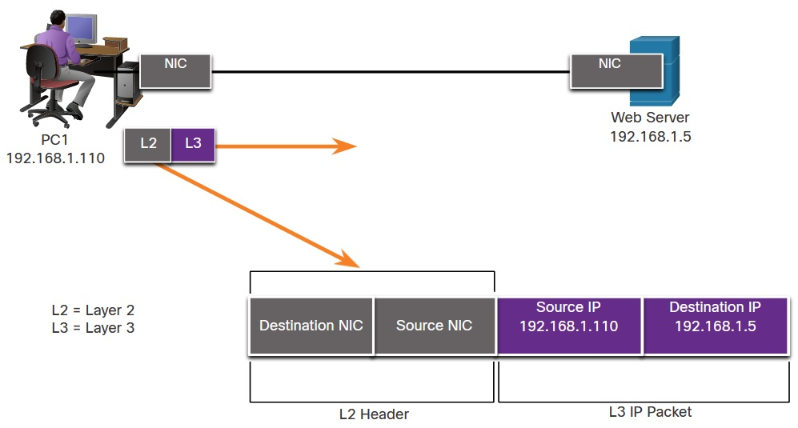
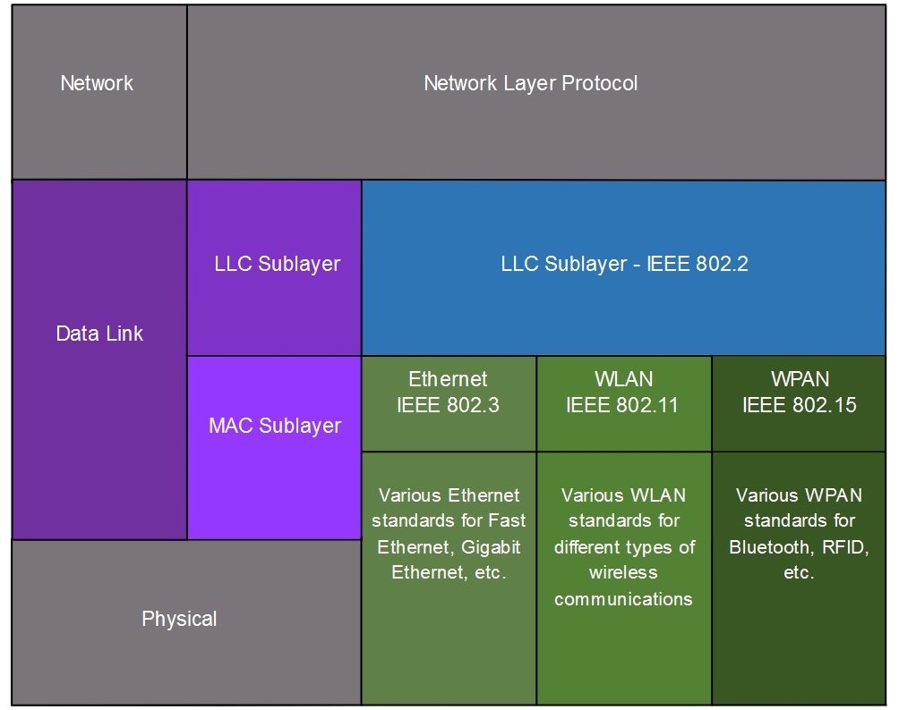
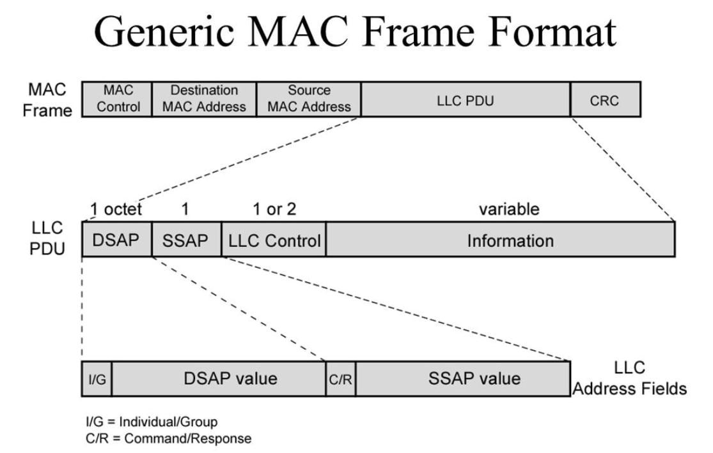
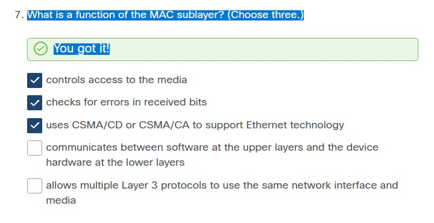
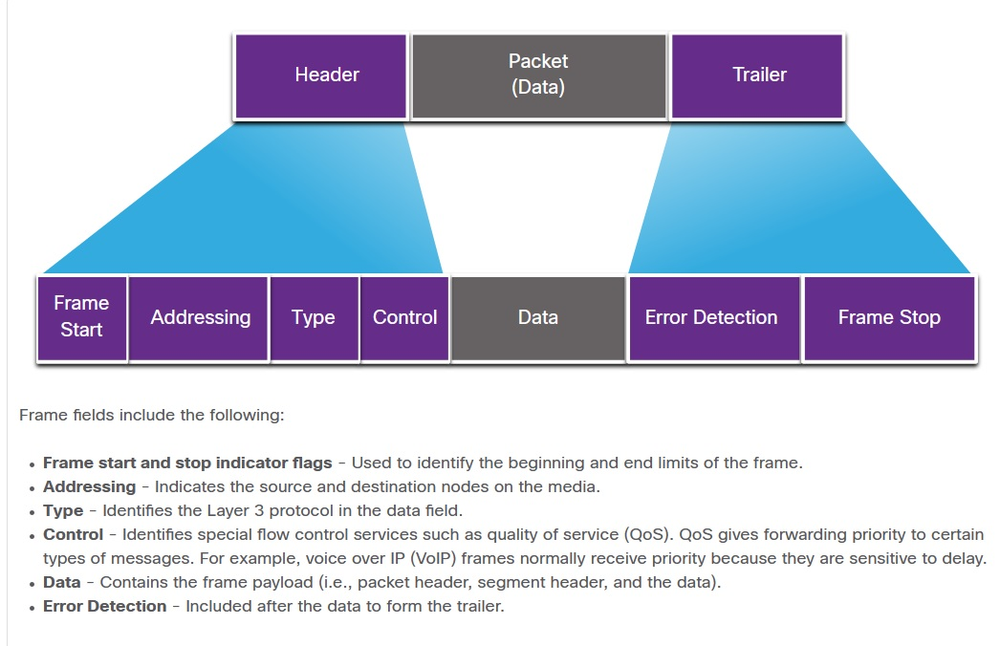
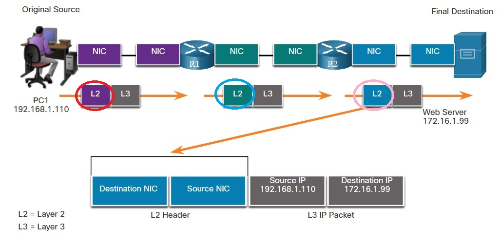
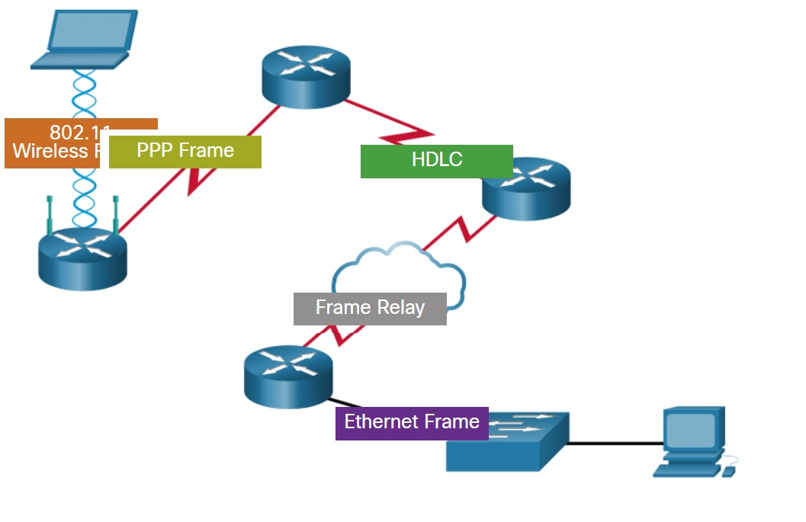

# 6.0 Data Link Layer
Канальный уровень (OSI model (Layer 2)) отвечает за подключение и работу NIC [network interface card]. Что делает L2:
   * Сетевой уровень ничего не знает о среде, по которой побегут данные. 
   * Как правило, Layer 3 пакеты (i.e., IPv4 or IPv6), инкапсулируются в Layer 2 frames.
   * контроллирует размещение данных в среде.
   * Производит отправку и получение кадров.
   * Производит обнаружение и отбой битых кадров (по CRC в конце каждого кадра)
И выглядит это безобразие следующим образом:

# 6.1.2 IEEE 802 LAN/MAN Data Link Sublayers
IEEE 802 стандарты определены для Ethernet, wireless (WLAN), wireless PAN (WPAN) и состоят из двух подуровней:

   * Logical Link Control (LLC) - This IEEE 802.2 подуровень размещает информацию из конкретного сетевого протокола (Layer 3) во frame, согласно каким-то своим алгоритмам. То есть по-сути отвечает за программное преобразование данных пакета (например IPv4 или IPv6) в формат для связи с таким же LLC-уровнем отвечающей стороны, с добавлением своих заголовков .
   * Media Access Control (MAC) – стандарты этого подуровеня (IEEE 802.3, 802.11, or 802.15) реализованы в конкретном железе/сетевой карте/интерфейсе. Отвечает за инкапсуляцию и контроль среды передачи/доступа. Обеспечивает адресацию канального уровня, например MAC-адрес. Интегрирован в конкретные технологии физического уровня. 
   

То есть LLC - некая сущность, которая общаясь с вышестоящим L3 понимает что  и кто ей заказывает: например IP заказывает отправку с подтверждением получения. Только после формирования кадра LLC он передается в MAC и обрастает привычными заголовками (https://admin-gu.ru/network/podurovni-llc-i-mac-kanalnogo-urovnya)
   

Чтобы эта хрень работала - надо чтобы соблюдались следующие правила:
   * Frame delimiting - процедура кадрирования задает делимитеры/зазграничители кадров. Эти биты, передаваемые перед кадром отвечают за синхронизацию передачи между отправителем и получателем.
   * Addressing - тут все просто - адрес src&dst Layer 2 (MAC) в общей среде.
   * Error detection - считаем CRC-сумму и записываем её в трейлер FCS, чтобы олух на той стороне сравнил ее со своей, которую он пересчитает после получения кадра.
   ___Заполмнить___

# 6.1.3 Providing Access to Media
Тут раньше все было сложно, когда все кричали всем, как на базаре. Теперь - все проще, так как каждый порт свича - отдельный домен коллизий и другие участники обмена не слышат истеричных воплей своих соседей. А если и слышат, то отправке данных это никак не мешает, так как идет работа в Full-duplex. 

Итак, еще раз: LLC "трамбует" L3 PDU в LLC L2 PDU, соответствующий конкретной среде передачи (например в Serial подключении точка-точка нет MAC-алресов, там другие идентификаторы). После того как сформирован/получен L2 PDU, подуровень MAC  начнет транслировать его в среду передачи единственно подходящим методом, соответствующим этой среде. 
Роутер должен сделать в 2 раза больше действий с кадром:
   * Отловить кадр в среде, понять что он не "битый" на основании FCS
   * Деинкапсулировать его, отправить на вышестоящий L3
   * Получить L3-пакет с вышщестоящего уровня, заново упаковать его в новый кадр
   * Спровадить кадр в следующий сегмент: возможно уже другим способом и в другую среду, с другого физического порта.

# 6.1.1 Data Link Layer Standards
Опять знакомые бездельники, но которые не сочиняют RFC (как те кто разрабатывает протоколы вышестоящих уровней) для L1,2:
   * Institute of Electrical and Electronics Engineers (IEEE)
   * International Telecommunication Union (ITU)
   * International Organization for Standardization (ISO)
   * American National Standards Institute (ANSI)

# 6.2.1 Physical and Logical Topologies
бред про физические и логические топологии, hub-spoke, mesh, full-mexh, point-to-point, устаревшие ___BUS___ и ___RING___, half и full duplex.
## Access Control Methods
   * Contention-based access
     * CSMA/CD used on legacy bus-topology Ethernet LANs - обнаружение коллизий
     * CSMA/CA used on Wireless LANs - избегание коллизий (After a wireless device sends an 802.11 frame, the receiver returns an acknowledgment so that the sender knows the frame arrived.)
   * Controlled access
     * Legacy Token Ring
     * Legacy ARCNET

# 6.3.1 The Frame
Итак, кадр имеет место быть во взаимодействии NIC-to-NIC, причем в рамках одной физики (у serial подключения - кадров нет). Каждый кадр MAC имеет 3 части:
   * Header
   * Data
   * Trailer (есть только на MAC-подуровне)

Информация которую представляет Cisco на картинке ниже - сборна солянка из частей кадров LLC и MAC.

Отправитель считает логическую сумму содержимого frame, known as the cyclic redundancy check (CRC). Эту сумму записывает в  FCS, чтобы получатель сосчитав свою сумму, определил: не битый ли к нему пришел кадр.

# 6.3.3 Layer 2 Addresses
Адресация L2 (физический адрес) используется для передачи данных в разделяемой среде. Адрес получателя стоит практически в начале кадра и NIC практически мгновенно разбирается: её ли это кадр ломится в распахнутые ворота, или совершенно чужой. Также заголоволк может содержать и кадр отправителя.
Физические адреса не имеют иерархии, в отличии от L3, но они должны быть уникальны в данном сегменте сети, чтобы не возникло 2 одинаковых отправителя или получателя.
При перекладывании кадров, маршрутизаторы подменяют MAC на новые значения и пересчитывают FCS

Без роутеров передача информации в другие подсети - невозможна: они принимают кадры, разворачивают их, ищут известные маршруты до IP-адреса назначения, определяют выходной IF, заворачивают пакет обратно в кадр выходящего IF и передают его уже в следующую среду.

# 6.3.4 LAN and WAN Frames
Ethernet (LANs) - IEEE 802.3. Wireless (WLAN) - IEEE 802.11. These protocols were designed for multiaccess networks.

WANs для различных типов подключений (point-to-point, hub-spoke, and full-mesh topologies) использует другие протоколы. Некоторые из них:
   * Point-to-Point Protocol (PPP)
   * High-Level Data Link Control (HDLC)
   * Frame Relay
   * Asynchronous Transfer Mode (ATM)
   * X.25
В TCP/IP все OSI-шные Layer 2 протоколы имеют дело с IP Layer 3. Однако, media access control протоколы зависят от логической топологии и физической среды. представленная ниже картинка отражает все степень упоротости и безнадеги

перечисленные Data link layer протоколы пишутся так:
   * Ethernet
   * 802.11 Wireless
   * Point-to-Point Protocol (PPP)
   * High-Level Data Link Control (HDLC)
   * Frame Relay