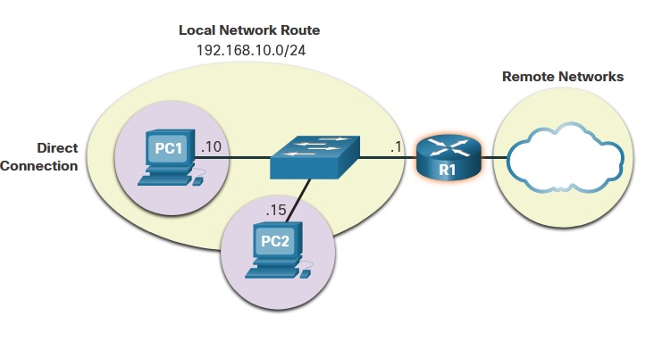
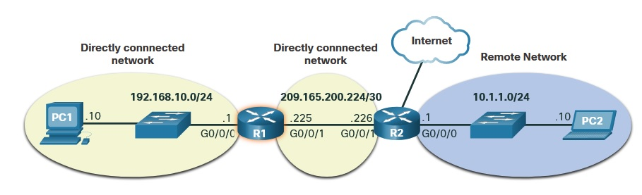

Лекция 20201205
# 8.0.0 
Протокол IP
   - connectionless (без установки соединения)
   - best effort (как получится, постараемся доствить, но пакет может и умереть)
   - media independent (не зависит от среды передачи, вид пакета - одинаков для всех типов сред, вот кадр - он да, разный в разных средах)

# IPv4 Packet header fields
Гораздо сложнее чем формат кадра.  Есть Src, Dst, Protocol, TTL (число уменьшающееся при прохождении хопов, при нуле - пакет сбрасывается, борьба с петлями маршрутизации) 


на данном представлении удобно выражено что адреса  - 4 byte,
суммарный размер IP-заголовка - 20 byte

проблема IPv4 - маленькое адресной пространство (32 бита). Проблема очень старая, начали придумывать "костыли" с 80-х годов. Существует из-за того, что "ТЗ на проект" было написано некорректно: считалось что сети будут закрытыми, без внедренных элементов безопасности и т.п.

IPv6 - Следующий шаг, стандарт с 2017 года. 
   - Increased address space - "все дреса IPv4 - можно уместить в самосвал, IPv6 - такими самосвалами можно построить башню от неба до земли"
   - Improved packet handling - The IPv6 проще, чем IPv4.
   
   - Eliminates the need for NAT - Private адреса, NAT, PAT

Маршрутизатор пересылает пакеты между сетями. На хостах прописываем "default Gateway", то есть по-сути 1 маршрут

# NETACAD
# 8. Network Layer
В Модели OSI - L3, необходим для организации взаимодейтсвия в сети состоящей больше чем из одного сегмента. В курсе CCNA изучаются протоколы основные протоколы - это IPv4, IPv6. Также будут рассмотрены другие L3 протоколы: OSPF, ICMP.

___Инкапсуляция___ - как и ранее, обертка данных вышестоящего уровня, необходима для разделения функций, чтобы один уровень работал независимо от другого (ха-ха, не у всех протоколов это получается, например icmp)


В процессе путешествия по сети, IP-заголовок пакета не меняется: SRC/DST IP-адреса постоянны, если нет необходимости в NAT.
Как уже говорили ранее, IP:
   - connectionless (без установки соединения)
   - best effort (как получится, постараемся доствить, но пакет может и умереть)
   - media independent (не зависит от среды передачи, вид пакета - одинаков для всех типов сред, вот кадр - он да, разный в разных средах)
В некоторых случаях, обычно R, дополнительно сегментирует пакеты, если они не пролезают в значение некоего ограничителя MTU, установленного для данного интерфейса (https://habr.com/ru/post/226807/)
```
R01(config)#interface gigabitEthernet 5/1 
R01(config-if)#mtu 1532
R01(config-if)#exit
```

# 8.2.1 IPv4 Packet
Информации в пакете должно хватать для передачи на next hop и вся эта информацию умещается в заголовке IP-пакета (min 20 bytes). Основные поля IP пакета (картинка второй раз)


   * version - 4 - IPv4, 6 - IPv6
   * header len - длина заголовка (20 bytes)
   * DS [differentiated services] - для приоритезации пакетов
   * Total Length - полная длина пакета в байтах
   * Identification number - используется при фрагментации пакета
   * Flag - говорит R можно ли фрагментировать пакет (0x00 - можно, 0х02 - нельзя)
   * Fragment offset - тоже относится к фрагментации
   * TTL - чтобы пакет не бегал вечно в сети, каждый R/хоп скидывает на 1 это значение и на последней единице - тот, кому повезет - грохнет пакет целиком (128 - default)
   * Protocol - что именно завернуто в пакет (TCP = 6; UDP=; ICMP = 1)
   * header Checksum - контрольная сумма заголовка пакета, если пересчитанная Checksum не совпадает с данными из пакета - пакет грохнется
   * SRC IP addr
   * DST IP addr
   * Все дальнейшее - данные

# 8.3.2 IPv6
Истощение IPv4 привело к необходимости костылей (NAT, серые ip и т.д.), а затем и к необходимости использования IETF IPv6. IPv6 - 128-bit hierarchical addressing,  IPv6 header shown the next figure consists of a fixed length header of 40 octets 
   

Заголовок IPv6 имеет аналогичное назначение: пакет должен быть гарантированно доставлен получателю. Поля:
   * version - 6 - IPv6
   * Traffic class - для приоритезации пакетов и на случай заторов (аналог DS)
   * Flow Label - идентификатор потока, как-то помогает R и SW обеспечивать порядок в доставке Real-Time пакетов
   * Payload Len - полная длина пакета в байтах (аналог Total Length)
   header len - длина заголовка (20 bytes)
   * Next Header - что именно завернуто в пакет (TCP = 6; UDP=; ICMPv6 = 58), аналог Protocol
   * Hop Limit - аналог TTL
   * SRC IPv6 addr
   * DST IPv6 addr

Уже говорят про различные виды IPv6 адресов:
   * linc-local (на основе MAC) fe80::
   * MC IPv6 ff02:

# 8.4 Host Routes  
Внутри локалки роутер не нужОн. Конечным хостам зачастую достаточно def GW, куда они сливают весть трафик. Это адрес из той же подсети, что и хост. def GW - это R и на нем уже выполняется маршрутизация (поиск подходящего маршрута и перекладывание пакета с одного IF на другой с деинкапсуляцией, пересчетом CRC кадров и т.д.).

   

У любого хоста (ПК, L3SW, R) может быть IPv4 и IPv6 таблицы маршрутизации, и маршрутов в конечном счете может быть больше чем 1
   * В Win используем ```netstat -r```; ```route print``` - для просмотра таблицы маршрутизации

# 8.5 Intro to routing
Как сказано выше, R перемалывает пришедшие пакеты:
   - Деинкапсулирует L2
   - анализирует заголовок L3, выбирает наиболее подходящий маршрут L3 в таблице маршрутизации (если конкретный маршрут найден не будет - пакет уйдет на default route 0.0.0.0)
   - Инкапсулирует пакет в новый кадр и отправляет по "новой" среде. Среда может быть аналогичной, но SRC/DST MAC поменяются.

Маршруты в таблице маршрутизации я вляются указателями на следующий узел, которому надо отправить пакет. Маршруты могут быть заданы ___Manually___ (static маршруты), ___Dynamically___ (dinamyc маршруты). Маршрутов 3 типа:
   * ___Directly-connected networks___: маршруты в сети существующие/прописанные на активных (up) IF-ах. Если интерфейс упадет, маршрут ___исчезнет___ из таблицы маршрутизации. Каждый IF R подключен к отдельному сегменту/отдельной подсети. На рисунке ___directly-connected___ IPv4 сети R1 - 192.168.10.0/24 и 209.165.200.224/30.
   * ___Remote networks___: Сети, о которых R узнал каким-то способом: ___статический маршрут___ заданный сисадмином или результат обмена информацией между ___протоколами динамической маршрутизации___. Следуюшие ___remote network___ в R1 IPv4 будут 10.1.1.0/24.
   * ___Default route___: большинство роутеров также имеют дефолтный маршрут ___gateway of last resort__ - шлюз последней надежды. На случай если не найдется никакого другого подходящего/близкого маршрута.  На R1 можно прописать дефолтным маршрутом 209.165.200.226/30, принадлежащий R2.

    

## Static Routing
Задаются вручную, пропадают в самый неподходящий момент (когда падает интерфейс), подходят для маленьких сетей с маленьким количеством резервных линков и споуков, часто используются совместно с dynamic для задания default route.

## Dynamic Routing
Протоколы динамической маршрутизации заставляют R обмениваться информацией о имеющихся маршрутах, конечно если сисадмин знает или не забыл их настроить )). Настраиваются протоколы динамической адресации как правило на совместных интерфейсах. Автоматически начинается обмен, а затем и поддержание таблиц маршрутизации участников обмена в актуальном состоянии. Протоколы динамической маршрутизации автоматически выбирают лучший путь до DST, при наличии нескольких, на основании слоооожных алгоритмов и метрик. Лучший путь пересчитывается, когда основной путь куда-то пропадает из таблицы.

  

заучивать не надо, но буковки в таблице маршрутизации часто намекают откуда взялся тот или иной маршрут в таблице:

  


В каждой записи таблицы маршрутизации есть ряд значений, которые отражают:
   * природу возникновения записи, или причину почему именно этот маршрут попал в таблицу маршрутизации, например сладкая парочка в квадратных скобках ___[110/65]___:
     * 110 - AD [administrative distance] - значение, выражающее "надежность", величину, которую роутер учитывает при выборе конкретного маршрута из всех дублирующих маршрутов. В таблицу маршрутизации должен попасть "самый надежный", ну или несколько самых надежных, в зависимости от алгоритмов используемой динамической маршрутизации. 
     * 65 - metric, помогает определить "лучший" путь до DST. Значение получается путем расчета по алгоритмам задействованной динамической маршрутизации (hp count и т.д.).
   * суть записи (путь до сети AB лежит via ZYX, если выйти через IF S0/1/0, или какой-то другой)
   * Промежуток времени который прошел с последнего обновления (не выводится для static/connected и default маршрутов)

для просмотра таблицы маршрутизации используется ```show ip route``` команда. Маршруты на подсети IF-ов автоматически попадают в таблицу маршрутизации при включении и пропадают из нее при выключении IF.
