# 9 Address resolution
# 9.1 MAC and IP
2 типа адресов используется в Ethernet сетях:
   * Physical address (the MAC address) - внутри одного сегмента Ethernet. L2 - адреса
   * Logical address (the IP address) – для обмена пакетами между ПК в разных сегментах. L3 - адреса

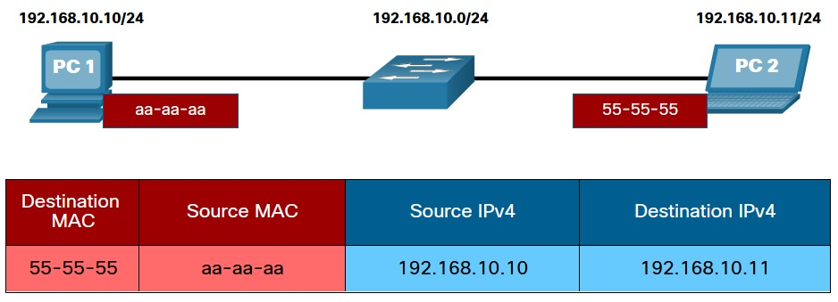

Если DST/получатель не в одном Ethernet-сегменте/подсети с отправителем, то кадр должен быть направлен на MAC - адрес Def GW, но с указанием в IP-пакете, L3-адреса конечного DST. Затем, при прохождении ip-пакета по сети, SRC/DST IP-адреса не меняются, но чтобы кадр был доставлен, DST/SRC MAC-адреса кадра меняются при подготовке кадра для отправки через другой выходной IF. Это опять работа процедуры инкапсуляции/деинкапсуляции

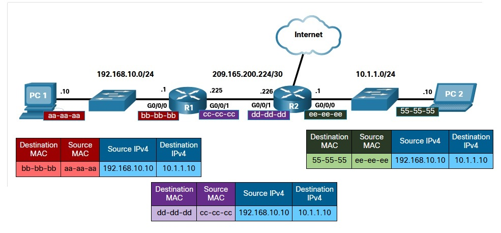

Процесс выяснения MAC-адреса DST в каждом линке по пути следования - лежит на протоколе ___ARP [Address resolution protocol]___ - IPv4 или ___ND___ - IPv6. Хранится информация от ARP/ND в RAM. Просмотр
```
R1# show ip arp 
Protocol  Address          Age (min)  Hardware Addr   Type   Interface
Internet  192.168.10.1            -   a0e0.af0d.e140  ARPA   GigabitEthernet0/0/0
Internet  209.165.200.225         -   a0e0.af0d.e141  ARPA   GigabitEthernet0/0/1
Internet  209.165.200.226         1   a03d.6fe1.9d91  ARPA   GigabitEthernet0/0/1
```

# 9.2.1 ARP
Работает в IPv4. Пакет не может сам довести себя до DST, ему нужно завернуться в кадр, а уже в кадре должны быть указаные MAC DST/SRC. Если SRC MAC - это мы сам, то DST MAC можно получить только от соседа, или R, если готовится пакет вовне локального сегмента. Т.о. ARP выполняет 2 задачи:
   - Разрешение IPv4 -> MAC
   - Составление таблицы MAC-адресов

При получении L3 PDU и перед подготовкой L2, узел оценивает куда отправляется пакет: в локалку или во внешнюю сеть. После этого решает какой MAC ему нужен при составлении кадра L2: MAC хоста из локалки или MAC def GW. Затем осматривается таблица MAC из оперативной памяти/___ARP-table/ARP-cache___, на предмет наличия нужного MAC: 
   - если ip в диапазоне локальной сети, то ищется MAC соответствующий ip DST из L3-PDU 
   - если ip в другом сетевом сегменте, то ищется MAC, соответствующий ip-адресу  def.GW.

Каждая строка MAC-таблицы связана с IPv4-адресом. Записи в таблице - временные (кэш) и пропадают через определенный   интервал, если хосты с этими MAC/IP - не выходили на связь.
Если в кэше MAC-таблицы нет соответствующего IP/MAC, то устройство откладывает формирование L2-пакета и отправляет ARP-req, на который отвечает только тот узел, который имеет соответствующий IP-адрес. Прпи получнии ARP-req ПК оценивает кадр на предмет DST MAC: если в кадре не MAC получателя, BC или MC, кадр смело дропнется. Если BC или MC - развертываем и заглядываем в DST ip-адрес. Если получатель он - откликаемся ARP-reply. Если получатель - чужой дядя, сидим и молчим в тряпочку. После получения ответа - продолжается формирование L2-PDU. Если никто не ответил на ARP-req, то L3-PDU с расстройства дропается, так как кадр не может быть составлен.

# 9.2.3 ARP-request

ARP-req инкапсулируется напрямую в кадр, без IPv4-заголовка, со следующим объемом информации:
   * ___Destination MAC address___ – BC адрес FF-FF-FF-FF-FF-FF в рамках протокола Ethernet, такой кадр принимается любой NICs в LAN.
   * ___Source MAC address___ – отправитель
   * ___Type___ - ARP-запрос в своем заголовке имеет тип 0x806. NIC получателя сразу понимает что данные кадра надо передать в ARP-процесс.

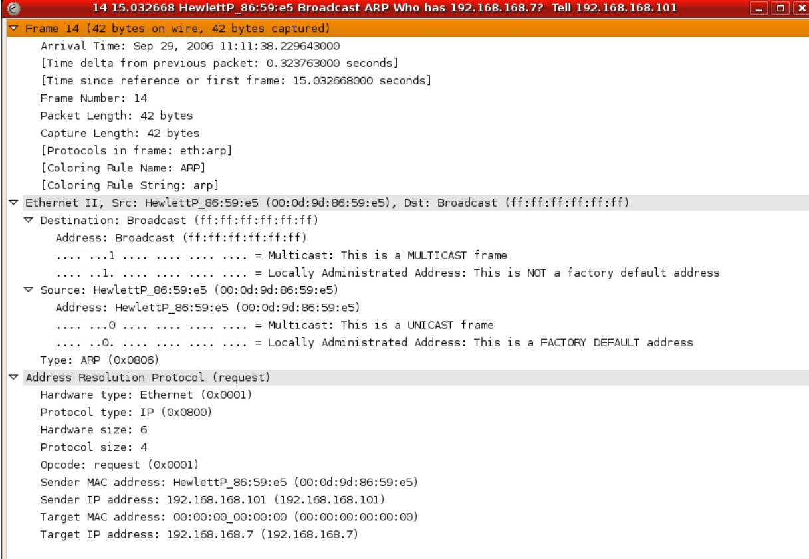

Из DST FF...FF - видно что это BC, который топит весь BC-домен, и каждый узел сети получит его.

# 9.2.4 ARP-reply

 При получении узел смотрит: его ли ip стоит в заголовке, и если нет - не отвечает ARP-reply.  Если ip - его, то отвечает ARP-reply со своим MAC. Интересная ситуация с отправкой трафика "к черту на куличики", в другую подсеть: SRC определяет что DST (ipv4/ipv6) в другой подсети, а значит искать надо MAC шлюза. Ну и дальше формирует ARP-req на ip GW и ждет ответа.

IPv6 использует похожую (на IPv4) процедуру ARP, известную как ICMPv6 Neighbor Discovery (ND). IPv6 использует сообщения ___neighbor solicitation___ (аналог arp-req) и ___neighbor advertisement___ (аналог arp-reply).

Команды просмотра ARP-кэша: ```sh ip arp``` (cisco), ```arp -a``` (win)

# 9.2.8 ARP особенности: ARP BC и ARP Spoofing
BC Кадр ARP-request получается и обрабатывается каждой ip-железкой. Поэтому возникают проблемы:
   - arp broadcast: если большое число железяк одновременно включится и захочет что-то передать, сеть приляжет.
   - arp spoofing: ответ злоумышленника на такой ARP-request, своим MAC, для реализации атаки MITM

Хорошие, дорогие свичи защищают от таких проблем технологией ___DAI [dynamic arp inspection]___ (https://wiki.merionet.ru/seti/26/nastrojka-dhcp-snooping-i-dynamic-arp-inspection-na-cisco/):
   - задаются "недоверенные" порты (все access). Как правило эта настройка производится совместно с ip dhcp snooping. По-сути включается количество BC пакетов, которые разрешено порту пропустить. Если пакетов будет много - порт вырубится

<details>
  <summary>пример</summary> 
<pre>
AccSwitch#conf t
AccSwitch(config)#int ra gi1/0/1-46
AccSwitch(config-if-range)#ip dhcp snooping limit rate 15
AccSwitch(config-if-range)#ip arp inspection limit rate 100   
</pre>
</details> 

   - задаются доверенные порты: для dhcp и arp -на этих портах трафик анализироваться не будет
<details>
  <summary>пример</summary> 
<pre>
AccSwitch(config)#int ra gi1/0/47-48
AccSwitch(config-if-range)#ip dhcp snooping trust
AccSwitch(config-if-range)#ip arp inspection trust
</pre>
</details>    

   - включается DHCP snooping
<details>
  <summary>пример</summary> 
<pre>
AccSwitch(config)#ip dhcp snooping
AccSwitch(config)#ip dhcp snooping vlan 200
AccSwitch(config)#no ip dhcp snooping information option
</pre>
</details> 

   - настраивается DAI (ARP-списки доступа): пара статический ip/ известный MAC
<details>
  <summary>пример</summary> 
<pre>
AccSwitch(config)#
AccSwitch(config)# arp access-list DAI
AccSwitch(config-arp-nacl)# permit ip host 192.168.200.25 mac host 0017.6111.a309
В таком порядке добавляем IP адреса всех устройств со статическим IP. Дополнительно можно настроить Sorce Guard. Этим мы конкретное устройство к порту коммутатора, таким образом другое устройство подключенное к указанному порту не сможет выдать себя за привязанное:
   AccSwitch(config)#ip source binding 0017.6111.a309 vlan 200 192.168.200.14 interface Gi1/0/5
Также под не доверенными интерфейсами нужно ввести команду ip verify source, которые проверяет источник запросов.
</pre>
</details> 

   - Ждем пару суток
   - включаем ip arp инспекцию
<details>
  <summary>пример</summary> 
<pre>
AccSwitch(config)#ip arp inspection vlan 200
</pre>
</details>    

# 9.3.1  IPv6 Neighbor discovery (RFC 4861+) [интересная статья по ipv6: https://habr.com/ru/post/192164/]
ND еще называют NDP.  2 режима:
   - neighbor solicitation
   - neighbor advertisemant
   
Протокол ND выполняет: разрешение имен, обнаружение R, перенаправление служб. Чтобы все это работало был написан протокол ICMPv6, котором реализовали 5 сервисов:

<details>
  <summary>1: Neigh Solicitation messages.</summary> 
<pre>
Как и с ARP, при разрешении IP в MAC задействуется кэш ПК, но затем вместо ARP отправляется NS сообщение: IPv6 - пакет инкапсулируется в Ethernet-кадр
</pre>
</details> 
 
<details>
  <summary>2: Neigh Advertisement messages</summary> 
<pre>
Эти первые 2 (NS и NA) - используются для взаимодействия при разрешении имен (аналог ARP). Хостами могут быть как ПК, так и R. BC в рассылках Ethernet уже нет, есть MC (а обратно - unicast), а R такой мультикаст не форвардит, так как он пришел по link-local scope
</pre>
</details>    

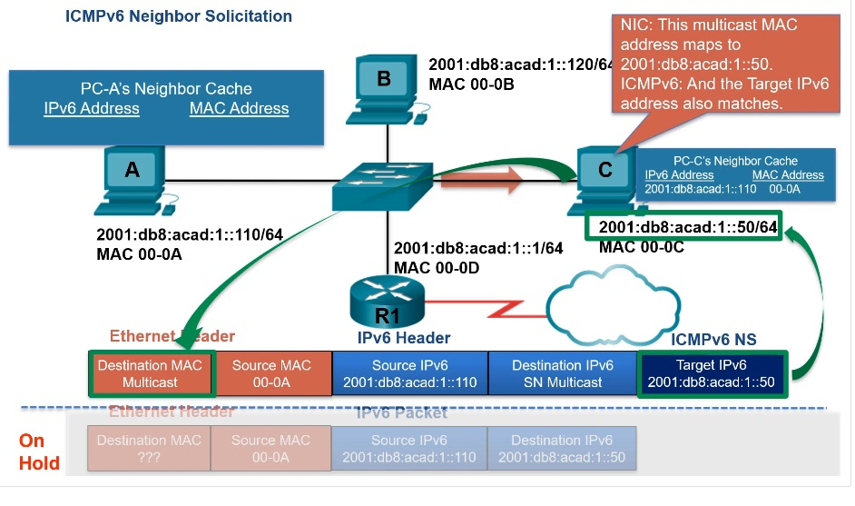

<details>
  <summary>3: Router Solicitation messages</summary> 
<pre>
Следующая пара (RS и RA) - используется когда хосту необходимо обменяться/найти R в сети, например в случае получения IPv6 адреса в режиме SLAAC (StateLess Address AutoConfiguration)   
</pre>
</details>  

<details>
  <summary>4: Router Advertisement messages</summary> 
<pre>
Следующая пара (RS и RA) - используется когда хосту необходимо обменяться/найти R в сети, например в случае получения IPv6 адреса в режиме SLAAC (StateLess Address AutoConfiguration)   
</pre>
</details>  
 
<details>
  <summary>5: Redirect messages</summary> 
<pre>
используется выбора лучшего next-hop'a
</pre>
</details>  

## Лабораторка
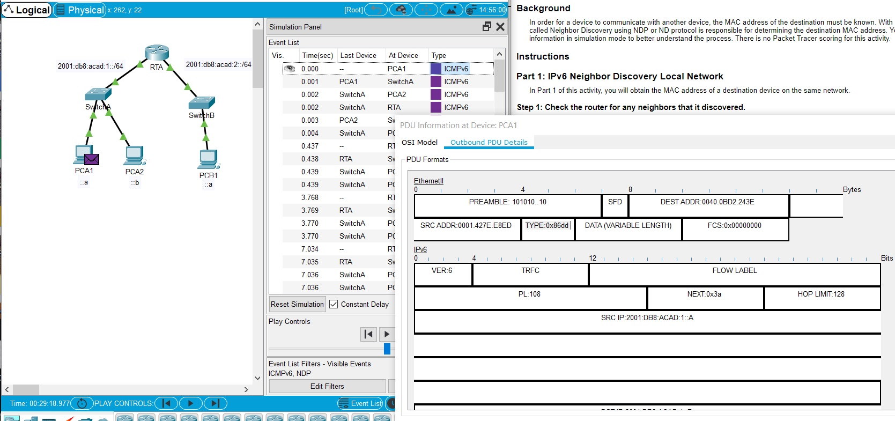

Задачи:
   - Ознакомиться со стеком IPv6
   - Изучить формат, заголовки кадра Ethernet в условиях IPv6
   - Изучить формат пакета IPv6

1. Запустили Simulation, поставили на паузу, запустили PCA1```ping -n 1 2001:db8:acad:1::b``` захватили перемоткой вправо 150 секунд
2. Открыл первый захваченный пакет, там echo Mess type 128 (IPv6). Поначалу я подумал что в лабе будет выяснение ARP через MC vs ND, но я ошибся и понял это лишь внимательно прочитав как образуется MC адрес Ethernet и описание кадра, где прямо сказано, что ND взял MAC из таблицы ((:

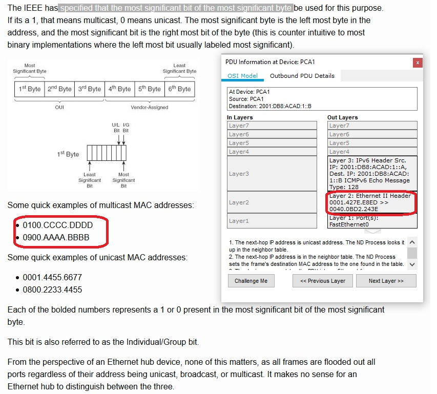

3. Понял что не разобрался и пропустил все самое интересное. Сбросил оборудование и запустил пинг снова. На этот раз ситуация как я и ожидал, другая: ICMPv6  - на паузе, а ND - трудится: в заголовке Ethernet вижу ождидаемый MC-addr ___(3333.FF00.000B)___, Message TYPE: ___0x86dd___ (то есть где-то там выше уровнем лежат данные ICMPv6)

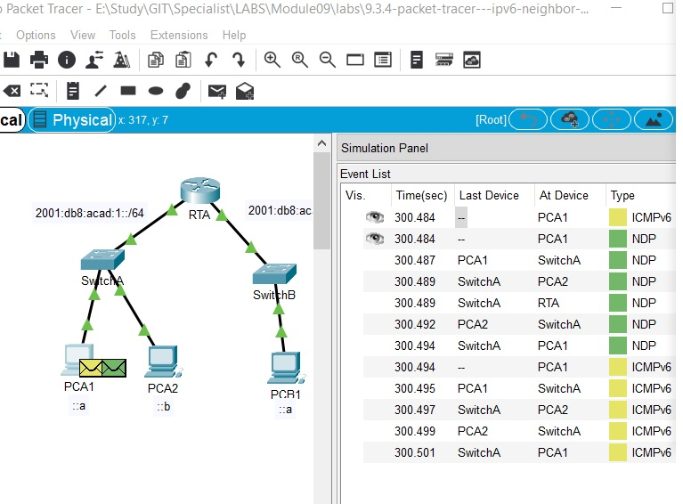
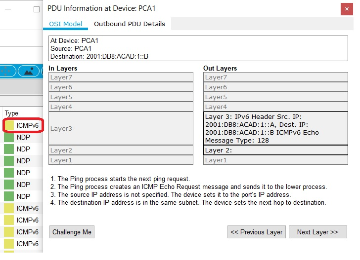
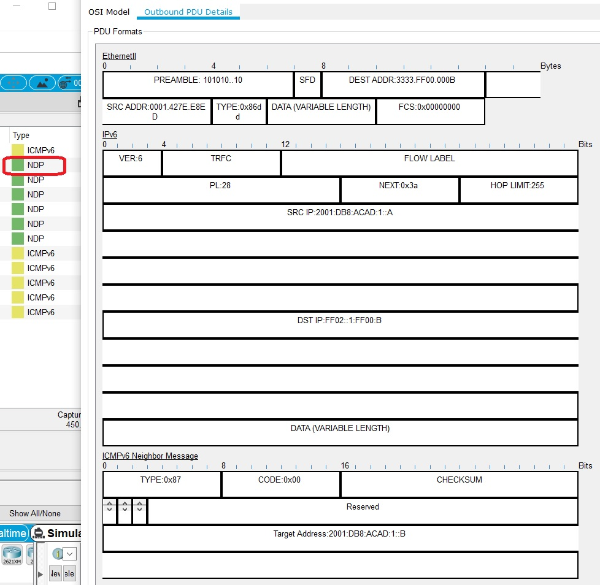

4. Следующий кадр из захвачяенных - тот, что приходит на SW: его мы просто флудим во все порты, предварительно записав в MAC-таблицу MAC ПК, с которого исходил трафик

5. Следующие 2 кадра - те, что пришли со SW на PCA2 и на R. Кадр на R - дропнется, так как назначение IPv6 не соответствует. Кадр же на PCA2 будет обработан, признан годным (кадр ND, Neigh Solicitation, IPv6 DST соответствует моему IPv6, значит можно обновить мою локальную таблицу MAC-адресов/neighbor table) и подготовлен ответный кадр (кадр юникаст, адрес DST - только что заносили в таблицу MAC, берем оттуда), с юникаст адресами Ethernet

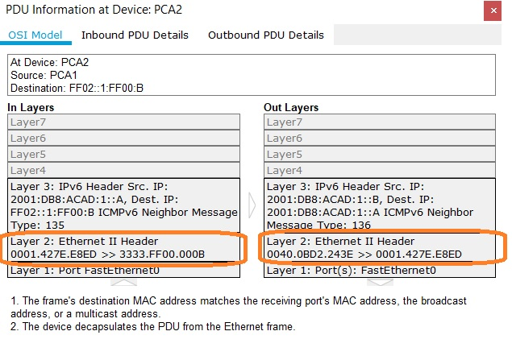

6. После всех ND событий, пришло время вернуться к ICMPv6 подготовленному пакету: он лежит пока в памяти и ждет пока найдется MAC соседа.

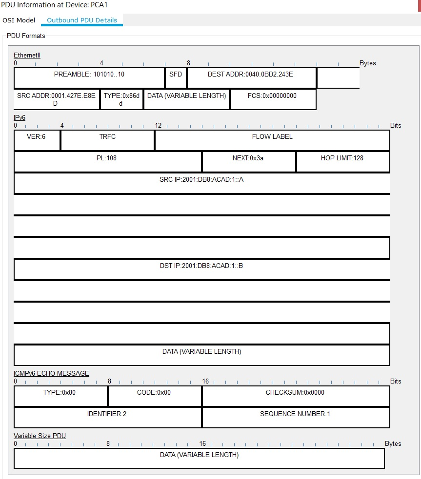

7. вторая часть л/р - гораздо более динамичная, так как NDP тут отработает во много раз больше, чем в первой части и это надо видеть своими глазами: тут куча ND Neighbor Solicitation до соседей, а процедура по передаче ICMPv6 начинается с поиска MAC и отправки на R, так как IPv6 в другой подсети. R, в свою очередь, опять всех метит/мажет MC NDP ___(3333.FF00.000B)___ и поскольку не знает где нужный ip - сначала устраивает BC Neigh Solicitation, PCB1, получив такой MC Ethernet запрос с MC IPv6 NDP-req с испугу отвечает своим личным MAC, упаковывает уже все это в UC и отправляет NDP обратно на R и тот, занеся данные о MAC PCB1 в свою таблицу соседей - готовит и отправляет ICMPv6 request, который висел у него в памяти, от PCA1. 

8. PCB1, получив ICMPv6 не может не повыпендрпиваться и опять устраивает фотосессию NDP с R и только потом отправляет ICMPv6... И так много-много раз, пока пакет с ICMP-echo reply на достигнет PCA1

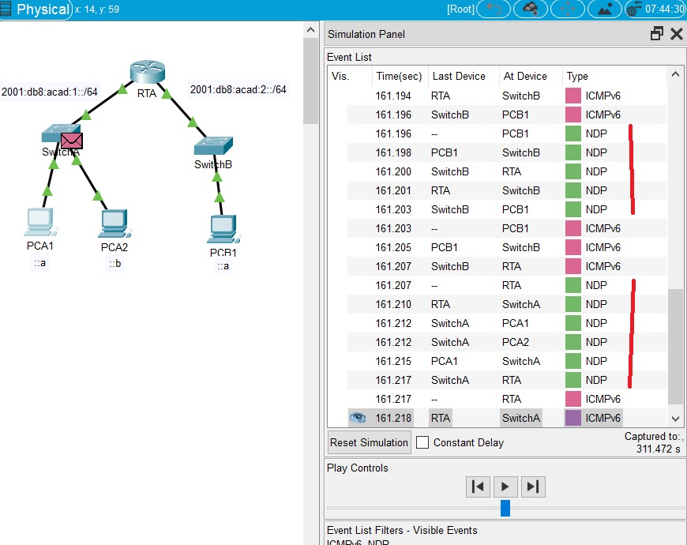