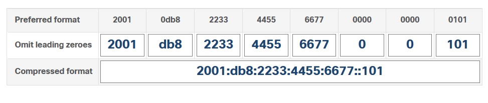

Specialist 20201212
# IPv6
   - ___Dual stack___ - совместная работа ipv4, ipv6
   - ___tunneling___ - метод транспортировки IPv6 поверх IPv4
   - ___translation___ - NAT64 позволяет организовать совместную работу устройств IPv6 vs IPv4

IPv6 - 128 bit: 8 групп по 16 бит, между гекстетами знак ":"
   
Упрощения:
   - убираем группу нулей, заменяя их одним
   - групппу нулей убираем, заменяя ___::___ Одновременно в нескольких местах - нельзя

  

или

 


пример адреса: fe80::1 - короче чем ipv4

## Unicast, Multicast, Anycast
   * Unicast
   * Multicast - в IPv6 отсутствует ___BC___, все широковещания заменена на MC
   * Anycast - "произвольная" рассылка, или: если есть представители одного сервиса - можно назначить этому сервису один адрес. Комапания - оповещает провайдера что один сервис в разных частях света, а провайдеры сами решают куда направить пакет (на ближайший сервис)

## IPv6 Prefix List
префикс может быть длиной 0-128

 

выделение узловой и сетевой частей, обычно используется /64: половина под сеть, половина - под узел

IPv6 - реализует plug-and-play:
   * link-local - 1-й тип адресов, похож на MAC-адрес. Используются для общения в одной сети, в рамках широковещательного домена. Используя эти адреса - не получится выйти в глобальную сеть. Способы автонастройки link-local адреса:
     * EUI-64: MAC делим на 2 половины, затем добавляем  в середину FFFE и инвертируем 7й  с начала бит. Устройство само все сделает за нас, пример - ниже
     * Random, псевдослучайно
     * Manual, часто используется на сетевых устройствах, для назначения "красивых" адресов. Чатсо назначают (fe80::1)

Рис. ниже - пример EUI-64


   * Global Uniq - должен быть у каждого устройства, чтобы все могли общаться со всеми. Сейчас раздают блоки 2000::/3 2000 - 3fff. Обращаемся к LIR и получаем 

## Способы назначения IP
   * SLAAC (stateless address autoconfig) - не надо иметь в каждой сети DHCP-сервер. Нет никакой общей таблицы ip-адресов.   
     * роутер рассылает RA (router advertisement), то есть кидаться 64 битами сетевого сегмента. Устройство последние 64 бита назначает либо по EUI, либо - random. Также в RA приходят ареса DNS. RA рассылаются редко, раз в 200 сек
     * Устройство отправляет RS (router solicitation[домогательство]) и R отвечает RA, а затем устройствор генерит IPv6
   * DHCPv6 - тоже не командует кто и какой адрес получит, но учитывает эти адреса. правда толку в этих адресах - мало
   * Manual 

## Multicast
начинается на ff, внутри одного BC-домена - на ff02:
   * например, R отправляет RA на ff02::1, никто другой его не использует
   * ff02::2 - если устройство считает себя R, то оно принимает такой пакет в рамках сети
   * Solicited Multicast - на смену ARP пришел neighbor discovery ff02::1:ff/104 + последжние 24 бита из IPv6. У каждого устройства свой SolMult

## Neighbor discovery
   * NS (neigh solicitation) 
   * NA (neigh advert)
   * DAD у кого есть такой адрес? если получит в ответ NA, то устройство понимает что дубль адреса и запрашивает или генерит новый IPv6)

В реультате у устройства есть сразу несколько ipv6:
   * LLA link local addr
   * GUA global unicast addr
   * ff02::1
   * ff02::1:ff72:efec   

## ICMPv6
этот протокол теперь очень "ответственный" и при запрете - теперь, сука, надо быть очень внимательным, оставлять хотя бы пакеты NA, NS, RA, RS, Echo-req, Echo-repl

# 12 IPv6 Addressing

## 12.1.2 Сосуществование v4, v6
- Dual Stack (на ПК, роутерах). В сети может гулять ipv6 трафик, о котором не знает админ
- Tunneling: когда ipv6 заворачивается в ipv4 для трансляции в ipv4 сетях.
- Translation: для взаимодействия между ipv6 и ipv4 устройствами


## 12.2 IPv6 representation
- ___HEX___: В Ipv6 каждые 4 бита (1111 = 0...15) - представлены 1-hex символом (0...9 A...F)
- ___HEXTET___: группа из 4 HEX символов (4*4 = 16 BITS)
- ___128___: всего адрес состоит из 128 бит. В адресе 8 HEXTET-ов

## 12.2.2 Правила преобразования
- лидирующие нули опускаются (01ab = 1abб 0001 = 1 и т.д.), также группа нулей    в hextet может быть записана одним нулем
- несколько нулевых hextet могут быть заменены ___::___, но только 1 раз в адресе(2001:db8:```0000:0000```:abcd:```0000```:```0000```:1234 = 2001:db8 ```::``` abcd:```0```:```0```:1234)



## 12.3 address types
BC - нету вообще.
- UC обмен между двумя ipv6 устройствами
- MC отправка пакета группе устройств
- AC anycast адрес может быть у нескольких устройств, отправка пакета будет выполнена на ближайшее устройство

адрес состояит из двух частей:
- ___PREFIX___ - сетевая часть, записывается через ___/___ (запись /64 подсети без лидирующих нулей: 2001:db8:a:0::/64)
- ___INTERFACE ID___ - ID устройства. 64-bit значение рекомендуется использовать в большинстве случаев. SLAAC (stateless address autoconfiguration) тоже использует 64-bit

Теперь, когда мы уже знаем из чего состоят и как записываются ipv6 адреса - еще раз вернемся к типам адресов. Итак, прошу любить и жаловать, ___UNICAST___ адреса:


- ___Global Unicast Address (GUA)___ - аналог public IPv4. Уникальные, маршрутизируемые, могут назначаться статикой или динамически.
- ___Link-local Address (LLA)___ - для взаимодействия IPv6-enabled устройств в рамках одного широковещательного домена/линка/подсети. LLAs сконфигурирован для конкретного линка и уникален только внутри него. Не маршрутизируется: роутеры не форвардят пакеты с LLA адресами.
- ___Unic Local___ (диапазон fc00::/7 - fdff::/7)- могут быть использованы для адресации внутрилокальных устройств (серверов, принтеров и т.д.). IETF не рекомендует их использовать
   - могут быть использованы во внутренних сетях нескольких сайтов
   - настраиваются на устройствах, которые гарантированно не должны иметь выход в интернет
   - нет возможности транслировать их в глобальные адреса