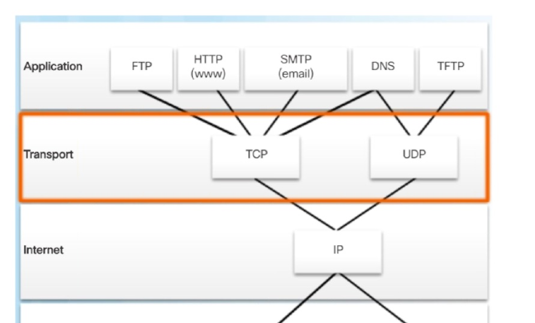
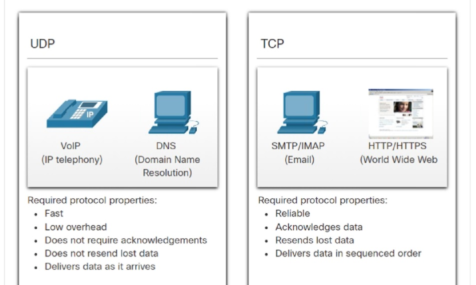
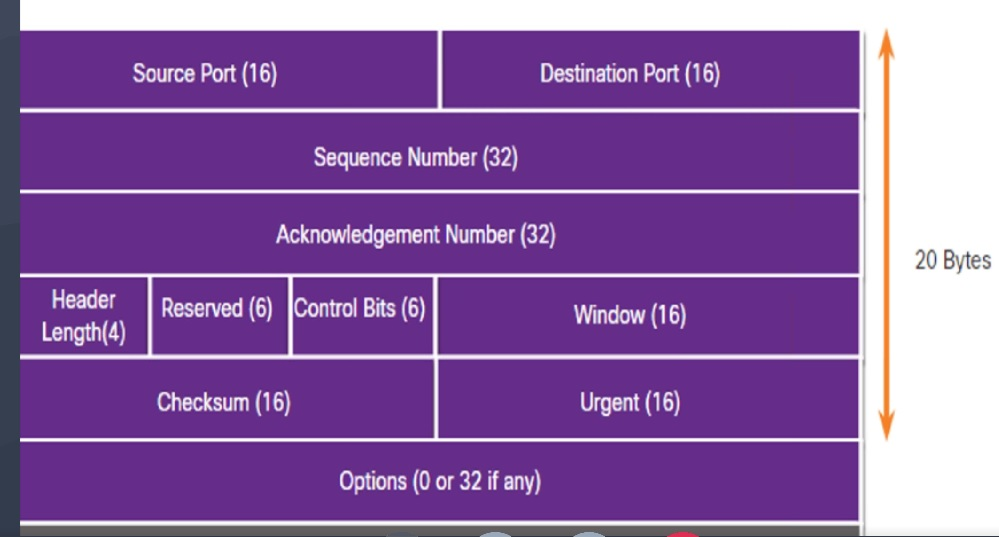
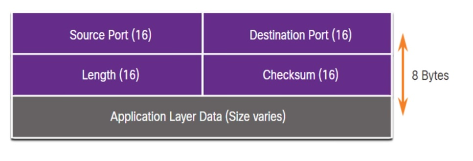
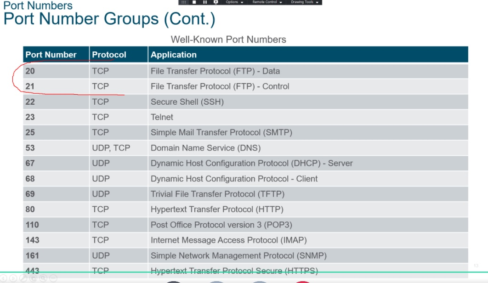
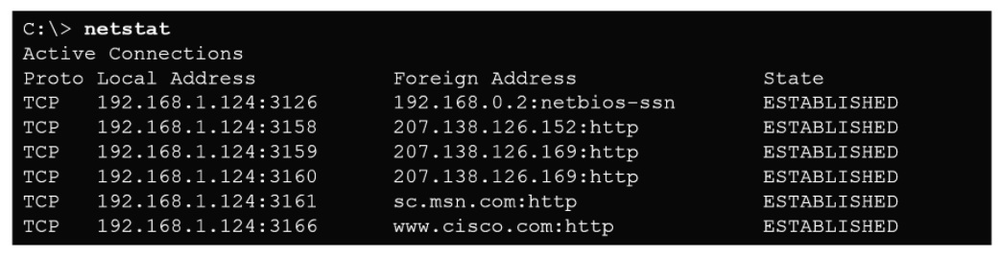
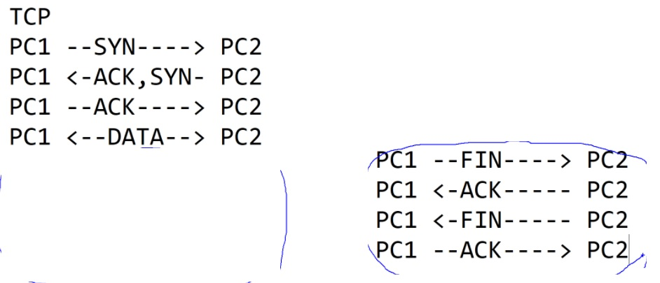

Specialist 20201212
# Transport Layer
Передача данных между процессами (например один браузер - yandex, второй -Chrome). На транспортном уровне 2 протокола TCP, UDP

   

## TCP
Сегменты нумеруются, отслеживается отправка, получение, повторная отправка, воспроизведение в определенном порядке, подстраивается под среду передачи (flow control)

## UDP
Ленивая медуза - просто отправляет сегменты, не нумерую их и не занимаясь ничем, кроме отправки сегментов

Так что надо использовать тот протокол, которыйподходит под конкретный случай. Как и с протоколами ftp,tftp и т.д.

# TCP
Заголовок

   * SP
   * DP
   * Seq Num
   * Ack Num
   ...
   * window - окно отправки (в байтах), которое без подтверждения, то есть сколько сегментов можно отправить без подтверждение. Алгоритмов - много: https://habr.com/ru/post/168407/

# UDP

еще про порты: каждому процессу соответствует свой Process ID [PID]. IANA регулирует общеиспользуемые DST порты, которые используются известными программами. 

Что касается Src портов, то их номерами управляет Kernel OS (ядро) и хранит их в соответствующей табличке.

Таким образом ОС каждому PID выделяет свой, один из 65535 портов TCP или UDP, то есть порт - связующее звено между приходящими данными и процессом (PID). Порты <1024 - well known протоколы

просмотреть текущую табличку ядра ___netstst___ с параметрами -a, -b и т.д.

## TCP еще раз
Перед отправкой данных - создаем сессию, для этого используем поле Control Bits: 
   * Отправитель в сегменте отправляет Syn с определенным значением
   * получатель отправляет Syn, Ack
   * отправитель отправляет Ack
   * пошли данные

Перед закрытием - тоже идет отправка определенных флагов:
   * отправитель Fin
   * получатель Ack
   * Получатель Fin
   * Отправитель Ack

Если получатель занят, то отправитель отправляет RST (reset) в ответ на Syn. 

Сканеры портов - так и работают - отправляют Syn на каждый порт, а потом дополнительно бомбят открытые

DDOS - работа на истощение ресурсов SynFlood - флужение Syn-ами

UDP просканировать нельзя, так как оно не устанавливает сессию перед открытием
