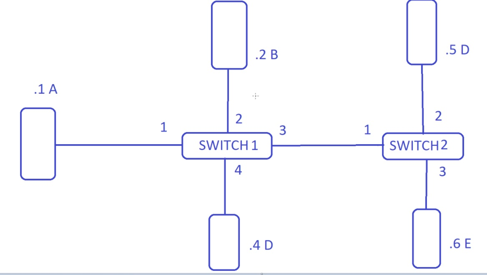
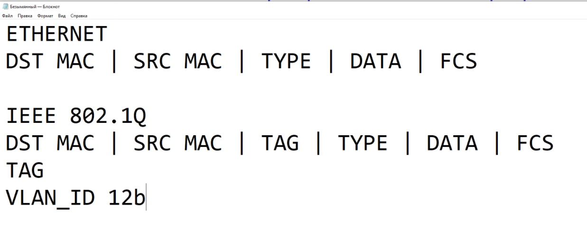
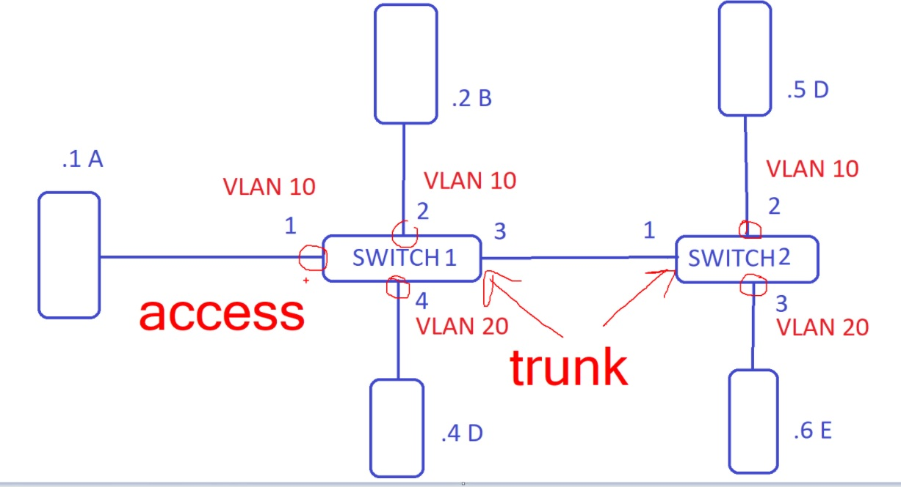
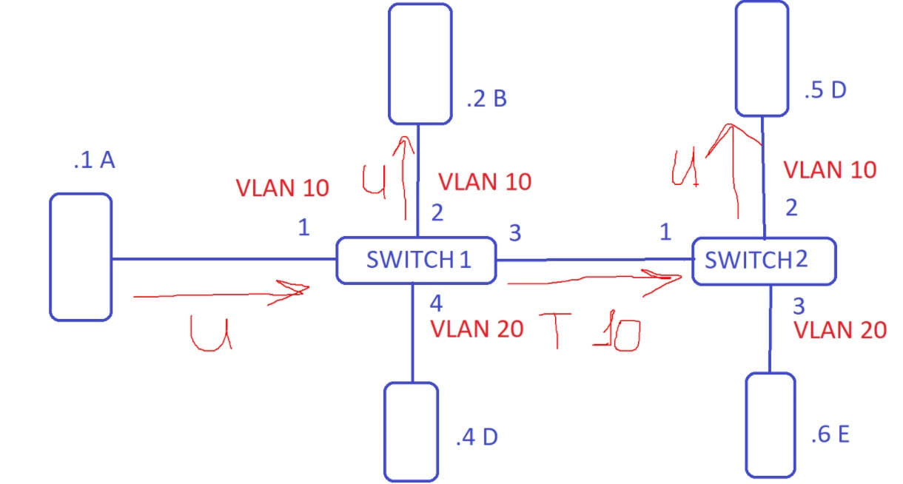
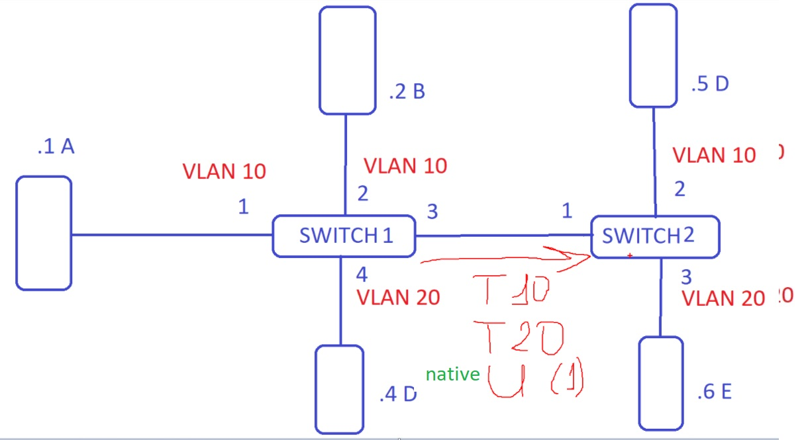
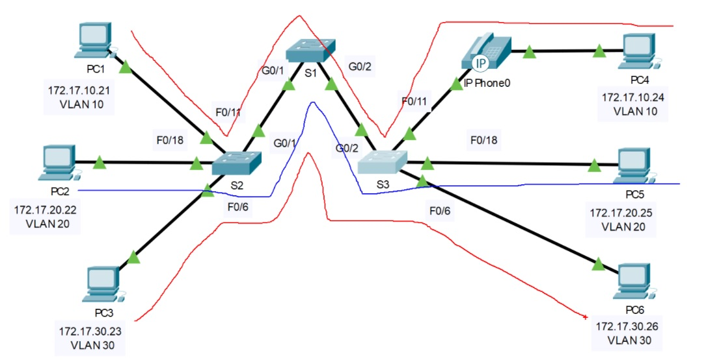
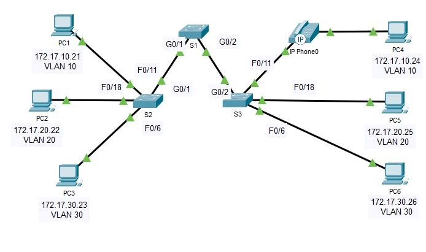

# 202012196 SPECIALIST
VLAN - инструмент разделения на логические подсети. Относиться надо как к кортошке и просто использовать.  
 

Как работает SW - смотрим ранее (учится, флудит, коммутирует)

VLAN - настройка на порту SW, которую сделал админ (указал какие порты в каком VLAN). С назначенными VLAN SW флудит трафик только в тот VLAN, из которого трафик поступил. Маршрутизацией между VLAN - занимается маршрутизатор. L2 SW - только дробит сети на VLAN'ы

def VLAN - 1

Если одинаковые VLAN на разных SW, то надо передавать идентификаторы VLAN в формате кадра. Это делает 802.1Q

 

   * Кадр Eth - нетегированный/untagged, 
   * 802.1Q - тэгированный/tagged (trunk в терминах Cisco)

 

SW получив тэгированный кадр, видит TAG vlan-a, меняет формат кадра на untagged и отправляет в Access

 

На транковом порту могут ходить кадры, прописанные в конфигурации.

802.1Q - native VLAN - не тегируем кадры этого VLAN, default vlan1. С другой стороны транка также надо настраивать native vlan, причем одинаково, иначе может возникнуть ситуация, когда 

 

VLAN - есть в таблице коммутации

VLAN делят сети и на 3 уровне, и на 2 уровне: каждому vlan - своя подсеть

 

# Лаба

 

```switch no access``` - на IF убирает конфигурацию порта по-умолчанию (dynamic desirable), когда порт ждет что с другой стороны тоже Dyn disarable и по-умолчанию попытается поднять транк. Если эту конфигурацию оставить включкеннной (switchport mode dynamic auto), то есть даже такая атака: VLAN Hopping, для которой нужно спец ПО, напеример Yersinia Homepage - http://www.yersinia.net/ 
```
attackers send out a DTP message and within a few seconds, a trunking link will be established. In our scenario, the attacker will then have access to all traffic flowing through VLAN 2 and can directly attack without going through any layer 3 devices.
```

тлф .порты - для экзамена access
802.1Q есть поле COS (class of service), тлф добавляет тэг в кадр и COS=5 а на этом порту SW - даем команду верить этим меткам: ```mls qos trust cos```, но это всего лишь подготовка к QOS

```
S3#show int f0/11 switchport
Name: Fa0/11
Switchport: Enabled
Administrative Mode: static access
Operational Mode: static access
Administrative Trunking Encapsulation: dot1q
Operational Trunking Encapsulation: native
Negotiation of Trunking: Off
Access Mode VLAN: 10 (Faculty/Stuff)
Trunking Native Mode VLAN: 1 (default)
Voice VLAN: 150
Administrative private-vlan host-association: none
Administrative private-vlan mapping: none
Administrative private-vlan trunk native VLAN: none
Administrative private-vlan trunk encapsulation: dot1q
Administrative private-vlan trunk normal VLANs: none
Administrative private-vlan trunk private VLANs: none
Operational private-vlan: none
Trunking VLANs Enabled: All
Pruning VLANs Enabled: 2-1001
Capture Mode Disabled
Capture VLANs Allowed: ALL
Protected: false
Unknown unicast blocked: disabled
Unknown multicast blocked: disabled
Appliance trust: none
```

VLAN1 - связан со всеми access-портами и всеми trunk, в которых он разрешен. Если vlan не прописан ни на каком порту/транке, то vlan 1 будет down.

Выделяют отдельный VLAN для MGM подсети, например 99 или 100

___Почитать___:
Запрещаем лишние VLAN’ы на транковых портах Cisco
https://unlix.ru/%d0%b7%d0%b0%d0%bf%d1%80%d0%b5%d1%89%d0%b0%d0%b5%d0%bc-%d0%bb%d0%b8%d1%88%d0%bd%d0%b8%d0%b5-vlan%d1%8b-%d0%bd%d0%b0-%d1%82%d1%80%d0%b0%d0%bd%d0%ba%d0%be%d0%b2%d1%8b%d1%85-%d0%bf%d0%be%d1%80%d1%82/