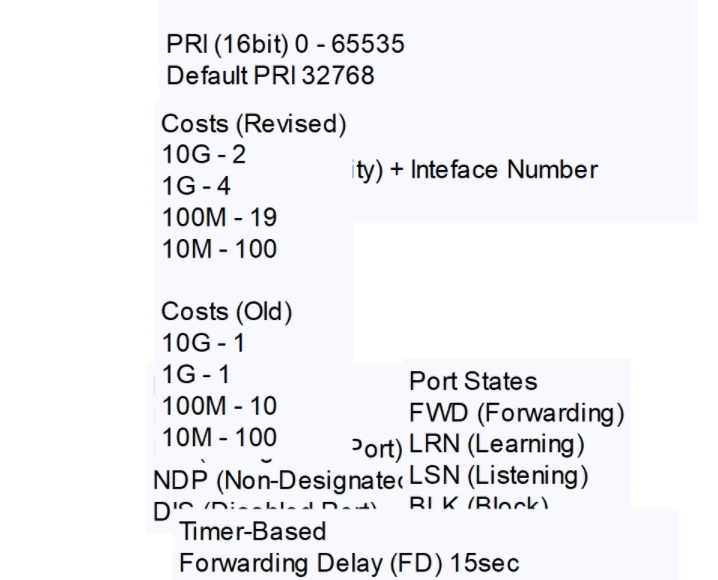
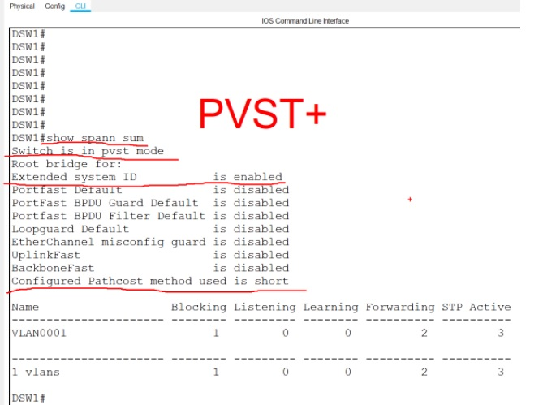
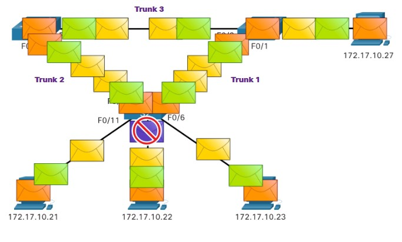

# Specialist 20201226
## Необходимость в STP/основные термины/этапы построения STP

В результате развития, инженеры пришли к необходимости построения физически отказоустойчевых подключений к SW более высокого уровня и между собой. 
STP реализован при помощи ___BPDU___ [bridge protocol data unit], которыми  обмениваются Свичи: 

- I этап: выбора корня ___root bridge___ на основании BID: идентификатор SW. Это некоторый составной ___ID=PRI & MAC___ 
     - MAC - можно посмотреть (min из вывода ```show interfaces | in Giga|address```)
     - приоритет [PRI] = 16bit (Default 32768)

   

```
Switch#show interfaces | in Giga|address
!
GigabitEthernet0/0 is up, line protocol is up (connected) 
  Hardware is iGbE, address is 0c09.c5ce.5300 (bia 0c09.c5ce.5300)
...
  Hardware is iGbE, address is 0c09.c5ce.530f (bia 0c09.c5ce.530f)
!
show spanning-tree | sec Bridge ID
!
Switch#show spanning-tree | sec Bridge ID
  Bridge ID  Priority    32769  (priority 32768 sys-id-ext 1)
             Address     0c09.c5ce.5300
             Hello Time   2 sec  Max Age 20 sec  Forward Delay 15 sec
             Aging Time  300 sec
```
   
При выборе ROOT - побеждает SW с ___min BID___

   

- II этап: После выбора ROOT - начинают выбирать ___ROOT Port [RP]___ на каждом SW, на основании ___стоимости___ линков до ROOT Bridge. В BPDU рассылает информацию до ROOT, все последуюшие SW рассылают информацию с учетом пришедшей стоимости аплинков до ROOT'а





- III этап: После выбора RP определяем роли остальных портов:
   - На ROOT - все порты DP, FWD
   - На конкурирующих SW в сторону ROOT смотрит RP (FWD)
   - осталось выяснить какой порт на каком SW класть в DOWN. Если стоимости одинаковы, то решаем по стоимости BID посылающего. У кого BID меньше, тот побеждает и оставляет свой порт вкл. ___DP/FWD___, второй - смиряется и гасит свой порт ___NDP/BLK___. При этом SW не отправляет через этот порт никаких кадров, только принимает BPDU.

     

- IV этап - поддержание и пересчет топологии при падении RP на каком-либо SW

В старом стандарте STP - падение LNK - пересчет топологии

## STP в параллельных линкАх

Если есть несколько параллельно существующих LNK до RB, то на назначение ___NDP/BLK___ влияет ___PID[PortID] = PRI.NBR___:
- PRIority - 8 bit (default 128)
- NBR - номер порта (fa0/1 - 1; Fa0/2 - 2 и т.д.)

Победит порт, который имеет min значение PID: справа ROOT, значит блокироваться будет один из линкОв левого свича, а именно тот, на который прилетел больший PID 128.2

   

   

Уточненные этапы выбора состояния, ролей портов

   

Если злоумышленник решит скоммутировать порты на одном свиче между собой, то опять срабатывает STP, который пройдет все этапы и на основании PID блокирует порт с MAX PID.

Для управления STP - настраиваем приоритеты SW, чтобы ROOT был на max эффективных SW.

В старом STP алгоритм работы:
   - коммутаторы обмениваются BPDU (timer ___Hello___ - 2 Сек )
   - если BPDU не приходит 20 секунд (timer ___MAX Age___), то считаем что сосед "умер" и начинаем пересчет топологии и работу с портом
   - простаивающий NDP порт - из состояния DIS ->- LIStening (15 сек) ->- LRN (изучение приходящих кадров, заполнение MAC - табл, тоже 15 сек) ->- FWD (timer ___Forwarding delay___)

Итого, при пересчете топологии min время простоя 2+20+30=52 секунды, что очень долго по современным меркам

   

- I этап: ASW1 - ROOT: все порты DP (на основании BID)
- II этап: порты
   - DSW1 - F0/1 - RP
   - DSW2 - F0/2 - RP
   - ASW2 - F0/2 - RP (стоимости до ROOT - одинаковые через оба линка, но на основании min BID - выигрывает линк до DSW2)
- III этап блокировка портов
     - DSW1 - F0/2 - DP/FWD, Gi0/1 - NDP/BLK (на основании BID пришедшего PDU)
     - DSW2 - F0/1 - DP/FWD, Gi0/1 - DP/FWD
     - ASW2 - F0/2 - NDP/BLK; F0/1 - RP/FWD

## Этапы развития STP

- CST IEEE 802.1D
PRI - 16 bit, но только безумный захочет управлять PRI таким количетством бит
- PVST+ для каждого VLAN - свое дерево: часть бит сократили и отдали для передачи инфы о VLAN  - только Cisco
- RSTP (Rapid STP) IEEE 802.1w
- PVRSTP+ (Per VLAN Rapid STP+) - только Cisco. При увеличении числа VLAN - требуется большое число ресурсов (100 VLAN, 100 BPDU в 2 сек, 100 ROOT и т.д.)
- Cisco придумала упростить ситуацию, объединяя часть деревьев с одинаковыми деревьями в инстансы (1-50 VLAN: 1 инстанс, 51-100 VLAN: 2 инстанс) MIST
- Общепринятый вариант на основе MIST - 802.1S MST/MSTP (multiple spanning tree)

Могут возникнуть проблемы совметсной работы SW поддерживающих разные версии STP => предложение - отказаться от STP, за счет внедрения на верхнем уровне L3, но тут тоже могут быть разные подходы в реализации

   

Договорились над этой сетью строить VXLAN - программно-определяемые сети SDN

[Лаба](./labs/STP.pkt)   

   
  

```
DSW1#show spanni summ
Switch is in pvst mode
Root bridge for:
Extended system ID           is enabled
Portfast Default             is disabled
PortFast BPDU Guard Default  is disabled
Portfast BPDU Filter Default is disabled
Loopguard Default            is disabled
EtherChannel misconfig guard is disabled
UplinkFast                   is disabled
BackboneFast                 is disabled
Configured Pathcost method used is short

Name                   Blocking Listening Learning Forwarding STP Active
---------------------- -------- --------- -------- ---------- ----------
VLAN0001                     1         0        0          2          3

---------------------- -------- --------- -------- ---------- ----------
1 vlans                      1         0        0          2          3
```

Просматривать STP лучше за конкретный VLAN ```sho spann vlan XX```

В CST - состояние порта называется ___NDP___

В RSTP - состояние порта называется Alternate, Backup - немного другая терминология, но роль порта от этого не меняется.

```
DSW1#show spann vlan 1
VLAN0001
  Spanning tree enabled protocol ieee
  Root ID    Priority    32769
             Address     0005.5EDE.80DA
             Cost        19
             Port        1(FastEthernet0/1)
             Hello Time  2 sec  Max Age 20 sec  Forward Delay 15 sec

  Bridge ID  Priority    32769  (priority 32768 sys-id-ext 1)
             Address     00E0.F957.E098
             Hello Time  2 sec  Max Age 20 sec  Forward Delay 15 sec
             Aging Time  20

Interface        Role Sts Cost      Prio.Nbr Type
---------------- ---- --- --------- -------- --------------------------------
Fa0/1            Root FWD 19        128.1    P2p
Fa0/2            Desg FWD 19        128.2    P2p
Gi0/1            Altn BLK 4         128.25   P2p
```

Для ROOTа все порты DP/FWD

```
ASW1#show spann vlan 1
VLAN0001
  Spanning tree enabled protocol ieee
  Root ID    Priority    32769
             Address     0005.5EDE.80DA
             This bridge is the root
             Hello Time  2 sec  Max Age 20 sec  Forward Delay 15 sec

  Bridge ID  Priority    32769  (priority 32768 sys-id-ext 1)
             Address     0005.5EDE.80DA
             Hello Time  2 sec  Max Age 20 sec  Forward Delay 15 sec
             Aging Time  20

Interface        Role Sts Cost      Prio.Nbr Type
---------------- ---- --- --------- -------- --------------------------------
Fa0/1            Desg FWD 19        128.1    P2p
Fa0/2            Desg FWD 19        128.2    P2p
```

 

Чтобы SW стал root - меняем на нем приоритет в нижнюю сторону. Еще можно установить SW в root primary (уменьшает текущее значение на 32768) или root secondary (___почитать___). 

НО

___Лучше вручную: primary 4196, secondary 8192___

Для ускорения перевода порта в DSG состояния (по умолчанию порт пытается получить штук 10 BPDU, что долго для современных ПК на SSD), необходимо включать на Access портах:
- ```spanning tree portfast``` - включение быстрого определения включения порта
- ```spanning tree bpduguard``` - включение блокировки порта, при получении BPDU на порте. Смешной случай, когда на ПК несколько сетевух, которые при бриджинге (технология ОС) тоже генерят BPDU
- включение на порту storm control - позволяет ограничить на порту количество приходящих кадров: UC/MC/BC

```
(config-if)# storm-control broadcast level 30.00 10.00
(config-if)# storm-control action shutdown
```
При достижении первого порого (30.00) - порт будет отключаться, при падении broadcast-трафика до уровня второго (10.00) — включаться.

Чтобы в этом примере коммутатор автоматически восстанавливал порт, скажем, через 3 минуты (это 180 секунд) после отключения, необходимо в глобальной конфигурации выполнить:

```
(config)# errdisable recovery cause storm-control
(config)# errdisable recovery interval 180
```

Все остальное - "от лукавого", но надо запомнить, что для тонкой настройки порта:
- ```loopguard```
- ```rootguard```

У SW Cisco есть также штатное средство обнаружения петель, основанное на периодической отправке keepalive-сообщений. Эта опция обычно включена по-умолчанию, и в случае срабатывания порт отключается. Для механизма keepalive можно также настроить автоматическое включение интерфейса:

```
# errdisable recovery cause loopback
```

Для рассмотренных выше STP-протоколов компания Cisco Systems разработала набор дополнительных компонентов, известный как Cisco STP Toolkit или Optional Spanning-Tree Features:
- Port Fast
- BPDU  Guard
- BPDU  Filtering
- UplinkFast
- BackboneFast
- EtherChannel Guard
- Root Guard
- Loop Guard


# NETACAD, Module 5.0 - STP

STP предназначена для разрыва петель, возникающих при построении отказоустойчивых сегментов, петель L2

   

Без STP пакеты (BC, MC, UC) кружились бы хороводом по закольцованным сегментам, размножаясь и плодясь, что может привести к переполнению буфера SW (CAM-таблицы) и превращению его в хаб буквально за считанные секунды. Это же относится и к ситуации, когда некорректно настраивается virtual инфраструктура и ядро.

   

## 5.1.7 Алгоритм STP

   

   - ___выбор ROOT___

   
   

   - ___блокировка избыточных линков___

   

   - ___работа по безкольцевой топологии___

   

   - ___отработка сбоев/разблокировака портов___

   

   

   

___Лабораторка 5.1.9___

[5.1.9](./labs/5.1.9-packet-tracer---investigate-stp-loop-prevention.pdf) 

Задачи:
• Describe the operation of Spanning Tree Protocol. 
• Explain how Spanning Tree Protocol prevents switching loops while allowing redundancy in switched networks. 

Выполнение:
В результате работы STP часть избыточных линкОв исключается из схемы работы/трансляции трафика, путем блокирования наиболее подходящего порта линкА. Выбор порта для блокировки осуществляется на основании алгоритма STP:
1. Изучение подсети, обмен BPDU, нахождение ROOT Bridge на основании min ___BID___
2. Определение характера портов относящихся к аплинкам, выяснение Root Port-ов, перевод их в FWD/DSG. У Root все порты FWD/DSG
3. Блокирование (BLK/ALTN) нужного порта на конкурирующих SW, на основании сопоставления информации PID из BPDU.

   

При пересчете STP (отказал G0/1 S2), происходит следующее:
- SW обмениваются Multicast BPDU, в которых указаны они сами, как ROOT Bridge, например S1 отправил информацию что:
   - Root 32769/000B.BE31.D3DA (то есть я сам, см. BID ниже)
   - COST до ROOT 0
   - BID (S1) 31769/000B.BE31.D3DA
   - PID 32793

  

  

- Этаким макаром S1 и S2 долбили S3 около 20 секунд, и толтько затем, S3 - сравнив между собой пришедшую информацию, сделал вывод, что вот нихера, ROOT = S2:
   - ROOT ID:32769 / 0001.6448.C6E7 
   - ROOT PATH COST:19 
   - BRIDGE ID:32769 / 000C.CF45.7534 
И указал при этом в каком состоянии порт, через который была выплюнута эта BPDU


Где-то 50 секунд понадобилось чтобы огонек загорелся зелененьким, а порт S2 Gi0/2 перешел в состояние LRN->FWD


Лабораторка выполнена


## 5.2.1 Steps to a Loop-Free Topology

- STA - Spanning-tree algorythm
- STP - Spanning-tree protocol

Итак, 4 маленьких шага для запоминания:
1. Выбор Root Bridge
2. Выбор Root Ports
3. Выбор Designated Ports
4. Выбор Alternate (blocked) ports

Делаются эти операции на основании информации, которая заключена в неком пакете BPDU? содержащем
- Bridge ID (BID) - ID отправителя, который участвует во многих аспектах STA, включая выбор root и ролей портов. BID (64 bits) состоит из:
   - Bridge Priority (4 bits) - 0-61440, шаг 4096 Чем ниже - тем ROOT-ее. 0 - точно ROOT
   - Extended system ID (12 bits) - ID VLAN. 802.1D - стандарт, в котором описана поддержка STP для каждого VLAN отдельно. Отдельный STP - допускает существование нескольких ROOT Bridge, для разных VLAN
   - MAC address (48 bits) - необходим на случай, когда 2 предыдущих параметра - идентичны. Чем меньше MAC, тем больше шансов у SW стать ROOT.

Пример выбора Root Bridge:


## 5.2.4 Root Path Cost
Этот параметр определяет "стоимость" линкА, в зависимости от его скорости. Стоимость будет учитываться для вычисления пути до ROOT Bridge ___root path cost___ = сумма стоимостей всех линкОв до ROOT. эта стоимость затем передается в BPDU следующему ROOT, и тот прибавляет к ней стоимость IF, в который пришел BPDU и транслирует эту новую стоимость дальше.

Стоимости разных стандартов/версий STP представлены ниже:


Стоимость порта может быть изменена индивидуально.

## 5.2.5 Выбор Root Ports
Производится после выбора Root Bridge/
- У самого ROOT все порты ___DSG___ (designated), что является признаком что он ROOT ))
- Порт смотрящий на самый короткий суммарный путь до ROOT - ROOT port, все другие порты - будут так или иначе заблокированы


## 5.2.6 Выбор Designated Ports
Порт, смотрящий на Root Port - ___DSG___


Самый сложный вариант - когда 2 не-Root порта смотрят друг на друга. Отстрелить ненужный порт поможет сравнение BID: у кого оно больше, тот и блокирует свой порт


## 5.2.7 Elect Alternate (Blocked) Ports
Порт не ROOT и не DSG - становится ___ALTN (Alternate)___ и блокируется. Блокируется - значит через него не будет проходить никакой трафик, кроме BPDU STP


## 5.2.8 Выбор роли порта в разных случаях
На картинке ниже, BID в BPDU от S3, заставил S2 признать порт F0/2 ALTN и заблокировать его


На следующей картинке, происходит сравнение BID. Видно что BID S1< BID S4, значит блокироваться будет какой-то порт на стороне S4, при этом надо учитывать:
- Прилетающий в оба линкА BID - одинаковый, для обоих линкОв
- затем S4 сверяет стоимость своих портов и если она одинакова, а по-умолчанию она 128 и не менялась, то идем дальше
- надо сравнивать ID порта, отправившего BPDU. Больший порт в данном случае - F0/2 S1, таким образом на S4 залочится F0/5.


## 5.2.9 STP таймеры и состояния портов
Как было сказано ранее в старом STP алгоритм работы:
   - коммутаторы обмениваются BPDU (timer ___Hello___ - 2 Сек )
   - если BPDU не приходит 20 секунд (timer ___MAX Age___), то считаем что сосед "умер" и начинаем пересчет топологии и работу с портом
   - простаивающий NDP порт - из состояния DIS ->- LIStening (15 сек) ->- LRN (изучение приходящих кадров, заполнение MAC - табл, тоже 15 сек) ->- FWD (timer ___Forwarding delay___)

Итого, при пересчете топологии min время простоя 2+20+30=52 секунды, что очень долго по современным меркам

Настраивать можно 3 таймера:
- Hello timer - время через которое выстреливается BPDU на IF (1-10 секунд, по-умолчанию 2)
- Forward delay timer - Время задержки Forwarding, то есть время которое порт не будет форвардить пакеты, поскольку находится в состоянии Listening или learning (4 - 30 сек., по-умолчанию 15 секунд в каждом состоянии)
- Max Age timer - Время, в котором SW будет находиться перед тем как попытаться изменить STP топологию (6-40 sec, по-умолчанию 20)

https://www.cisco.com/c/ru_ru/support/docs/lan-switching/spanning-tree-protocol/19120-122.html

Default- значения меняются на ROOT Bridge, тем самым значения меняются для STP домена

Если порту сразу разрешить переходит из BLK состояния в FWD, то можно насоздавать кольца, поэтому STP использует 5 состояний портов:


- Blocking - ALTN, не транслирует никакие пакеты, но получает BPDU, таким образом SW через него может узнать новый путь до ROOT bridge. Порт, который ___MAX Age Time___ (20 сек) не получает BPDU, переходит в состояние BLK
- Listening - После BLK порт начинает слушать LST
- Learning
- Forwarding
- Disabled

## 5.3.1 Эволюция STP
   

### RSTP (802.1w) понятия 
___RSTP___ пришел на замену 802.1D, при этом чуть-чуть изменилась терминология, а также:
- значительно увеличилась скорость сходимости/пересчета (пара сотен миллисекунд)
- ALTN -> FWD практически моментально, не дожидаясь сходимости

___Rapid PVST+___ - Cisco реализация RSTP, с поддержкой VLAN (для каждого VLAN - свой PVST)

___Сравнение терминов ```Состояния портов```/```Ролей портов```___

   

  

Ну и то, как RSTP+ располагает порты

  


Для оптимизации придумали такие технологии как:
- PortFast - настраиваем на Access-портах, чтобы включение ПК не вызывала пересчета топологии, и как следствие - временную блокировку трафика, на время изучения портом  (listening [15 сек] ->learning [15 sec]) состояния окружающего мира, с 15-ю секундными блокировками порта? и как следствие - сбоями при получении ip-адреса по DHCP
- BPDU Guard - включение в ACCES-порт SW - кладет этот порт в ___ERRDISABLE___ состояние на определенное время

## Альтернатива STP
Старая картина мира

  

Для более современных вариантов, внедряем маршрутизацию L3

  

  

И получаем такие технологии (pf пределами курса), как:
- MLAG - multi system link aggregation
- SPB - shortest path bridging
- TRILL - Transparent interconnect of Lots of Links

___Почитать___:

STP в опасности:

https://unlix.ru/stp-%d0%b2-%d0%be%d0%bf%d0%b0%d1%81%d0%bd%d0%be%d1%81%d1%82%d0%b8/#more-793


