# SPECIALIST 20210116 #
UDP/67, UDP/68
Проблема DHCP:
 - если злоумышленник поднял свой DHCP и ловит запросы, защита: DHCP-snooping (вынюхивание)
 - трансляция запроса с удаленного сайта (helper) - делает BC запрос UC и транслирует на адрес указанный в настройке

При настройке pool, имя - часто совпадает с номером VLAN/названием подсети и т.д., что идентифицирует сегмент.


# NETACAD #
# DHCP v4 #
## DHCP Concept ##
На роутерах DHCP только в небольших сетях. DHCP работает в режиме влиент-сервера (67, 68 UDP). Выдача с нуля (на самом деле там все немного сложнее):
- DHCP ___D___iscover (DHCPDISCOVER) BC запрос
- DHCP ___O___ffer (DHCPOFFER) Предложение от сервера
- DHCP ___R___equest  (DHCPREQ) Подтверждение приема предложения клиентом
- DHCP ___A___ck (DHCPACK) Подтверждение выдачи сервером

Продление:
- DHCP request  (DHCPREQ) Я хотел бы обновить
- DHCP Ack (DHCPACK) Подтверждение обновления сервером

## Configure ##
DHCP включен по-умолчанию, надо выключать ```no servive dhcp```. При сбросе кэша привязок DHCP - может произойти дублирование ip в сетке
1. Exclude address
2. Define new pool name
3. Configure pool: может быть много параматров (сеть; DNS; default-router; domain-name; lease dd:HH:MM|infinite (по-умолчанию 24 часа); netbios-name-server <addr1, addr2...8>)

```
ip dhcp excluded-address low-address high-address
ip dhcp pool pool-name
network 192.168.10.0 255.255.255.0
default-router 192.168.10.1
dns-server 192.168.11.5
domain-name example.com
end
```
проверка:
- ```show run | sec dhcp```
- ```sho ip dhcp bind```
- ```sho ip dhcp serv stat```

### DHCP relay ###
полезная фича, когда в подсетке нет DHCP и надо переслать BC запрос в другую подсеть. Кроме работы с такими BC запросами, ip-helper пробрасывает и следующие UDP
- Port 37: Time
- Port 49: TACACS
- Port 53: DNS
- Port 67: DHCP/BOOTP server
- Port 68: DHCP/BOOTP client
- Port 69: TFTP - например от ip-phone
- Port 137: NetBIOS name service
- Port 138: NetBIOS datagram service

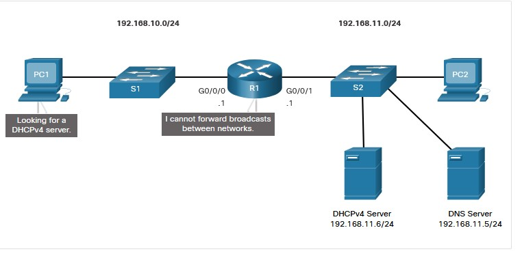

Настраивается на IF смотрящем в сегмент без DHCP. Если несколько DHCP-серверов, то надо прописать их разными строчками
```
int gi0/0/0
ip helper-address 192.168.11.6
end
```
Проверка:
```
sho ip int gi 0/0/0
R1# show ip interface g0/0/0
GigabitEthernet0/0/0 is up, line protocol is up
  Internet address is 192.168.10.1/24
  Broadcast address is 255.255.255.255
  Address determined by setup command
  MTU is 1500 bytes
  Helper address is 192.168.11.6
```
helper преобразует BC в UC, подменяет в пакете SRC ip на свой ip, а DST - указанный в настройках helper. При этом в пакете появляется GIAddress - адрес пересыльщика (если прошло пересылку, то "ставится штамп"), на основании которого DHCP-сервер выбирает pool из которого выдает ip-адрес:

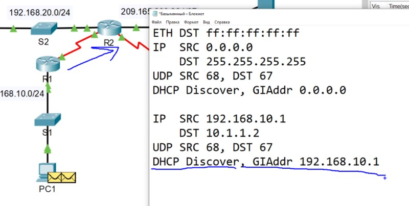

___Лаба 7.2.10___

- [pdf](labs/7.2.10-packet-tracer---configure-dhcpv4.pdf)
- [pka](labs/7.2.10-packet-tracer---configure-dhcpv4.pka)

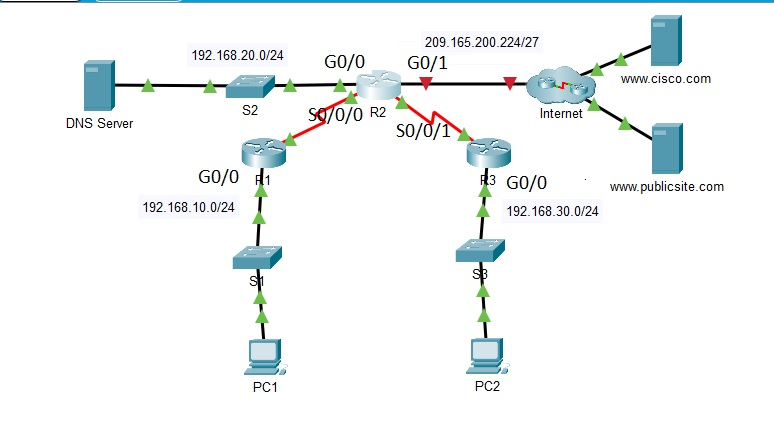
ЗАДАЧА:
1. Настроить R2 DHCP-сервером для сегментов R1-LAN, R2-LAN
   - настроить исключаемые адреса 1-10
   - настроить пулы для каждого сегмента
      - Настроить подсети для соответствующего сегмента
      - настроить default GW для соответствующего сегмента
      - настроить для сегментов DNS 192.168.20.254
2. Настроить на маршрутизаторах R1, R2 ip-helper на соответствующий пул
3. Получить ip-адрес на PC1,2

Конфиги тут:
[R2](./labs/7.2.10_R2.cfg)
[R1](./labs/7.2.10_R1.cfg)

пулы на R2 выглядят так:
```
R2#sho ip dhcp pool 
Pool R1-LAN :
 Utilization mark (high/low)    : 100 / 0
 Subnet size (first/next)       : 0 / 0 
 Total addresses                : 254
 Leased addresses               : 0
 Excluded addresses             : 2
 Pending event                  : none

 1 subnet is currently in the pool
 Current index        IP address range                    Leased/Excluded/Total
 192.168.10.1         192.168.10.1     - 192.168.10.254    0    / 2     / 254

Pool R2-LAN :
 Utilization mark (high/low)    : 100 / 0
 Subnet size (first/next)       : 0 / 0 
 Total addresses                : 254
 Leased addresses               : 0
 Excluded addresses             : 2
 Pending event                  : none

 1 subnet is currently in the pool
 Current index        IP address range                    Leased/Excluded/Total
 192.168.30.1         192.168.30.1     - 192.168.30.254    0    / 2     / 254
```
Итак, PC2 включился и увидел что ip - нет и решил отправить BC-запрос всем (255.255.255.0):
1. The DHCP client constructs a Discover packet and sends it out.
2. The device encapsulates the PDU into an UDP segment (SRC 68, DST 67).
3. Запрос в мою же подсеть, поэтому задаем next-hop = DST (255.255.255.255) 
4. так как next-hop = BC, то ARP задает dst MAC = FFFF.FFFF.FFFF и инкапсулируем PDU в Ethernet-кадр

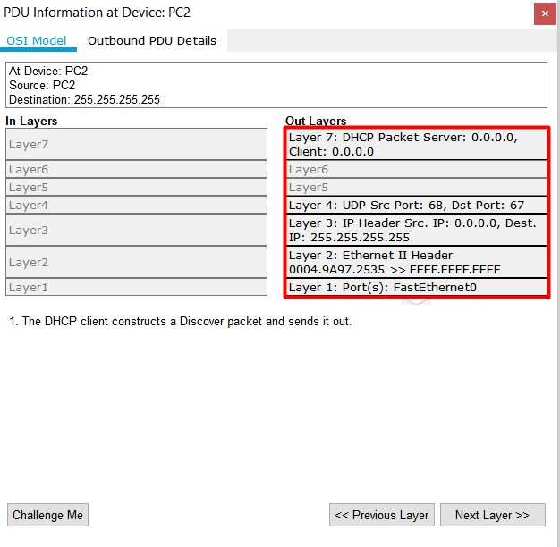

Как происходит свитчинг - не цель данной лабы, главное что SW видит что запрос L2 - BC и поэтому транслирует его на все, кроме входящего, порты

R1 получил запрос и в итоге понял что это DHCP-Discover

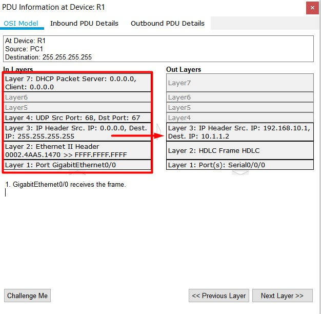
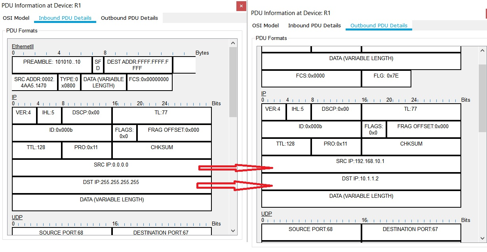

Поэтому:
1. The packet matches the helper criteria. The device forwards the packet to the helper address. При этом, как видно, пакет переиначился: появилось прелести UC трафика: DST и SRC.
2. The device looks up the destination IP address in the CEF table.
3. The CEF table does not have an entry for the destination IP address.
4. The device looks up the destination IP address in the routing table.
5. The routing table finds a routing entry to the destination IP address.
6. The destination network is directly connected. The device sets destination as the next-hop.

При переупаковке PDU7, R1  добавляет информацию о RelayAgent Address, и, как было сказано ранее, на основании этого ip, DHCP жолжен выбрать pool, в котором будет нарезан ip-адрес.

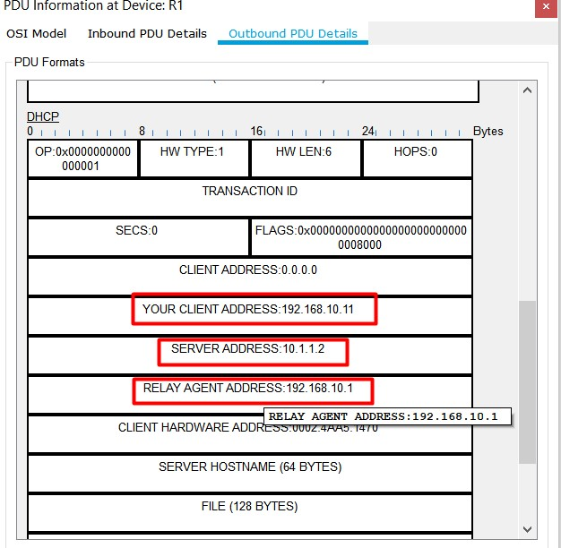

После чего начинает работать R2, уже как DHCP
- 1. The packet is a DHCP packet. The DHCP server processes it.
- 2. The DHCP server received a DHCP Discover packet.
- 3. The DHCP server does not have an existing binding to this host. It looks up DHCP pools for a new IP address.
- 4. The DHCP server finds the next available IP address in the pool.

Что и требовалось доказать: ip-helper меняет пакет и DHCP отвечает на него как на UC. 

Отправляемый обратно пакет - UC, который на R1 опять будет преобразован и разослан броадкастом обратно (L3, L2) на свич, который опять разошлет ответ по всем портам

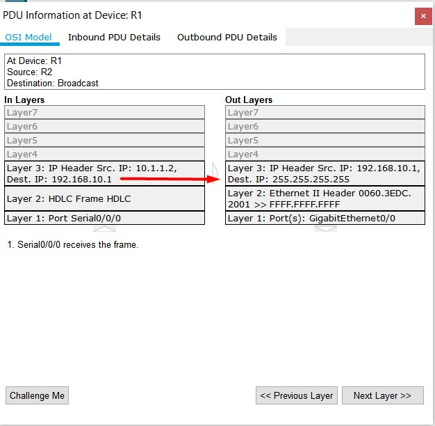

Хост понимает по MAC, что к нему пришел BC кадр, распаковывает его, пакет - тоже BC и он в свою очередь тоже деинкапсулируется в сегмент с портами SRC 67, DST 68, после чего хост понимает что пришел DHCP_Offer и в ответ на него отправляет BC DHCP_Request (doRa). BC - потому, что DHCP_Offer мог прийти от нескольких DHCP и надо оповестить всех о выбранном ip/dhcp

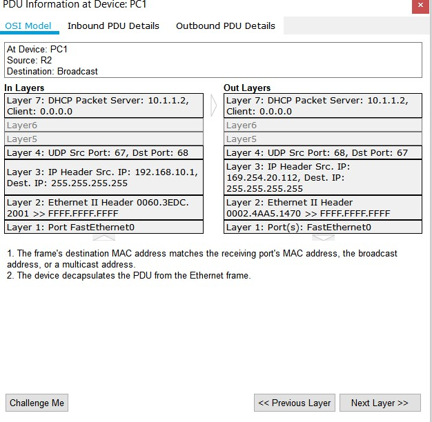

При этом этот Request L3 src все to tyt использует предложенный ip и все также отправляется BC и опять повторяется история c helper-ом, когда в PDU пихается ip интерфейса, на котором прописан helper параметром relay Agent, но уже также есть информация о том адресе, который выдал DHCP

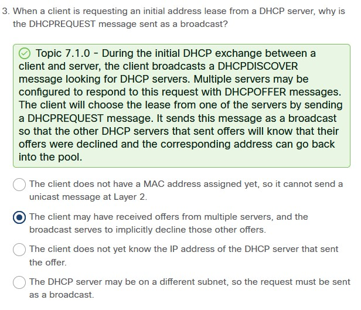


DHCP - Пришедший PDU просматривает на предмет существования binding и если он есть - отправляет ACK (dorA), опять в виде UC на адрес R1, а тот в свою очередь преобразует его в BC и снова выплевывает в сторону S1

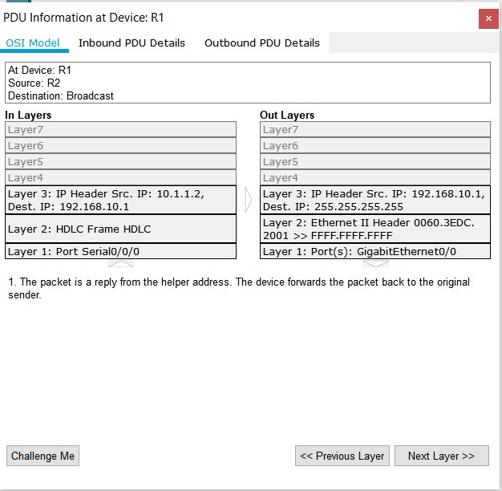

Только получив Ack клиент начинает использовать этот ip

проверяем binding:
```
R2#sho ip dhcp bind
IP address       Client-ID/              Lease expiration        Type
                 Hardware address
192.168.10.11    0002.4AA5.1470           --                     Automatic
192.168.30.11    0004.9A97.2535           --                     Automatic
```

## Configure DHCP client ##
Сам роутер может получать ip на IF смотрящем на ISP
```
SOHO(config)# interface G0/0/1
SOHO(config-if)# ip address dhcp
SOHO(config-if)# no shutdown
...
SOHO# show ip interface g0/0/1
GigabitEthernet0/0/1 is up, line protocol is up
  Internet address is 209.165.201.12/27
  Broadcast address is 255.255.255.255
  Address determined by DHCP
```

___Лаба - 7.4.1___

- [pdf](labs/7.4.1-packet-tracer---implement-dhcpv4.pdf)
- [pka](labs/7.4.1-packet-tracer---implement-dhcpv4.pka)

Задача:
- нарезать 2 dhcp-pool'а: R1-LAN, R3-LAN (network, GW, DNS - общий)
- заставить PC1,2 получить ip
- включить К2 - int gi0/1 на получение ip от DHCP

Проверяем pool's
R2#sho ip dhcp bind
IP address       Client-ID/              Lease expiration        Type
                 Hardware address
192.168.10.11    0002.4AA5.1470           --                     Automatic
192.168.30.11    0004.9A97.2535           --                     Automatic

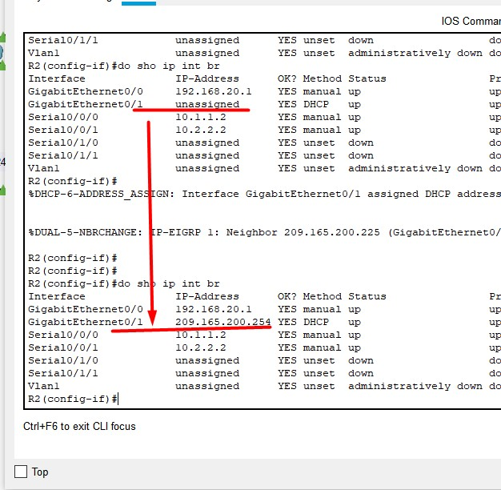


___Лаб 7.4.2___

- [pdf](labs/7.4.2-lab---implement-dhcpv4.pdf)

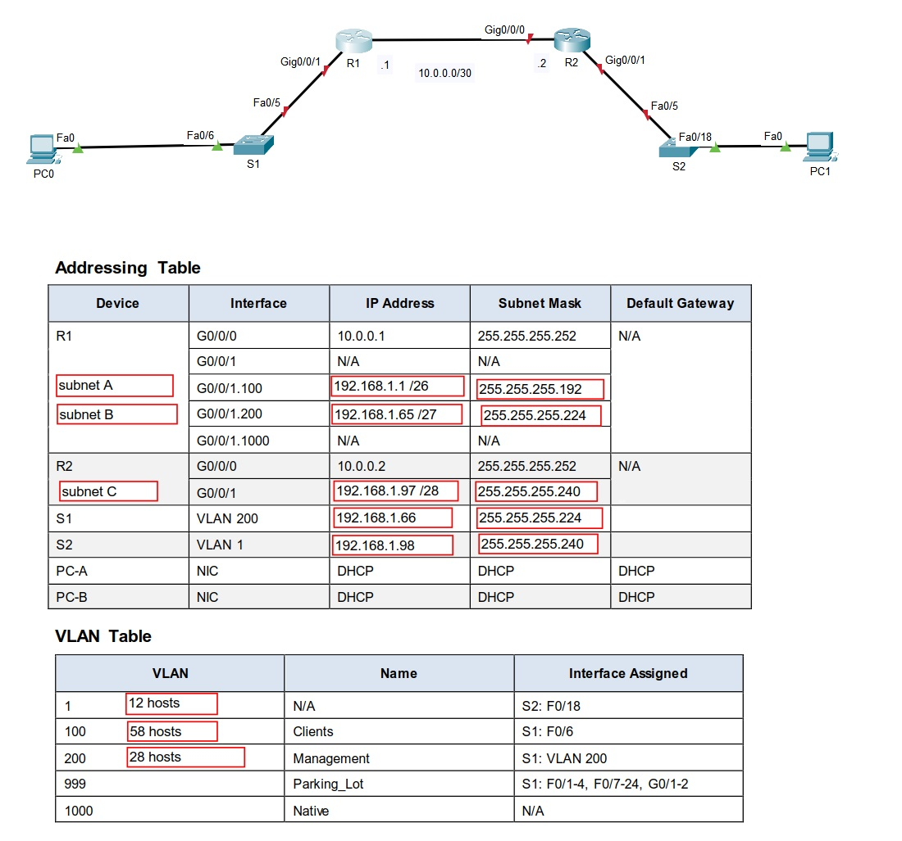

Задачи:
1. Разбить подсетки
2. Произвести базовую настройку роутеров
3. На R1 настроить сабы, включить inter vlan routing
4. Произвести базовую настройку SW
5. Настроить S1: vlan'ы, SVI, аплинк - trunk->native,  Access->clients, все остальные в Parking_LOT
6. Настроить S2: vlan1, SVI, все порты кроме аплинк, access - выключить
7. На R1 настроить исключения, пулы DHCP
8. Получить ip на PC1
9. На R2 настроить ip-helper на inside IF
10. Получить ip на PC2
11. Проверить связность PC1-PC2

Конфиги:
- [R1](./labs/7.4.2_r1.cfg)
- [R2](./labs/7.4.2_r2.cfg)
- [S1](./labs/7.4.2_S1.cfg)
- [S2](./labs/7.4.2_S2.cfg)

Самым сложным оказалось правильно разбить подсеть и записать это в pdf, ушло 2,5 часа.

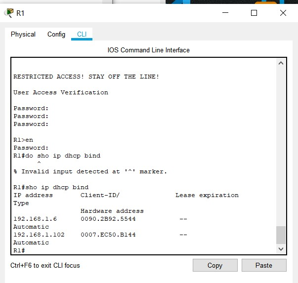

оба PC пингуются, задача решена

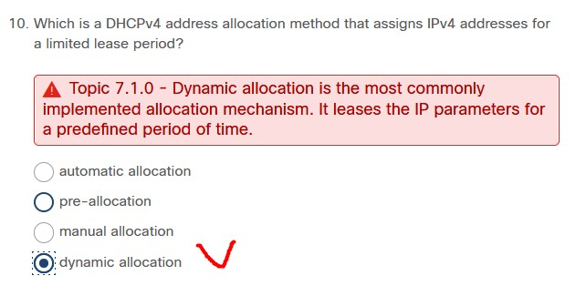

- [pkt](labs/7.4.2.lab.pkt)

___Почитать___:

Защита DHCP в сети
https://unlix.ru/%d0%b7%d0%b0%d1%89%d0%b8%d1%82%d0%b0-dhcp-%d0%b2-%d1%81%d0%b5%d1%82%d0%b8/#more-794