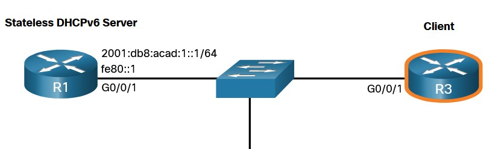

# SPECIALIST 20210116 #
UDP/546? UDP/547
3 способа получения ip
1. SLAAC - Stateless address auticonfi
   - RA (router Advertisement)
2. Stateless DHCPv6/DHCPv6 Lite - здесь DHCP-сервер выдает только опции, а адрес - выдает маршрутизатор
3. Statefull DHCPv6 - все операции делает DHCP-сервер

Пакеты DORA преобразовали:
DHCPv4/DHCPv6
Discover/Solicit - поиск DHCPv6
Offer/Advertise - сервер рассказывает о себе и говорит какая сеть доступна
Request/Request - клиент говорит что хочу сеть, сервер проверяет на le.kz; захоченного ip
Ack/Reply - подтверждает, если нет дубляжа

Итак, DHCPv6 делает:
- Может вести табличку кто и что получил
- Нет понятия "время аренды"
- Использует DUID  для идентификации клиента - DHCP Unic ID - Идентифиактор клиента, который клиент генерит сам. Делается это якобы для анонимности, так как раньше по MAC можно было "следить" за клиентом. В DHCPv6 уже не получится выяснить по MAC - клиента

Итак, при включении клиент отправляет RS, а роутер отвечает RA с флагами SLAAC/DHCPv6 Lite/DHCP:
- A(utoconfig) ___1___/___1___/___0___ - генери сам, других настроек не будет
- O(ther) ___0___/___1___/___0___ - генери сам, а настройки от DHCP
- M(anaged) ___0___/___0___/___1___  - вообще все получай от DHCPv6
Из поыта: вполне устраивает SLAAC


# NETACAD #
# DHCP v6 #
методы DCHP для ipv6:
- SLAAC [stateless address autoconfiguration] - (аналог APIPA для Global UC addresses)
- DHCPv6
## Ipv6 GUA assignment ##
SLAAC  или DHCPv6 - все равно на IF будет GUA и LLA. Пример статического GUA


При получении динамического ipv6-адреса, хост будет использовать какой-либо из 3 методов определенных в пойманном сообщении ICMPv6 Router Advertisement [RA]. К, находящийся в одном сегменте с ПК, рассылает эти самые RA-шки:
- Ipv6 Router может быть настроен на рассылку RA, которые получает клиент
- LLA - адресавтоматически создается при включении IF. ___%<№№>___ - для идентификацции ZoneID или ScopeID, это используется OS для идентификации определенного IF.

Пример LLA
```
C:\PC1> ipconfig
Windows IP Configuration
Ethernet adapter Ethernet0:
   Connection-specific DNS Suffix  . : 
   IPv6 Address. . . . . . . . . . . : 
   Link-local IPv6 Address . . . . . : fe80::fb:1d54:839f:f595%21
   IPv4 Address. . . . . . . . . . . : 169.254.202.140
   Subnet Mask . . . . . . . . . . . : 255.255.0.0
   Default Gateway . . . . . . . . . : 
```

В примере нет GUA- адреса, так как возможно там нет и R, рассылающего RA-шки. Итак, методы получения GUA: Все они используют RA-шки, для указания хосту метода настройки Ipv6

## Назначение Ipv6 GUA 
По-сути 2 способа, с небольшими отличиями:
- ___Stateless___
   - ___SLAAC only___ RA содержит:
      - network prefix
      - prefix-length
      - def GW addr
   - ___SLACC with DHCP server___ RA указывает кто тут DHCP, чтобы клиент обратился к нему за доп. информацией
- ___Stetefull___ - RA говорит клиенту прийти за всеми настройками на DHCPv6


### 3 Флага RA ###
Необходимы, чтобы клиент рздуплил с каким режимом DHCPон имеет дело:
- ___A flag___  - " ___А___ ты сам как-нибудь" - Address Autoconfiguration признак: чувак, сам себе настраивай адрес GUA методом [___Stateless___ Address Autoconfiguration] - SLAAC.
- ___O flag___ - " ___О___ стальные допы у DHCP"- Other Configuration признак: Other информация есть на ___Stateless___ DHCPv6 server.
- ___M flag___ - " ___М___ ы обо всем позаботимся"- Managed Address Configuration признак: ___Stateful___ DHCPv6 выдаст IPv6 GUA.


## SLAAC ##
Не все сети имеют DHCP, но всем клиентам надо выходить в инет, поэтому хосты могут опираясь на метод SLAAC сами генерить себе Ipv6-адреса. При этом в сети отсутствует узел, хранящий информацию о том за кем и какой адрес закреплен.

RA (каждые 200 сек) в этом случае выполняет информационную функцию, и хост использует информацию из RA. Чтобы отправлять RA, надо на R1 включить рассылку.

```
config)ipv6 unicast-routing
```

После включения рссылки, интерфейс будет отправлять MC на ff02::1 каждые 200 секунд


Итак, после включения SLAAC через ```ipv6 unicast-routing```, RA-шки начнут рассылаться с флагом А=1: клиент создает свой собственный IPv6 GUA, используя префикс, объявленный в RA. Также клиент может создать свой собственный идентификатор интерфейса, используя метод Extended Unique Identifier (EUI-64) или случайно сгенерированный.

Флаги O=0 и M=0 
- A=1 - " ___А___ ты сам как-нибудет"
- O=0 - " ___О___ стальные допы у DHCP"
- M=0 - " ___М___ ы обо всем позаботимся"

намекают клиенту что информация о префиксе, длине префикса, DNS-сервере, MTU и информация о шлюзе по умолчанию - содержится в RA. Типа, чувак, не рассчитывай ни на какую другую информацию ни от кого.


В примере ниже, клиент получил из RA DefGW, то есть LLA - адрес R1


### Сообщения RS ICMPv6 ###
RS-ки генерят клиенты, когда хотят получить информацию RA от DHCP? не дожидаясь 200 секунд. RS-ка отправляется на Ipv6 MC-адрес ff02::2. R1 отвечает на MC-адрес всех клиентов Ipv6 ___ff02::1___, сообщением с префиксом локальной сети и длиной префикса ___2001:db8:acad:1::/64___


Хост, получивший RA-шку, генерит оставшийся 64-битный хостовый ID самостоятельно, одним из 2 методов:
- случайный способ - используется Win10
- EUI-64 - на основании MAC-адреса (в середину MAC вставляем fffe-последовательность)

### Обнаружение дублирующихся адресов (DAD) ###

DAD - иетод обнаружения дубля созданного хостов Ipv6-адреса. Используется протокол ICMPv6. хост отправляет ICMPv6 Neighbor Solicitation (___NS___), с указанием адресом своей личной MC-рассылки (solicited-node multicast address), содержащей последние 24-бита изобретенного нами только что адреса. Если никто другой не откликнтся на данную рассылку, то значит в сети нет хостов с указанным адресом. Если же ответ будет получен, то Ipv6 будет сгенерирован заново. 

DAD рекомендован к использованию во всех случаях генерации Ipv6 - адресов.


## DHCPv6 (DHCPv6 is defined in RFC 3315)##
- ___STATELESS___ - Использует SLAAC
- ___STATEFULL___ - Не использует SLAAC

- RA - 546 port
- RS - 547 port

- The host sends an RS message.

- The router R1 отвечает RA-шкой, из кторой хост узнает что за настройками надо обращаться на DHCPv6.

- The host sends a DHCPv6 SOLICIT message (RS) на зарезервированный MC ipv6 ___ff02::1:2___. Этот адрес из LLA-диапазона, поэтому R не транслируют его дальше, без спец. настроек

- The DHCPv6 server отвечает ADVERTISE message, маякую клиенту что он тут, такой красивый и ждет начала обмена.

- The host responds to the DHCPv6 server. Ответ клиента, ___ADVERTISE___ , зависит от названных в самом начале режимов:
   - ___STATELESS___ - Использует SLAAC, Клиент сам создает IPv6-адрес, и на DHCPм6-сервер отправляет запрос ___INFORMATION-REQUEST___ о доп. информации (например DNS)
   - ___STATEFULL___ - Не использует SLAAC и хост отправляет обычный ___REQUEST___, для получения всей информации


- The DHCPv6 server sends a REPLY message. И в этом сообщении содержится информация соотносящаяся с выбранным режимами STATLESS/STATEFULL.

### Stateless DHCPv6 Operation ###
Флаги RA от роутера: 
- A=1 - " ___А___ ты сам как-нибудет"
- O=1 - " ___О___ стальные допы у DHCP"
- M=0 - " ___М___ ы обо всем позаботимся"


В этом режиме DHCPv6 сервер отправляет всем клиентам одинаковую конфигурационную информацию (DNS) и не ведет учет клиентов.

Включение на R1 ___Stateless___
```
ipv6 nd other-config-flag
```


### Stateful DHCPv6 Operation ###
Флаги RA от роутера
- A=0 - " ___А___ ты сам как-нибудет"
- O=0 - " ___О___ стальные допы у DHCP"
- M=1 - " ___М___ ы обо всем позаботимся"


Хост отправляет RS на MC ipv6 ___ff02::1:2___

Включение на R1
```
ipv6 nd managed-config-flag
дополнительная команда для установки флага A=0
ipv6 nd prefix default no-autoconfig
```


## Config DHCPv6 Server ##
CISCO - роутер может быть:
- DHCPv6 Server - DHCPv6 может работать в обоих режимах: stateless/stateful.
- DHCPv6 Client - сам может получать Ipv6 от DHCPv6.
- DHCPv6 Relay Agent - пробрасывает запросы от клиента на DHCPv6 из другой подсети.

### Configure a Stateless DHCPv6 Server ###
```
R1(config)# ipv6 unicast-routing
R1(config)# ipv6 dhcp pool IPV6-STATELESS
R1(config-dhcpv6)# dns-server 2001:db8:acad:1::254
R1(config-dhcpv6)# domain-name example.com
R1(config-dhcpv6)# exit
...
R1(config)# interface GigabitEthernet0/0/1
R1(config-if)# description Link to LAN
R1(config-if)# ipv6 address fe80::1 link-local
R1(config-if)# ipv6 address 2001:db8:acad:1::1/64
R1(config-if)# ipv6 nd other-config-flag
R1(config-if)# ipv6 dhcp server IPV6-STATELESS
R1(config-if)# no shut
R1(config-if)# end
```

Почуяв такие настройки, DHCP-клиент с радостным ржанием получит и Ipv6 адрес

### Configure a Stateless DHCPv6 Client ###



На тот случай, если R3 захочет стать клиентов, надо:
```
R3(config)# ipv6 unicast-routing
R3(config)# interface g0/0/1
R3(config-if)# ipv6 enable
R3(config-if)# ipv6 address autoconfig
R3(config-if)# end
```
Проверка:
```
R3# show ipv6 interface brief
GigabitEthernet0/0/1   [up/up]
    FE80::2FC:BAFF:FE94:29B1
    2001:DB8:ACAD:1:2FC:BAFF:FE94:29B1
```
и еще:


### Configure a Stateful DHCPv6 Server ###

Аналогичная настройка, с небольшими изменениями
```
R1(config)# ipv6 unicast-routing
R1(config)# ipv6 dhcp pool IPV6-STATEFULL
R1(config-dhcpv6)# address prefix 2001:db8:acad:1::/64 - добавилось
R1(config-dhcpv6)# dns-server 2001:4860:4860::8888
R1(config-dhcpv6)# domain-name example.com
R1(config-dhcpv6)#
R1(config-dhcpv6)# exit
...
R1(config)# interface GigabitEthernet0/0/1
R1(config-if)# description Link to LAN
R1(config-if)# ipv6 address fe80::1 link-local
R1(config-if)# ipv6 address 2001:db8:acad:1::1/64
R1(config-if)# ipv6 nd managed-config-flag - M=1
R1(config-if)# ipv6 nd prefix default no-autoconfig - A=0
R1(config-if)# ipv6 dhcp server IPV6-STATEFUL
R1(config-if)# no shut
R1(config-if)# end
```

### Configure a Stateful DHCPv6 Client ###
На случай, если какой-то роутер захочет стать DHCPv6-клиентом


```
R3(config)# ipv6 unicast-routing
R3(config)# interface g0/0/1
R3(config-if)# ipv6 enable
R3(config-if)# ipv6 address dhcp
R3(config-if)# end
```
Проверка:
```
R3# show ipv6 interface brief
GigabitEthernet0/0/1   [up/up]
    FE80::2FC:BAFF:FE94:29B1
    2001:DB8:ACAD:1:B4CB:25FA:3C9:747C
```


### Configure a DHCPv6 Relay Agent ###


Все помнят эту печальную ситуацию, когда у нас нет своего DHCP, и надо MC запросы клиентов транслировать на IF роутера - DHCP.
```
Router(config-if)# ipv6 dhcp relay destination ipv6-address [interface-type interface-number]
```


Проверка:
- ```R1# show ipv6 dhcp interface```
- ```show ipv6 dhcp binding```
- ``````


# Лабораторка

___Лаб 7.4.2___

- [pdf](labs/8.5.1-lab---configure-dhcpv6.pdf)


Задачи:
1. Разбить подсетки
2. Произвести базовую настройку роутеров
3. На R1 настроить сабы, включить inter vlan routing
4. Произвести базовую настройку SW
5. Настроить S1: vlan'ы, SVI, аплинк - trunk->native,  Access->clients, все остальные в Parking_LOT
6. Настроить S2: vlan1, SVI, все порты кроме аплинк, access - выключить
7. На R1 настроить исключения, пулы DHCP
8. Получить ip на PC1
9. На R2 настроить ip-helper на inside IF
10. Получить ip на PC2
11. Проверить связность PC1-PC2

Конфиги:
- [R1](./labs/7.4.2_r1.cfg)
- [R2](./labs/7.4.2_r2.cfg)
- [S1](./labs/7.4.2_S1.cfg)
- [S2](./labs/7.4.2_S2.cfg)
