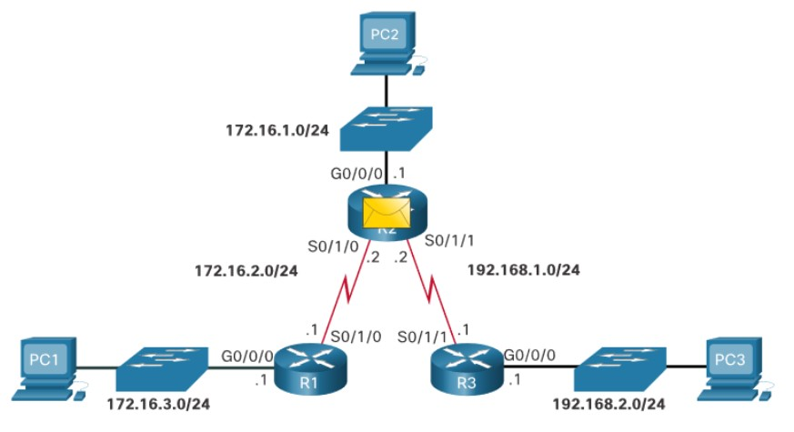
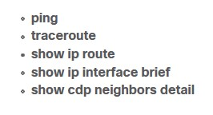
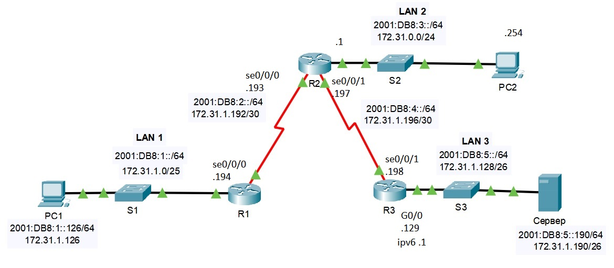
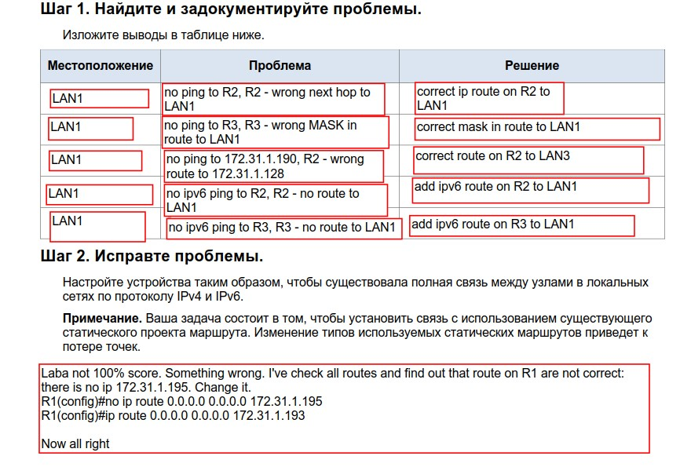

# NETACAD

Процедура пересылки пакета выглядит так:
- Пакет поступает на  GigabitEthernet 0/0/0 R1.
- У R1 нет маршрута в сеть назначения 192.168.2.0/24. Но R1 использует default static route.
- R1 инкапсулирует пакет в новый кадр. Так как линк к R2 ppp link, R1 добавляет "all 1s" как Layer 2 DST addr.
- Кадр выходит из Serial 0/1/0. Приходит на Serial 0/1/0 R2 и деинкапсулируется в пакет.
- R2 ищет маршрут в DST сеть. У него есть static route 192.168.2.0/24 через Serial 0/1/1.
- R2 инкапсулирует пакет уже в новый кадр. Так как R2-R3 линк ppp, R2 делает "all 1s" как Layer 2 DST addr.
- Пакет переслывается из Serial 0/1/1, прибывает на Serial 0/1/1 R3.
- R3 деинкапсулирует кадр и ищет маршрут в сеть DST. У R3 эта сеть - connected и поэтому маршрут к ней (192.168.2.0/24) через GigabitEthernet 0/0/0.
- R3 ищет в ARP таблице строку для адреса 192.168.2.10, чтобы найти Layer 2 Media Access Control (MAC) адрес PC3. Если строки не будет, R3 сделает Address Resolution Protocol (ARP) запрос через  GigabitEthernet 0/0/0 (так как выходной маршрут указывает на этот интерфейс), а PC3 ответит ARP reply, в котором будет PC3 MAC L2 адрес.
- R3 инкапс. пакет в новый кадр, задавакя  MAC адрес GigabitEthernet 0/0/0 как SRC L2 address, и MAC адрес PC3 как DST L2 MAC адрес.
- кадр выходит из GigabitEthernet 0/0/0. и поступает на (NIC) PC3.

Команды траблшутинга

Ахтунг-вопрос с уже правильными ответами

На внимательность

___Лабка 16.3.1___

- [pdf](labs/16.3.1-packet-tracer---troubleshoot-static-and-default-routes_ru-RU.pdf)
- [pka](labs/16.3.1-packet-tracer---troubleshoot-static-and-default-routes_ru-RU.pka)

Все ошибки исправлены.

___Лабка 16.3.2___

- [pdf](labs/16.3.2-lab---troubleshoot-ipv4-and-ipv6-static-and-default-routes.pdf)

