# NETACAD
## 2.1.2 Включение OSPF
Процесс OSDPFv2 включается командой, с заданием process-ID (1-65535)
```
router ospf <XX>
```
После ввода этой команды, мы приступаем к настройкам процесса OSPF:
- RID [router ID]  - 32-bit значение, похожее на IPv4 адрес. Это значение должно быть уникальным в OSPF домене. Задать его можно:
   - вручную ```router-id <xxxxx>```, где xxxxx - 32-bit значение
   - автоматически: 
       - Если есть хоть один ___lo___ IF, то любой максимальный ip из всех Lo.
       - Если нет Lo, то любой максимальный из всех имеющихся
Для уверенного последующего траблшутинга, часто рекомендуют RID задавать вручную
```
router ospf 10
router-id 1.1.1.1

do sho ip proto | in Router ID
```

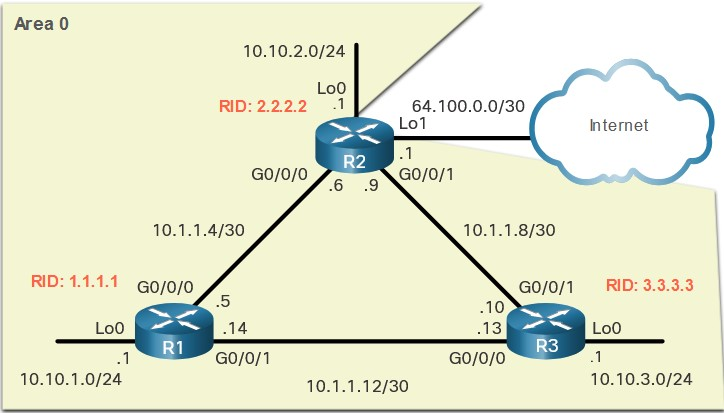

Если по каким-то причинам надо ___сменить RID___, то делается это ___только с последующим сбросом OSPF___:
```
clear ip ospf process
```

В этот момент отвалятся все соседства и пропадут маршруты в целевые OSPF-сети

Влияет значение RID на алгоритм некоторых действий:
   - ExStart состояние: у кого больший RID, тот станет master и начнет обмене DBD-шками
   - участвует в выборах DR/BDR - тот, у кого больше всех - становится DR, тот у кого чуть меньше - BDR

Ахтунг-вопрос:


## 2.2.1
Если перед нами PPP-сеть, то IF, который подключается к OSPF может быть однозначно идентифицирован подсеткой этого IF:

```
network <network-address> <wildcard-mask> area <area-id>
```

- Любой IF, который определен таким образом в OSPF - будет задействован в OSPF-обмене (отправить/получать ospf-пакеты).
- area-id должна быть одинакова на всех роутерах, в одной AREA. Если всего одня area, то рекомендуется использовать area-id=0

Также процесс OSPF можно включить и на каком-либо IF непосредственно:
```
ip ospf <process-id> area <area-id>
```

Для безопасности, IF через которые OSPF ходить не должен (это те. которые не подключены к OSPF-соседям) - надо делать пассивными:
```
router ospf <10>
passive-intarface loopback 0

...

R1# show ip protocols
...
  Passive Interface(s):
    Loopback0
```

## 2.2.11 DR/BDR в PPP - подключении

Даже если подключение PPP - в канале ethernet все равно будут DR/BDR.


Если по каким-либо причинам это надо отключить, (например мы скоммутировали 2 роутер по Ethernet-подключению, но мы знаем, что их всего лишь 2)
```
ing gi 0/0
ip ospf netwo point-to-point
```

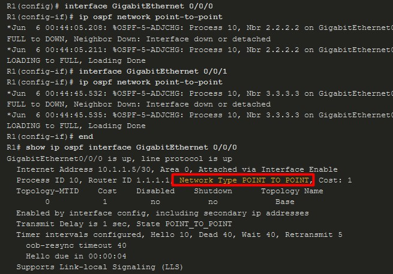

отсюда фича, при работе с Loopback: если нам надо получать не /32 подсеть, то можно сконфигурировать Lo point-to-point и тогда на соседа прилетит /24:


## лаба 2.2.13

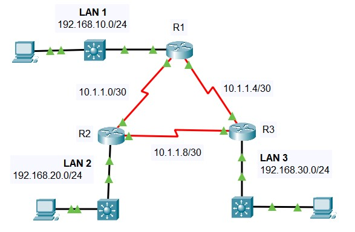

Задачи:
- Configure Router IDs.
- Configure Networks for OSPF Routing.
- Configure Passive Interfaces.
- Verify OSPF configuration.

- [pdf](labs/2.2.13-packet-tracer---point-to-point-single-area-ospfv2-configuration.pdf)
- [pka](2.2.13-packet-tracer---point-to-point-single-area-ospfv2-configuration.pka)

Лаба выполнена, но удовольствие не получено, так как, так как не разобравшись, я подумал что в PT не видно DR/BDR. Пересобрал в GNS3 и понял что соединение PPP, поэтому DR/BDR - не будет: это PPP, детка

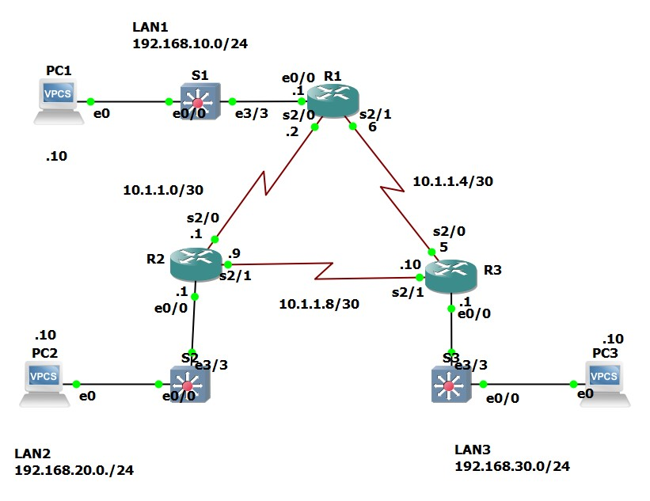

[gns3](labs/2.2.13_exp.gns3project)

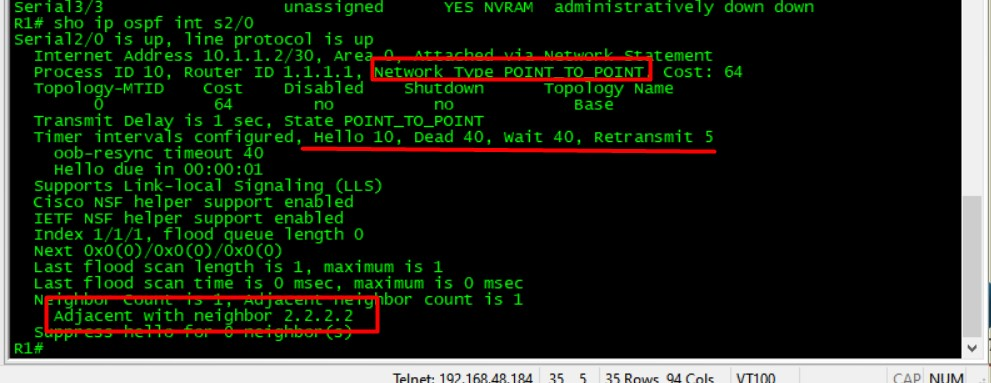


___По итогу прочтения - я не совсем понял, зачем так много времени посвящено point-to-point сетям___

## 2.3.1 OSPF Network Types
Второй тип сетей OSPF - multiaccess, этот тип будет отличаться от ppp - сети, так как тут будут выделенные роутеры DR/BDR, и DR будет отвечать за распространение LSA. DR использует MC-пакеты на адрес 224.0.0.5 (всем OSPF - роутерам). BDR - некий пассивный дублер DR, который втихаря все слушает ит также поддерживает соседские отношения со всеми другими соседями AREA.

Все остальные роутеры - DROTHER, и они уже используют MC 224.0.0.6 для взаимодействия друг с другом и DR/BDR. Как ранее говорилось, тот у кого больше RID - станет DR, у кого меньше - BDR и перевыборов не будет, пока не сдохнет DR или BDR.

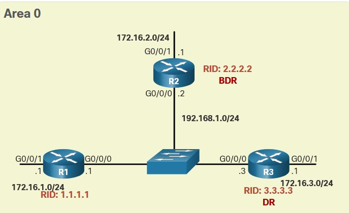

```
show ip ospf interface <Gi0/0/0>
```

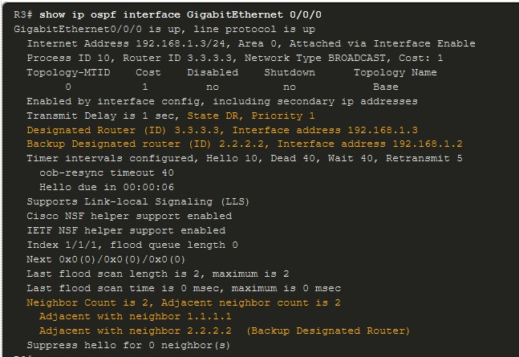

Как мы помним, роутеры OSPF находятся в каком-то из перечисленных состояний:
- ___FULL/DROTHER___ - DR или BDR в состоянии ___full___-соседства по отношению к non-DR or BDR роутерам. Обмен с такими присутствует в полном объеме: Hello packets, updates (LSU), queries (LSR), replies (LSR), and acknowledgments (LSAck).
- ___FULL/DR___ - ___full___-соседство с DR соседом. Обмен также в полном объеме: Hello packets, updates, queries, replies, and acknowledgments.
- ___FULL/BDR___ - ___full___-соседство с BDR соседом. Также обмен в полном объеме: Hello packets, updates, queries, replies, and acknowledgments.
- ___2-WAY/DROTHER___ - non-DR и non-BDR (DROTHER) роутеры также имеют отношения соседства между собой. Обмен ТОЛЬКО Hello packets.

Смотрим на состояние: нормальное состояние - FULL. Если R завис в каком-то другом состоянии (за исключением 2-WAY, как показано выше), то у него есть проблемы формирования соседства (разные таймеры, MTU и т.д.)

## 2.3.6 Default DR/BDR Election Process
DR/BDR выборы начинаются сразу, как только на OSPF-роутере включится IF. Выборы занимают несколько секунд и поэтому если кто-то из роутеров проспал этот момент, он уже никак не сможет повлиять на результат: новые R не вмешиваются в работу сети.  Критерии выбора DR/BDR - следующие:
1.  На основании приоритета (___см. описание hello-пакета, Router Priority - для выбора DR/BDR - 1 default, вручную задаем 0 - 255 (чем больше, тем лучше)___), роутер сам себе выбирает DR. Роутер со вторым по величине приоритетом становится BDR. Приоритет задается на IF, если его значение задать в 0, то IF роутера никогда не будет назначен DR/BDR (типа открестился от почетной обязанности). Приоритет по-умолчанию для multiaccess broadcast interfaces ___1___. Так как чаще всего никому нафиг эти приоритеты менять не надо, они так и остаются в 1 и поэтому придумали еще один спосб назначения.
2. При обмене Hello-пакетами, роутеры получают информацию о RID других участников обмена. Поскольку, как я написал, приоритеты на IF никто не меняет, роутеры начинают меряться RID-ами, и у кого больше - тот DR. Второй по величине RID - BDR.

Ну и тут уже надо понимать, что по-хорошему новым и центровым роутерам надо назначать максимальный RID, не забывая сбрасывать ```clear ip ospf process```. А если забыли, то RID возьмется автоматически:
   - максимальный lo адрес
   - максимальный из активных сетевой IPv4 IF.

Вышесказанное, относительно устоявшегося положения вещей с DR/BDR относится и ко вновь включенному R: опаздавший сидит и ждет пока не освободится место самого буйного в сумасшедшем доме.

## 2.3.8 ip OSPF priority
Эта настройка нужна чтобы выиграть выборы OSPF. Таким образом R прекрасно может сочетать в себе DR в одной AREA и быть DROTHER в другой. Если поставить 0 - значит R никогда не станет DR/BDR
```
R1(config)# interface GigabitEthernet 0/0/0 
R1(config-if)# ip ospf priority 255 
R1(config-if)# end 
```

В результате, R1 станет DR


___Лабка 2.3.11___

- [pdf](labs/2.3.11-packet-tracer---determine-the-dr-and-bdr.pdf)
- [pka](labs/2.3.11-packet-tracer---determine-the-dr-and-bdr.pka)

Задачи:
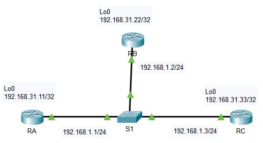
- Part 1: Examine DR and BDR Changing Roles
- Part 2: Modify OSPF Priority and Force Elections

просмотреть какая роль в настоящий момент у R можно командами
```
sho ip ospf int gi 0/0/0
...
shi ip ospf nei
```


Поперезагружал роутеры, в итоге RC - стал DROther, а DR - RB, BDR - RA, затем сделал ```debug ip ospf adj``` и отключил Gi0/0/0 на RA, который к тому времени стал DR


Через некоторое время я увидел как ospf поплыл и заметил отвал ___FULL->DOWN___ соседа, с которым он был DROTHER/BDR. Ну и понятно, что инициировались перевыборы. В итоге:
- DR - остался RB
- BDR - стал RC.

А вот и пакетики LSU/LSR/LSAck подвезли:

На L3:

1. The device multicasts out an OSPF Hello packet on GigabitEthernet0/0.
2. The device encapsulates the data into an IP packet.
3. The device sets the TTL on the packet.
4. The destination IP address is a broadcast or multicast address. The device sets the destination address as the next-hop.

L2:

1. The next-hop IP address is a multicast. The ARP process sets the frame's destination MAC address to a multicast MAC address.
2. The device encapsulates the PDU into an Ethernet frame.

L1:

1. GigabitEthernet0/0 sends out the frame.

Весь обмен идет MC, но нутрянку OSPF- пакета я не посмотрю в PT, ее надо смотреть в GNS

После смены приоритетов, в соответствии с задланием, картина состояний роутеров стала следующей


Выполненно 100%

## 2.4 Modify Single-Area OSPFv2

### Cisco OSPF Cost Metric

еще раз: данный link-state протокол использует поныятие стоимости для вычисления маршрута. Метрика - отражение накладных расходов при передаче данных по этому линку. OSPF использует ___cost___, чем она ниже - тем лучше.

Вычисляется cost обратно пропорционально BW канала, причем привязывается к некой ыеличине "относительной стоимости", которая до сих пор эквивалентна 100 Мбпс (см. картинку).

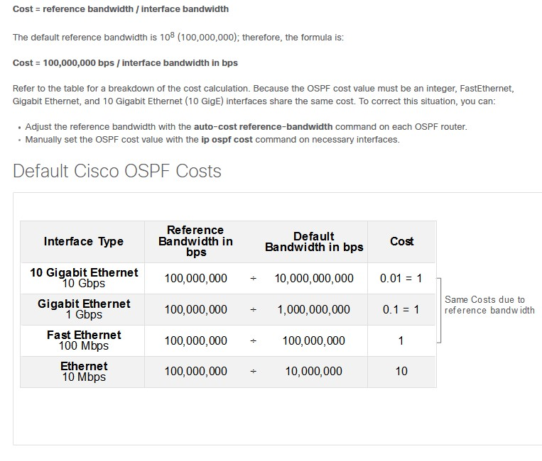

Поэтому, при расчете на современных цифрах, OSPF не замечает разницы между 1/10 Gbps и выше. Поэтому принято на всех устройствах в OSPF домене ___переопределять___ reference Bandwidth:
```
auto-cost reference-bandwidth <Mbps>
```
Например для 10 Gigabit Ethernet, ```auto-cost reference-bandwidth 10000```. Все будет пересчитано

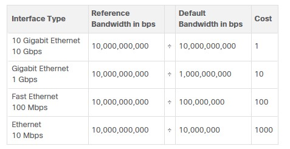

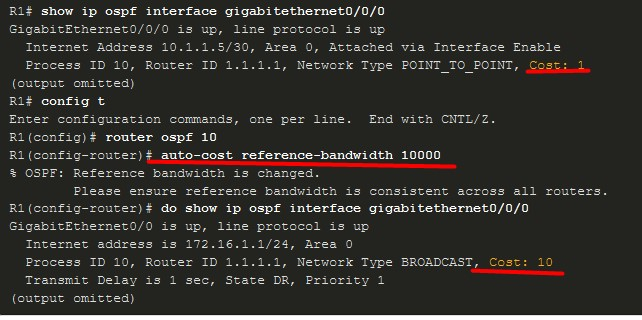

Вурнуть обратно можно командой ```auto-cost reference-bandwidth 100```

## 2.4.3 OSPF Accumulates Costs
Суммирование стоимости - работа, которую делает OSPF при расчете маршрута. Например, на R1 стоимость до R2=10, а до подсети R2/lo0 = 10+1 = 11/

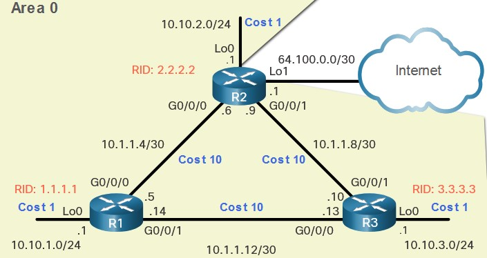

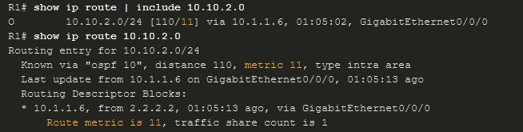

Бывают ситуации, когда на стоимость линка нужно повлиять ```ip ospf cost <value>``` :
- назначить дорогому маршруту метрику хуже
- взаимодействие оборудования разных производителей

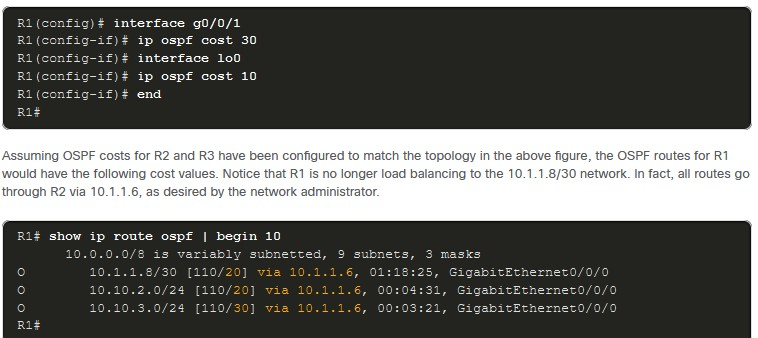

аналогичного результата можно добиться используя команду ```bandwidth``` на IF, но только если все R - cisco

## 2.4.7 Hello Packet Intervals
Hello-пакеты рассылаются MC 224.0.0.5 (на все OSPF роутеры) 1р/10 сек со всех IF, за исключением passive. Кроме этого интервала, есть еще и DEAD: по-умолчанию, если от соседа нет hello-пакета через 4х10 секунд, то он выбрасывается из LSDB и соответственно маршруты через него тоже все экспайрятся и исчезают. Интервалы должны совпадать с обоих сторон линка

В NBMA сетях эти интервалы
- hello = 30 сек
- dead = 4x30=120 сек

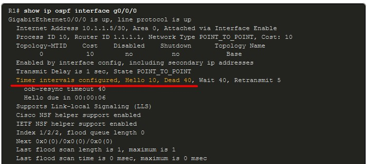

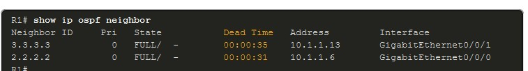

поменять интервалы легко, как и вернуть их в исходное состояние:
```
[no] ip ospf hello-interval <seconds>
[no] ip ospf dead-interval <seconds>
```
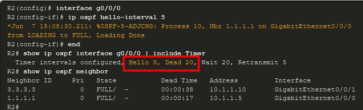

___Лабораторка 2.4.11___

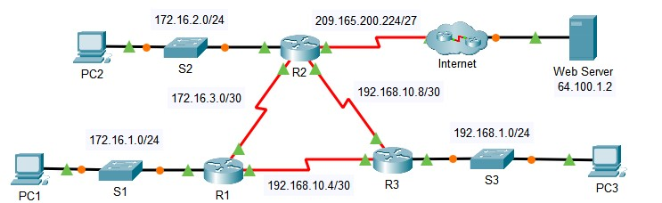

- [pdf](labs/2.4.11-packet-tracer---modify-single-area-ospfv2.pdf)
- [pka](labs/2.4.11-packet-tracer---modify-single-area-ospfv2.pka)

Задачи:
- Part 1: Modify OSPF Default Settings
- Part 2: Verify Connectivity

Итак, в соответствии с заданием, были изменены таймеры на IF между R1, R2, а кроме этого, стоимость s0/0/0 была изменена при помощи команды ```bandwidth 64```, то есть превращена в совсем маленькую.

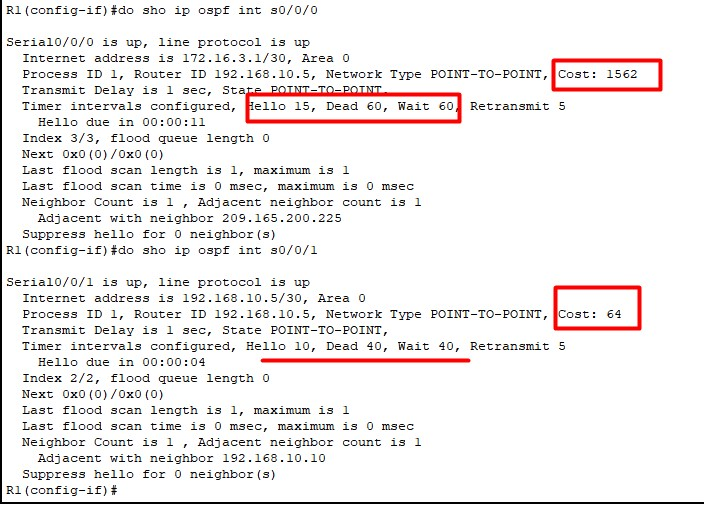

При этом трафик PC1-PC2 ожидаемо пошел через R3

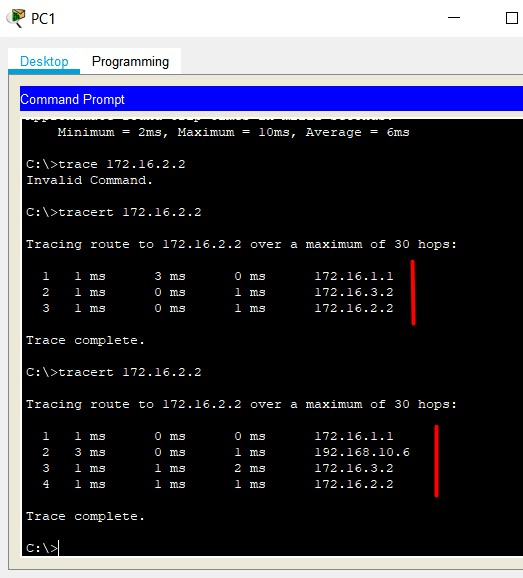

И в итоге - 100%, лаба сделана

##2.5.1 Propagate a Default Static Route in OSPFv2

Делается это безобразие с целью дать понять всем роутерам, что default маршрут проходит через тот роутер, который его анонсировал. Анонсировать default route должен тот, который стоит на границе OSPF и не-OSPF области. Называется такой роутер ___ASBR (autonomous system boundary router)___. 

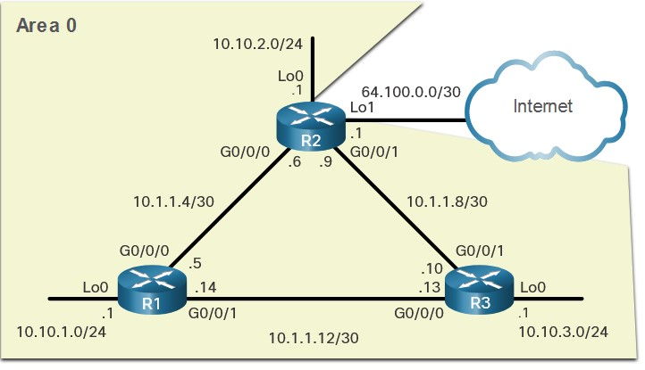

На R2, допустим, уже есть статика-восминулевка через lo0. Распространить этот маршрут на все другие роутеры можно командой 
```
router ospf 10
default information originate
```

Инжектированный дефолтный маршрут при этом в таблице маршрутизации будет обозначен символами ___O*E2___

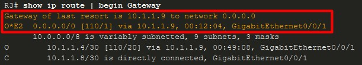

___Лабораторка 2.5.3___

Схема - как в лабораторке выше.

Задачи:
- Part 1: Propagate a Default Route
- Part 2: Verify Connectivity

л/р выполняется в 2 команды

```
R1
ip route 0.0.0.0 0.0.0.0 s0/1/0
router ospf 1
default-information originate
```

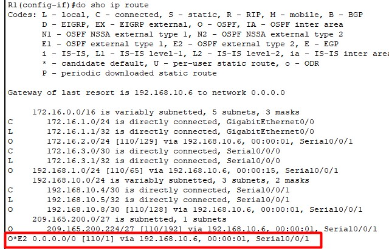

После чего с PC1 становится возможным достучаться до 64.100.1.2. Немного похулиганил: изменил bw верхнего IF у R1, трафик пошел через низ

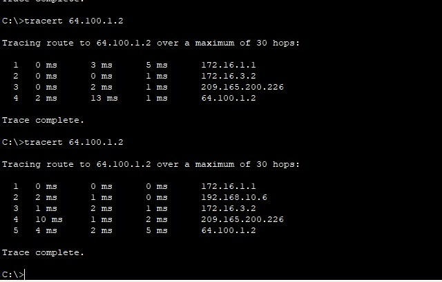


Аналогично перенаправить трафик можно и при изменении ___cost___ на верхнем IF 


## 2.4.1 Verify Single-Area OSPFv2

Команды для проверки OSPF
```
show ip interface brief
show ip route
show ip ospf neighbor
show ip protocols
show ip ospf
show ip ospf interface <X/Y>
show ip ospf interface brief
```

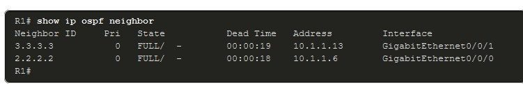

- Neighbor ID - This is the router ID of the neighboring router.
- Pri - This is the OSPFv2 priority of the interface. This value is used in the DR and BDR election.
- State - This is the OSPFv2 state of the interface. FULL state means that the router and its neighbor have identical OSPFv2 LSDBs. On multiaccess networks, such as Ethernet, two routers that are adjacent may have their states displayed as 2WAY. The dash indicates that no DR or BDR is required because of the network type.
- Dead Time - This is the amount of time remaining that the router waits to receive an OSPFv2 Hello packet from the neighbor before declaring the neighbor down. This value is reset when the interface receives a Hello packet.
- Address - This is the IPv4 address of the interface of the neighbor to which this router is directly connected.
- Interface - This is the interface on which this router has formed adjacency with the neighbor.

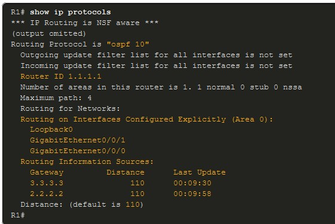

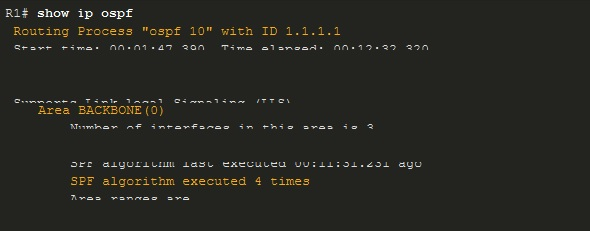

___Лабораторка 2.7.1___
Начал делать, но времени не хватило

___Лабораторка 2.7.2___
Не начал делать


Ахтунг-вопросы

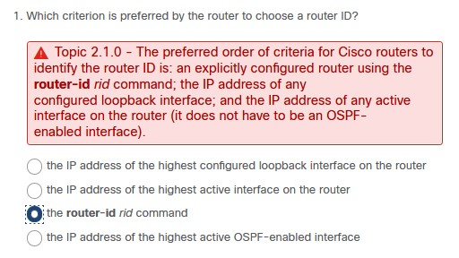
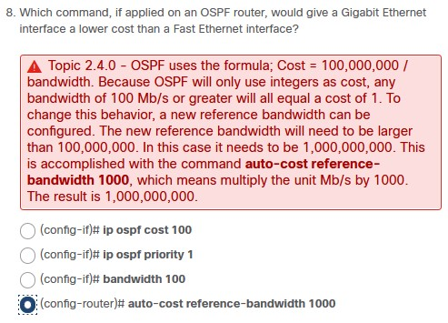
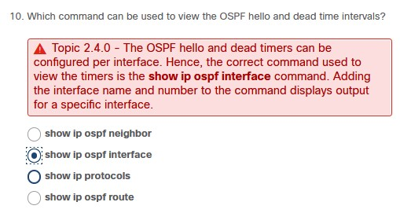
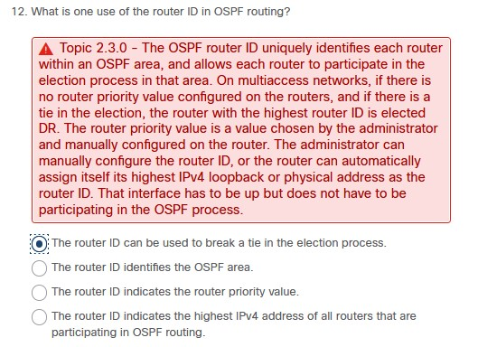
