# 20210206 Основы ACL
Запрет/ограничение на доступ выполняется ACL.
Пакетный фильтр проверяет каждый пакет по ACL:
- Пакетов много, ACE много - тормоза
- не открывают обратного прохождения пакетов 
Современная технология - Statefull firewall

ACL все равно надо знать, так как Cisco реаклизует ими в том числе условия/интересующий трафик

ACL задается несколькими ACE, которые состоят из условий ```permit|deny CONDITION```. Внизу каждого списка ACL - неявный deny all => в ACL должно быть хотя бы одно разрешающее правило, иначе трафик дропнется.

ACVL делятся на:
- Standard
    - условия SRC addr
- Extended (5 условий)
    - SRC
    - DST
    - протокол сетевого ур 
    - протокол трансп ур (TCP/UDP)
    - порты
ICMP - поэтому внимательно ограничиваем (icmp echo req, echo reply). Standard ACL раньше экономили ресурсы. Теперь можно все делать EXtended ACL.

В IOS еще есть деление
- Numbered
    - 1-99 - автоматически STANDARD
    - 100-199 - автоматически EXTENDED 
- Named
    - STANDARD
    - EXTENDED

ACL применяются на IF, но:
- 1 ACL на IN
- 1 ACL на OUT
SUB, VLAN - требуют применения ACL именно к ним.

В ACL используется шаблонная маска/обратная/Wildcard. Разница в инверсировании бит. Способ хитрый и для умных: 
- если стоит 0 - надо сверять
- если стоит 1 - сверять не надо

Wildcard для выборки только четных адресов:

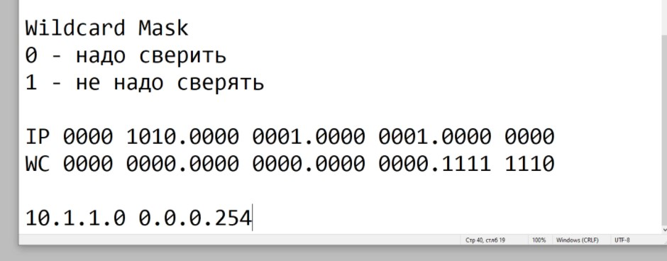

Стандартные ACL

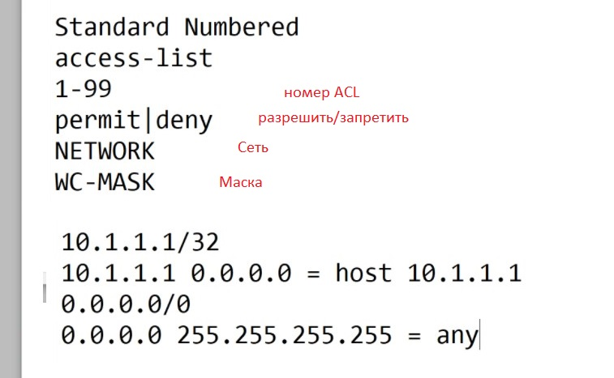

Расширенные ACL

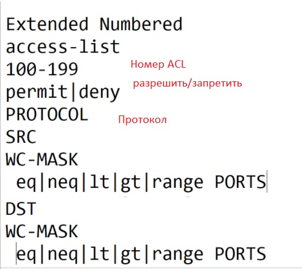

Например задача разрешить траф из 10.1.1.0/24, кроме трафика от узхла 10.1.1.101. Если писать как указано в задаче. то получится:
```
access-list 1 permit 10.1.1.0 0.0.0.255
access-list 1 deny host 10.1.1.101
```

Но будет ошибка в логике, так как любой трафик подпадет под 1-ю строчку. Чтобы избежать этого, заперщающие строки надо ставить выше
```
access-list 1 deny host 10.1.1.101
access-list 1 permit 10.1.1.0 0.0.0.255
```
лайфхак для учета неучтенного трафика: задать явно deny any, чтобы видеть число срабатываний. Если на правиле счетчик не растет, то надо задумываться об удалении этого правила.
```
access-li 1 deny any
```
В самом низу - неявный запрет. Но логика может отличаться: во фряхе может ACE перебираться до последнего совпадения.

После создания ACL - его надо повесить на оборудование (по ходу трафика). В FW все что явно не разрешено - запрещено. В FW трафик от самого маршрутизатора ACL  не -подпадает. Надо контроллировать self-трафик отдельно
```
int fa0/1
 ip access-group 1 in
```
Гадать о направлении трафика не надо, надло РИСОВАТЬ

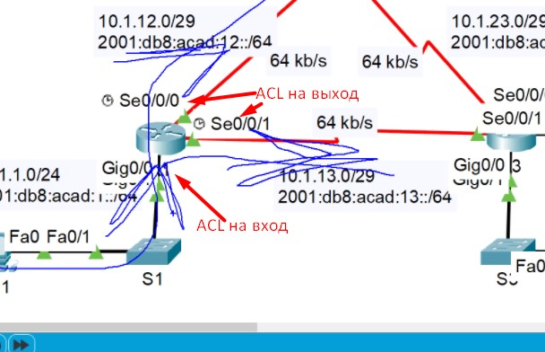

По применению ACL есть BestPract:
- Stand ACL вешают ближе к получателю, так как там анализируется SRC адрес
- Ext ACL вешают к отправителю, чтобы трафик не делал лишний путь (не напрягать маршрутизаторы, линкИ)

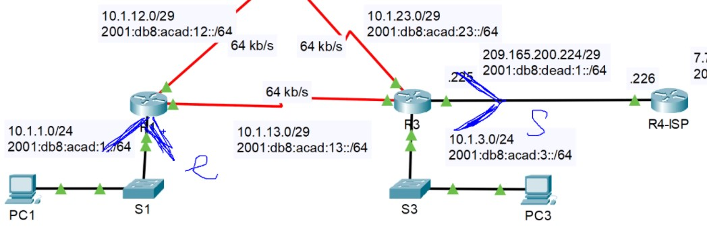

На SW L3 - есть ограничение на количетсов ACE, по причину ограничения ASIC. На маршрутизаторе такого предела - нет: он ограничен только ресурсами (CPU/MEM)

Лабка на настройку стандартного ACL

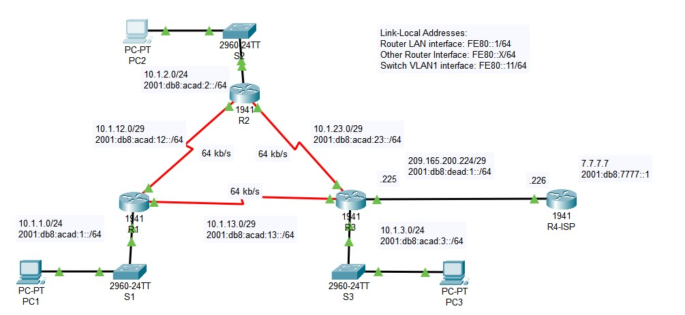

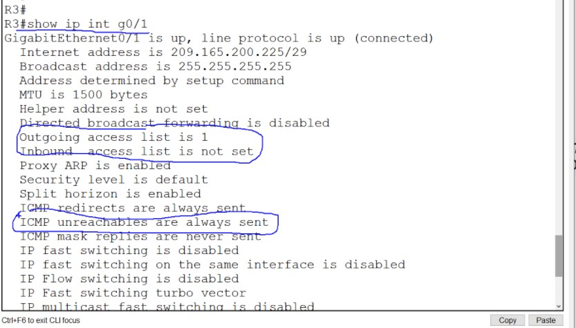

Назначение стндартного именованного ACL. Эффект что и от стандартного нумерованного

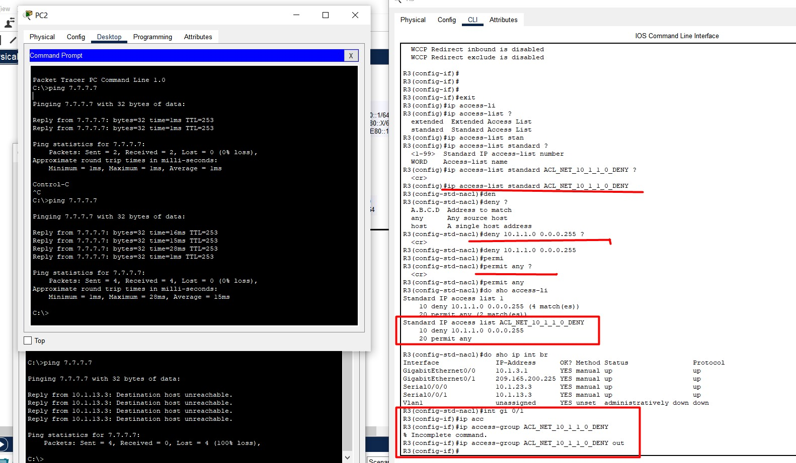


# 4. NETACAD - ACL
## 4.1.1 Что такое ACL
Роутеры обязаны принимать решения куда маршрутизировать трафик, но кроме этого мы можем нагрузить их еще: пусть они принимают решения можно ли пропускать трафик через интерфейсы. Пусть они сравнивают определенные параметры ___пакета/сегмента (данные L3/L4)___ с информацией из списков ACL [access-control lists]
- адреса SRC/DST
- протоколы/приложения (TCP/UDP/icmp/ftp)
- порты (80, 443, 53)

ACL содержат в себе ряд ACL, которые будут перебираться с начала и до нахождения подходящего пункта (или до конца), перед принятием решения заблокировать или пропустить пакет. А нужно все это, чтобы:
- запретить определенные виды трафа
- выделить виды трафика, которым надо дать определенную полосу пропускания
- ограничить пользователей в использовании какого-либо контента
- разграничить пользователей в использовании разных протоколов (ftp/ssh)
- разграничить доступ к подсетям

ACL делим на 2 типа
- Standard ACLs - только Layer 3, только SRC IPv4.
- Extended ACLs - SRC/DST IPv4 address. А также Layer 4 TCP, UDP ports, и протоколы.

## 4.1.3
Статические ACL нельзя применять как попало: по 1 ACL в каждом направлении (inbound/outbound) на IF, по ходу движения трафика. 

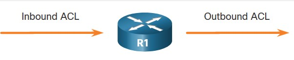

- Inbound фильтр - применяется до маршрутизации (экономия ресурсов), и эффективен для connected сетей
- Outbounf фильтр - после маршрутизации, эффективен когда одно и то же правило надо использовать ко многим сетям

Параноидильные шаги применения ACL:
- Извлекаю IPv4-адреса
- начинаю просматривать ACL с самого верха, на предмет совпадения извлеченного IPv4 и значения в ACE
- Если что-то совпало - смотрю что делать с этим пакетом и прыгаю от радости, так как не надо больше перебирать эти мутные ACE.
- Если в результате прогона от начала и до конца нихрена не нашлось - дропаю этот пакет (хитрость - явно прописать дроп, чтобы видеть что какой-то трафик дропается).

Вообще, последнее правило неявного дропа (implicit deny), как правило реализуется на все моборудовании. Также надо обязательно иметь хоть одно разрешающее правило, иначе все дропнется, и мы, в итоге, можем потерять доступ к железке.

___ЛОабораторка 4.1.4___

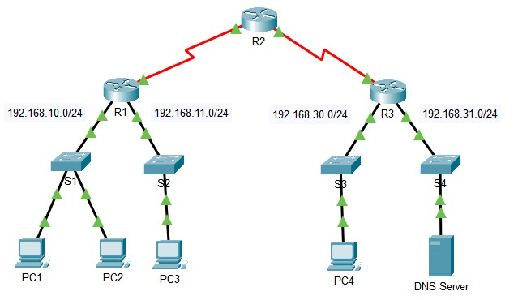

- [pdf](labs/4.1.4-packet-tracer---acl-demonstration.pdf)
- [pka](labs/4.1.4-packet-tracer---acl-demonstration.pka)

Задачи:
- Part 1: Проверить связность на узлах
- Part 2: Удалить ACL и снова проверить связность

как оказалось, стандартный ACL висел на R1:s0/0/0:out и блокировал трафик из подсети 192.168.10.0 в другие сети на основании SRC ipv4 подсети.
```
R1#show access-lists 
Standard IP access list 11
    10 deny 192.168.10.0 0.0.0.255 (7 match(es))
    20 permit any
R1#show run | in interface|access
...
interface Serial0/0/0
 ip access-group 11 out
```

После того как трафик был снят с IF s0/0/0 трафик спокойно начал ходить во все сегменты.

## 4.2.1 WILDCARD "маска" (обязательно https://habr.com/ru/post/131712/)
Некая форма записи, в которой биты инверсированы относительно стандартного представления маски подсети. Таким образом получаемые диапазоны ip-адресов зависят от того: стоит ли в значимой части wildcard маски 1 или 0:
- 0 - биты, которые не могут меняться и которые будут совпадать у заданного ip-адреса и итоговых ip-адресов (это может быть 1 адрес, группу последовательных или выборка по определенным алгоритмам). Отсюда маска ___host___ = 192.168.1.1 0.0.0.0
- 1 - биты могут меняться, они не обязаны совпадать. Отсюда маска ___any___ = 0.0.0.0 255.255.255.255

Чтобы въехать - для начала надо освоить получение инверсной маски из прямой, и обратное действие. Осуществляется такая операция инвертированием битового поля: меняем 0 на 1, а 1 на 0. Если использовать десятичное представление то получение инверсной маски вычисляется следующим образом: от 255 отнимается число соответствующее значению октета в прямой маске, для /22:

```
IP адрес, десятичное:            10.      10.       0.       1/22
IP адрес, двоичное:        00001010.00001010.00000000.00000001
Маска, двоичное:           11111111.11111111.11111100.00000000
Инверсная маска, двоичное: 00000000.00000000.00000011.11111111
Маска, десятичное:              255.     255.     252.       0
Инверсная маска, десятичное:      0.       0.       3.     255
```

Ещё способ - вычитание
```
      255.255.255.255
    - 255.255.252.  0
    =   0.  0.  3.255
```
Запомним, что wildcard mask – "гораздо более мощный механизм, нежели чем просто другое обозначение битов для нумерации сети и хоста в IP адресе". Этот способ для списков доступа (ACL) позволяет создавать не просто условия последовательные хосты из сети/ряда подсетей, а гораздо более гибкие правила и определение сетей или выборки конкретных хостов. Также в конфигурировании протоколов маршрутизации, OSPF например, - позволяет создавать компактные правила для анонса сетей не идущих подряд.

Пример результата применения wildcard к заданному адресу/подсети:
- 192.168.1.1 0.0.0.0 - должны совпадать все биты у проверяемого и заданного значения ip-адреса. Результат - ждем конкретный ip 192.168.1.1
- 192.168.1.___1___ 0.0.0.254  (не пытайтеся инверсировать такую маску: маска 255.255.255.1 - бессмысленна с точки зрения сетевых масок для какой-либо подсети). Итак, первые три октета проверяемых ip-адресов - должны совпадать, а в четвертом октете (254 - 11111110) могут меняться биты с 1-го по 7-й, а вот последний бит должен совпадать с битом заданного адреса/подсети - ___1___. Результатом применение такой wildcard будет ожидание ip-адресов у которых последний бит - ___1___, то есть это будут все нечетные ip-адреса.
- 192.168.1.1 0.0.0.252 (252 - 11111100), могут меняться все биты кроме 2 последних - они всегда будут совпадать с последними двумя битами последнего октете ___.1 (000000___01___)___. Таким образом в результате будут выбираться все адреса из диапазона 192.168.1.0 /24 с шагом 4:
```
192.168.1.1
192.168.1.5
192.168.1.9
192.168.1.13
...
```

Еще пример:

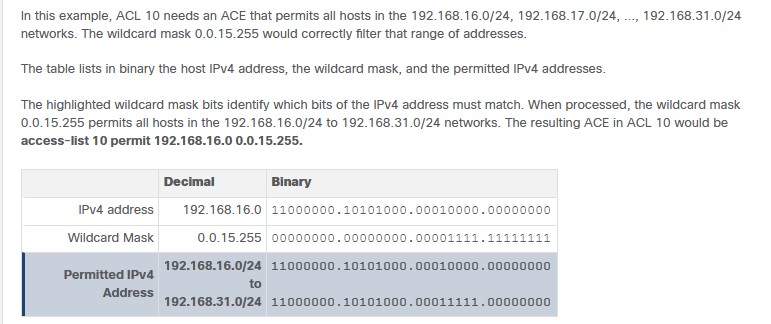

16 - 4-й бит (000 ___1___ 0000), он обязательно будет у всех подсетей, все остальные биты - меняются ( 0001 ___1111___ ), итого - меняется только 5-й, 6-й, 7-й, 8-й ,биты, wildcard - 15, все верно...

Еще интересный пример

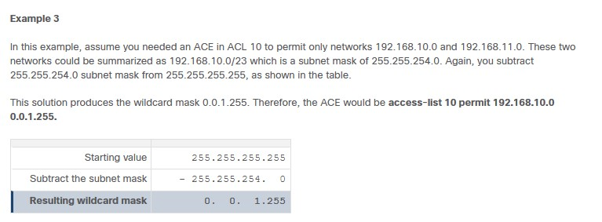
Я личноошибся в вычислениях, опять забыв что 1 - те биты, которые могут меняться от первоначального адреса (192.168.10.0). В итоге wildcard будет 0.0.1.255

## 4.3.1 Limited Number of ACLs per Interface
Число ACL на IF роутера ограничено (говорим про так называемый dual-stack):

- 1 outbound IPv4 ACL
- 1 inbound IPv4 ACL
- 1 inbound IPv6 ACL
- 1 outbound IPv6 ACL

Картинка лучше

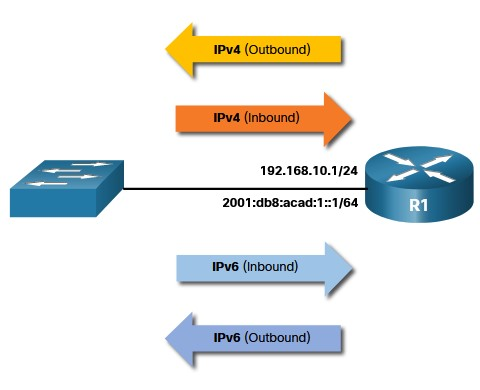

Самих ACL может быть гораздо больше. При этом не надо конфигурить ACL для обоих направлений, все зависит от ситуации. Если вы не хотите чтобы на вас свалились все шишки от применения, используйте следующие условия:
- У организации должна быть политика безопасности
- Запишите, что именно вы хотите сделать
- Обязательно надо использовать для написания ACL текстовый редактор (при этом сохраните сначала те ACL, которые у вас в рабочем конфиге)
- используйте ___remark___ в ACL, чтобы не морщить потом лоб, вспоминая по какому поводу появилась та или иная строчка
- тестируйте ACL на кошках

# 4.4.1 Types of IPv4 ACLs
Тут тоже все просто (это не ZBPF): StExNumNam
- ___Standard ACL___ - permit/deny на основании SRC адреса

```
access-list 10 permit 192.168.10.0 0.0.0.255
```

- ___Extended ACL___ - permit/deny на основании 
   - SRC + DST адресов
   - протокол 
   - TCP/UDP src и/или dst порты или ICMP

```
access-list 100 permit tcp 192.168.10.0 0.0.0.255 any eq www
```
- ___Numbered ACL___: 
   - Standard 1-99 или 1300-1999
   - Extended 100-199, 2000 - 2699
```
R1(config)# access-list ?
  <1-99>       IP standard access list
  <100-199>    IP extended access list
  <1100-1199>  Extended 48-bit MAC address access list
  <1300-1999>  IP standard access list (expanded range)
  <200-299>    Protocol type-code access list
  <2000-2699>  IP extended access list (expanded range)
  <700-799>    48-bit MAC address access list
  rate-limit   Simple rate-limit specific access list
  template     Enable IP template acls
```
- ___Named ACL___ - и Standard и Extended (имена надо давать смысловые, из чисел/букв, без пробелов и знаков препинания, ЗАГЛАВНЫМИ БУКВАМИ)

```
R1(config)# ip access-list extended FTP-FILTER
R1(config-ext-nacl)# permit tcp 192.168.10.0 0.0.0.255 any eq ftp
R1(config-ext-nacl)# permit tcp 192.168.10.0 0.0.0.255 any eq ftp-data
R1(config-ext-nacl)#
```

Как распологать - надо запомнить следующее:
- STANDART - как можно ближе к DST, чтобы src поток имел шансы прорваться к другим ресурсам, кроме DST
- Extended - как можно ближе к SRC - чтобы не замусоривать линкИ


Ахтунг-вопросы:

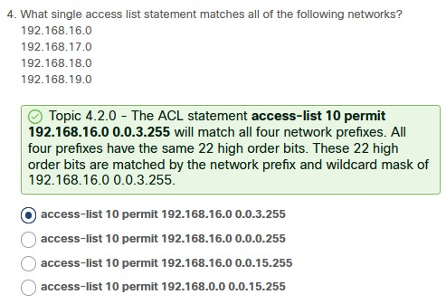

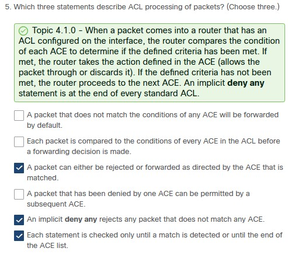

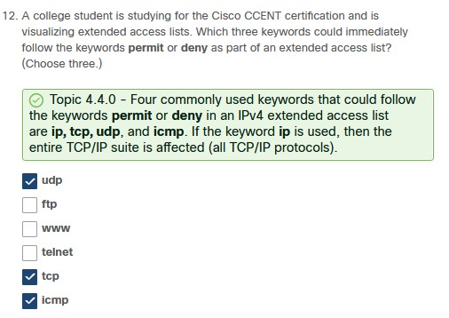

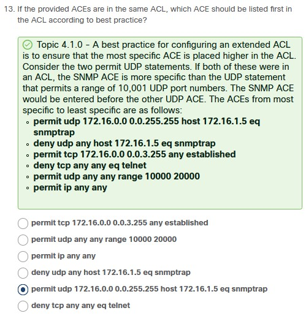

В последнем просто тупо пропустил