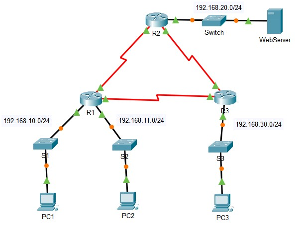
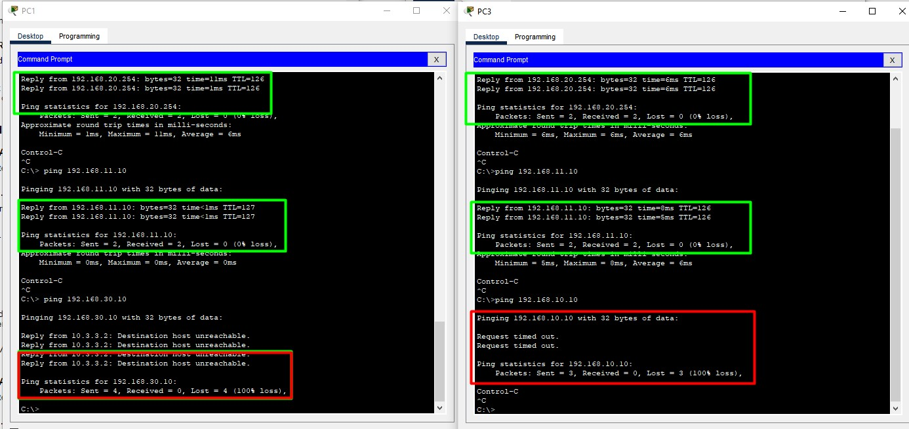
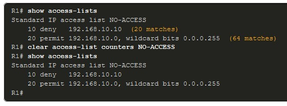
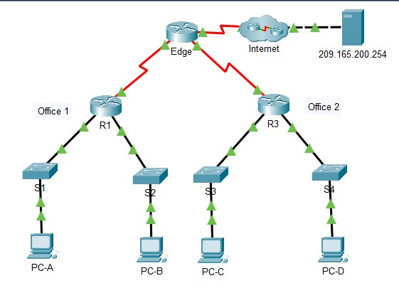
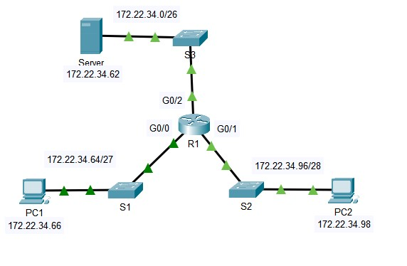

# NETACAD
## 5.1.1 Создание ACL
Прежде чем взять и все сломать, шутка, надо ACL как следуют спланировать.
- Работаем в текстовом редакторе
- Работаем в песочнице
- Используем ___remark___
- Копипастим строки на железо
- Тестируем ACL, чтобы не получить эффекта неожиданности

## 5.1.2/3 Standard IPv4 ACL Syntax
- Numbered 
```
 access-list access-list-number {deny | permit | remark text} source [source-wildcard] [log]
```
- Named 
```
 ip access-list standard access-list-name
... 
Standard Access List configuration commands:
  <1-2147483647>  Sequence Number
  default         Set a command to its defaults
  deny            Specify packets to reject
  exit            Exit from access-list configuration mode
  no              Negate a command or set its defaults
  permit          Specify packets to forward
  remark          Access list entry comment
```

## 5.1.4
После того как вы сваяли ACL - надо его применить хоть куда-то, например на IF ))

```
Router(config-if) # ip access-group {access-list-number | access-list-name} {in | out}
```

Пример настройки ACL: 

```
access-list 10 remark ACE permits ONLY host 192.168.10.10 to the internet
access-list 10 permit host 192.168.10.10
access-list 10 remark ACE permits all host in LAN 2
access-list 10 permit 192.168.20.0 0.0.0.255
...
do show access-lists
Standard IP access list 10
    10 permit 192.168.10.10
    20 permit 192.168.20.0, wildcard bits 0.0.0.255
...
R1(config)# interface Serial 0/1/0
R1(config-if)# ip access-group 10 out
R1(config-if)# end
...
R1# show ip int Serial 0/1/0 | include access list
  Outgoing Common access list is not set
  Outgoing access list is 10
  Inbound Common access list is not set
  Inbound  access list is not set
```

Еще 1 пример:


___Лаборатока 5.1.8___



- [pdf](labs/5.1.8-packet-tracer---configure-numbered-standard-ipv4-acls.pdf)
- [pka](labs/5.1.8-packet-tracer---configure-numbered-standard-ipv4-acls.pka)

Задачи:
- Part 1: Спланироват ACL
- Part 2: Сконфигурировать, применить и проверить Standard ACL
   - Evaluate two network policies and plan ACL implementations.
      - a. The following network policies are implemented on R2:
         - Запретить 192.168.11.0/24 доступ до WebServer в подсети 192.168.20.0/24.
         - Все остальное - разрешено.
      - b. The following network policies are implemented on R3:
         - Запретить обмен между 192.168.10.0/24 и 192.168.30.0/24.
         - All other access is permitted.

Как помним, стандартные ACL - лучше держать максимально далеко от себя, поэтому:
- var a , ___ACL 1___
   - 1-й ACE, запрещающий доступ ACL от 192.168.11.0/24 до WebServer 192.168.20.254 лечше нависить на R2, OUT IF, в направлении OUT, чтобы этот ACL не наделал бед и не зарезал другой возможный поток из подсетки 192.168.10.0/24 или из какой-то другой.
   - 2-й ACE будет явно разрешать все остальное (permit any).
- var b, тоже ___ACL 1___
   - Запретить исходящий из 192.168.10.0/24 в 192.168.30/24 так чтобы он не пересекался с другими потоками можно только на R3: ACE на IF в сторону подсетки 192.168.30.0/24 , в направлении OUT.
   - 2-й ACE будет permit all.

Перед выполнением лабы - надо проверить что везде есть ip-связность:
пинги ходят между всеми хостами
- var a
```
R2(config-if)#do show access-li
Standard IP access list 1
    10 deny 192.168.11.0 0.0.0.255
    20 permit any

R2(config-if)#do show ip int gi0/0 | in access
  Outgoing access list is 1
  Inbound  access list is not set
  IP access violation accounting is disabled
```
Результат применения - pc2 не в состоянии обмениваться ip-трафиком с сервером, но вполне себе обменивается с другими участниками


- var b
```
R3(config-if)#do show access-li
Standard IP access list 1
    10 deny 192.168.10.0 0.0.0.255
    20 permit any

R3(config-if)#do show ip int gi0/0 | in access
  Outgoing access list is 1
  Inbound  access list is not set
  IP access violation accounting is disabled
```
Результат применения - pc1 не в состоянии обмениваться ip-трафиком с подсетью PC3, но вполне себе обменивается с другими участниками, РС3 - также может общаться со всеми, кроме подсети PC1


при этом понятно, что echo-request в подсеть PC1 - прилетают, и даже echo-reply улетают обратно, но вот пробиться от PC1 до PC3 на R3 они уже не могут, так как ACL закрывает этот трафик


100%


___Лаборатока 5.1.9___
Все просто - вешается 1 ACL на IF глядищий на file-сервер, в направлении OUT.


## 5.2.1 Модификация aCL
Помним: набрав ```no access-list <№ | name>``` - мы тупо удалим его, вот такая херня, малята. Поэтому с маленькими ACL - сначала копируем их в блокнотик, затем прави ручками, затем удаляем acl с железки, затем копируем туда acl  из блокнотика.

Если же ACL больше чем одна строка и грохать его страшно/жалко - тоже сначала копируем весь ACL на бумажку/блокнотик. Затем входим в ACL и правим конкретный ACE
```
ip access-list standard 1
no 10
10 deny host 192.168.10.10
```
Что касается именованных ACL, то  с ними работают аналогично.  

Еще одна фича: по-умолчанию ACE пишутся через 10, так что при желании между ними можно впихнуть еще 9 строк ))

## 5.2.5 Статистика
Просмотреть ее можно набрав
```
show access-lists
```


Увидимо количество "попаданий" и да возрадуемся.

___Лаборатока 5.2.7___



- [pdf](labs/5.2.7-packet-tracer---configure-and-modify-standard-ipv4-acls.pdf)
- [pka](labs/5.2.7-packet-tracer---configure-and-modify-standard-ipv4-acls.pka)

Задачи:
- Part 1: Verify Connectivity
- Part 2: Configure and Verify Standard Numbered and Named ACLs
   - ACL 1:
      - allow 192.168.10.0/24, 192.168.20.0/24 to 192.168.30.0/24
      - deny any
   - name ACL ___BRANCH-OFFICE-POLICY___:
      - allow 192.168.40.0/24 -> 192.168.10.0/24
      - allow only PC-C -> 192.168.10.0/24
- Part 3: Modify a Standard ACL
   - найти и модифицировать ACL, который мешает обмену между PC-A и server 209.165.200.254

Итогом становится следующий конфиг:
R3 - создается ACL1, вешается на IF смотрящий в подсеть 192.168.30.0, в направлении OUT
```
access-list 1 remark Allow R1 LANs Access
access-list 1 permit 192.168.10.0 0.0.0.255
access-list 1 permit 192.168.20.0 0.0.0.255
access-list 1 deny any
...
interface GigabitEthernet0/0/0 
 ip access-group 1 out
```
R1 - создается ACL BRANCH-OFFICE-POLICY, вешается на IF смотрящий в подсеть 192.168.10.0, в направлении OUT
```
ip access-list standard BRANCH-OFFICE-POLICY
 permit host 192.168.30.3
 permit 192.168.40.0 0.0.0.255
 permit 209.165.200.224 0.0.0.31 - добавляется для Part3
 deny any
!...
interface GigabitEthernet0/0/0 
 ip access-group BRANCH-OFFICE-POLICY out
 ```
100%

## 5.3.1 Защита VTY
Такую защиту я встретил первый раз в одной маленькой компании, которую поддерживал очень грамотный коллега. Схемы, которые он рисовал с трудом на тот момент вмещались в мою голову, но благодаря общению с ним, я реально развился как специалист, спасибо, Юра ))

Итак, ACL может применяться для разрешения трафика на vty только с определенных хостов. Схема такая:
- создаем список админских хостов
- вешаем список на vty

Общий конфиг с локальным админом с паролем class

```
R1(config)# username ADMIN secret class
R1(config)# ip access-list standard ADMIN-HOST
R1(config-std-nacl)# remark This ACL secures incoming vty lines
R1(config-std-nacl)# permit 192.168.10.10
R1(config-std-nacl)# deny any
R1(config-std-nacl)# exit
R1(config)# line vty 0 4
R1(config-line)# login local
R1(config-line)# transport input ssh, telnet - telnet - совсем уж плохой тон
R1(config-line)# access-class ADMIN-HOST in
R1(config-line)# end
```


## 5.4.1 Extended ACL

___ОЧЕНЬ итересная тема, оставлю на потом___


___Лаборатока 5.4.12___



- [pdf](labs/5.4.12-packet-tracer---configure-extended-ipv4-acls---scenario-1.pdf)
- [pka](labs/5.4.12-packet-tracer---configure-extended-ipv4-acls---scenario-1.pka)

Задачи:
- Part 1: Configure, Apply and Verify an Extended Numbered ACL
- Part 2: Configure, Apply and Verify an Extended Named ACL:

Создали 2 ACL:
```
access-list 100 permit tcp 172.22.34.64 0.0.0.31 host 172.22.34.62 eq ftp
access-list 100 permit icmp 172.22.34.64 0.0.0.31 host 172.22.34.62
...
ip access-list extended HTTP_ONLY
 permit tcp 172.22.34.96 0.0.0.15 host 172.22.34.62 eq www
 permit icmp 172.22.34.96 0.0.0.15 host 172.22.34.62
```

повесили их на соответствующие IF, в ближайшем от отправителя месте ( на входе в IF Gi0/0, Gi0/1)
```
interface GigabitEthernet0/0
 ip access-group 100 in
 !
interface GigabitEthernet0/1
 ip access-group HTTP_ONLY in
 ```

  и проверили:
- трафик icmp сохранился от обоих устройств
- с PC1 - не работает http на 172.22.34.62
- c PC2 - не работает ftp на 172.22.34.62