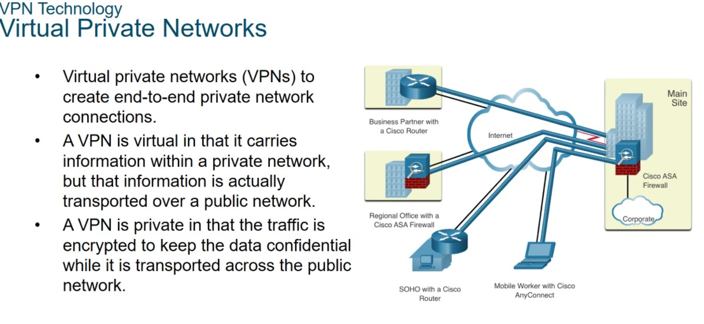
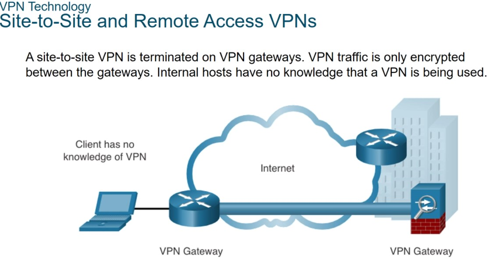
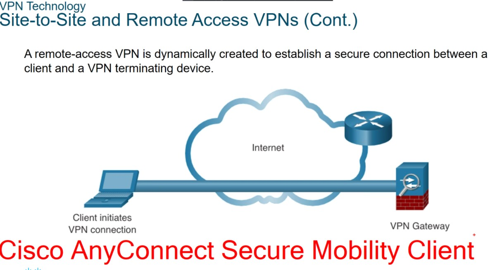
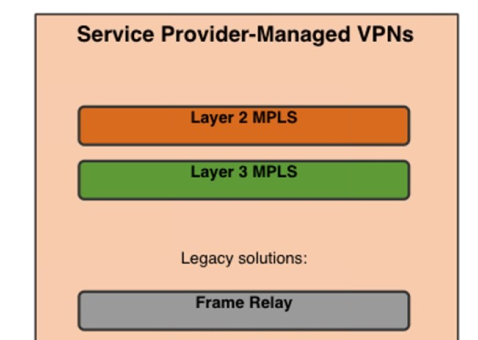
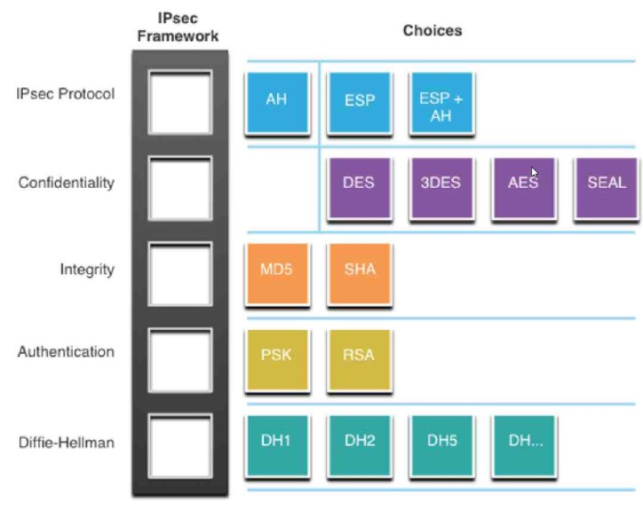

# SPECIALIST 20210222

## VPN, Private Networks
Причина - объедениени филиалов, удаленных сотров. Пробовали арендловать физику для филиалов, но дорого и немасштабируемо, хотя и безопасно.

VPN дает ряд преимуществ:
- безопасность (алгоритмы шифровыания, хеширования)
- Масштабируемость (без существенного изменения инфраструктуры)
- Совместимость (разные производители поддерживают открытые стандарты и близкие алгоритмы, все "стыкуется").

VPN строится на основе протокола IPCSEC или SSL (TLS)

Типы VPN
- site-to-site

- remote-access VPN (спец ПО anyconnect): может быть десяток сайтов и сотен remote access

Есть VPN организуемые провайдером, что может быть лучше, так как если использовать общую сеть - там действуют правила конкуренции. Провайдер лучше справится, на случай если нужны какие-то гарантированные показатели связи. провайдер гарантирует качество обслуживание (задержка не больше мс, гарантированная полоса пропускания и т.д., вы соответствии с SLA). Провайдер VPN строит при помощи L2 или L3 MPLS.
- L2 - ничего прововского не видим
- L3 - видим граничное оборудование прова

## IPSEC VPN
В IPv4 появился не сразу, а в Ipv6 - сразу в него интегрирован. В него входят следующие кубики:
- IPSec Proto
   - AH - нет шифрования? мертв по-сути
   - ESP - не было целостности
      - ESP+AH - обросший доп. функционалом ESP
- Confidentiality
   - 

   ...

Как собрать IPSec

IPSEC Policy

Когда настраиваем IPSEC надо настроить IKE, ISAKMP, IPSEC