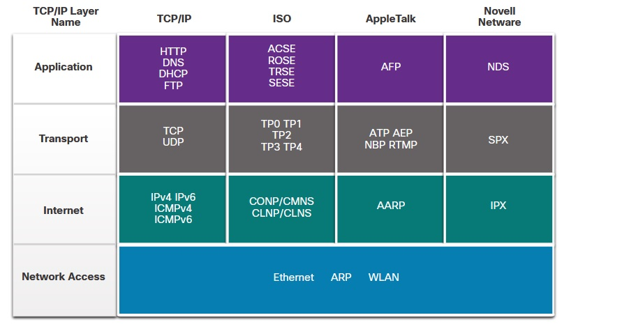
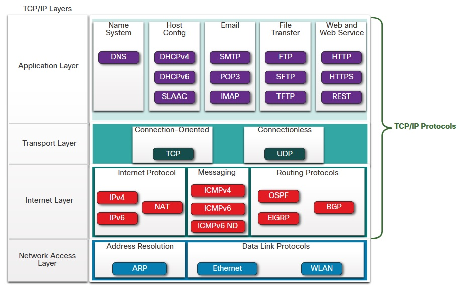
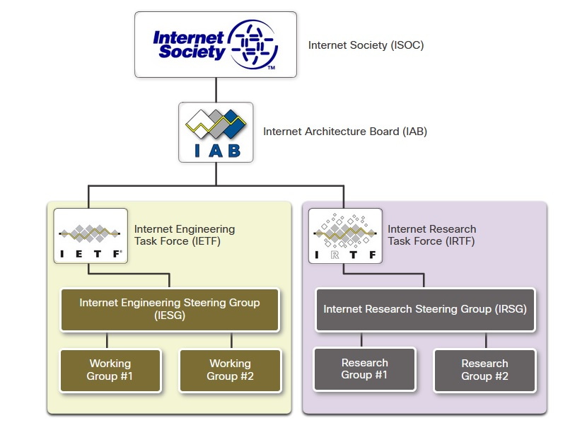
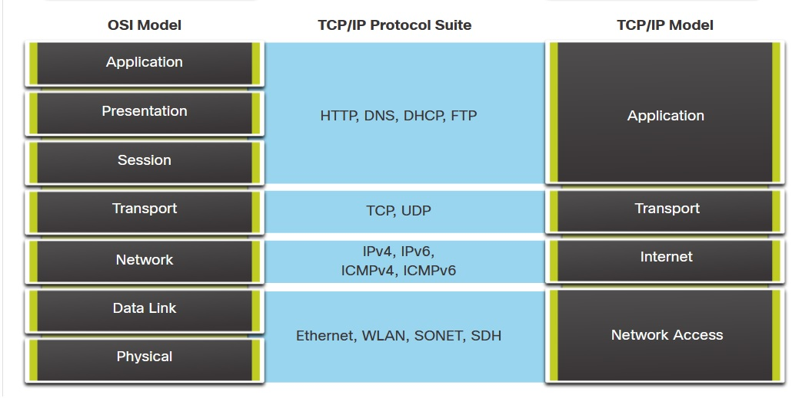
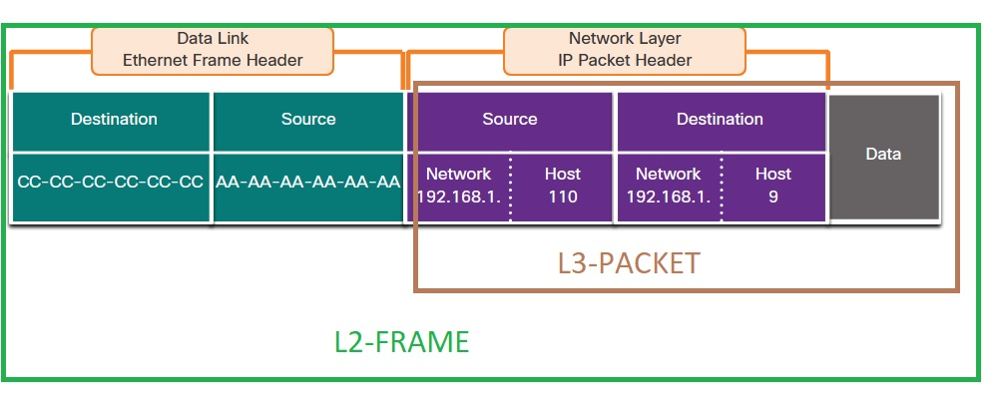
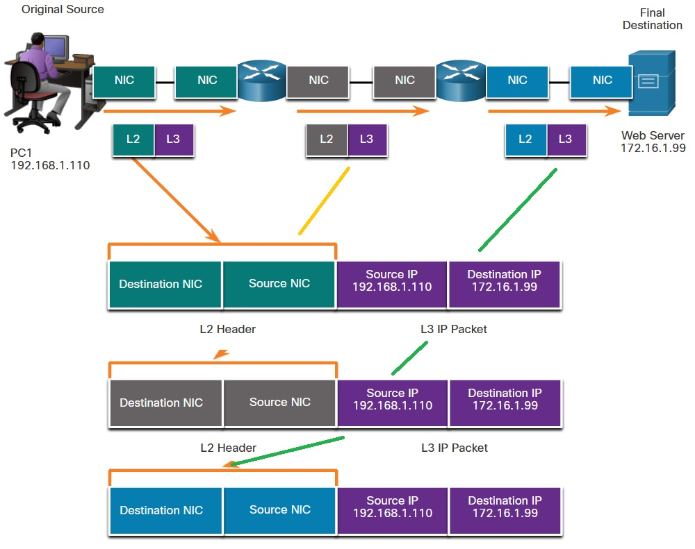

# 3.1 Основы взаимодействия по сети

Есть Sorce, Destination, Channel. Чтобы все понимали друг друга - используются протоколы: 

   * кодирование/декодирование при передаче
   * Форматирование и инкапсуляция (формат сегмента/пакета/кадра)
   * размер сообщения (добиваем джо минимума нулями, или сегментируем)
   * тайминги
      * flow control - контроль скорости отправки, зависит от качества связи, очередей в буфере и т.п. Сообщения отправляются с учетом этих изменений
      * Response timeout - ожидание ответа только определенное время, повторная отправка при неответе
      * access method - алгоритмы определения коллизий, 
   * способы доставки
        - Unicast - Information is being transmitted to a single end device.
        - Multicast - Information is being transmitted to a one or more end devices.
        - Broadcast - Information is being transmitted to all end devices.

# 3.2 Обзор протоколов

Для взаимодейсвия использование протоколов - обязательно. протоколы условно делятся на 4 типа:
   * ___Network Communications Protocols___ - обеспечивают сетевое взаимодейтсвие устройств (___IP, TCP, HTTP, etc___)
   * ___Network Security Protocols___ - защита данных АУ, целостность, шифрование (___SSH, SSL. TLS___)
   * ___Routing Protocols___ - обмен информацией о маршрутах, путях для выбора оптимального пути доставки (___BGP, OSPF,...___)
   * ___Service Discovery Protocols___ - автоматическое определение узлов сети (___DNS, DHCP, etc___)
## Функции протоколов.

___Addressing___ - идентификация участников при обмене. ___IPv4, IPv6___.

___Reliability___ - Обеспечение механизма гарантированной доставки, на случай потери или разрушения сообщения. ___TCP___

___Flow control___ - обмен на скорости близкой к эффективной. ___TCP___.

___Sequencing___ - уникальная идентификация каждого передаваемого сегмента. Получатель использует эти метки для сбора сообщшения из сегментов по порядку, на случай некорректной очереди доставки, потерь, порчи  сегментов. ___TCP provides sequencing___.

___Error Detection___ - determine if data corrupted during transmission. ___Ethernet, IPv4, IPv6, and TCP___.

___Application Interface___ - Интерфейсы приложений, предназначены создания process-to-process взаимодействия сетевых приложений. ___HTTP or HTTPS___ protocols are used to communicate between the client and server web processes.

При отправлении сообщения по сети, происходит взаимодействие между различными протоколами: ___HTTP->TCP->IP->Ethernet___

# 3.3 Стеки протоколов 
Используются для согласованного взаимодействия сетевых устройств. В процессе развития шире всех начал использоваться стек TCP/IP с уровнями: ___Network Access/Internet/Transport/Application___. В стеке OSI уровни другие

# ___Стек TCP/IP___ - ___Выучить картинку наизусть___

На каждом уровне одним или несколькими протоколами реализуется набор тех или иных функций:
___

Application Layer
___

___Name System___ - DNS - Domain Name System. Translates domain names such as cisco.com, into IP addresses.

___Host Config___
   * DHCPv4 - Dynamic Host Configuration Protocol for IPv4. A DHCPv4 server dynamically assigns IPv4 addressing information to DHCPv4 clients at start-up and allows the addresses to be re-used when no longer needed.
   * DHCPv6 - Dynamic Host Configuration Protocol for IPv6. DHCPv6 is similar to DHCPv4. A DHCPv6 server dynamically assigns IPv6 addressing information to DHCPv6 clients at start-up.
   * SLAAC - Stateless Address Autoconfiguration. A method that allows a device to obtain its IPv6 addressing information without using a DHCPv6 server.

___Email___
   * SMTP - Simple Mail Transfer Protocol. Enables clients to send email to a mail server and enables servers to send email to other servers.
   * POP3 - Post Office Protocol version 3. Enables clients to retrieve email from a mail server and download the email to the client's local mail application.
   * IMAP - Internet Message Access Protocol. Enables clients to access email stored on a mail server as well as maintaining email on the server.

___File Transfer___
   * FTP - File Transfer Protocol. Sets the rules that enable a user on one host to access and transfer files to and from another host over a network. FTP is a reliable, connection-oriented, and acknowledged file delivery protocol.
   * SFTP - SSH File Transfer Protocol. As an extension to Secure Shell (SSH) protocol, SFTP can be used to establish a secure file transfer session in which the file transfer is encrypted. SSH is a method for secure remote login that is typically used for accessing the command line of a device.
   * TFTP - Trivial File Transfer Protocol. A simple, connectionless file transfer protocol with best-effort, unacknowledged file delivery. It uses less overhead than FTP.

___Web and Web Service___
   * HTTP - Hypertext Transfer Protocol. A set of rules for exchanging text, graphic images, sound, video, and other multimedia files on the World Wide Web.
   * HTTPS - HTTP Secure. A secure form of HTTP that encrypts the data that is exchanged over the World Wide Web.
   * REST - Representational State Transfer. A web service that uses application programming interfaces (APIs) and HTTP requests to create web applications.

___

Transport layer
___

___Connection-Oriented___ (___TCP___) - Transmission Control Protocol. Надежная передача, с подтверждением успешной передачи.

___Connectionless___ (___UDP___) - User Datagram Protocol. Ненадежная передача, без подтверждения доставки. Однако работает быстрее.

___

Internet Layer
___

___Internet Protocol___
   * ___IPv4___ - Internet Protocol version 4. PDU с ___transport layer___ пакует в пакет, с указанием Src& Dst, и занимается доставкой пакета между сетями. IPv4 uses a 32-bit address.
   * ___IPv6___ - IP version 6. Аналогичен по назначению IPv4, отличается алгоритмами работы и адресом: 128-bit address.
   * ___NAT___ - Network Address Translation. Костыль IPv4: используется для того, чтобы информация/пакеты доходила от/в немаршрутизируемые (частные) сети. Подменяет IP private network на globally unique public IPv4 addresses и обратно.

___Messaging___
   * ___ICMPv4___ - Internet Control Message Protocol for IPv4. Provides feedback from a destination host to a source host about errors in packet delivery.
   * ___ICMPv6___ - ICMP for IPv6. Similar functionality to ICMPv4 but is used for IPv6 packets.
   * ___ICMPv6___ ND - ICMPv6 Neighbor Discovery. Includes four protocol messages that are used for address resolution and duplicate address detection.

___Routing Protocols___
   * ___OSPF___ - Open Shortest Path First. Link-state routing protocol that uses a hierarchical design based on areas. OSPF - открытый стандарт, поддерживается у всехз производителей.
   * ___EIGRP___ - Enhanced Interior Gateway Routing Protocol. Разработан Cisco, но теперь уже частично открыт, для расчета metric используются коэффициенты bandwidth, delay, load and reliability.
   * ___BGP___ - Border Gateway Protocol. Открытый стандарт, exterior gateway routing protocol used between Internet Service Providers (ISPs). BGP is also commonly used between ISPs and their large private clients to exchange routing information.   

___

Network Access Layer
___

___Address Resolution___
   * ___ARP___ - Address Resolution Protocol. Занимается сопоставлением (mapping) IPv4 address и MAC (hardware) address.

Note: You may see other documentation state that ARP operates at the Internet Layer (OSI Layer 3). However, in this course we state that ARP operates at the Network Access layer (OSI Layer 2) because it's primary purpose is the discover the MAC address of the destination. A MAC address is a Layer 2 address.

___Data Link Protocols___

   * ___Ethernet___ - Defines the rules for wiring and signaling standards of the network access layer.

   * ___WLAN___ - Wireless Local Area Network. Defines the rules for wireless signaling across the 2.4 GHz and 5 GHz radio frequencies.

В процессе подготовки сообщения к отправке с использованием TCP/IP, на отправителе передаваемые данные обрастают заголовками соответствующих уровней, что называется ___инкапсуляция___. На получателе происходит обратная процедура - ___деинкапсуляция___

# 3.4 Стандарты Internet (проработать еще раз)

Реализуются различными некоммерческими организациями

Причем стек TCP/IP также имеет свои регулирующие органы

# 3.5 Эталонная модель
Использование многоуровневой модели имеет определенные выгоды. Rак сказано ранее, существуют 2 основные модели:
   * OSI
   * TCP/IP

 

Уровни модели OSI

   * ___7 - Application___ - уровень ___ПРИЛОЖЕНИЯ___: его протоколы используются доля организации взаимодействия между процессами запущенными на разных сетевых устройствах.
   * ___6 - Presentation___ -уровень ___ПРЕДСТАВЛЕНИЯ___: common representation of the data transferred between application layer services.
   * ___5 - Session___ - уровень ___СЕАНСОВЫЙ___: организация диалогов соответствующих приложений presentation layer и управление обменом данных.
   * ___4 - Transport___- уровень ___ТРАНСПОРТНЫЙ___: управляет segment-ацией, передачей и сборкой сегментов конечными устройствами.
   * ___3 - Network___ - уровень ___СЕТЕВОЙ___:	необходим для обмена единицами данных между идентифицированными участниками обмена.
   * ___2 - Data Link___ - уровень ___КАНАЛЬНЫЙ___: его протоколы описывают методы обмена кадрами между устройствами с общей средой передачи.
   * ___1 - Physical___ - уровень ___ФИЗИЧЕСКИЙ___ описывает механизмы необходимые для передачи бит информации в качестве сигналов по различным средам (mechanical, electrical, functional, and procedural means to activate, maintain, and de-activate physical connections for a bit transmission to and from a network device). 

Уровни модели TCP/IP

   * ___4 - Application___ уровень ___ПРИЛОЖЕНИЯ___: Represents data to the user, plus encoding and dialog control.
   * ___3 - Transport___ уровнеь ___ТРАНСПОРТНЫЙ___: Supports communication between various devices across diverse networks.
   * ___2 - Internet___ уровнеь ___ИНТЕРНЕТ___: Determines the best path through the network.
   * ___1 - Network Access___ уровнеь ___СЕТЕВОГО ДОСТУПА___: Controls the hardware devices and media that make up the network.

# 3.6 Инкапсуляция
Выгоды от инкапсуляции очевидны:
   * сегментированные участки данных легче и быстрее дойдут до конечных устройств
   * если пропадет один сегмент, т о передать необходимо будет лишь его, а не все данные
   * возможна смешанная передача сегментов разных отправителей разным получателям (мультиплексирование)

Каждый сегмент имеет уникальный номер в потоке обмена (3.2 - Sequencing).

Единица передаваемой информации имеет название PDU. На каждом уровне PDU имеет собственное название:
   - Transport - ___SEGMENT___/сегмент (иногда UDP PDU = datagramm/дейтаграмма)
   - Internet - ___PACKET___/пакет ( иногда IP PDU = IP datagramm)
   - Data Link - ___FRAME___/фрейм 
   - Physical - ___bit___/бит

# 3.7 Адресация
Необходима для доставки кусочка данных между отправителем и получателем. Адресация в стеке TCP/IP двух видов:
   - ___Network layer source and destination addresses (L3)___ - между разными IP, which may be on the same network or a remote network.
   - ___Data link layer source and destination addresses (L2)___ - между разными NIC, как правило, в одной подсети (NIC to another NIC on the same network).
 
 L3-адрес из 2 частей:
   * ___Network portion (IPv4)___ or ___Prefix (IPv6)___ - The left-most part of the address that indicates the network in which the IP address is a member. All devices on the same network will have the same network portion of the address.
   * ___Host portion (IPv4)___ or ___Interface ID (IPv6)___ - The remaining part of the address that identifies a specific device on the network. This portion is unique for each device or interface on the network.

Как видно из иллюстрации, L2 PDU содержит информацию только о физически назначенных идентификаторах, как правило в Ethernet сети это уникальные MAC, записанные в hex-формате:
   * Source MAC address
   * Destination MAC address

В отличии от L2, которые физически находятся в одном сегменте, L3 адреса могут быть разделены рядом подсетей и для доставки L3PDU необходимы маршрутизаторы, которые перекладывают  L2PDU с одной среды в другую, с одного IF на другой. При этом IPv4 адреса SRC/DST в самом пакете при транспортировке по сети не меняются, происходит замена L2 SRC/DST (MAC) - адресов кадра, сами кадры при этом каждый раз "пересобираются" с пересчетом FCS тем маршрутизатором, который перекладывает кадр из одного IF в другой IF.

unhide

 

Посмотреть внимательно форматы кадров:
-Eth
-802.1 Wireless
-PPP
-HDLC
-FrameRelay