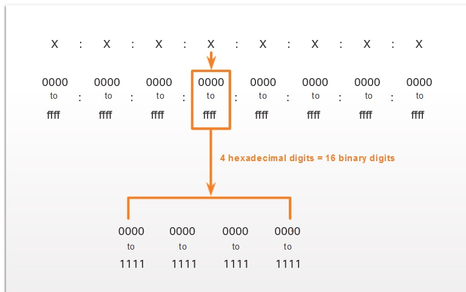
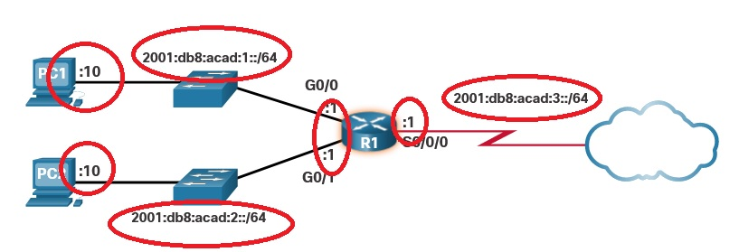
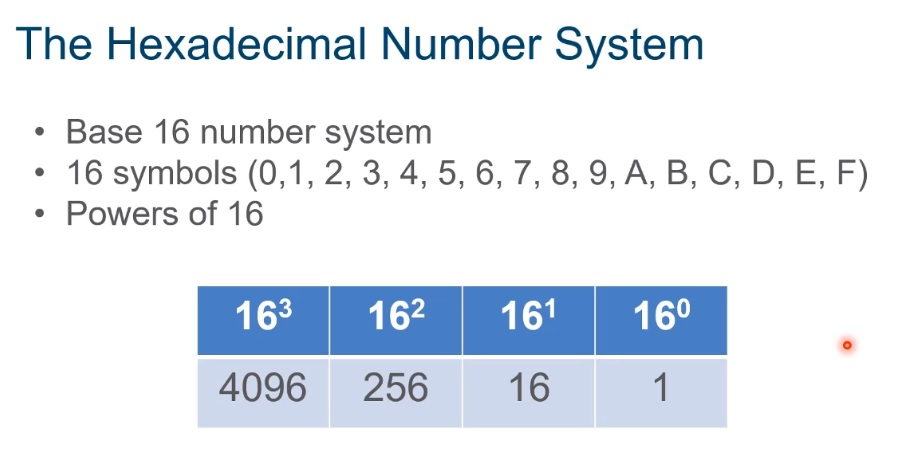
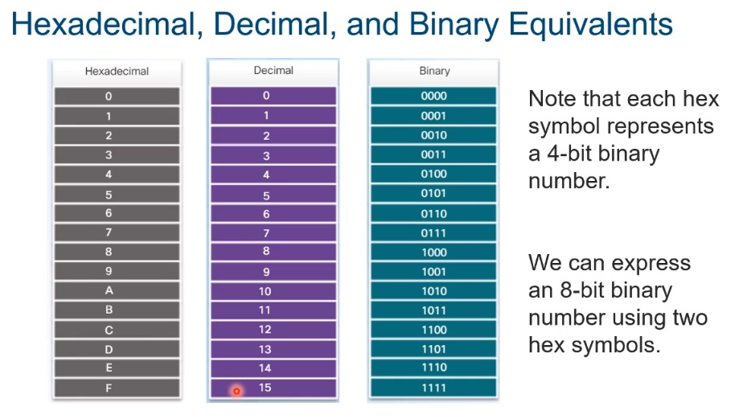
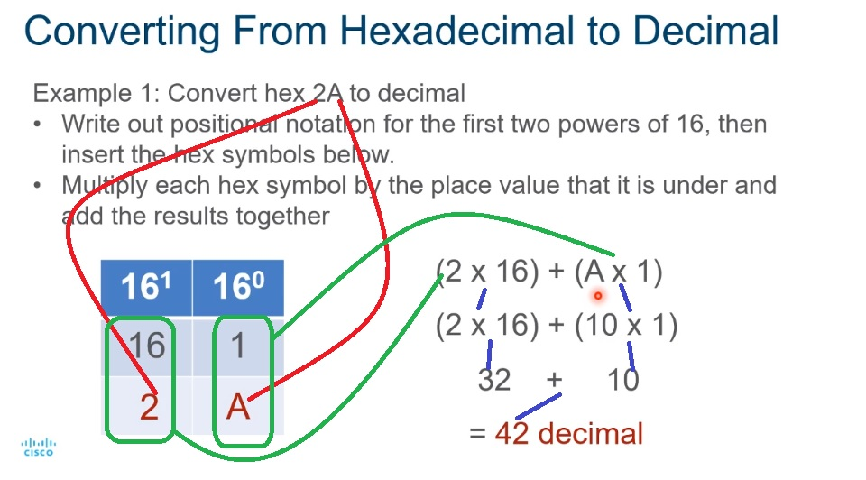
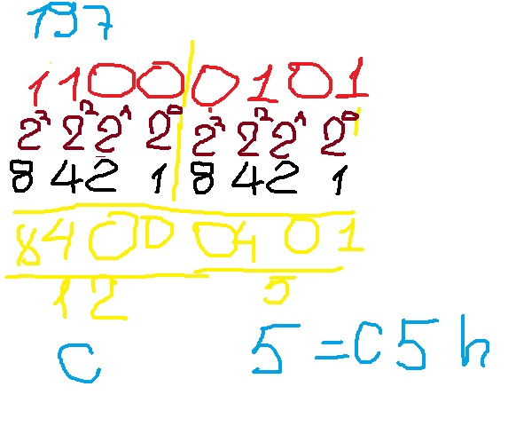
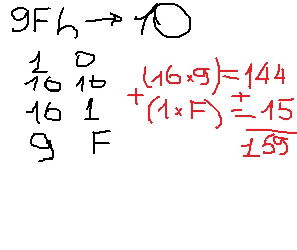
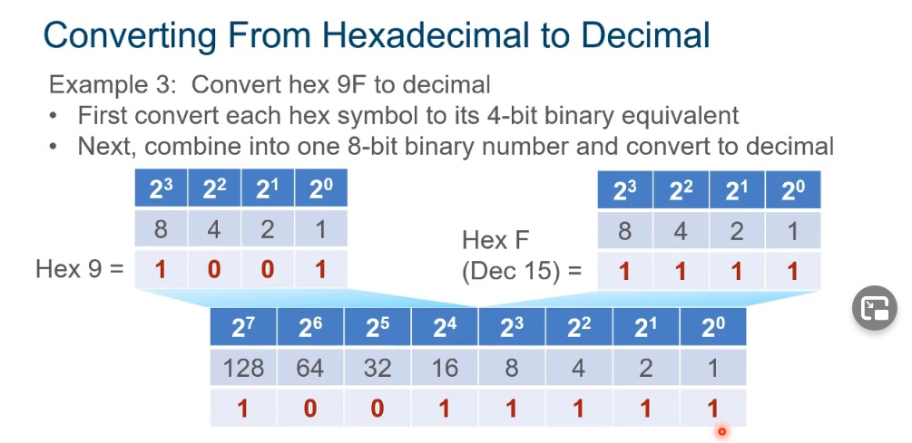

# 5.0 Number System
Системы счисления, разюираются двоичная, которую все знают и 16-иричная,, которую я лично знаю плохо
Говоря о 8 bits of an IPv4 address используется термин octet (IPv4 - 4 octet). В IPv6, говорим hextet (неофициальный термин сегмента из 16 bits или 4 16-ричных цифры). Каждый “x” - hextet, 16 bits, или 4 16-ричных цифры (IPv6 = 8 hextet).

Обведенное красными кружками дерьмо - неебически хитрые IPv6

И нихрена не понятно - как нам, убогим, счетать это дерьмо:

 
Подсказка для пересчета:

И пример, чтобы все окончательно запутать: переведем в десятичное представление 2A. Число из двух 16-ричных цифр, поэтому запишем верхнюю строчку 16^0, 16^1. Они нам дадут в средней строке: 1 и 16. Перемножим среднюю и нижнюю строки, получим 42

Переведем 197 в 16-ричный вид, получим С5 h

Переведем 9Fh в 10-ичный вид, получим 159

Можно перевести и так:

QUIZ:
Module Quiz - Number Systems

   * What is the binary representation for the decimal number 173?

___Topic 5.1.0 - decimal 173 = 128 + 0 + 32 + 0 + 8 + 4 + 0 + 1___

   * Given the binary address of 11101100 00010001 00001100 00001010, which address does this represent in dotted decimal format?

___Topic 5.1.0 - The binary number 11101100 00010001 00001100 00001010 translates to 236.17.12.10.___

   * How many binary bits exist within an IPv6 address?

___Topic 5.2.0 - IPv4 addressing space is exhausted by the rapid growth of the Internet and the devices connected to the Internet. IPv6 expands the IP addressing space by increasing the address length from 32 bits to 128 bits.___

   * What is the binary equivalent of the decimal number 232?

___Topic 5.1.0 - 232 in binary is 11101000. 128+64+32+8 = 232___

   * Which two statements are correct about IPv4 and IPv6 addresses? (Choose two.)

___Topic 5.2.0 - IPv4 addresses are represented as dotted decimal numbers and are 32 bits in length. IPv6 addresses are represented by hexadecimal numbers and are 128 bits in length.___

   * Which IPv4 address format was created for ease of use by people and is expressed as 201.192.1.14?

___Topic 5.1.0 - For ease of use by people, binary patterns are represented as dotted decimal. Computer systems were created to understand binary addressing.___

   * What is the dotted decimal representation of the IPv4 address 11001011.00000000.01110001.11010011?

___Topic 5.1.0 - Each section (octet) contains eight binary digits. Each digit represents a specific value (128, 64, 32, 16, 8, 4, 2, and 1). Everywhere there is a 1, the specific value is relevant. Add all relevant values in a particular octet to obtain the decimal value. For example binary 11001011 equals 203 in decimal.___

   * What is the decimal equivalent of the binary number 10010101?

___Topic 5.1.0 - Binary 10010101 maps to 149 in decimal. 128+16+4+1 = 149___

   * What is the decimal equivalent of the hex number 0x3F?

___Topic 5.2.0 - Hex 0x3F is 63 in decimal.
(3*16)+(15*1) = 63___

   * What is the dotted decimal representation of the IPv4 address which is represented as the binary string 00001010.01100100.00010101.00000001?

___Topic 5.1.0 - Converting the binary string of 00001010.01100100.00010101.00000001 to dotted decimal gives 10.100.21.1___

   * What is the decimal equivalent of 0xC9?

___Topic 5.2.0 - 0x refers to the item as hexadecimal. Convert each character into its corresponding nibble. Then combine the nibbles together and calculate the resulting decimal equivalent. C has a value of 12. 12 x 16 = 192. 192 + 9 = 201.___

   * Which is a valid hexadecimal number?

___Topic 5.2.0 - The hexadecimal numbers are 0,1,2,3,4,5,6,7,8,9,a,b,c,d,e,f.. The hexadecimal number 0 represents 0 in decimal and is represented as 0000 in binary. The hexadecimal number f represents 15 in decimal .___

   * What is the binary representation of 0xCA?

___Topic 5.2.0 - When converted, CA in hex is equivalent to 11011010 in binary. One way to do the conversion is one nibble at a time, C = 1100 and A = 1010. Combine the two nibbles gives 11001010.___

   * How many bits are in an IPv4 address?

___Topic 5.1.0 - An IPv4 address is comprised of 4 octets of binary digits, each containing 8 bits, resulting in a 32-bit address.___
