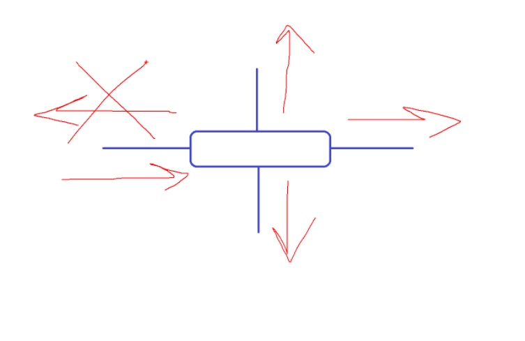
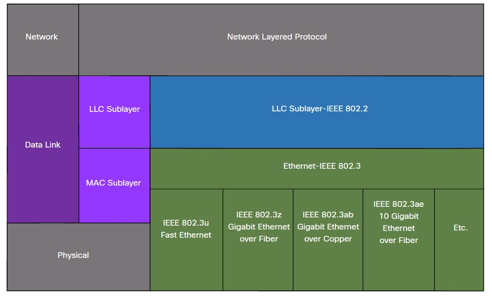
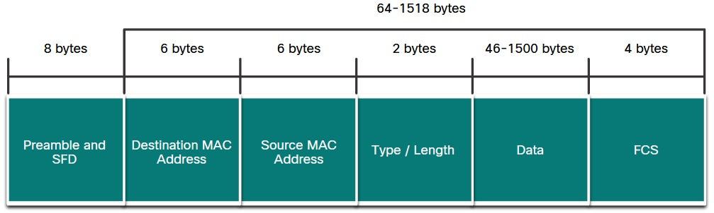
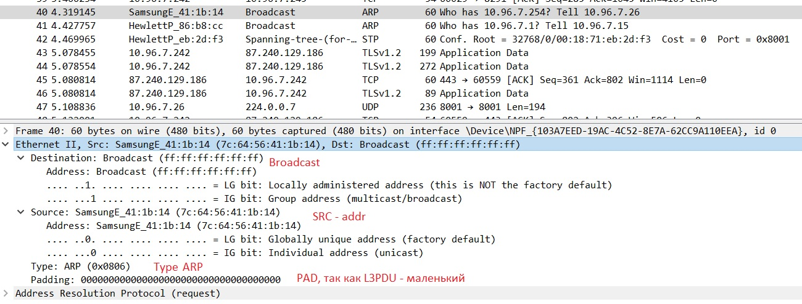
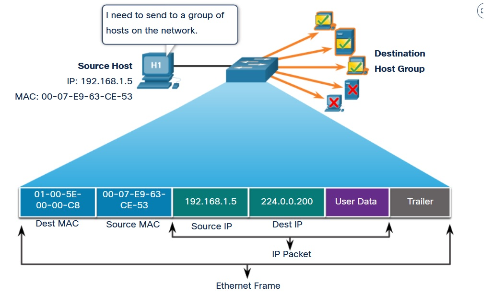
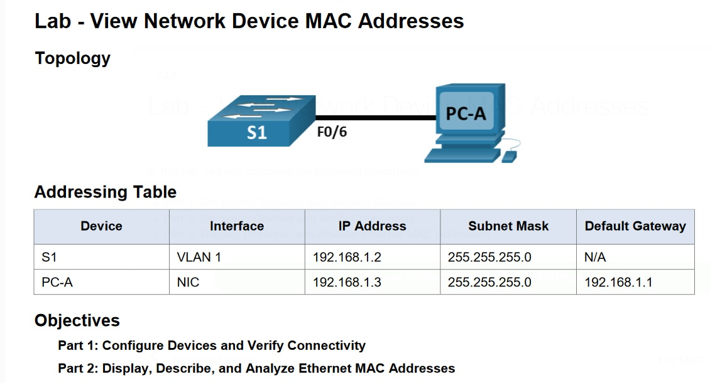
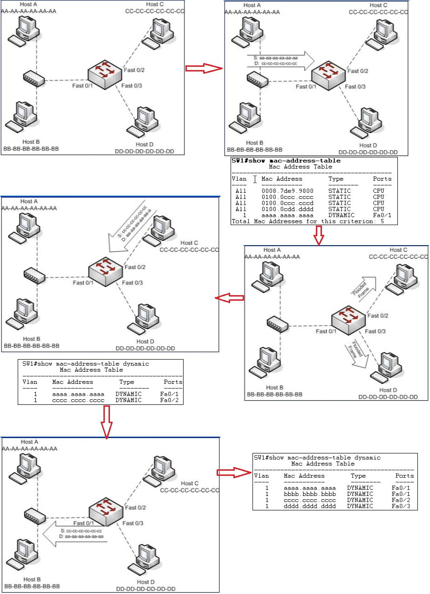
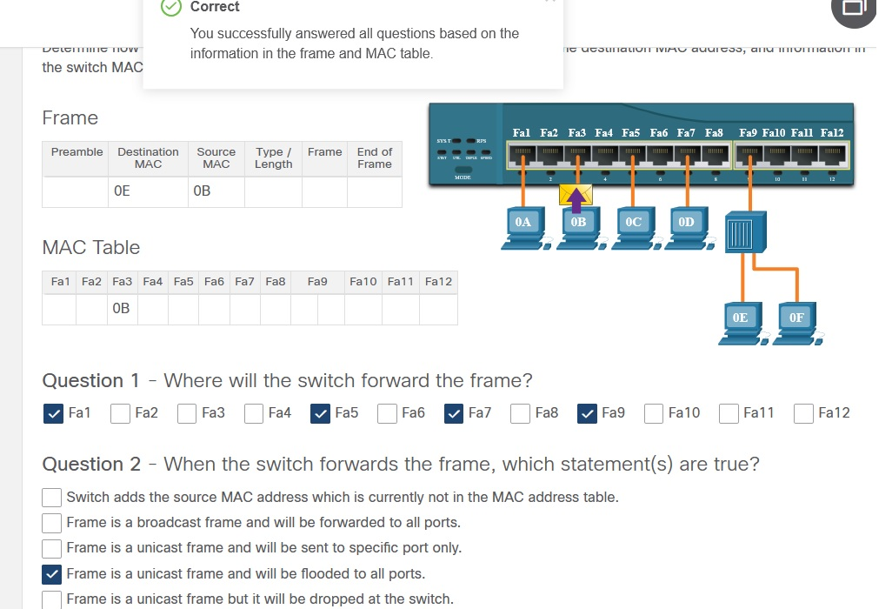
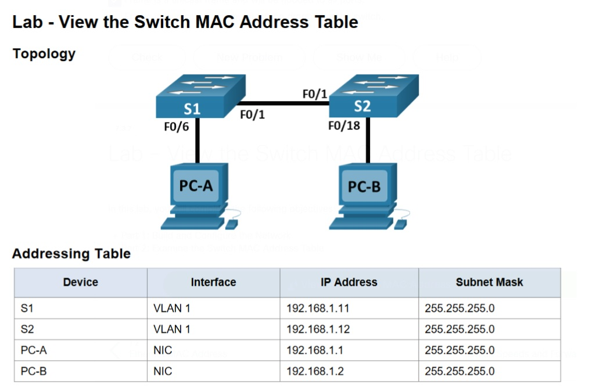
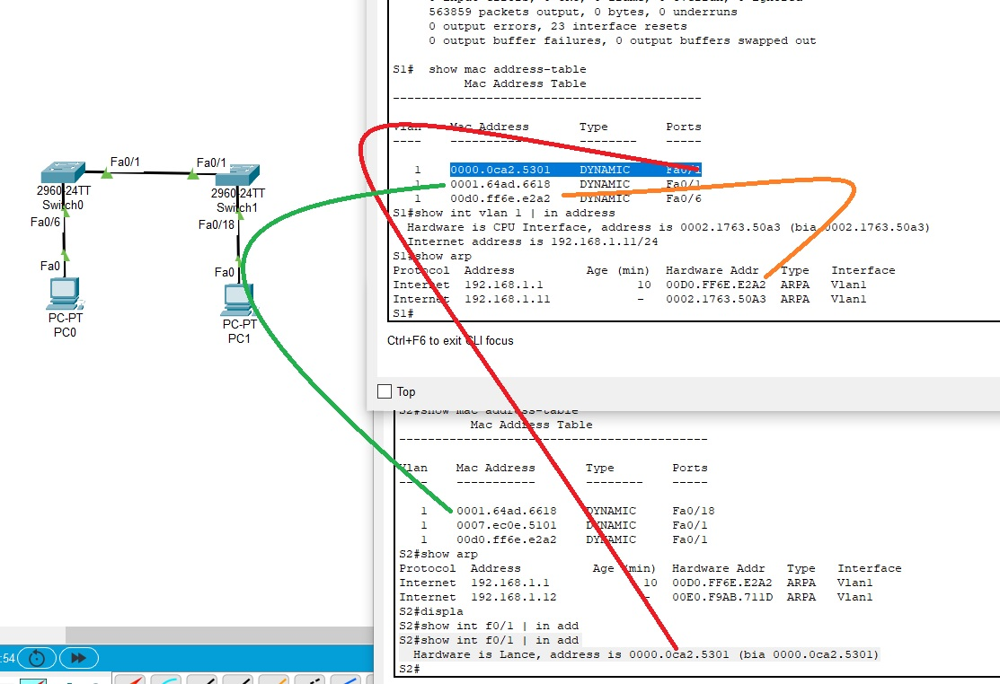

___20201205 Лекция___
# 7.0 Ethernet switching
Максимальная длина кадра - 48 бит, меньше - коротыши, больше - Jumbo

MAC - 48-битное число.

BC MAC - FF-FF-FF-FF-FF-FF

   - Разборчивый режим - прием кадров только адресованных моему MAC
   - promiscues режим - для Wireshark, прием всех кадров, без исключения, даже чужих

BC/MC
   * BC MAC - FF-FF-FF-FF-FF-FF
   * MC - 01-00-5E

# Устройства
   - Репитер - повторитель, который просто транслирует пришедшие сигналы, "улучшив" их. Работает на L1
   - Hub/концентратор - также работает с электрическими сигналами. Флудит сигнал на все порты, кроме того, на который поступил сигнал (Filtering/flooding). Все устройства подключенные к хабу - работают в half-duplex, иначе наступают коллизии



   - Bridge - анализирует кадры, устройство L2. (flooding/filtering/forwarding/learning). Хранит в памяти CAM-таблицу (content address memory- таблица ассоциативной памяти): сопоставление MAC-адресов - портам, за которыми эти MAC светятся. CAM-таблица "обучается" по ходу работы: анализирует пришедшие кадры и если MAC - незнакомый, заносит его в CAM. Заполняется таблица буквально за секунды после включения. CAM ведет также счетчики времени жизни MAC, например 300 секунд если кадр не поступал в порт, MAC - убирается из CAM

http://twistedminds.ru/2012/12/tcam/

   - switch (L2) - все порты работают в полном дуплексе. Каждый порт - отдельный домен коллизий. Порты могут быть разной производительности (uplink). Если кадры поступают быстрее чем отдаются в upolink, они накапливаются в очереди. Работают на ASIC - аппаратные платы, которые "делают мало, но быстро"


___netacad___
# 7.0 Ethernet Frame
Ethernet - наиболее широко используемая сегодня технология, использует проводныесети. Второй - WLAN. Ethernet - работает на канальном ___802.2/LLC___ , ___802.3/MAC___ и физическом уровнях.


Подуровнями канального уровня считаются LLC и MAC. В сетях TCP/IP (а есть еще и другие)  LLC подуровень (802.2) передает в MAC (802.3) информацию c L3 протоколов IPv4/IPv6. MAC кроме 802.3 (Ethernet) имеет реализацию и для других сред: WLAN - 802.11, WPAN - 802.15.

Про LLC подуровень на CCNA говорят мало, больше про MAC

# 7.1.3 MAC
Отвечает за инкапсуляцию и доступ к середе передачи.
IEEE 802.3 кадр использует понятия
   - Ethernet frame - структура кадра.
   - Ethernet Addressing - включает в себя L2/MAC адреса (Dest и Src) для доставки  между Ethernet NIC to Ethernet NIC, в рамках одного физического сегмента LAN.
   - Ethernet Error detection - в кадре есть трейлер FCS (frame check sequence) и если при получении расчетный FCS отличается от полученного, то кадр считается битым.

Виды 802.3 для каждой среды представлены на картинке

Есть как устаревшие стандарты (использующие еще CSMA/CD, half-duplex, совместную среду, хабы), так и современные, которые работаеют в современных свичах на full-duplex (https://habr.com/ru/post/208202/).

# Ethernet Frame Fields
Длина кадра (от начала Dst MAC - окончания FCS, без преамбулы)
   * min = 64 bytes (все что меньше - результат коллизии; runt frame, автоматом рубится на DST)
   * max = 1518 (все что выше - jumbo, требует спец конфигов всех пром. устройств, иначе - тоже рубится DST)


   * Preamble and Start Frame Delimiter Fields: ___Preamble___ (7 bytes) + ___SFD___(Start of Frame) (1 byte), необходимы чтобы и отправитель и получатель понимали когда начинается отправляемый пакет. Типа фразы "От советсткого информбюро...".
   * Destination MAC: 6-byte поле - L2 id NIC получателя, получатель не видя еще всего кадра сразу втыкается что информация - ему, если его MAC совпадает с пришедшим, но MACтакже может быть: unicast [___UC___], multicast [___MC___], broadcast [___BC___]
   * Source MAC: 6-byte поле -  L2 id NIC отправителя.
   * Type/Length: 2-byte поле говорит какой протокол вышестоящего уровня содержится в кадре in hex:
      * 0x800 for IPv4
      * 0x86DD for IPv6
      * 0x806 for ARP.
   * Data Field: (46 - 1500 bytes) содержит L3 PDU (IPv4 пакет) целиком. Если L2PDU < 64 bytes (например маленький L3PDU), сюда допихиваются нули (pad).
   * Frame Check Sequence: эти 4 bytes служит для обнаружения испорченных кадров. CRC [cyclic redundancy check]. Отправитель считает CRC и запихивает его в FCS. Получатель пересчитывает CRC пришедшего кадра и сравниват его с последними 4 bytes. Если совпало - кадр целехонек. Не совпало - кадр отбрасываем. В Wireshark не виден

___Лабораторка___
   

# 7.2.1 MAC Address and Hexadecimal
MAC-адрес принято записывать как 6 групп из двух 2 16-ричных чисел. 16-ричное число - это 4 бита (1111 = 15), => 2х4 = 8bit, таких групп 6 => 6х8 = 48 bits


___OUI [organizationally unique identifier]___: Вендоры, которые производят сетевое оборудование регистрируются в IEEE (как мухи на кухне у шефа), и тот им выдает уникальные 3 bytes (3x8=24 bits). Таким образом все вышедшие от этого вендора сетевухи имеют одинаковые первые 3 байта. Например у cisco это 00-60-2F, VMWARE- 00-50-56. Внимательно следим за MAC VM, которые также должны быть уникальными в пределах одного сегмента. 

# 7.2.4-5 Unicast/Broadcastr/Multicast traf
Unicast/Broadcast - бывают и на L2, и на L3:
  * unicast - traf peer-to-peer
  * broadcast - traf one to everyone (FF-FF-FF-FF-FF-FF)
  * multicast - traf one to group (some from all). У групповой рассылки специфическое начало MAC-адреса:
    - 01-00-5E - для L3 IPv4 Multicast
    - 33-33 - для L3 IPv6 Multicast
    - для STP/LLDP - также свои MAC multicast traffic

Мультикаст трафик 
   - SW: флудит на каждом порту каждого свича, если на нем не настроена ограничивающая такой трафик технология multicast snooping. 
   - R: не маршрутизируют мультикаст без доп. настроек

При необходимости передачи L3PDU МС траффика, устройствам принадлежащие к MC группе назначается МС групповой ip-адрес:
   - IPv4 - 224.0.0.0 - 239.255.255.255. 
   - IPv6 - ff00::/8

Такой адрес может быть только адресом DST. ___SRC IP - всегда UNICAST.___  В локалке, на L2, MC-траф не будет работать бу МС L2/МАС-адресов. МС-MAC получается связаны с MC-ip.


___Лабораторка___


Задание
   1. Сконфигурировать в PT устройства, проверить связность
   2. Просмотреть, описать и проанализировать MAC-адреса

Для настройки SW будем использовать команды Module02:
```
configure terminal
enable secret cisco
no ip domain lookup
hostname S1
line con 0
password class
login
exit
line vty 0 15
password class
login
exit
banner motd #Restricted access. Do not cross the line#
service password encryption
int vlan 1
ip address 192.168.1.2 255.255.255.0
no shut
exit
```

После настройки проверим связность с PC-A:
```
C:\>ping 192.168.1.2

Pinging 192.168.1.2 with 32 bytes of data:

Request timed out.
Reply from 192.168.1.2: bytes=32 time<1ms TTL=255
Reply from 192.168.1.2: bytes=32 time<1ms TTL=255
Reply from 192.168.1.2: bytes=32 time<1ms TTL=255
```
Также проверим что у нас находится в CAM-table S1:
```
S1#show mac address-table 
          Mac Address Table
-------------------------------------------

Vlan    Mac Address       Type        Ports
----    -----------       --------    -----

   1    0040.0bbe.87b9    DYNAMIC     Fa0/1
S1#show arp
Protocol  Address          Age (min)  Hardware Addr   Type   Interface
Internet  192.168.1.2             -   0090.21D4.C388  ARPA   Vlan1
Internet  192.168.1.3             0   0040.0BBE.87B9  ARPA   Vlan1
```
Видно, что PC-A включен в F0/1, и имеет MAC-адрес 00:40:0B:BE:87:B9. Теперь получим MAC SW-1
```
C:\>arp -a
  Internet Address      Physical Address      Type
  192.168.1.2           0090.21d4.c388        dynamic
```
или посмотрим его на самом устройстве:
```
S1#show int vlan 1 | in addr
  Hardware is CPU Interface, address is 0090.21d4.c388 (bia 0090.21d4.c388)
  Internet address is 192.168.1.2/24  
```
Видно, что VLAN1 SW-1 имеет MAC 00:90:21:d4:c3:88

С данных ресурса https://macvendorlookup.com/, это оба MAC -  производителя CISCO SYSTEMS, INC.
Address
    SAN JOSE CA 95134-1706
    UNITED STATES
Range
    00:40:0B:00:00:00 - 00:40:0B:FF:FF:FF
Range
    00:90:21:00:00:00 - 00:90:21:FF:FF:FF
Type
    IEEE MA-L

Лабораторка выполнена

# 7.3.1 Switch Fundamentals
Обычный L2 SW - достаточно примитивное устройство, в логику которого входит несколько действий:
   * Learning - изучение MAC-адресов подключенных сетевых устройств путем анализа приходящих кадров
   * Forwarding/flooding - пересылка кадров на порты:
     * флудим на все, если MAC - неизвестен или BC
     * флудим на часть портов, если MAC - MC
     * форвардим, если знаем точно на какой/какие порты
   * Filtering - когда таблица CAM - заполнена, кадры отправляем уже на конкретный порт
На картинке ниже представлена схема. Видно, что кадр Host-A в самом начале флудится на все выходящие порты. при этом в MAC -таблицу уже занесен адрес Host-A  и ответный кадр будет форвардиться на порт Fa0/1


иллюстрацией фильтрации будет "убийство" кадррв, которыми будут обмениваться host-A и host-B, так как SW знает что эти хосты оба находятся за портоа Fa0/1. Не будет же он этот кадр флудить/форвардить в тот же порт, откуда он пришел.

В случае если хосту необходимо отправить пакеты за пределы LAN, то он это сделает путем отправки пакета на default GW.  Узел сам определяет надо ли ему отправлять адрес на GW сравнив IP адрес назначения со своим локальным IP. L2-пакет, при этом, будет иметь DST MAC-адрес def. GW
___Еще мини-лабка___


___Еще лабораторка 7.3.7___


Задачи: 
1. Построить сеть
2. Исследовать MAC-таблицы свичей

Задание 1
для S1 и S2 конфиги почти одинаковые
```
S1(config)#ena
S1(config)#enable sec
S1(config)#enable secret cisco
S1(config)#line con 0 
S1(config-line)#pass
S1(config-line)#password class
S1(config-line)#login
S1(config-line)#line vty 0 15
S1(config-line)#pass
S1(config-line)#password class
S1(config-line)#login
S1(config-line)#exit
S1(config)#banner mot
S1(config)#banner motd #ACCESS RESTRICTED. DO NOT CROSS THE LINE#
S1(config)#no ip domain lookup
S1(config)#int vlan 1
S1(config-if)#ip address 192.168.1.11 255.255.255.0
S1(config-if)#no shut
S1(config-if)#
%LINK-5-CHANGED: Interface Vlan1, changed state to up
```

Проверка ip-связности c PC-A показала, что все узлы сети отвечают. Поскольку все хосты находятся в одной подсети, в конфигурировании GW на PC - нет необходимости:
```
C:\>ping 192.168.1.11

Pinging 192.168.1.11 with 32 bytes of data:

Reply from 192.168.1.11: bytes=32 time=1ms TTL=255
Reply from 192.168.1.11: bytes=32 time<1ms TTL=255
Reply from 192.168.1.11: bytes=32 time<1ms TTL=255
Reply from 192.168.1.11: bytes=32 time<1ms TTL=255

Ping statistics for 192.168.1.11:
    Packets: Sent = 4, Received = 4, Lost = 0 (0% loss),
Approximate round trip times in milli-seconds:
    Minimum = 0ms, Maximum = 1ms, Average = 0ms

C:\>ping 192.168.1.12

Pinging 192.168.1.12 with 32 bytes of data:

Request timed out.
Reply from 192.168.1.12: bytes=32 time<1ms TTL=255
Reply from 192.168.1.12: bytes=32 time<1ms TTL=255
Reply from 192.168.1.12: bytes=32 time=3ms TTL=255

Ping statistics for 192.168.1.12:
    Packets: Sent = 4, Received = 3, Lost = 1 (25% loss),
Approximate round trip times in milli-seconds:
    Minimum = 0ms, Maximum = 3ms, Average = 1ms

C:\>ping 192.168.1.2

Pinging 192.168.1.2 with 32 bytes of data:

Reply from 192.168.1.2: bytes=32 time<1ms TTL=128
Reply from 192.168.1.2: bytes=32 time<1ms TTL=128
Reply from 192.168.1.2: bytes=32 time<1ms TTL=128
Reply from 192.168.1.2: bytes=32 time=1ms TTL=128

Ping statistics for 192.168.1.2:
    Packets: Sent = 4, Received = 4, Lost = 0 (0% loss),
Approximate round trip times in milli-seconds:
    Minimum = 0ms, Maximum = 1ms, Average = 0ms
```
CAM-таблица на S1:
```
S1#  show mac address-table 
          Mac Address Table
-------------------------------------------

Vlan    Mac Address       Type        Ports
----    -----------       --------    -----

   1    0000.0ca2.5301    DYNAMIC     Fa0/1
   1    0001.64ad.6618    DYNAMIC     Fa0/1
   1    00d0.ff6e.e2a2    DYNAMIC     Fa0/6
   1    00e0.f9ab.711d    DYNAMIC     Fa0/1
```
сбросим кэш и посмотрим ее снова, как видим таблица - пустая:
```
S1#clear mac add
S1#clear mac address-table 
S1#  show mac address-table 
          Mac Address Table
-------------------------------------------

Vlan    Mac Address       Type        Ports
----    -----------       --------    -----
```
При  последовательной проверке доступности PC-B  в таблицу попадет только MAC PC-A и PC-B и f0/1 S-2:



# 7.4.1 Frame Forwarding Methods on Cisco Switches
У хитрой Cisco есть 2 понимания как форвардить кадры. Оба этих метода настраиваются используются по ситуации:
   * ___Store-and-forward switching___ - Получаем весь кадр, вычисляем его  CRC и только для валидный кадров ищем в CAM DST-адрес и соответствующий выходящий порт и толоько потом кадр отправляем по назначению.
   * ___Cut-through switching___ - Не тратим времени на получение и ресурсов на вычисление CRC: решение куда форвардить ищется уже после получения начала кадра с DST MAC. При этом есть еще 2 варианта развития событий:
     * ___fast-forwarding switching___ (когда отправка осуществляется непосредственно после получения заголовка с DST, а время задержки считается от времени получения первого бита до времени форвардинга первого бита)
     * ___Fragment-free switching___ (форвардингу предшествует попытка проанализировать первые 64 бита) - это попытка найти компромисс между отправкой без проверки и отправкой с проверкой.
Есть практика настройки порта свича следующим способом: сначала cut through, пока не наступит некий порог срабатывания по ошибкам, после чего порт переходит в Store-and-forward, а затем после снижения количества ошибок - опять в сначала cut through.

# 7.4.3 Memory Buffering on Switches
Тут особо говорить нечего: скорости отправки/получения на хостах не безграничны и надо где-то держать приходящие кадры, до момента пока порт куда они отправляются не подосвободиться. Держать из можно в:
   * Port-based memory (маленький такой кусочек памяти на порту)
   * Shared memory (общий такой сегмент, куда каждый порт может пихать достаточно большой объем кадров)

# 7.7.4, 5 Duplex and Speed Settings / Auto-MDIX
Тут опять все просто: 
Скорость/duplex можно назначать принудительно на порту или оставлять в Auto. Если есть сомнения в канале, то параметры скорости можно занизить принудительно, чтобы снизить риски ошибок
До внедрения Auto-MDIX, разные сетевые устройства и хосты требовалось подключать разными кабелями между собой. Теперь - все устройства умные и автоматически виртуально "переворачивают" кабель как надо, как будто ыекфшпре - это cross и т.р.
