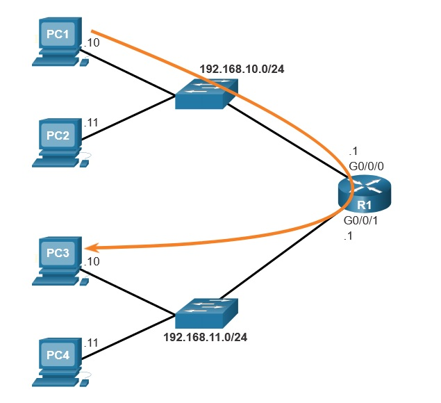
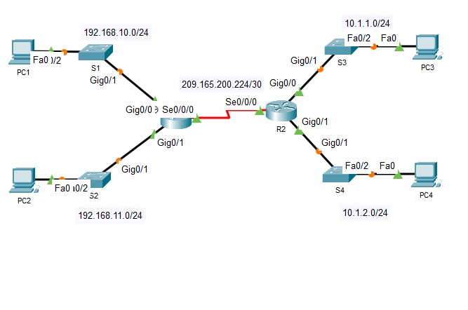
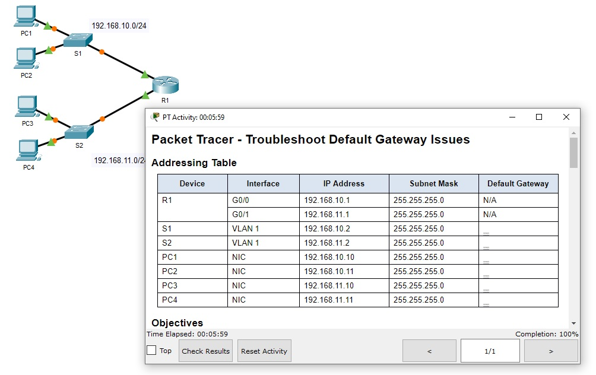
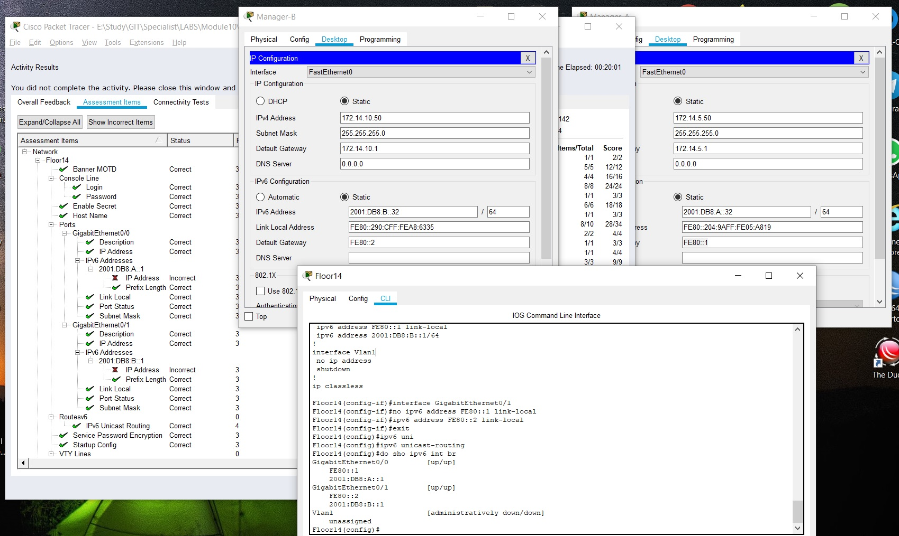
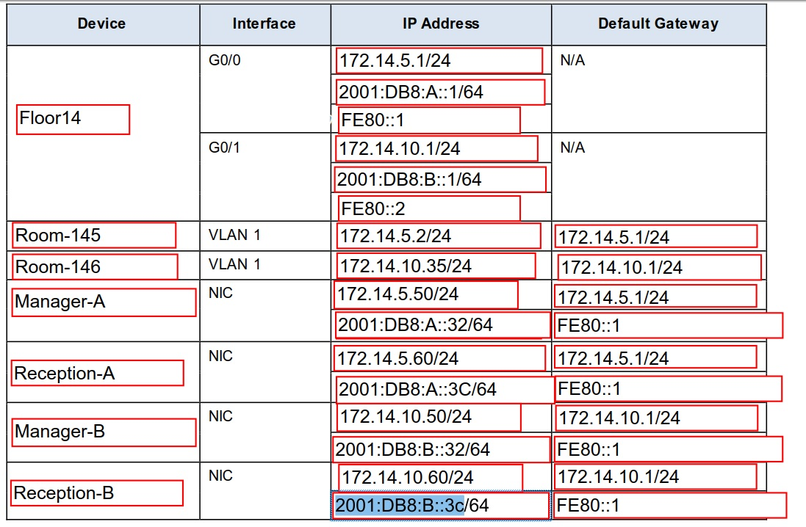
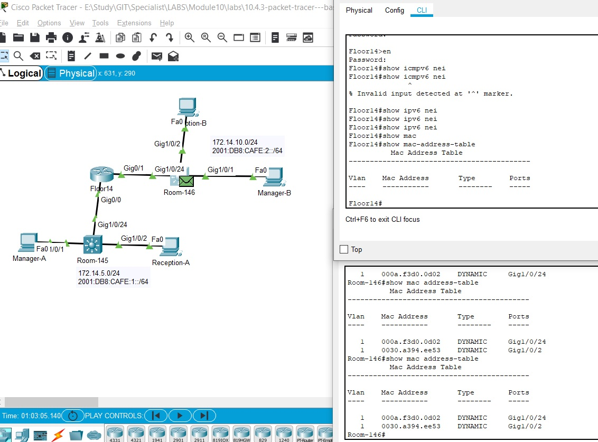
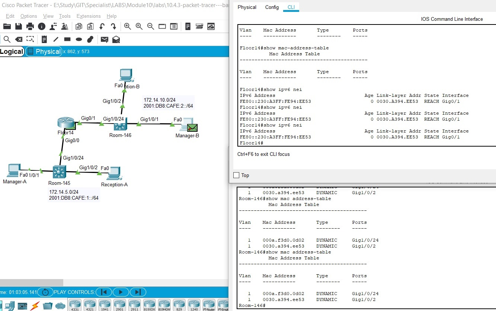
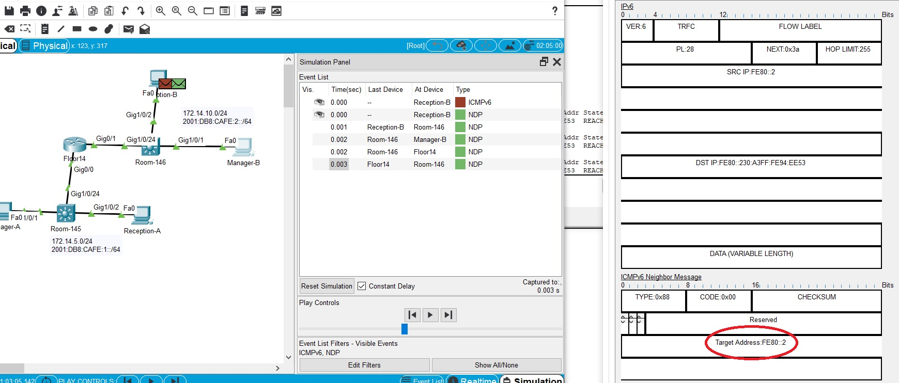

# 10. Basic Router configuration
Не мудрствуя лукаво:

```
hostname hostname
enable secret class

line console 0
password cisco
login

line vty 0 4
password cisco
login
transport input ssh telnet
exit

service password-encryption

banner motd #
*********************************************** 
WARNING: Unauthorized access is prohibited!
***********************************************
#

copy running-config startup-config
```

## Маленькая лабораторка:
```
Enter global configuration mode to configure the name of the router as “R1”.
Router>enable
Router#configure terminal
```

Enter configuration commands, one per line. End with CNTL/Z.

```
Router(config)#hostname R1
```

Configure 'class' as the secret password.
```
R1(config)#enable secret class
```

Configure 'cisco' as the console line password, require users to login, and return to global configuration mode.
```
R1(config)#line console 0
R1(config-line)#password cisco
R1(config-line)#login
R1(config-line)#exit
```

For vty lines 0 through 4, configure 'cisco' as the password, require users to login, enable SSH and Telnet access, and return to global configuration mode.
```
R1(config)#line vty 0 4
R1(config-line)#password cisco
R1(config-line)#login
R1(config-line)#transport input ssh telnet
R1(config-line)#exit
```

Encrypt all clear text passwords.
```
R1(config)#service password-encryption
```

Enter the banner 'Authorized Access Only!' and use # as the delimiting character.
```
R1(config)#banner motd #Authorized Access Only!#
```

Exit global configuration mode.
```
R1(config)#exit
```
_________________________

## Лабка по настройке базового конфига роутера
Настроил без проблем, ответил на вопросы

# 10.2.1 Настройка интерфейсов
Из новенького - приучиться заполнять description, запомнить настройки ipv6, 
```
R1(config)# interface gigabitEthernet 0/0/0
R1(config-if)# description Link to LAN
R1(config-if)# ip address 192.168.10.1 255.255.255.0
R1(config-if)# ipv6 address 2001:db8:acad:10::1/64
R1(config-if)# no shutdown
R1(config-if)# exit
R1(config)#
```
проверка:
   * ___show ip interface brief___
   * ___show ipv6 interface brief___

   * ___show ip route___
   * ___show ipv6 route___

   * ___show interfaces___ - Displays statistics for all interfaces on the device. However, this command will only display the IPv4 addressing information.
   * ___show ip interfaces___ -	Displays the IPv4 statistics for all interfaces on a router.
   * ___show ipv6 interface___ - Displays the IPv6 statistics for all interfaces on a router.

# 10.3.1 Конфигурация Def GW
Поскольку наша задача как сетевиков выпустить ПК в инет - надо запомнить, что без "ворот" любой хост не знает куда отправлять пакеты L3, с тем чтобы они были доставлены куда-то дальше. Def GW имеет одинаковое значение как для IPv4, так и для IPv6



На свичах L2 GW задается командой вместе с настройкой Management VLAN
```
int vlan 1
ip addreess 192.168.10.10 255.255.255.0
no shut
exit

ip default gateway 192.168.10.1 255.255.255.0
```

## 2 лабки, совсем не сложные на Def GW
### 10.3.4



### 10.3.5



### 10.3.6

Лабораторка стала камнем преткновения. Как ни старался - добиться 100% не удалось, причем каждый раз открывал для себя что-то новенькое:
   - ipv6 unicast-routing - включить на R
   - FE80::1 - для соответствующего link-local адреса на обоих IF R
   - несоответствие практически заданным подсетям ipv6 на Gi0/0, Gi0/1 R




Video тут: https://www.youtube.com/watch?v=uPinwWoF1As

Итак, по этапам:
   - ICMPv6-req зависает в памяти, так как нет MAC в таблице соседей DST шлюза, отправляем ND
   - ND приходит на Floor14, в его таблице соседей появляется чей-то MAC и тут возникает идея icmpv6 отправить с Reception-B, так как Room-146 открыт для просмотра, а что настроено на Room-145 - я не знаю.

Начинаем снова:
   - ICMPv6 зависает в памяти, выплевываем MC NDP
   - NDP приходит на Room-146



   - Room-146 отправляет MC на все порты, в таблице соседей Floor14 появляется link-local адрес Reception-B

   - Floor14 отвечает на NDP MC, так как в получаетелях его icmpv6, также в его таблице соседей появляется MAC linc-local адреса Reception-B

   - Room-146 получает ND от Floor-14

<details>
  <summary>пример</summary> 
<pre>
AccSwitch(config)#ip arp inspection vlan 200
</pre>
</details>    