# Специалист лекция 20201205
# 11 IPv4
Network and Host Portions - необходимы, чтобы понять какая часть адреса - сеть, а какая - id хоста
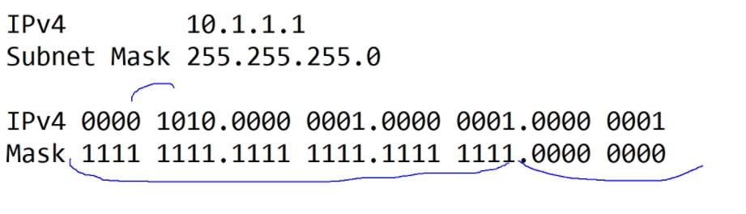
   - там где единицы в маске - там сетевая часть
   - там где нули в маске - там маска узла

Количество адресов в сети = 2^n-2, из за того, что существуют ___особые адреса___:
   * ___Адрес сети___ - тот, у которого хостовая часть адреса все "0", но не факт что в десятичном виде это будет 0
   * ___Направленный широковещательный адрес___ - тот, у которого узловая часть - все "1", но не факт что в десятичном виде это будет 255

Хитрости для представления форматов масок - /24б /19 и т.п.

# Классовая адресация
Раньше, когда не было масок, использовались понятия классов сетей
   * 0     - класс А /8     0. - 127.
   * 10    - класс B /16  128. - 191.
   * 110   - класс С /24  192. - 224.
   * 1110  - класс D MC   224. - 239. 
   * 1111  - класс E reserved 240. - 255
   * 127.0.0.1 - loopback

договорились, что часть адресов будут частными (не маршрутизируемыми провайдерами)
   * 10.0.0.0    /8
   * 172.16.0.0  /12
   * 192.168.0.0 /16
   * 169.254.0.0 /16 - Автоматические APIPA адреса

Чтобы частные адреса выпустить в инет - спроектировали и начали использовать NAT.

Выдачей адресов занимается IANA, которая отдает блоки RIR-ам
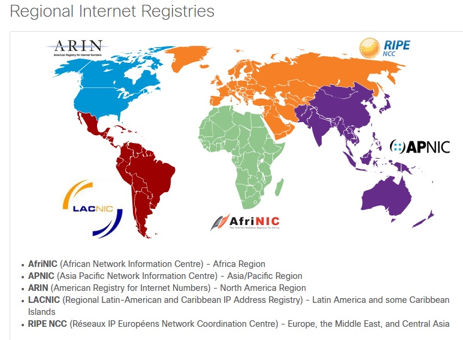
блоки IPv4 уже в аренду у RIR - не получить, их нет

# BC DOMAIN
кадры, которые флудят всю сеть. Крупные BC домены - плохо, устройства тратят огромные ресурсы, чтобы кадры обработать.
Спастись от этого помогает маршрутизатор, которые разграничивает BC домены. Сети рекомендуется дробить: BC будет меньше и производительность увеличится. Но: каждый IF R - должен быть в своей подсети => сети надо "дробить".
Дробление - "увеличение" длины сетевой части маски: была /24, стала /25, количество хостов,
2^n-8 = 2^7-2=128-2 = 126 адреса в /25

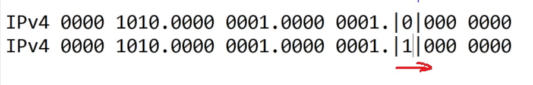

Связующее звено IPv4 и Ethernet - ARP: ___ARP_request___/___ARP_reply___, ARP-кэш имеет срок жизни, и сам очищается.

# NETACAD
# 11. IPv4

IPv4 адрес - 32 bits, часть - биты сети, чатсь - биты хоста. Точки - разделяют октеты. Т.О. в адресе IPv4 - 4 октета
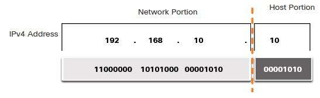

Чтобы понять какая частс хоста, какая сети - используется маска:

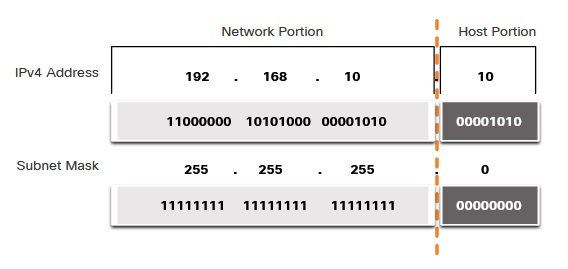

Маски считаются по числу бит и могут записываться ___/4___, ___/8___, ___30___ и т.д. ПК при расчете маски использует операцию логического ___И___, когда 1+1 = 1, 1+0 = 0.

Адреса разделяются:
   - Network addr (первый адрес в диапазоне)
   - BC addr (последний адрес в диапазоне)
   - First usable (адрес после первого) 
   - Last Usable (адрес перед последним)

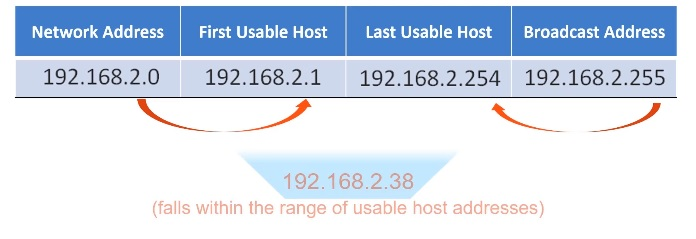

   - Unicast: трафик от хоста к хосту
   - Broadcast: от одного всем (частный случай - ipDirect BC, когда отправляем пинг на максимальный ip диапазона), на Cisco выключен по-умолчанию ```no ip directed-broadcasts```
   - Multicast: от одного - многим, участникам группы, зарезервирован диапазон ___224.0.0.0 - 239.255.255.255___, хосты - получатели MC - Multicast клиенты. ___OSPF использует Multicast___

# 11.3.1 Публичные и частные (RFC 1918) ip
Публичные ip нарезаются провайдерами, для взаимодействия с глобальными сетями. Блок зарезервированных/частных/немаршрутизируемых адресов:
   - 10.0.0.0/8     : 10.0.0.0    - 10.255.255.255
   - 172.16.0.0/12  : 172.16.0.0  - 172.31.255.255 
   - 192.168.0.0/16 : 192.168.0.0 - 192.168.255.255

Пережиток IPv4 с истощенными ip - NAT, который используется чтобы пользователи с серыми ip могли выходить в инет. Настраивается на каждом R. Как правило при настройке NAT мы используем и другие термины:
   - Intranet (inside)
   - DMZ
   - Internet (outside)
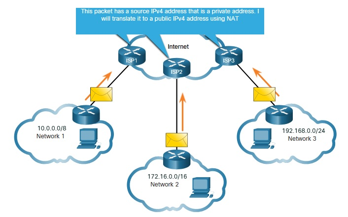   

# 11.3.4 Специальные ip
   - Loopback 127.0.0.0/8: ___127.0.0.1 - 127.2555.255.254___
   - Link-Local addresses 169.254.0.0/16: ___169.254.0.1 - 169.254.255.254___

# Устаревшая Classful адресация
   - Class A (0.0.0.0/8 to 127.0.0.0/8): 16 million host addresses; /8 prefix
   - Class B (128.0.0.0 /16 - 191.255.0.0 /16): approximately 65,000 host addresses; /16 prefix
   - Class C (192.0.0.0 /24 - 223.255.255.0 /24): maximum of 254 hosts; /24 prefix(only 254 host addresses per network).
   - Class D (224.0.0.0 to 239.0.0.0) - MC
   - Class E (240.0.0.0 - 255.0.0.0.) experimental address block

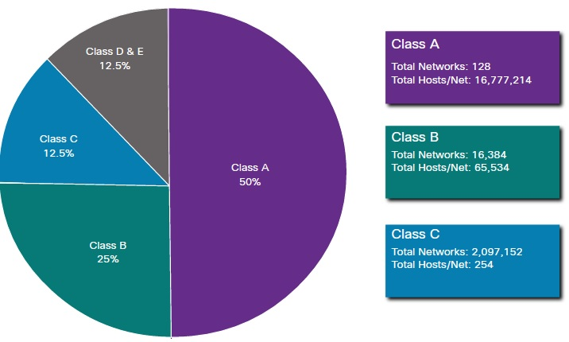

За выделение белых ip отвечают:

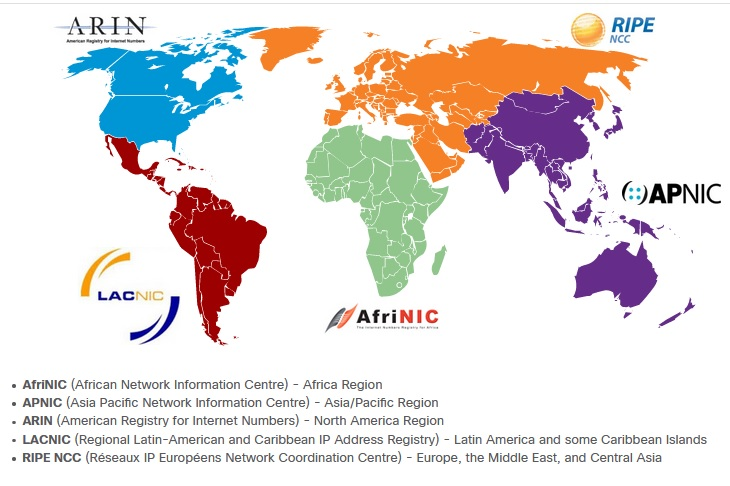

# 11.4.1 Разграничение BC домена
Надо производить, если число получателей приближается к 200.
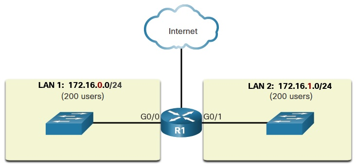

Также для удобства выделяют этажные подсети (иногда по 2 /24 на этаж), сети отдела, типы устройств (хосты/сервера/принтеры), MGM подсети

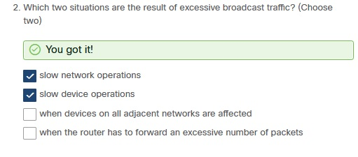

# 11.5.1 Разбиение на подсетки (бесклассовая адресация)
Удобна, когда в нашем распоряжении одна большая сеть, а надо поделить ее на несоклько/много маленьких. Граница деления может проходить как по границам октета, так и в октете:
   - /25 row - Borrowing 1 bit from the fourth octet creates 2 subnets supporting 126 hosts each.
   - /26 row - Borrowing 2 bits creates 4 subnets supporting 62 hosts each.
   - /30 row - Borrowing 6 bits creates 64 subnets supporting 2 hosts each.

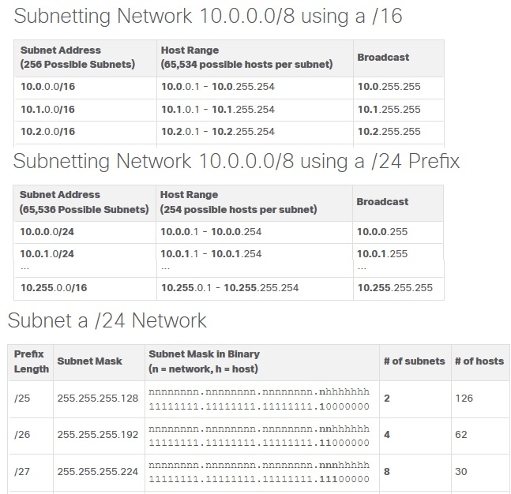

Деление квадратом, магическими числами

## Лабка 11.5.5
Задачи:
- Разбить подсеть 192.168.0.0/24 на 4
- настроить базовую безопасность: console Cisco123, secret Class123, pass encrypt
- настроить IF оборудования, VLAN1 SW LAN-A, LAN-B, 
Подсети
   1. 192.168.0.1/192
   2. 192.168.0.64/192
   3. ... и еще 2 подсети

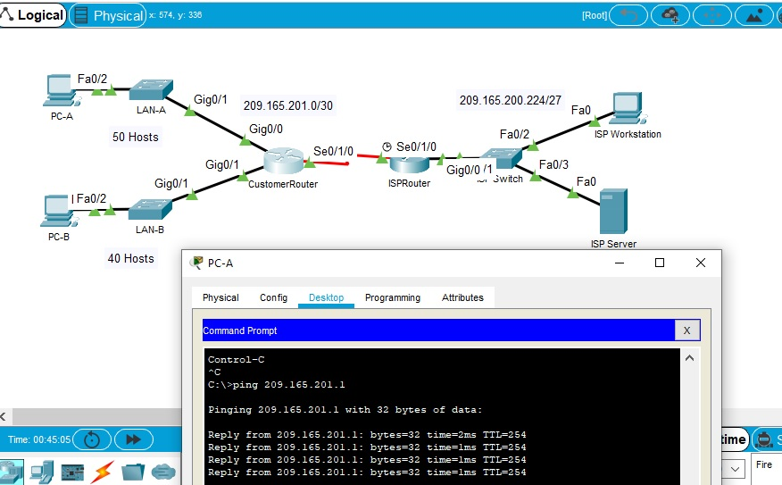
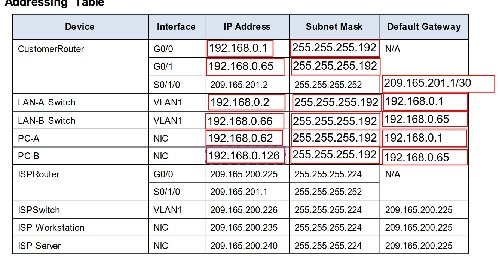

Все работает

# 11.6.2 Деление на подсети
   - По числу хостов
   - По числу подсетей

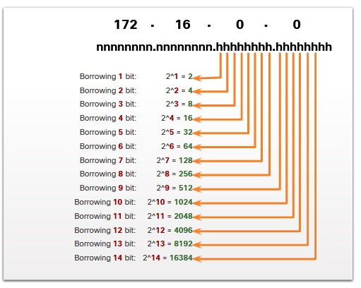   

Тут надо просто делать лабы, которые я выкладывал:
   - [лабы на сети, с ответами](./labs/1-StudentsubnetworkbookV2.pdf)
   - [лабы VLSM - маски, разбиение на подсети](./labs/2-VLSM_WB_Student_Ed-v2_0.pdf)
   - [лабы VLSM - маски, разбиение на подсети - отвыеты](./labs/2-VLSM_WB_InstructorsEd-v2_0.pdf)


## Лабка 11.6.6
Деление на подсеточки
   - количество подсетей 2^n
   - количесов хостов (2^n) -2 

[Вспомогательный_материал](./labs/11.6.6.address.txt)

[11.6.6-lab---calculate-ipv4-subnets.pdf](./labs/11.6.6-lab---calculate-ipv4-subnets.pdf)

# 11.7.1
При работе в организации имеющей выход в интернет часто придется делить адлресное пространство между следующими сегментами:
   - Branch XX
   - DMZ
   - MGM
   - Phone
   - etc...

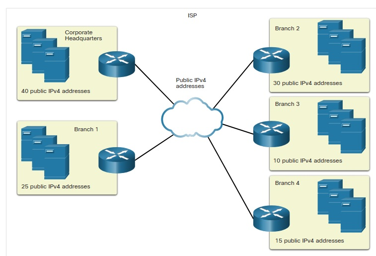   

При этом надо помнить как о минимум 30% резервации адресного пространства для хостов офиса, так и предусмотреть рост количества бранчей предприятия, в противном случае может оказаться проблематично расширить адресное пространство или придется городить костыли. Поэтому иногда приходится брать не 192.168.0.0 /24, а 172.16.0.0/12 и даже 10.0.0.0/8

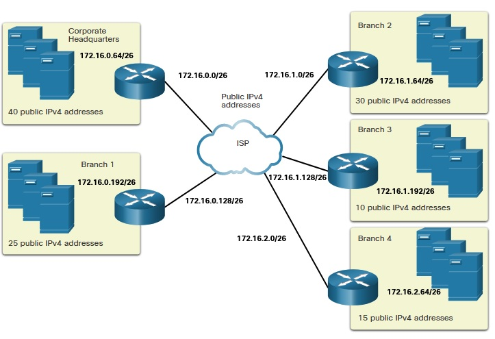   

# [Лабораторка 11.7.5](./labs/11.7.5-packet-tracer---subnetting-scenario.pka)

[Заполненная методичка](./labs/11.7.5-packet-tracer---subnetting-scenario.pdf)   

Задачи
   - разбить адресное пространство на 5 подсетей
   - проверить в PC4 доступность остальных подсетей

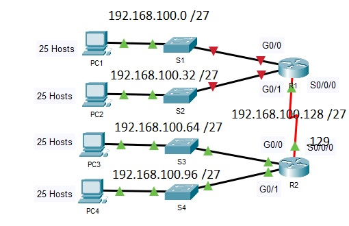   
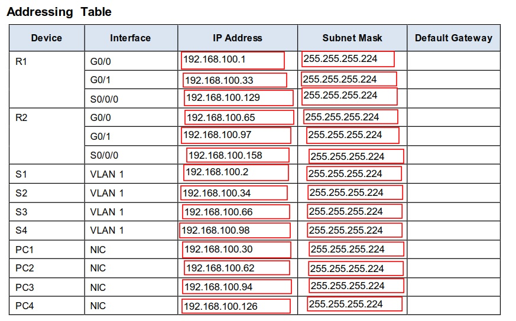   

Проверял пингом - замечаний нет

# 11.8.1 Subnets / VLSM
Вся суть подсетей отражена на картинке ниже: берем и делим крупную подсеть на несколько мелких. Таким образом на участках где надо всего 2 ip - можно /27 сеть разделить на /30 и спокойно сэкономить другие подсети. /30 подсети вполне хватит чтобы запустить IPv4 подветь из 2 устройств.

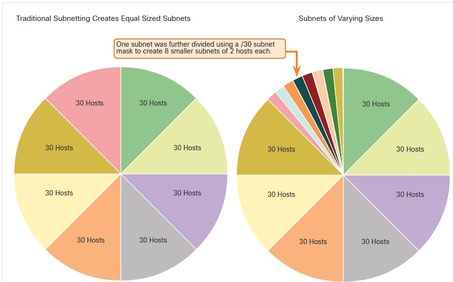   

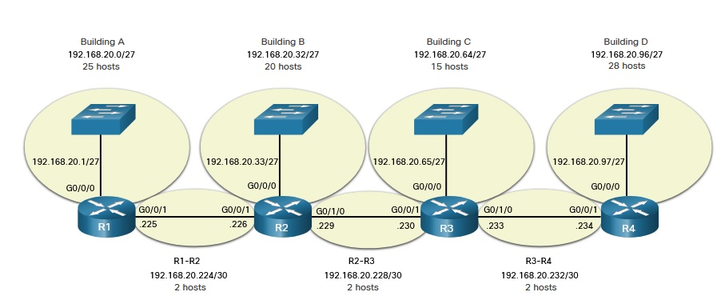   

Хорошее упражнение:
92.168.5.0/24 | Table 1 - First Subnets Calculation

Table 1 uses regular subnetting to accommodate the network shown. Table 2 uses VLSM to further subnet the network. Calculate 50 users per subnet.
   - Задание 1: Click the new Subnet Mask (decimal)

 |       1       |   2       |        3        |       4        |        5      |
 |-------------- |:---------:|:---------------:|:--------------:|:-------------:|
 | 192.168.5.0- 192.168.5.63  |   /26     | ```255.255.255.192``` | 192.168.5.192 - 192.168.5.255 | 192.168.5.64-192.168.5.127 |
 
 
   - Задание 2: Click the first Prefix notation

 |       1       |   2       |        3        |       4        |        5      |
 |-------------- |:---------:|:---------------:|:--------------:|:-------------:|
 | 192.168.5.0- 192.168.5.63  |   ```/26```     | 255.255.255.192 | 192.168.5.192 - 192.168.5.255 | 192.168.5.64-192.168.5.127 |
 
   - Задание 3: Click the first full subnet range

 |       1       |   2       |        3        |       4        |        5      |
 |-------------- |:---------:|:---------------:|:--------------:|:-------------:|
 | ```192.168.5.0- 192.168.5.63```  |   /26     | 255.255.255.192 | 192.168.5.192 - 192.168.5.255 | 192.168.5.64-192.168.5.127 |

   - Задание 4: Click the second full subnet range

 |       1       |   2       |        3        |       4        |        5      |
 |-------------- |:---------:|:---------------:|:--------------:|:-------------:|
 | 192.168.5.0- 192.168.5.63  |   /26     | 255.255.255.192 | 192.168.5.192 - 192.168.5.255 | ```192.168.5.64-192.168.5.127``` |

   - Задание 5: Click the last full subnet range

 |       1       |   2       |        3        |       4        |        5      |
 |-------------- |:---------:|:---------------:|:--------------:|:-------------:|
 | 192.168.5.0- 192.168.5.63  |   /26     | 255.255.255.192 | ```192.168.5.192 - 192.168.5.255``` | 192.168.5.64-192.168.5.127 |

## Подзадача
192.168.5.0/24 | Table 2 - VLSM Calculation: Use the second full subnet range from Table 1 and VLSM to calculate for 20 users per subnet.

   - Задание 1: Click the second full subnet range (/26) from Table 1

 |       1       |   2       |        3        |       4        |        5      |
 |-------------- |:---------:|:---------------:|:--------------:|:-------------:|
 | 192.168.5.96- 192.168.5.127  |   /27     | ```192.168.5.96- 192.168.5.127``` | 255.255.255.224 | 192.168.5.64-192.168.5.95 |

   - Задание 2: Click the new VLSM Subnet Mask (decimal)

 |       1       |   2       |        3        |       4        |        5      |
 |-------------- |:---------:|:---------------:|:--------------:|:-------------:|
 | 192.168.5.96- 192.168.5.127  |   /27     | 192.168.5.96- 192.168.5.127 | ```255.255.255.224``` | 192.168.5.64-192.168.5.95 |

   - Задание 3: Click the VLSM Prefix notation

 |       1       |   2       |        3        |       4        |        5      |
 |-------------- |:---------:|:---------------:|:--------------:|:-------------:|
 | 192.168.5.96- 192.168.5.127  |   ```/27```     | 192.168.5.96- 192.168.5.127 | 255.255.255.224 | 192.168.5.64-192.168.5.95 |

   - Задание 4: Click the first full VLSM subnet range

 |       1       |   2       |        3        |       4        |        5      |
 |-------------- |:---------:|:---------------:|:--------------:|:-------------:|
 | 192.168.5.96- 192.168.5.127  |   /27     | 192.168.5.96- 192.168.5.127 | 255.255.255.224 | ```192.168.5.64-192.168.5.95``` |

   - Задание 5: Click the last full VLSM subnet range

 |       1       |   2       |        3        |       4        |        5      |
 |-------------- |:---------:|:---------------:|:--------------:|:-------------:|
 | ```192.168.5.96- 192.168.5.127```  |   /27     | 192.168.5.96- 192.168.5.127 | 255.255.255.224 | 192.168.5.64-192.168.5.95 |


# 11.9.2 Назначение адресов устройствам
   - ___End user clients___ - DHCP/DHCPv6/SLAAC; при изменении адресного пространства - необходимо менять пулы DHCP
   - ___Servers and peripherals___ - Статика
   - ___Servers that are accessible from the internet___ - либо белые IPv4, либо проброс портов за NAT, либо VPN до них
   - ___Intermediary devices___ - Статика - те железки, которые должны, мать их, иметь ip для мониторинга, безопасности либо управляемости
   - ___Gateway___ - тут сам Б...г велел использовать статику. Чаще всего либо первый, либо последний ip  из диапазона

## Лабораторка
Задание: дана подсеть 10.11.48.0/24
   - Part 1: Examine the Network Requirements, Определить количество подсетей, исходя из условий, выбрать маску:
     * ASW-1 LAN will require 14 host IP addresses
     * ASW-2 LAN will require 30 host IP addresses
     * ASW-3 LAN will require 6 host IP addresses
     * ASW-4 LAN will require 60 host IP addresses
   - Part 2: Design the VLSM Addressing Scheme, 
     - задокументируйте её
       * Use the first subnet to accommodate the largest LAN.
       * Use the second subnet to accommodate the second largest LAN.
       * Use the third subnet to accommodate the third largest LAN.
       * Use the fourth subnet to accommodate the fourth largest LAN.
       * Use the fifth subnet to accommodate the connection between Building1 and Building2.
     - Назначте ip:
       * Assign the first usable IP addresses to Building1 for the two LAN links and the WAN link.
       * Assign the first usable IP addresses to Building2 for the two LAN links. Assign the last usable IP address for the WAN link.
       * Assign the second usable IP addresses to the switches.
       * Assign the last usable IP addresses to the hosts.       
   - Part 3: Assign IP Addresses to Devices and Verify Connectivity

по моим прикидкам, схема получилсь такая:

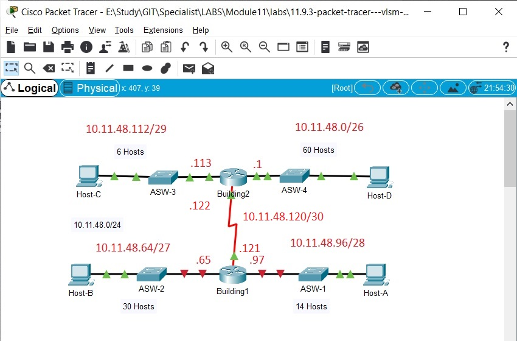   

Заполненная pdf-ка тут: [11.9.3-packet-tracer---vlsm-design-and-implementation-practice.pdf](./labs/11.9.3-packet-tracer---vlsm-design-and-implementation-practice.pdf)


[11.9.3-packet-tracer---vlsm-design-and-implementation-practice.pka](./labs/11.9.3-packet-tracer---vlsm-design-and-implementation-practice.pka)


В процессе настроек были рассчитаны подсети и на доступных узлах настроены:
   - ip-адреса, 
   - безопасность (secret, line con0, line vty 0 14, service pass-encr, banner motd)
   - конфиг сохранен и записан в Startup

Выполнение 100%


## Лабораторка 2
Задание: дана подсеть 10.1.1.0/24 - найти ее было не просто - оказалось что она написана мелкими буквами на схеме сети

Все как обычно: рассчитать схему, настроить ip, прописать ip на SW, хостах, проверить связность

по моим прикидкам, схема получилсь такая:

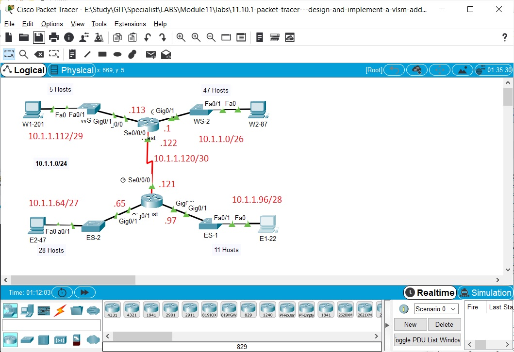   

Заполненная pdf-ка тут: [11.10.1-packet-tracer---design-and-implement-a-vlsm-addressing-scheme.pdf](./labs/11.10.1-packet-tracer---design-and-implement-a-vlsm-addressing-scheme.pdf)


[11.10.1-packet-tracer---design-and-implement-a-vlsm-addressing-scheme.pka](./labs/11.10.1-packet-tracer---design-and-implement-a-vlsm-addressing-scheme.pka)

Самое тяжелое оказалось - найти нужную подсеть )))
