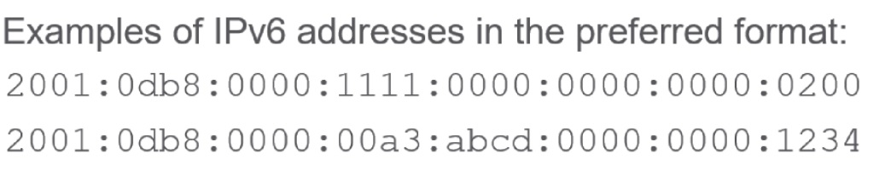
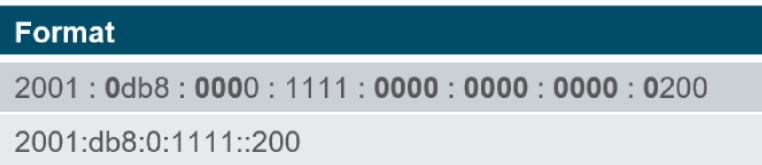
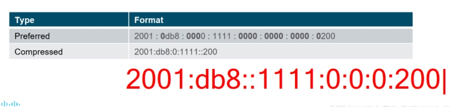
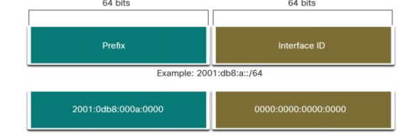
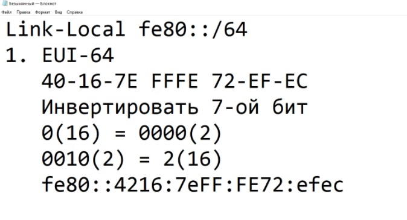

Specialist 20201212
# IPv6
   - ___Dual stack___ - совместная работа ipv4, ipv6
   - ___tunneling___ - метод транспортировки IPv6 поверх IPv4
   - ___translation___ - NAT64 позволяет организовать совместную работу устройств IPv6 vs IPv4

IPv6 - 128 bit: 8 групп по 16 бит, между гекстетами знак ":"
   
Упрощения:
   - убираем группу нулей, заменяя их одним
   - групппу нулей убираем, заменяя ___::___ Одновременно в нескольких местах - нельзя

  

или

 

пример адреса: fe80::1 - короче чем ipv4

## Unicast, Multicast, Anycast
   * Unicast
   * Multicast - в IPv6 отсутствует ___BC___, все широковещания заменена на MC
   * Anycast - "произвольная" рассылка, или: если есть представители одного сервиса - можно назначить этому сервису один адрес. Комапания - оповещает провайдера что один сервис в разных частях света, а провайдеры сами решают куда направить пакет (на ближайший сервис)

## IPv6 Prefix List
префикс может быть длиной 0-128

 

выделение узловой и сетевой частей, обычно используется /64: половина под сеть, половина - под узел

IPv6 - реализует plug-and-play:
   * link-local - 1-й тип адресов, похож на MAC-адрес. Используются для общения в одной сети, в рамках широковещательного домена. Используя эти адреса - не получится выйти в глобальную сеть. Способы автонастройки link-local адреса:
     * EUI-64: MAC делим на 2 половины, затем добавляем  в середину FFFE и инвертируем 7й  с начала бит. Устройства все сделает за нас. пример - ниже

 

     * Random, псевдослучайно
     * Manual, часто используется на сетевых устройствах, для назначения "красивых" адресов. Чатсо назначают (fe80::1)
   * Global Uniq - должен быть у каждого устройства, чтобы все могли общаться со всеми. Сейчас раздают блоки 2000::/3 2000 - 3fff. Обращаемся к LIR и получаем 

## Способы назначения IP
   * SLAAC (stateless address autoconfig) - не надо иметь в каждой сети DHCP-сервер. Нет никакой общей таблицы ip-адресов
    * роутер рассылает RA (router advertisement), то есть кидаться 64 битами сетевого сегмента. Устройство последжние 64 бита назначает либо по EUI, либо по random. Также в RA приходят ареса DNS. RA рассылаются редко, раз в 200 сек
    * Устройство отправляет RS (router solicitation[домогательство]) и R отвечает RA, а затем устройствор генерит IPv6
   * DHCPv6 - тоже не командует кто и какой адрес получит, но учитывает эти адреса. правда толку в этих адресах - мало
   * Manual 

## Multicast
начинается на ff, внутри одного BC-домена - на ff02:
   * например, R отправляет RA на ff02::1, никто другой его не использует
   * ff02::2 - если устройство считает себя R, то оно принимает такой пакет в рамках сети
   * Solicited Multicast - на смену ARP пришел neighbor discovery ff02::1:ff/104 + последжние 24 бита из IPv6. У каждого устройства свой SolMult

## Neighbor discovery
   * NS (neigh solicitation) - 
   * NA (neigh advert)
   * DAD у кого есть такой адрес? если получит в ответ NA, то устройство понимает что дубль адреса и запрашивает или генерит новый IPv6)

В реультате у устройства есть:
   * LLA link local addr
   * GUA global unicast addr
   * ff02::1
   * ff02::1:ff72:efec   

# ICMPv6
этот протокол теперь очень "ответственный" и при заперете - надо очень внимательно это делать, оставлять хотя бы пакеты NA, NS, RA, RS, Echo-req, Echo-repl