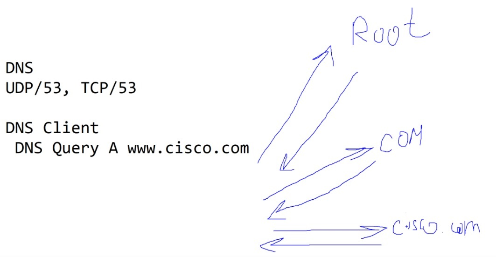

Specialist 20201212
# Уровень приложений
Этими уровнями как правило сетевиков заставляют заниматься.
Возможные интересующие сетевиков протоколы:
   * DHCP
   * HTTP
   * DNS

## DNS [domain name system]
Запоминать адреса - плохо. Идея DNS - в запоминании и сопоставление ip- адресов некоему имени. 
Для работы используются ___UDP/53 (обмен с клиентом), TCP/53 (обмен между серверами)___. Это клиент-серверный протокол. В любой ОС есть DNS-client, которые генерит запрос DNS-query, и этот запрос отправляется на DNS. Типы запросов dns-query (их гораздо больше)
   * A - ipv4
   * AAAA - ipv6
   * MX - адрес почтовых серверов
DNS - сервер отвечает ip-адресом, если знает. Если не знает - отправляет запрос к root-серверу, и тот, в зависимости от ситуации отвечает или отвечает ip-шником DNS, который возможно знает что-то и т.п.

