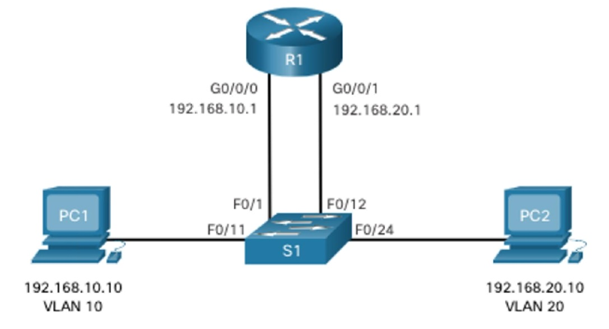
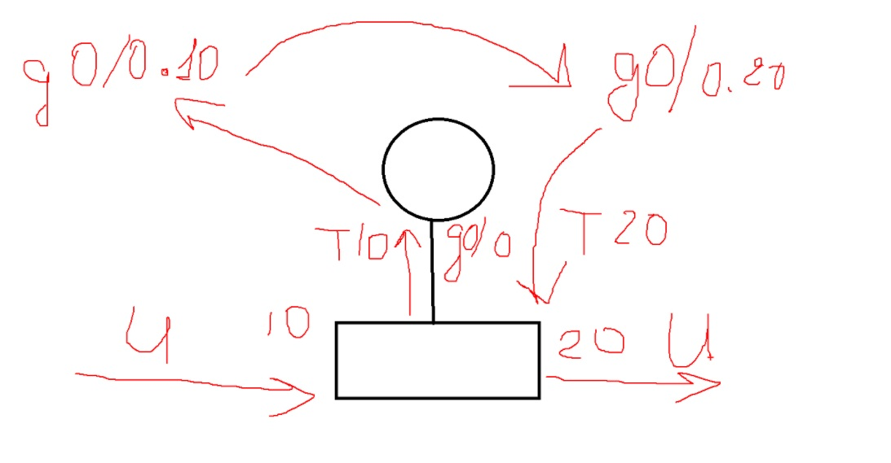
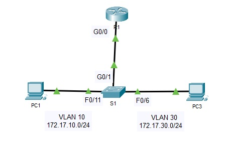
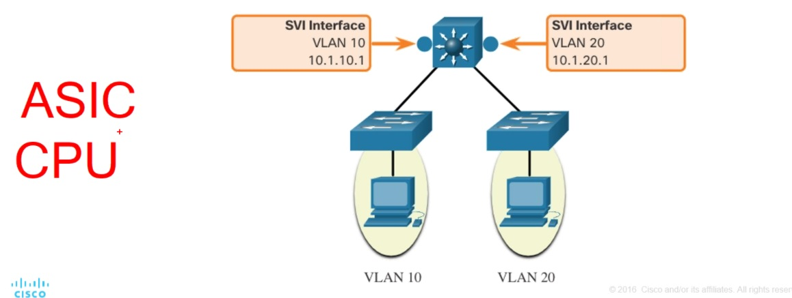
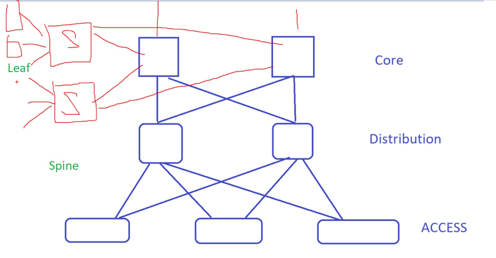

# 202012196 SPECIALIST
## ___IVR___ (Inter-vlan routing)

 

Если VLAN - мало, то можно было раньше сделать и так. но стоимость R портов - очень велика, поэтому начали использовать ROS

## ___ROS___ (router on a stick)
Порт на SW в сторону R - транковый, на R все порты по-умолчанию маршрутизируемые (можно прописать ipv4/ipv6, но нельзя trunk и access), на SW - все порты коммутируемые (нельзя ip, но можно access/trunk). 

   Выход - Sub IF - дробление родлительского IF на несколько Subif:
```
int gi0/0
    no shut
int gi 0/0/0.10
    description <link to VLAN10>
    encapsulation dot1q <10>
    ip add 192.168.10.1 255.255.255.0
```
на этот IF можно назначить IP, а строка encapsulation dot1q (стандарт  802.1q) дает понимание что оперировать на этом IF надо кадрами с тегом 10. IP этого IF настраивают GW для хостов всей подсети vLAN 10, например 192.168.10.1 

Как правило номер SubIF совпадает с № VLAN, для облегчения администрирования

 

Минусы ROS - необходимо 2 устройства, линк - бутылочное горлышко, широко распространен до сих пор.

### лаба 4.2.7 - ROS
 

Конфиг SW[], R

```
R1#show ip route
Codes: L - local, C - connected, S - static, R - RIP, M - mobile, B - BGP
       D - EIGRP, EX - EIGRP external, O - OSPF, IA - OSPF inter area
       N1 - OSPF NSSA external type 1, N2 - OSPF NSSA external type 2
       E1 - OSPF external type 1, E2 - OSPF external type 2, E - EGP
       i - IS-IS, L1 - IS-IS level-1, L2 - IS-IS level-2, ia - IS-IS inter area
       * - candidate default, U - per-user static route, o - ODR
       P - periodic downloaded static route

Gateway of last resort is not set

     172.17.0.0/16 is variably subnetted, 4 subnets, 2 masks
C       172.17.10.0/24 is directly connected, GigabitEthernet0/0.10
L       172.17.10.1/32 is directly connected, GigabitEthernet0/0.10
C       172.17.30.0/24 is directly connected, GigabitEthernet0/0.30
L       172.17.30.1/32 is directly connected, GigabitEthernet0/0.30
```

## ___L3SW___
L3SW - не роутеры, работают на микросхемах ASIC: очень узкие наборы задач, но очень быстро. Не могут NAT, VPN.
R - по сути ПК, использует для работы процессор, выполняет гораздо больше разнообразных процедур и делает часть операций гораздо быстрее. Но R можно загнать в 100% CPU.

 

На дешевых коммутаторах внутренняя матрица/шина не позволяет пропустить полную нагрузку на всех портах, например только для 1/10 всех портов.

Маршрутизаторы ставят только на границах сетей. Все сети - на L3SW/Multilayer

 


