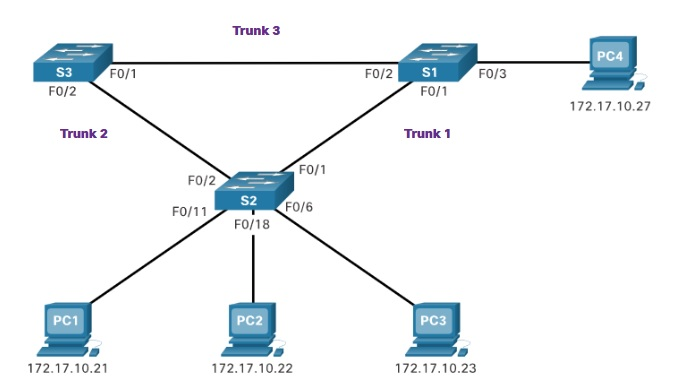
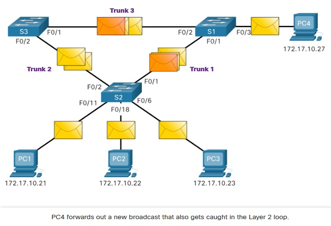
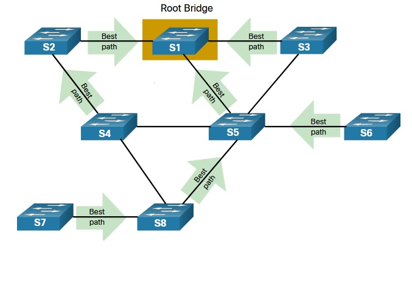
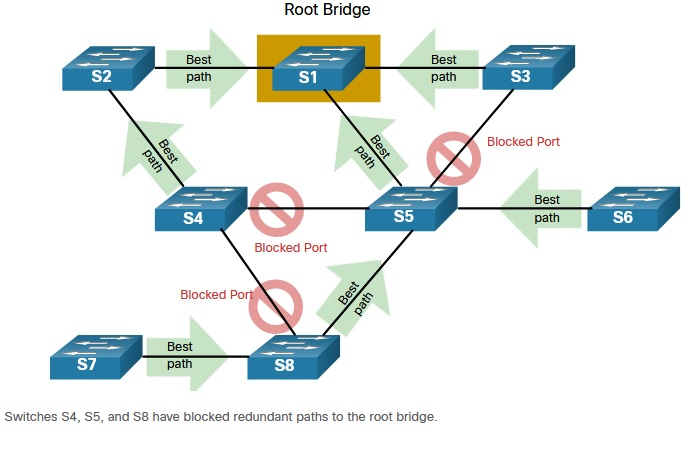
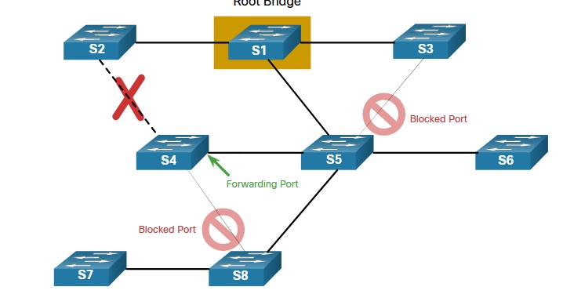
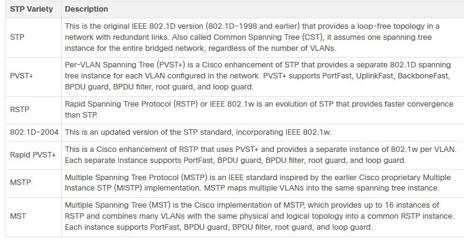

# Specialist 20201226

# 5.0 STP
STP предназначена для разрыва петель, возникающих при построении отказоустойчивых сегментов, петель L2

   

Без STP пакеты кружились бы хороводом по закольцованным сегментам, размножаясь и плодясь, что может привести к переполнению буфера SW и превращению егог в хаб

   

# 5.1.7 Алгоритм STP
   - ___выбор ROOT___

   

   - ___блокировка избыточных линков___

   

   - ___работа по безкольцевой топологии___

   

   - ___отработка сбоев/разблокировака портов___

   

# 5.3.1 Эволюция STP
   