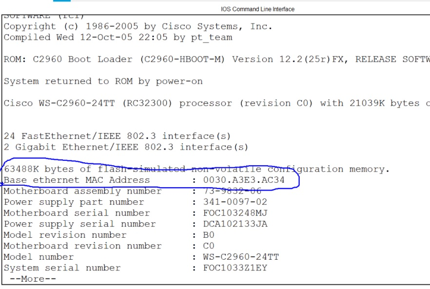
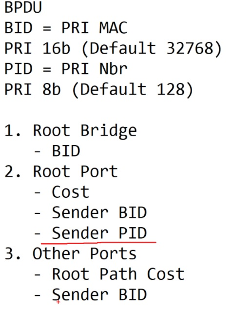
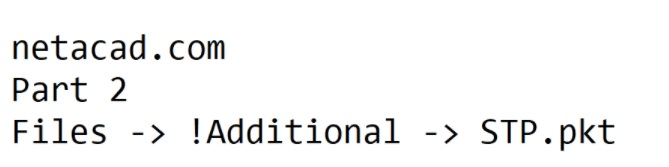

# Specialist 20201226
В результате развития, инженеры пришли к необходимости построения физически отказоустойчевых подключений к SW более высокого уровня. 
Свичи обмениваются ___BPDU___, для 
   - I этап: выбора корня ___root bridge на основании BID: идентификатор SW. Некоторый составной ID PRI&MAC - 
     - MAC - можно посмотреть 
   
   - приоритет PRI 16bit (Default 32768)
При выборе ROOT - побеждает SW с ___min BID___
   
   - II этап: После выбора ROOT - начинают выбирать ROOT Port на каждом SW, на основании ___"стоимости"___ линков до ROOT Bridge и в BPDU рассылает информацию до ROOT, все последуюшие SW рассылают информацию с учетом стоимости аплинков до ROOT'а


   - III этап: После выбора RP определяем роли остальных портов:
     - на ROOT - все порты DP, FWD
     - На конкурирующих SW в сторону ROOT смотрит RP (FWD), осталось выяснить какой порт на каком SW класть в DOWN. Если стоимости одинаковы, то решаем по стоимости BID посылающего. У кого BID меньше, тот побеждает и оставляет свой порт вклю DP/FWD, второй - смиряется и гасит свой порт ___NDP/BLK___. При этом SW не отправляет через этот порт никаких пакетов, кроме BPDU.
     
   - IV этап - поддержание и пересчет топологии при падении RP на каком-либо SW

В старом стандарте STP - падение LNK - пересчет топологии

Если есть несколько параллельно существующих LNK до RB, то на назначение NDP/BLK влияет PortID = PID
   - PRIority - 8 bit (default 128)
   - NBR - номер порта
Победит порт, который имеет min значение PID
   
   

Уточненные этапы выбора состояния, ролей портов
   

Если злоумышленник решит скоммутировать порты на одном свиче между собой, то опять срабатывает STP, который пройдет все этапы и на основании PID блокирует порт с MAX PID.

Для управления STP - настраиваем приоритеты SW, чтобы ROOT был на max эффективных SW.

В старом STP алгоритм работы:
   - коммутаторы обмениваются BPDU (timer ___Hello___ - 2 Сек )
   - если BPDU не приходит 20 секунд (timer ___MAX Age___), то считаем что сосед "умер" и начинаем пересчет топологии и работу с портом
   - NDP порт - из состояния DIS ->- LIStening (15 сек) ->- LRN (изучение приходящих кадров, заполнение MAC - табл, тоже 15 сек) ->- FWD (timer ___Forwarding delay___)
Итого при пересчете топологии min время простоя 20+30 секунд, что очень долго по современным меркам

   

   - I этап: ASW1 - ROOT: все порты DP (на основании BID)
   - II этап: порты
     - DSW1 - F0/1 - RP
     - DSW2 - F0/2 - RP
     - ASW2 - F0/2 - RP (стоимости до ROOT - одинаковые через оба линка, но на основании min BID - выигрывает линк до DSW2)
   - III этап блокировка портов
     - DSW1 - F0/2 - DP/FWD, Gi0/1 - NDP/BLK (на основании BID пришедшего PDU)
     - DSW2 - F0/1 - DP/FWD, Gi0/1 - DP/FWD
     - ASW2 - F0/2 - NDP/BLK; F0/1 - RP/FWD


   - CST IEEE 802.1D
PRI - 16 bit, но только безумный захочет управлять PRI таким количетством бит
   - PVST+ для каждого VLAN - свое дерево: часть бит сократили и отдали для передачи инфы о VLAN  - только Cisco
   - RSTP (Rapid STP) IEEE 802.1w
   - PVRSTP+ (Per VLAN Rapid STP+) - только Cisco. При увеличении числа VLAN - требуется большое число ресурсов (100 VLAN, 100 BPDU в 2 сек, 100 ROOT и т.д.)
   - Cisco придумала упростить ситуацию, объединяя часть деревьев с одинаковыми деревьями в инстансы (1-50 VLAN: 1 инстанс, 51-100 VLAN: 2 инстанс) MIST
   - Общепринятый вариант на основе MIST - 802.1S MST/MSTP (multiple spanning tree)
Могут возникнуть проблемы совметсной работы SW поддерживающих разные версии STP => предложение - ортказаться от STP, за счет внедрения на верхнем уровне L3, но тут тоже могут быть разные подходы в реализации

   

Договорились над этой сетью строить VXLAN - программно-определяемые сети SDN

[Лаба](./labs/STP.pkt)   
   
  

```
DSW1#show spanni summ
Switch is in pvst mode
Root bridge for:
Extended system ID           is enabled
Portfast Default             is disabled
PortFast BPDU Guard Default  is disabled
Portfast BPDU Filter Default is disabled
Loopguard Default            is disabled
EtherChannel misconfig guard is disabled
UplinkFast                   is disabled
BackboneFast                 is disabled
Configured Pathcost method used is short

Name                   Blocking Listening Learning Forwarding STP Active
---------------------- -------- --------- -------- ---------- ----------
VLAN0001                     1         0        0          2          3

---------------------- -------- --------- -------- ---------- ----------
1 vlans                      1         0        0          2          3
```

Просматривать STP лучше за конкретный VLAN ___```sho spann vlan XX```___
CST - NDP
RSTP - Alternate, Backup - немного другая терминология, но роль порта от этого не меняется.

```
DSW1#show spann vlan 1
VLAN0001
  Spanning tree enabled protocol ieee
  Root ID    Priority    32769
             Address     0005.5EDE.80DA
             Cost        19
             Port        1(FastEthernet0/1)
             Hello Time  2 sec  Max Age 20 sec  Forward Delay 15 sec

  Bridge ID  Priority    32769  (priority 32768 sys-id-ext 1)
             Address     00E0.F957.E098
             Hello Time  2 sec  Max Age 20 sec  Forward Delay 15 sec
             Aging Time  20

Interface        Role Sts Cost      Prio.Nbr Type
---------------- ---- --- --------- -------- --------------------------------
Fa0/1            Root FWD 19        128.1    P2p
Fa0/2            Desg FWD 19        128.2    P2p
Gi0/1            Altn BLK 4         128.25   P2p
```
Для ROOTа все порты DP/FWD
```
ASW1#show spann vlan 1
VLAN0001
  Spanning tree enabled protocol ieee
  Root ID    Priority    32769
             Address     0005.5EDE.80DA
             This bridge is the root
             Hello Time  2 sec  Max Age 20 sec  Forward Delay 15 sec

  Bridge ID  Priority    32769  (priority 32768 sys-id-ext 1)
             Address     0005.5EDE.80DA
             Hello Time  2 sec  Max Age 20 sec  Forward Delay 15 sec
             Aging Time  20

Interface        Role Sts Cost      Prio.Nbr Type
---------------- ---- --- --------- -------- --------------------------------
Fa0/1            Desg FWD 19        128.1    P2p
Fa0/2            Desg FWD 19        128.2    P2p

```
 

чтобы SW сделать root - меняем на нем приоритет в нижнюю сторону. Еще можно установить SW в root primary (уменьшает текущее значение на 32768) или root secondary (___почитать___). ___Лучше вручную: primary 4196, secondary 8192___

Для ускорения перевода порта в DSG состояния (по умолчанию порт пытается получить штук 10 BPDU, что долго для современных ПК на SSD), необходимо переводить Access порты в 
<IF>
    - ```spanning tree portfast``` - включение быстрого определения включения порта
    - ```spanning tree bpduguard``` - включение блокировки порта, при получении BPDU на порте. Смешной случай, когда на ПК несколько сетевух, которые при бриджинге (технология ОС) тоже генерят BPDU
    - ``` ``` - включение на порту storm control - позволяет ограничить на порту количество приходящих кадров: UC/MC/BC
Все остальное - "от лукавого", для тонкой настройки порта:
    - ```loopguard```
    - ```rootguard```


# 5.0 STP
STP предназначена для разрыва петель, возникающих при построении отказоустойчивых сегментов, петель L2

   

Без STP пакеты кружились бы хороводом по закольцованным сегментам, размножаясь и плодясь, что может привести к переполнению буфера SW и превращению его в хаб

   

# 5.1.7 Алгоритм STP
   - ___выбор ROOT___

   

   - ___блокировка избыточных линков___

   

   - ___работа по безкольцевой топологии___

   

   - ___отработка сбоев/разблокировака портов___

   

# 5.3.1 Эволюция STP
   