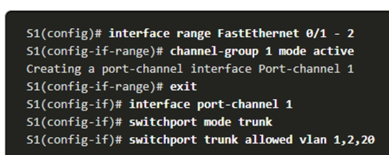

# Specialist 20201226
   - Etherchannel - до 8 портов. Если 1 из портов помирает - другие порты принимаю на себя нагрузку.
   - Объединять лучше количество лдинков ___кротно двойке___
   - На дешевых Cisco - до 6 EtChannel
   - Порты должны быть в одном режиме (Duplex, speed)
   - При объединении портов - появляется PoChannel, все настройки делать с ним. ___STP работает уже с PoCH___

Протоколы агрегирования:
   - PAGP (cisco) - не имеет смысл использовать, старый
   - LACP (IEEE 802.1ad) - есть везде, стандарт
   - static

## LACP
   - ON
   - LACP Active - оба порта могут быть в Active
   - Lacp Passive - ждет сигнала от Active, можно попробовать использовать с другим производителем

___При настройке PoCH порты лучше для начала выключить___
 

Проверить существующие PoCH можно командами

```
S4#show etherchannel 
                Channel-group listing:
                ----------------------

Group: 1
----------
Group state = L2
Ports: 2 Maxports = 16
Port-channels: 1 Max Port-channels = 16
Protocol:   LACP

S4#show etherch summary 
Flags:  D - down        P - in port-channel
        I - stand-alone s - suspended
        H - Hot-standby (LACP only)
        R - Layer3      S - Layer2
        U - in use      f - failed to allocate aggregator
        u - unsuitable for bundling
        w - waiting to be aggregated
        d - default port


Number of channel-groups in use: 1
Number of aggregators:           1

Group  Port-channel  Protocol    Ports
------+-------------+-----------+----------------------------------------------

1      Po1(SD)           LACP   Fa0/1(D) Fa0/2(D) 
```

1      Po1(SU)           LACP   Fa0/1(___P___) Fa0/2(___P___) - Большая буква P - ПРЕКРАСНО, если ___I___ - что-то пошло не так

После настройки EtCH - STP мы обманули и тепероь он видит только 1 линк:
```
S4(config-if-range)#do show span vlan 1
VLAN0001
  Spanning tree enabled protocol ieee
  Root ID    Priority    32769
             Address     000D.BDA1.7BDA
             Cost        9
             Port        27(Port-channel1)
             Hello Time  2 sec  Max Age 20 sec  Forward Delay 15 sec

  Bridge ID  Priority    32769  (priority 32768 sys-id-ext 1)
             Address     0030.F23A.3811
             Hello Time  2 sec  Max Age 20 sec  Forward Delay 15 sec
             Aging Time  20

Interface        Role Sts Cost      Prio.Nbr Type
---------------- ---- --- --------- -------- --------------------------------
Po1              Root FWD 9         128.27   Shr
```
PoCh - виден и в VLAN
```
S4(config-if-range)#do show vlan br

VLAN Name                             Status    Ports
---- -------------------------------- --------- -------------------------------
1    default                          active    Po1, Fa0/1, Fa0/2, Fa0/3
                                                Fa0/4, Fa0/5, Fa0/6, Fa0/7
                                                Fa0/8, Fa0/9, Fa0/10, Fa0/11
                                                Fa0/12, Fa0/13, Fa0/14, Fa0/15
                                                Fa0/16, Fa0/17, Fa0/18, Fa0/19
                                                Fa0/20, Fa0/21, Fa0/22, Fa0/23
                                                Fa0/24, Gig0/1, Gig0/2
1002 fddi-default                     active    
1003 token-ring-default               active    
1004 fddinet-default                  active    
1005 trnet-default                    active    
```

Для ROS также можно объеденить несколько IF в PoCH и уже на нем настраивать SubIF для приема VLAN.

При объединении портов в Poch суммарная скорость линка не будет равна сумме емкостей всех линков.
При расчете коммутации/балансировки на линке используется  технология ___RBH [raw bundle hash]___: у каждого физического IF есть "ведро хэшей"/Bucket. При необходимости прогнать трафик, в зависимости от настроек, возникает пересчет MAC/IP SRC/DST и получаются хэши, которые совпадают с хэшем какого-либо ведра/IF. Т.О. возникает поляризация трафика, когда при устоявшемся трафике peer-to-peer трафик пойдет только по одному линку (причем могут не совпадать отправляемый и получаемый), все остальные - только для отказоустойчивости.
Также на балансировку оказывает влияние размеры кадра: они не разные и поэтому часть линков может оказаться незагруженной

посмотреть балансировку/назначить на коммутатор ___ЦЕЛИКОМ___: ```S4(config)#port-channel load-balance ?```
  dst-ip       Dst IP Addr
  dst-mac      Dst Mac Addr
  src-dst-ip   Src XOR Dst IP Addr - универсальные режимы
  src-dst-mac  Src XOR Dst Mac Addr
  src-ip       Src IP Addr
  src-mac      Src Mac Addr

  на старших моделях может быть еще и балансировка по TCP/UDP

# Etherchannel
