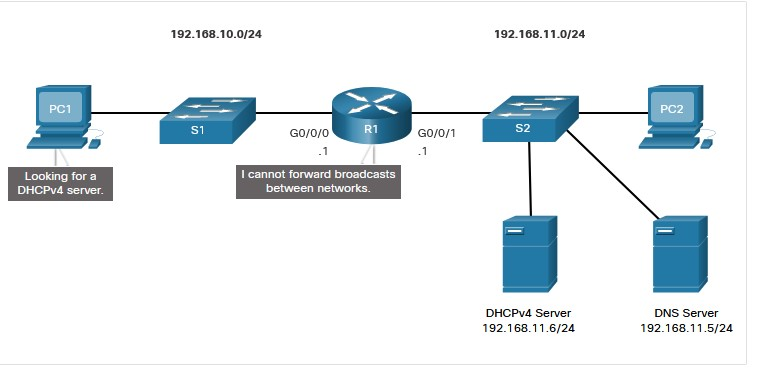
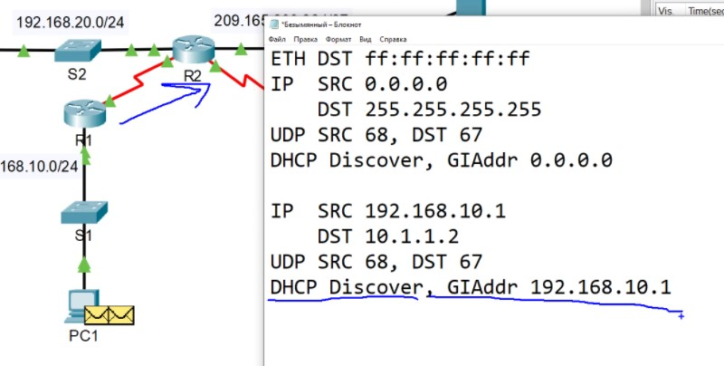
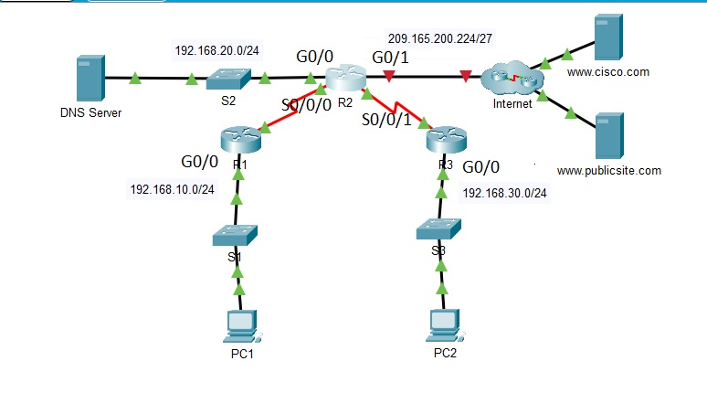

# SPECIALIST 20210116 #
UDP/67, UDP/68
Проблема DHCP:
 - если злоумышленник поднял свой DHCP и ловит запросы, защита: DHCP-snooping (вынюхивание)
 - трансляция запроса с удаленного сайта (helper) - делает BC запрос UC и транслирует на адрес указанный в настройке

При настройке pool, имя - часто совпадает с номером VLAN/названием подсети и т.д., что идентифицирует сегмент.


# NETACAD #
# DHCP v4 #
## DHCP Concept ##
На роутерах DHCP только в небольших сетях. DHCP работает в режиме влиент-сервера (67, 68 UDP). Выдача с нуля (на самом деле там все немного сложнее):
- DHCP ___D___iscover (DHCPDISCOVER) BC запрос
- DHCP ___O___ffer (DHCPOFFER) Предложение от сервера
- DHCP ___R___equest  (DHCPREQ) Подтверждение приема предложения клиентом
- DHCP ___A___ck (DHCPACK) Подтверждение выдачи сервером

Продление:
- DHCP request  (DHCPREQ) Я хотел бы обновить
- DHCP Ack (DHCPACK) Подтверждение обновления сервером

## Configure ##
DHCP включен по-умолчанию, надо выключать ```no servive dhcp```. При сбросе кэша привязок DHCP - может произойти дублирование ip в сетке
1. Exclude address
2. Define new pool name
3. Configure pool: может быть много параматров (сеть; DNS; default-router; domain-name; lease dd:HH:MM|infinite (по-умолчанию 24 часа); netbios-name-server <addr1, addr2...8>)

```
ip dhcp excluded-address low-address high-address
ip dhcp pool pool-name
network 192.168.10.0 255.255.255.0
default-router 192.168.10.1
dns-server 192.168.11.5
domain-name example.com
end
```
проверка:
- ```show runn | sec dhcp```
- ```sho ip dhcp bind```
- ```sho ip dhcp serv stat```

### DHCP relay ###
полезная фича, когда в подсетке нет DHCP и надо переслать BC запрос в другую подсеть. Кроме работы с такими BC запросами, ip-helper пробрасыфвает и следующие UDP
- Port 37: Time
- Port 49: TACACS
- Port 53: DNS
- Port 67: DHCP/BOOTP server
- Port 68: DHCP/BOOTP client
- Port 69: TFTP - например от ip-phone
- Port 137: NetBIOS name service
- Port 138: NetBIOS datagram service



Настраивается на IF смотрящем в сегмент без DHCP. Если несколько DHCP-серверов, то надо прописать их разными строчками
```
int gi0/0/0
ip helper-address 192.168.11.6
end
```
Проверка:
```
sho ip int gi 0/0/0
R1# show ip interface g0/0/0
GigabitEthernet0/0/0 is up, line protocol is up
  Internet address is 192.168.10.1/24
  Broadcast address is 255.255.255.255
  Address determined by setup command
  MTU is 1500 bytes
  Helper address is 192.168.11.6
```
helper преобразует BC в UC и указывает SRC свои ip, а DST - указанный в настройках helper.
GIAddress - адрес пересыльщика (если прошло пересылку, то "ставится штамп"), на основании которого DHCP-сервер выбирает pool из которого выдает ip-адрес:




___Лабку 7.2.10___

- [pdf](labs/7.2.10-packet-tracer---configure-dhcpv4.pdf)
- [pka](labs/7.2.10-packet-tracer---configure-dhcpv4.pka)


ЗАДАЧА:
1. Настроить R2 DHCP-сервером для сегментов R1-LAN, R2-LAN
   - настроить исключаемые адреса 1-10
   - настроить пулы для каждого сегмента
      - Настроить подсети для соответствующего сегмента
      - настроить default GW для соответствующего сегмента
      - настроить для сегментов DNS 192.168.20.254
2. Настроить на маршрутизаторах R1, R2 ip-helper на соответствующий пул
3. Получить ip-адрес на PC1,2

## Configure DHCP client ##
Сам роутер может получать ip на IF смотрящем на ISP
```
SOHO(config)# interface G0/0/1
SOHO(config-if)# ip address dhcp
SOHO(config-if)# no shutdown
...
SOHO# show ip interface g0/0/1
GigabitEthernet0/0/1 is up, line protocol is up
  Internet address is 209.165.201.12/27
  Broadcast address is 255.255.255.255
  Address determined by DHCP
```

___Лабку - СДЕЛАТЬ___

- [pdf](labs/7.4.1-packet-tracer---implement-dhcpv4.pdf)
- [pka](labs/7.4.1-packet-tracer---implement-dhcpv4.pka)

___Лабку - СДЕЛАТЬ___

- [pdf](labs/7.4.2-lab---implement-dhcpv4.pdf)
