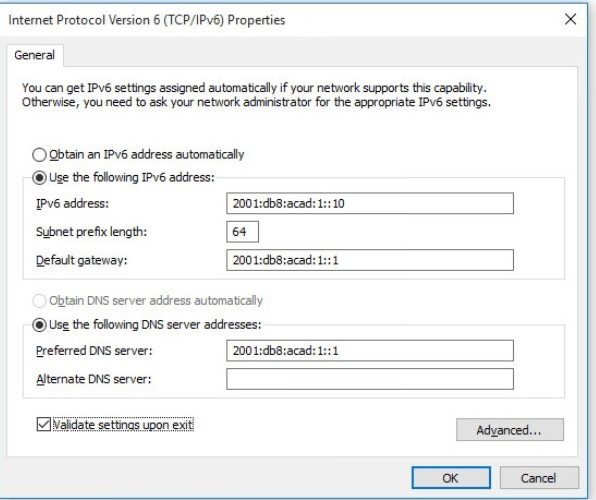
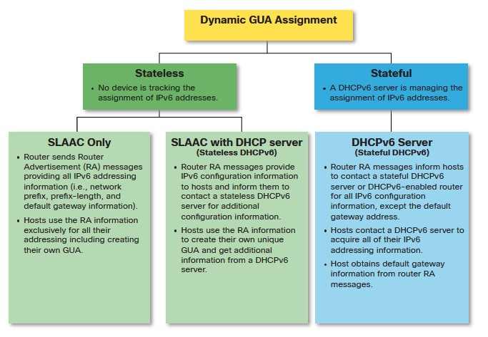
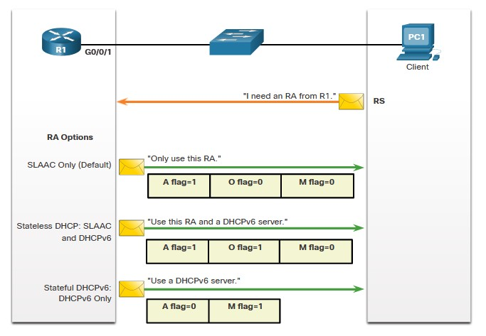

NETACAD
# DHCP v6 #
методы DCHP для ipv6:
- SLAAC [stateless address autoconfiguration] - (аналого APIPA для Global UC addresses)
- DHCPv6
## Ipv6 GUA assignment ##
SLAAC  или DHCPv6 - все равно на IF будет GUA и LLA. Пример статического GUA



При получении динамического ipv6-адреса, хост будет использовать какой-либо из 3 методов определенных в ICMPv6 router Advertisement [RA]:
- Ipv6 Router может быть настроен на рассылку RA, которые получает клиент
- LLA - адресавтоматически создается при включении IF. ___%___ - для идентификацции ZoneID или ScopeID ___???___

Пример LLA
```
C:\PC1> ipconfig
Windows IP Configuration
Ethernet adapter Ethernet0:
   Connection-specific DNS Suffix  . : 
   IPv6 Address. . . . . . . . . . . : 
   Link-local IPv6 Address . . . . . : fe80::fb:1d54:839f:f595%21
   IPv4 Address. . . . . . . . . . . : 169.254.202.140
   Subnet Mask . . . . . . . . . . . : 255.255.0.0
   Default Gateway . . . . . . . . . : 
```

Итак, методы получения GUA: Все они используют RA-шки, для указания хосту метода настройки Ipv6



### 3 Флага RA ###
- ___A flag___ - Address Autoconfiguration признак: чувак, сам себе настраивай адрес GUA методом [___Stateless___ Address Autoconfiguration] - SLAAC.
- ___O flag___ - Other Configuration признак: Other информация есть на ___Stateless___ DHCPv6 server.
- ___M flag___ - Managed Address Configuration признак: ___Stateful___ DHCPv6 выдаст IPv6 GUA.



## SLAAC ##
## DHCPv6 ##
## Config DHCPv6 Sesrver ##
