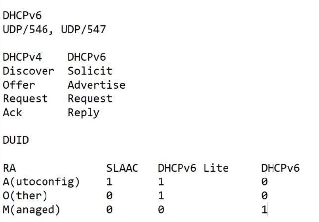

# SPECIALIST 20210116 #
UDP/546? UDP/547
3 способа получения ip
1. SLAAC - Stateless address auticonfi
   - RA (router Advertisement)
2. Stateless DHCPv6/DHCPv6 Lite - здесь DHCP-сервер выдает только опции, а адрес - выдает маршрутизатор
3. Statefull DHCPv6 - все операции делает DHCP-сервер

Пакеты DORA преобразовали:
DHCPv4/DHCPv6
Discover/Solicit - поиск DHCPv6
Offer/Advertise - сервер рассказывает о себе и говорит какая сеть доступна
Request/Request - клиент говорит что хочу сеть, сервер проверяет на le.kz; захоченного ip
Ack/Reply - подтверждает, если нет дубляжа

Итак, DHCPv6 делает:
- Может вести табличку кто и что получил
- Нет понятия "время аренды"
- Использует DUID  для идентификации клиента - DHCP Unic ID - Идентифиактор клиента, который клиент генерит сам. Делается это якобы для анонимности, так как раньше по MAC можно было "следить" за клиентом. В DHCPv6 уже не получится выяснить по MAC - клиента

Итак, при включении клиент отправляет RS, а роутер отвечает RA с флагами SLAAC/DHCPv6 Lite/DHCP:
- A(utoconfig) ___1___/___1___/___0___ - генери сам, других настроек не будет
- O(ther) ___0___/___1___/___0___ - генери сам, а настройки от DHCP
- M(anaged) ___0___/___0___/___1___  - вообще все получай от DHCPv6
Из поыта: вполне устраивает SLAAC


# NETACAD #
# DHCP v6 #
методы DCHP для ipv6:
- SLAAC [stateless address autoconfiguration] - (аналого APIPA для Global UC addresses)
- DHCPv6
## Ipv6 GUA assignment ##
SLAAC  или DHCPv6 - все равно на IF будет GUA и LLA. Пример статического GUA


При получении динамического ipv6-адреса, хост будет использовать какой-либо из 3 методов определенных в ICMPv6 router Advertisement [RA]:
- Ipv6 Router может быть настроен на рассылку RA, которые получает клиент
- LLA - адресавтоматически создается при включении IF. ___%___ - для идентификацции ZoneID или ScopeID ___???___

Пример LLA
```
C:\PC1> ipconfig
Windows IP Configuration
Ethernet adapter Ethernet0:
   Connection-specific DNS Suffix  . : 
   IPv6 Address. . . . . . . . . . . : 
   Link-local IPv6 Address . . . . . : fe80::fb:1d54:839f:f595%21
   IPv4 Address. . . . . . . . . . . : 169.254.202.140
   Subnet Mask . . . . . . . . . . . : 255.255.0.0
   Default Gateway . . . . . . . . . : 
```

Итак, методы получения GUA: Все они используют RA-шки, для указания хосту метода настройки Ipv6


### 3 Флага RA ###
- ___A flag___ - Address Autoconfiguration признак: чувак, сам себе настраивай адрес GUA методом [___Stateless___ Address Autoconfiguration] - SLAAC.
- ___O flag___ - Other Configuration признак: Other информация есть на ___Stateless___ DHCPv6 server.
- ___M flag___ - Managed Address Configuration признак: ___Stateful___ DHCPv6 выдаст IPv6 GUA.


## SLAAC ##
## DHCPv6 ##
## Config DHCPv6 Sesrver ##
