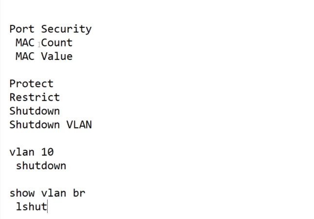
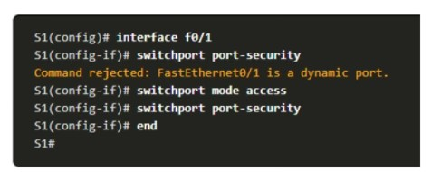
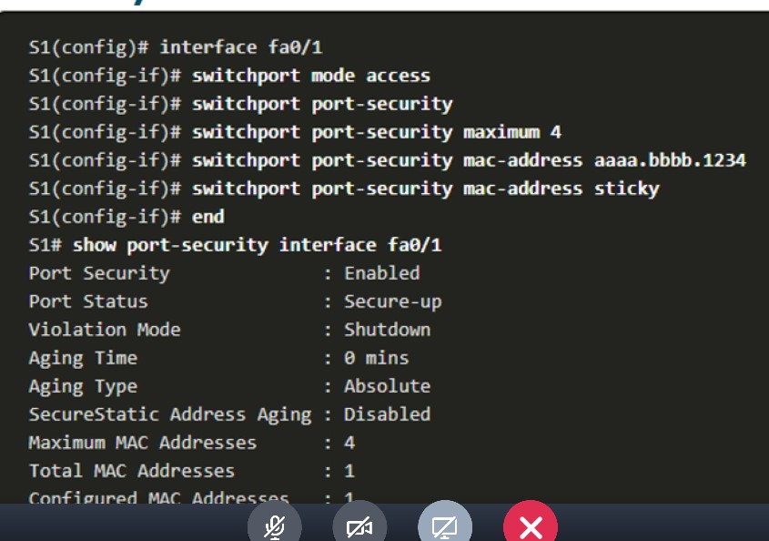
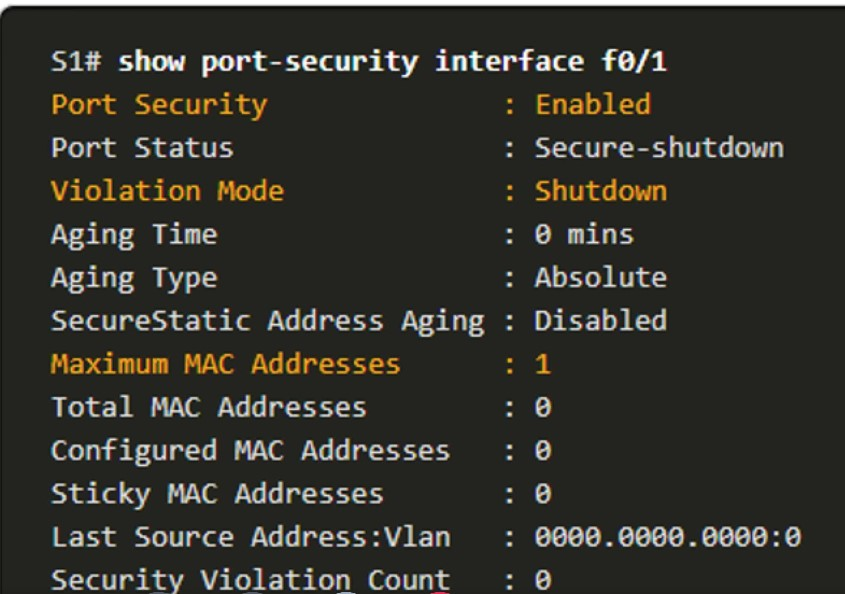
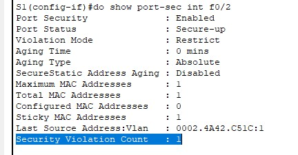
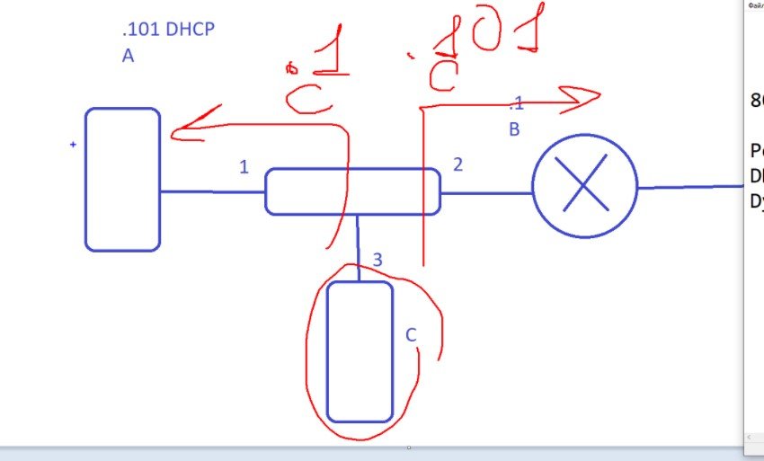

# SPECIALIST 20210116#

## L2 атаки ##
## MAC-floodind ##  (попытка залить до упроа таблицу MAC) - механим порт-sec позволяет защититься, путем задания
- количества MAC
- конкретным MAC
PortSec - настраивает реакцию на "нарушение безопасности":
- protect - дропается кадр
- restrict - кадр дропается, увеличивается счетчик нарушений
- shutdown - порт выключается, до момента ручного 
- shutdown vlan - выключаем vlan, который настроен (оказывается можно выключить) и все порты, которые в этом vlan - выключаются
```
vlan 10
shutdown

show vlan bri
    lshut - будет в 
```



PortSec - защита от дурака, так как злоумышленник рано или поздно подберет рабочий MAC, рекомендуется включать на всех портах коммутатора доступа. 

___Обязательно порт в режим access___ - по умолчанию в dynamic





проверка



поднастройка port-security
- aging - параметры устаревания MAC
- mac-address
   - sticky - добавляется running config - как статический и будет существовать в конфиге
- maximunm - максимальное количества адресов на порту (рекомендовал 10, чтобы на заморачиваться с редкими переключения)

Лабка 11.1.10

- [pdf](./labs/11.1.10-packet-tracer---implement-port-security.pdf)
- [pka](./labs/11.1.10-packet-tracer---implement-port-security.pka)

ЗАДАЧА
- настроить port-sec на портах 1, 2
- переключить 

При включении ПК нарушителя в порт, на котором уже сработал sticky (на рабочий ПК), произойдет ___нарушение___ - ```Security Violation Count   : 1```, но порт не заблокируется:

```
%LINK-5-CHANGED: Interface FastEthernet0/3, changed state to administratively down
S1(config-if)#do show port-sec int f0/2
Port Security              : Enabled
Port Status                : Secure-up
Violation Mode             : Restrict
Aging Time                 : 0 mins
Aging Type                 : Absolute
SecureStatic Address Aging : Disabled
Maximum MAC Addresses      : 1
Total MAC Addresses        : 1
Configured MAC Addresses   : 0
Sticky MAC Addresses       : 1
Last Source Address:Vlan   : 0002.4A42.C51C:1
Security Violation Count   : 1
```




## атака на VLAN ##
- vlan hopping - DTP - жестко переводите порты в access
- vlan double taging - двойное тэгирование. С ПК злоумышленника отправляется кадр с тэгом, и если vlan на access порту совпадет, то кадр будет обработан. Дальше: злоумышленник формирует кадр с двумя тэгами, например ___1;20___. Затем пересывлает кадр дальше и если в транке совпадает native vlan с перовым тэгом (что странно для vlan используемого на access порту), то на втором SW кадр на транке будет интерпретирован как кадр от vlan, соответствующего второму VLAN и соответственно перешлет этот кадр дальше


## атака на DHCP ##

- DHCP snoopiong  - защита от левого DHCP (DHCP spoofing). Защита основывается на распознавании серверных ответных пакетов на access портах. При включении защиты на портах - все порты становятсмя недоверенными - untrusted и при срабатывании - пакет дропнется, либо порт выключится. Тольео аплинки делаются trusted/ При включении защиты на порту, появляется табюличка, содержащая в себе данные о регистрации клиента на DHCP на основе отдельной таблицы DHCP-binding (НЕ таблицы коммутации) - строится защита DAI. Таблица DHCP-binding - большая и очищается при получении сигнала release от клиента
- DAI - Dynamic Arp Inspection. - защита от ARP - poisoning, когда злоумышленник становится MITM

Если включена защита DHCP snooping, то в таблице MAC отсутствует информация о выдаче ip и если SW поймает кадр GARP, то кадр будет дропнут или  заблокируется порт
GARP - нужен для ускорения работы ARP, поэтому устройства заранее о себе рассказывают, рассылая BC GARP. Чтобы все остальные занесли информацию о устройстве себе в таблицы

## IP Source Guard ##
Защита от подмены ip-адресов (IP Spoofing), опять-таки если включена защита DHCP snooping и существует таблица DHCP-binding/


___Таким образом все типа защит на access-SW___:

