# NETACAD
В базовой концепции роутинга в IPv4 нет ничего сложного:
- в случае с Ethernet, порт получает поток нулей-единиц, интерпретирует их в кадры (для других протоколов - своя терминология), кадры проверяются на чексумму и передаются выше
- Из кадра извлекается пакет
- Производится поиск максимально подходящего маршрута (если нет такого, то будет использована нулевка, если ее нет - дроп пакета)
- На основании маршрута выбирается выходящий интерфейс и пакет отдается вниз
- Кадр обертывается новыми заголовками и трейлерами и транслируется через выбранный порт

Таким образом основная задача роутера - найти подходящий маршрут из таблицы маршрутизации. Лучший маршрут - тот, у которого максимальное совпадение сетевой части

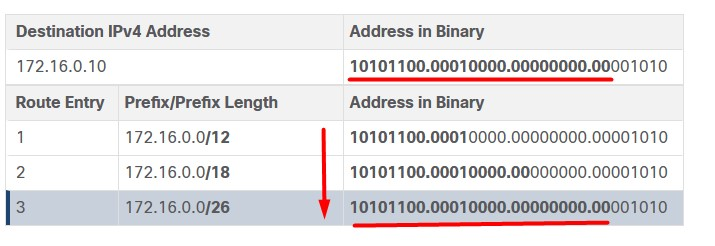
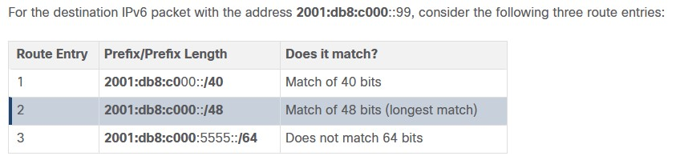

Такблица маршрутизации строится в роутере сама собой, и админ по-хорошему должен лишь создавать условия чтобы записи в нее попадали вовремя. Записи бывают:
- Directly connected Network: маршруты с префиксами С и L (маска /32 или /128); оказываются в таблице маршрутизации только когда IF - UP
- Remote Network: маршщруты с другим веселыми префиксами, см. позже.
- Default route (next-hop маршрут на случай если не будет найдено никакой подходящей записи)

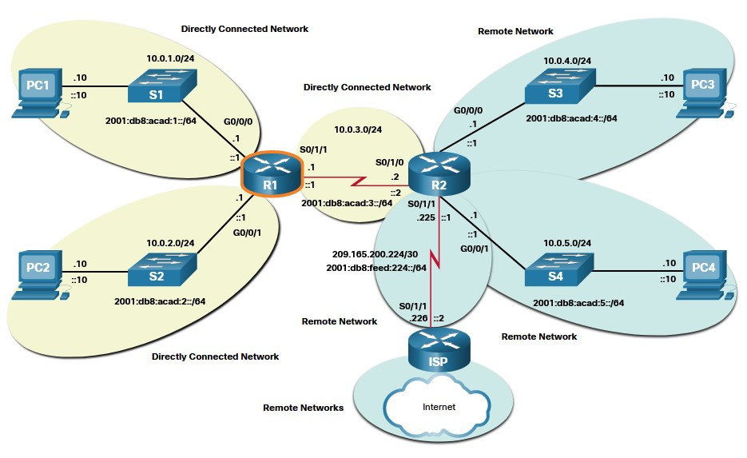

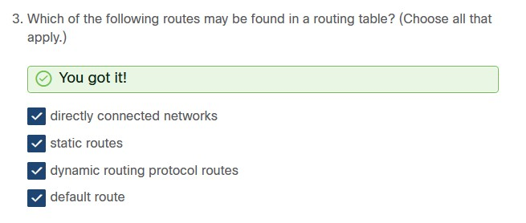

интерфейсы роутере:
- ingress
- egress

- для directly-connected сети L3 PDU не будет переобуваться в формат другой L2 среды:
    - Для IPv4 проверится ARP-таблица на предмет известного IP/MAC. Если нет, то ARP req/ARP-repl и MAC станет известным, если ПК включен.
    - Для Ipv6 - проверится neighbor cache из тех же соображений. Если IPv6/MAC - нет, то ICMPv6 этим займется: запрос NS[network Solicitation]/ответ NA[network advertisement]
- для remote network - произойдет обертка в MAC (или идентификатор подходящей среды), взятый из таблицы ARP или соседства. Причем если MAC-таблица пустая - то сначала также будет выясняться MAC next-hop'а.
- дроп пакета при отстутсвии точного/близкого и default маршрута

## 14.2.3 Механизм packet-forwarding
- Process-Switching - старый, каждый пакет отправлялся в Control Plane, где CPU искал подходящую запись в таблице маршрутов
- Fast Switching - старый, добавлися fast-switching cache (с next-hop информацией), который заполняется CPU и используется для пакетов всего потока (у которых DST - одинаковый). Все остальные пакеты не будут обрабатываться control plane, а сразу  проскочат dataPlane
- CEF - современный, default - включенный. Процесс CEF строит ___FIB___ (forwarding information base) и ___adjacency table___ (я где-то это читал, но забыл). Строится на основании изменений маршрутов. Таким образом когда сеть сошлась - FIB и adjacency table содержат всю информацию которая нужна роутеру для маршрутизации, все пакеты пойдут чреез DataPlane

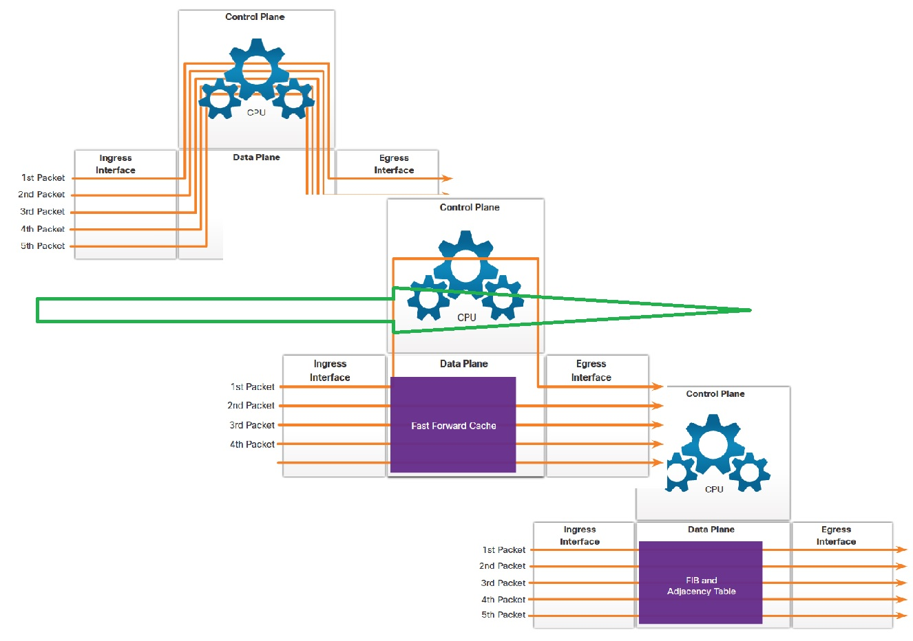

## 14.3.1
Маршрутизатор в мозгах строит топологию

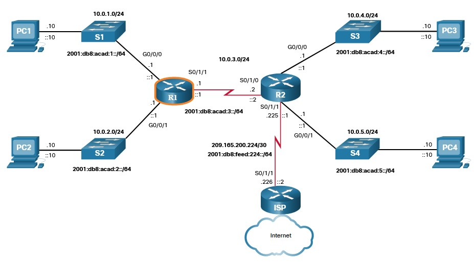

Конфиг R1 с рисунка

```
Router> enable
Router# configure terminal
Enter configuration commands, one per line. End with CNTL/Z.
Router(config)# hostname R1
R1(config)# enable secret class 
R1(config)# line console 0  
R1(config-line)# logging synchronous
R1(config-line)# password cisco 
R1(config-line)# login 
R1(config-line)# exit 
R1(config)# line vty 0 4 
R1(config-line)# password cisco 
R1(config-line)# login 
R1(config-line)# transport input ssh telnet 
R1(config-line)# exit 
R1(config)# service password-encryption 
R1(config)# banner motd #
Enter TEXT message. End with a new line and the #
***********************************************
WARNING: Unauthorized access is prohibited!
***********************************************
#
R1(config)# ipv6 unicast-routing
R1(config)# interface gigabitethernet 0/0/0
R1(config-if)# description Link to LAN 1
R1(config-if)# ip address 10.0.1.1 255.255.255.0 
R1(config-if)# ipv6 address 2001:db8:acad:1::1/64 
R1(config-if)# ipv6 address fe80::1:a link-local
R1(config-if)# no shutdown
R1(config-if)# exit
R1(config)# interface gigabitethernet 0/0/1
R1(config-if)# description Link to LAN 2
R1(config-if)# ip address 10.0.2.1 255.255.255.0 
R1(config-if)# ipv6 address 2001:db8:acad:2::1/64 
R1(config-if)# ipv6 address fe80::1:b link-local
R1(config-if)# no shutdown
R1(config-if)# exit
R1(config)# interface serial 0/1/1
R1(config-if)# description Link to R2
R1(config-if)# ip address 10.0.3.1 255.255.255.0 
R1(config-if)# ipv6 address 2001:db8:acad:3::1/64 
R1(config-if)# ipv6 address fe80::1:c link-local
R1(config-if)# no shutdown
R1(config-if)# exit
R1# copy running-config startup-config 
Destination filename [startup-config]? 
Building configuration...
[OK]
```

Проверка паарметров для ipv6 (аналогично для ipv4)^
```
    show ipv6 interface brief
    show running-config interface <int X/Y>
    show interfaces
    show ipv6 interface
    show ipv6 route
    ping
```

```
R1# show ip interface brief | exclude unassigned
Interface              IP-Address      OK? Method Status                Protocol
GigabitEthernet0/0/0   192.168.10.1    YES manual up                    up
GigabitEthernet0/0/1   192.168.11.1    YES manual up                    up
Serial0/1/1            209.165.200.225 YES manual up                    up
```

### ЛАБА 14.3.5 - сделать

- [pdf](labs/14.3.5-packet-tracer---basic-router-configuration-review.pdf)
- [pka](labs/14.3.5-packet-tracer---basic-router-configuration-review.pka)

## Route sorces
Источники маршрутов:
- Directly connected
- Static
- Dynamic routing

Буковки при просмотре ___Show ip route___:
- L - Local назначенный адрес IF.
- C - Сonnected network.
- S - static route.
- O - dynamically learned using the OSPF.
- * - This route is a candidate for a default route.

Хитрости, которые надо запомнить:
- Маршрутизаторы сами как-то строят таблицы самостоятельно и ничего не знают о маршрутах в таблицах других роутеров
- Содержимое таблиц маршрутизаторов - не идентичное
- В одну сторону пакет может пойти по одному маршруту, а вернуться - по другому

пример запивей в таблице маршрутизации

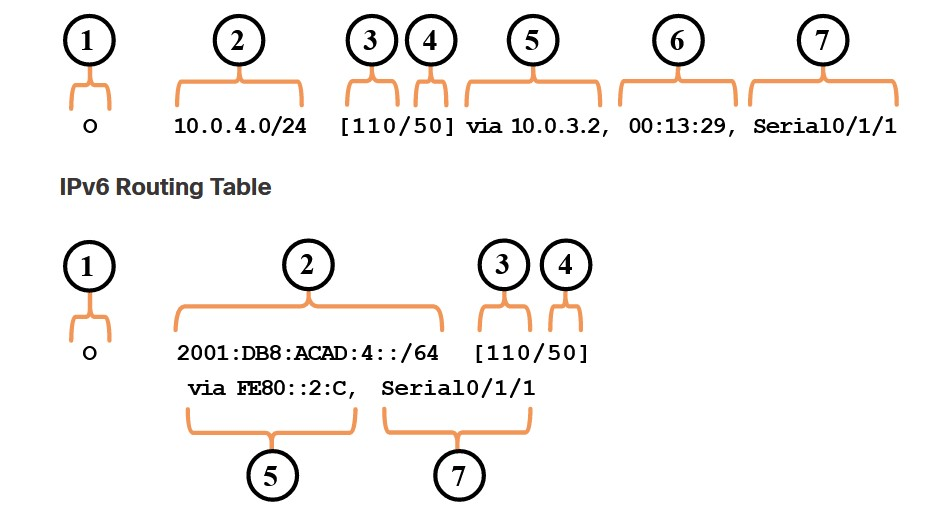

- ___1___ - Route sorce
- ___2___ - DST network prefix и длина (/24)
- ___3___ - Adm Distance (степень доверия маршруту), чем меньше - тем лучше
- ___4___ - Metric - на случай если маршрутов несколько, в таблицу попадет с меньшей метрикой
- ___5___ - Next-Hop - на какой роутер кидать пакет для достижения ___2___
- ___6___ - Route timestamp - сколько времени маршрут уже существует (как давно его узнал роутер)
- ___7___ - Exit IF - через него уйдет пакет
## 14.4.4 Directly connected Network
маршруты с префиксами С и L (маска /32 или /128); оказываются в таблице маршрутизации только когда IF - UP => хитрость: маршрутизируем трафик через маршрут с меньшей метрикой или выживший (тот кто в UP) 

## 14.4.5 Static route
конфигурируются после directly. Плюсы - большая секьюрность и меньше ресурсов на "обнаружение" маршрута, минусы - недостаточная гибкость при перестроении сети. Static маршруты подойдут для: ___маленькие сети___, ___default route___ в маленьких сетях, ___Stub___ - сети (заглушки/сети без какого-либо выхода)

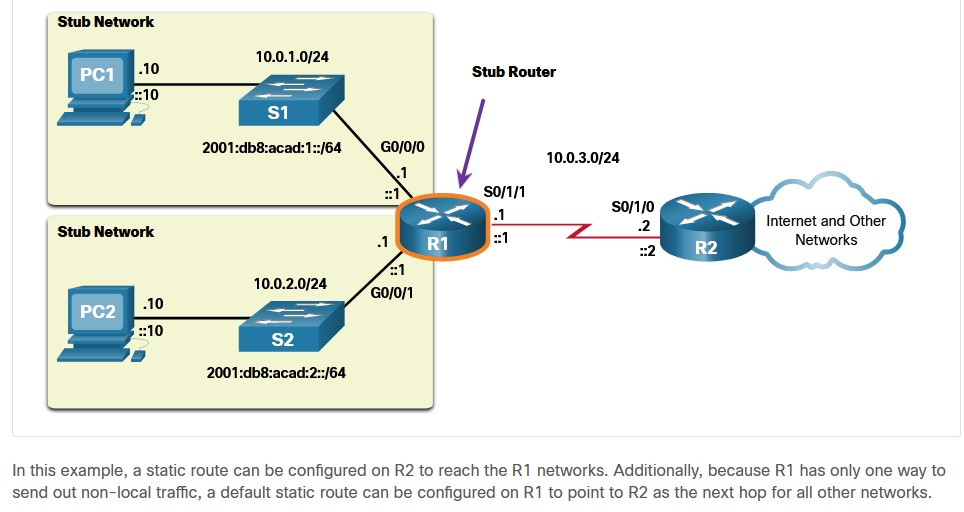

Задается статика:
- ```ip route 10.4.0 255.255.255.0 10.0.3.2```
- ```ipv6 route 2001.db8.acad.4::/64 2001.db8.acad.3::2```

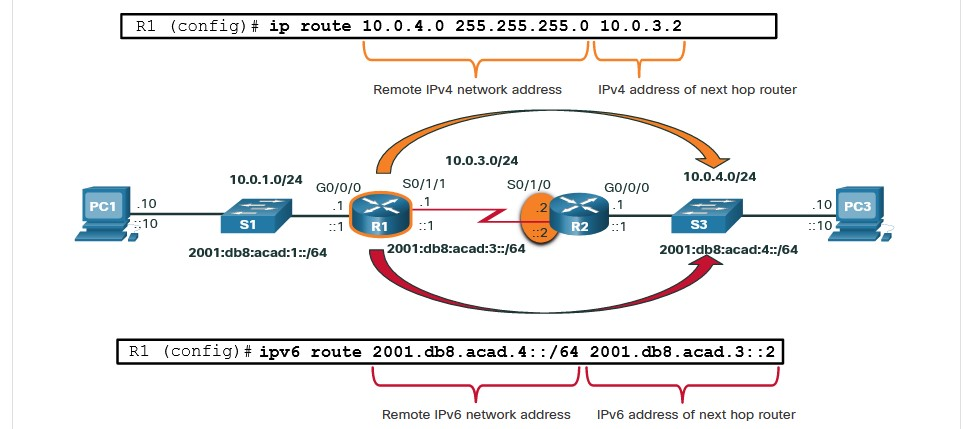

проверка - ```show ip route static```

## 14.4.7 - Dynamic Routing Protocol
Заставляют роутеры обмениваться определенной информацией (характерной для соответствующего протокола динамической маршрутизации) между собой. На основании этой информации роутеры самостоятельно перестраивают свои таблицы маршрутизациию. Network Discovery - оповещение соседей/других роутеров с аналогичным протоколом маршрутизации об изменениях в сети

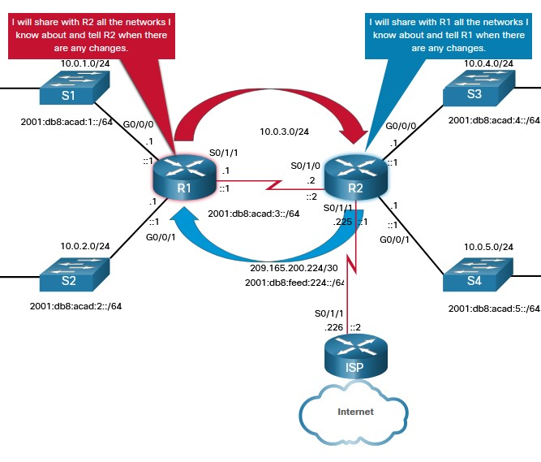

## 14.4.8 Default Route
Аналог Def GW у ПК. На случай если куда-то проебутся все остальные маршруты. Задается как вручную, так и может возникнуть/прилететь по протоколу динамической маршрутизации. Обозначается как 0.0.0.0/0 или ::0 - называется "нулевка". Плюсы - снижение размера таблиц маршрутизации на клиентском оборудовании, если провайдеров немного и нет необходимости держать кучу VPN - туннелей через разных ISP.

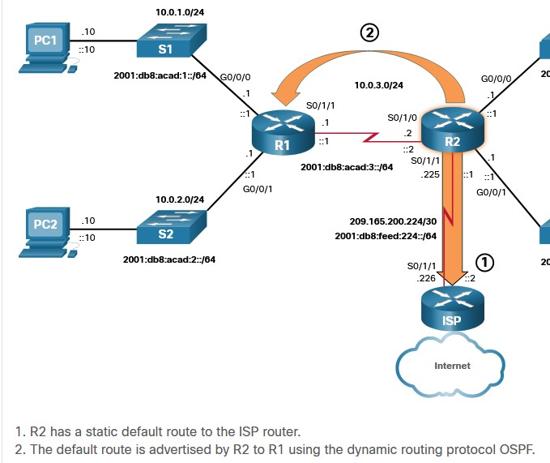

пример прилетевшей нулевки:

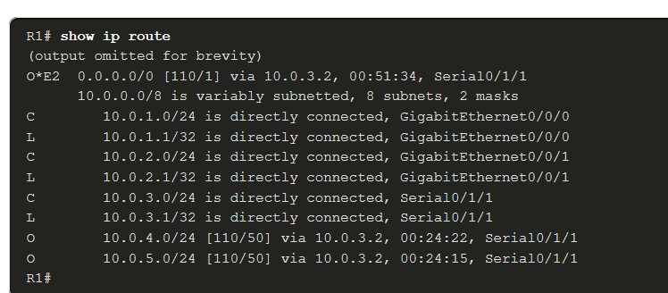

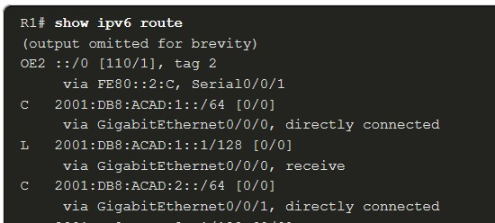

## 14.4.2 Adm distance
Степень доверия к маршруту. Зависит от того как маршрут оказался в таблице: статика ли это или он прилетел от какого-то соседа при сходимости сети, или прилетел от двух соседей, но по разным динамическим протоколам, например EIGRP и OSPF и т.п. Для этого приняты следующие значения ___AD___

| Route Source | 	Administrative Distance | 
 |-------------- |------------------------- |
| Directly connected | 	0 | 
| Static route | 	1 |
| EIGRP summary route | 	5 |
| External BGP | 	20  |
| Internal EIGRP | 	90 |
| OSPF | 	110 |
| IS-IS | 	115 |
| RIP | 	120 |
| External EIGRP | 	170 |
| Internal BGP | 	200 |

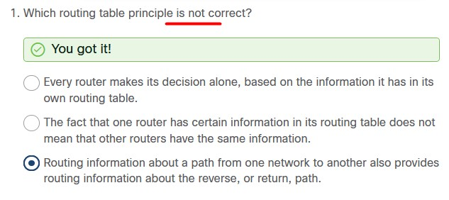

## 14.5.1 Static vs Dynamic
Static:
- default to ISP
- маршрут в области откуда никаких маршгрутов не прилетает
- явное желание админа задать конкретный маршрут (к датацентру или конкретной подсетке/хосту)
- маршрутизация между stub-сетями

Dynamic
- когда роутеров больше чем мало
- необходима реакция на изменение маршрутов/падение сегментов
- Масштабируемость на случай роста

Как появлялись протоколы динамической маршрутизации:

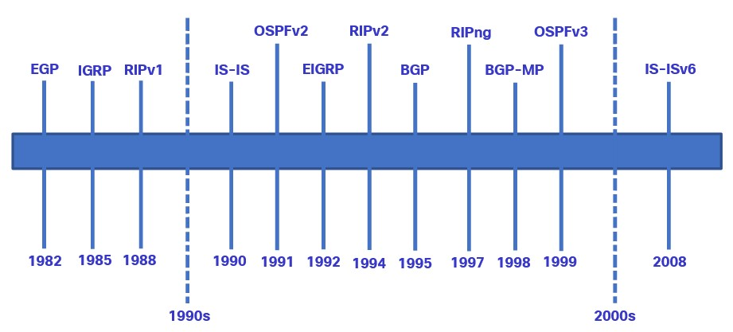

Dynamic протоколы делятся:

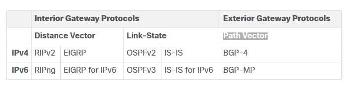

Еще раз про концепции протоколов динамичесокй маршрутизации:
- Обнаружение удаленных сегментов
- Поддержание маршрутов в актуальном состоянии
- Выбор лучшего пути
- автоподбор пути в случае исчезновниея пути вследствии падения сегмента

Компонентами протоколов динамичесокй маршрутизации является:
- Data structures - обычно маршруты в таблицах
- Routing protocol messages - Разные форматы, разная структура и форма обмена
- Algorithm - у каждого протокола - свой

## 14.5.4 Best Path
Прежде чем попасть в таблицу маршрутизации, маршрут должен быть выбран соответствующим протоколом маршрутизации. Таким образом, если маршрутов в какую-либо подсеть несколько, то они не должны попасть одновременно в таблицу маршрутизации. В таблице должен быть только 1 маршрут. Определяется он по минимальному значению ___metric___'и, и чем меньше она - тем короче расстояние до конечной сети. 

Хитрость в том, что каждый протокол динамической маршр-ции использует свое ее название метрика, свой алгоритм расчета метрики и построения таблицы маршрутизации:

| Routing Protocol	| Metric| 
| -------------------| --------------| 
| Routing Information Protocol (RIP) | метрика - ___hop count___. Каждый узел - добавляет a hop. максимум - 15 hops. | 
| Open Shortest Path First (OSPF) | метрика - ___cost___, cumulative bandwidth from source to destination. у быстрых линков - меньший costs по сравнению с медленными (higher cost). |
| Enhanced Interior Gateway Routing Protocol (EIGRP) | It calculates a metric based on the slowest bandwidth and delay values. It could also include load and reliability into the metric calculation. | 	

Видно, что в зависимости от метрики пакет пойдет либо по короткому, либо по более скоростному пути

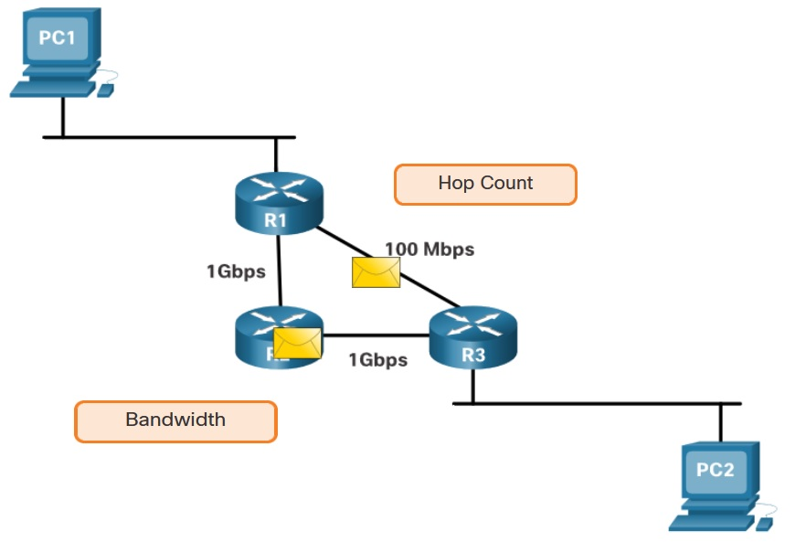    


## 14.5.5 Load balance
Если в таблице окажутся 2 маршрута с одинаковыми метриками, то маршрутизатор будет отправлять пакеты по обоим маршрутам (через разные выходные IF) - ___equal cost path balancing___/ При правильной настройке это увеличит производительность сети. Даже static маршруты с одинаковой стоимостью будут балансировать трафик. ___Только EIGRP может балансировать трафик по маршрутам с разной стоимостью___

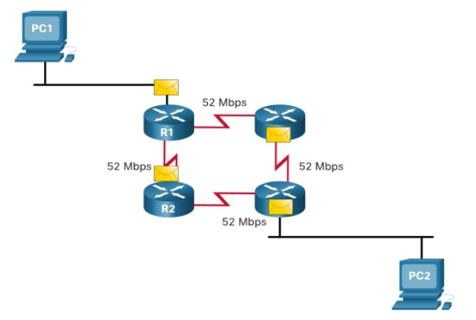    

Ахтунг-вопросы с правильными ответами:

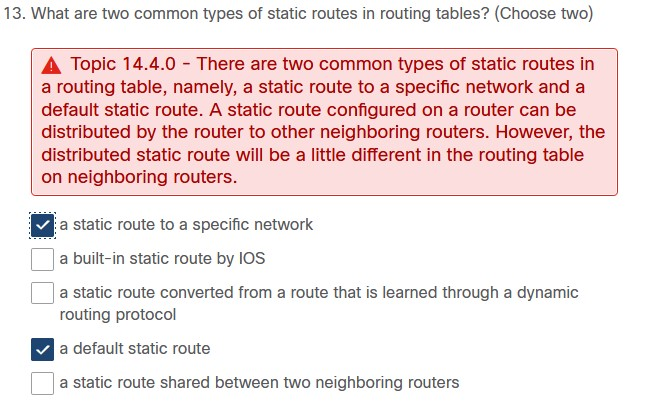    

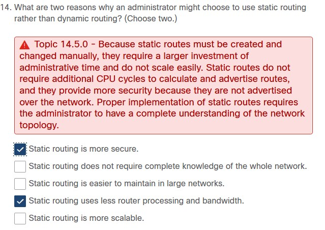    