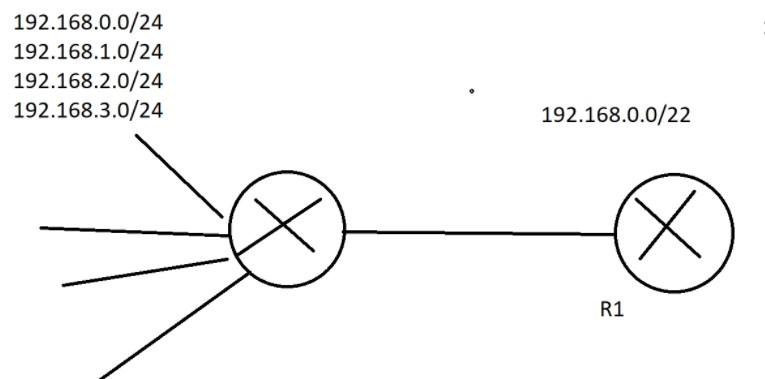
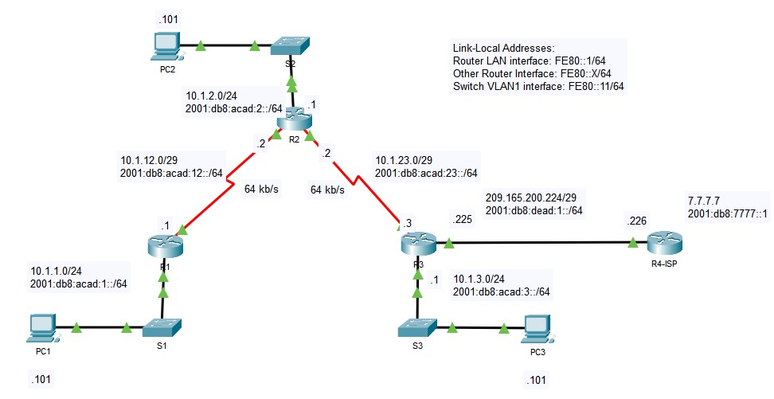
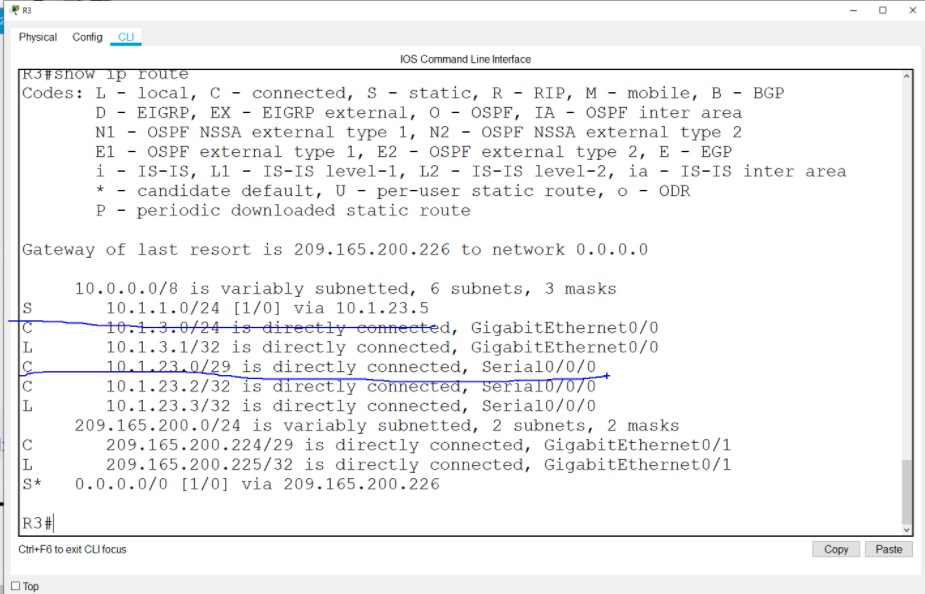
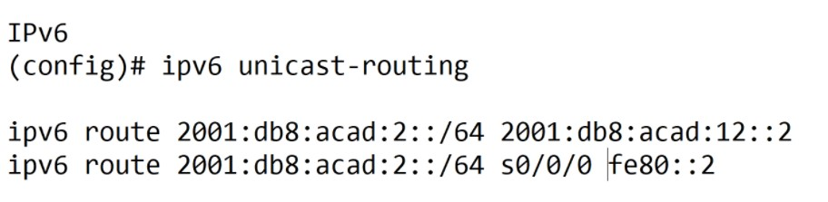
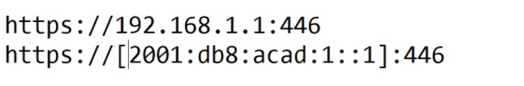
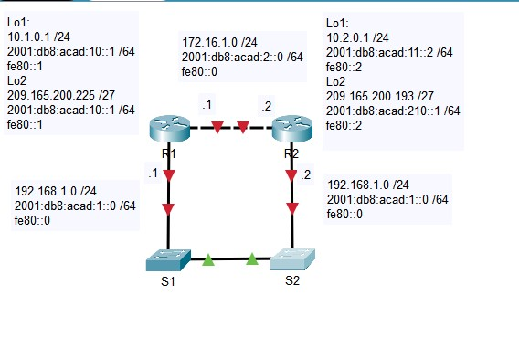

# Specialist 20210123
static маршруты есть и в ipv6 и ipv6. Критерий выбора ststic маршрута: если задолбался копаться со статикой - переходи на динамику, если нет - оставайся на статике
Типа static
- standard - самый обычный, на указание сегмента и next-hop или out IF
- default - добавляется символ ___*___ в выводе команды ___show ip route___
- Плавающие - для случая, когда необходимо автоматически перестроить таблицу маршрутизации, для этого зададим AD хуже, чем у предпочтительного маршрута, тогда процесс маршрутизации "уйдет в тень". Если упадет основной IF, то резервный маршрут всплывет. Способ не сработает, до тех пор пока не упадет физика, проблемы с логикой вышестоящего маршрутизатора тоже не отловятся. Поэтому плавающие маршруты используются обязательно с IP SLA  в реальном мире. У Cisco есть EEM embedded event manager - скрипты, преподаватель говорит что с 12 IOS...
- суммарные



Next-hop опции:
- next-hop route [ip]
- Directly connected static route [Out IF] (не применять в Ethernet сетях) - будет не просто падение производительности, а может просто все лечь
- fully specified static route - [ip] + [out IF]

Лаба в классе

Настроили ipv4, затем провели эксперимент: удалили на R3 все маршруты, и настроили маршрут через неправильный next-hop
```
10.1.1.0 255.255.255.0 10.1.12.5
```
ip-связность сохранилась, так как у нас R2-R3 - SERIAL, ppp подключение =>  R1 не заморачивался с DST отправляемого пакета, а просто рекурсивно вычислели следующий  next-hop и передал пакет на R2, разбирайся сам. А R2 знает что это за сеть



для включения ipv6 маршрутизации ___ipv6 unicast-routing___
При настройке ipv6 маршрутов, можно указывать:
- GUA
- LLA, но его надо указывать с ___out IF___



Доступ к http  по ipv6



# NETACAD

## Типы Static Route
Бывают:
- Standard
- Default
- Floating
- Summary

Идентификация Next-hop может быть:
- Next-hop route - ___ip - адрес___
- Directly connected static route - ___egress IF___
- fully specified static route - и ip и IF

задаются командами ```ip route``` или ```ipv6 route```:
```
Router(config)# ip route network-address subnet-mask { ip-address | exit-if [ip-address]} [distance]
```
- ip-address - адрес Next-hop, при этом может возникнуть рекурсивный запрос, Next-hop через Next-hop через Next-hop, что приводит к задержкам выплевывания пакета
- exit-IF - через что выплевывать пакет, при этом автоматически создается ___directly-connected___ static маршрут. Используется в p-t-p подключениях
- exit-if ip-address - для fully specified static route
- distance - AD; 1...255; хитрость: для задания плавающего/floating маршрута задаем AD больше чем у dynamic-вычисленного маршрута

```
Router(config)# ipv6 route ipv6-prefix/prefix-length {ipv6-address | exit-intf [ipv6-address]} [distance]
```
- ipv6-prefix - идентификатор IPv6 сети назначения.
- /prefix-length - длина prefix'а сети назначения.
- ipv6-address - next-hop router IPv6 address. Обычно используется в BC среде Ethernet. Может появиться екурсивный запрос, Next-hop через Next-hop через Next-hop, что приводит к задержкам выплевывания пакета
- exit-intf - exit IF куда будут выплевываться пакеты. Создает ___directly connected static route___. Используется для point-to-point.
- exit-intf ipv6-address - для fully specified static route.
- distance - AD; 1...255; хитрость: для задания плавающего/floating маршрута задаем AD больше чем у dynamic-вычисленного маршрута

без static маршрутов связности в такой сетке не будет


Ахтунг- вопрос


## 15.2.1  Next-hop Static Route
Для приведенной выше картинки на R1 сделаем 
- для IPv4:
```
R1(config)# ip route 172.16.1.0 255.255.255.0 172.16.2.2
R1(config)# ip route 192.168.1.0 255.255.255.0 172.16.2.2
R1(config)# ip route 192.168.2.0 255.255.255.0 172.16.2.2
...

R1# show ip route | begin Gateway
Gateway of last resort is not set
...
S     172.16.1.0/24 [1/0] via 172.16.2.2
...
S     192.168.1.0/24 [1/0] via 172.16.2.2
S     192.168.2.0/24 [1/0] via 172.16.2.2

```

- для IPv6:
```
R1(config)# ipv6 unicast-routing
R1(config)# ipv6 route 2001:db8:acad:1::/64 2001:db8:acad:2::2
R1(config)# ipv6 route 2001:db8:cafe:1::/64 2001:db8:acad:2::2
R1(config)# ipv6 route 2001:db8:cafe:2::/64 2001:db8:acad:2::2

...

R1# show ipv6 route
...
S   2001:DB8:ACAD:1::/64 [1/0]
     via 2001:DB8:ACAD:2::2
...
S   2001:DB8:CAFE:1::/64 [1/0]
     via 2001:DB8:ACAD:2::2
S   2001:DB8:CAFE:2::/64 [1/0]
     via 2001:DB8:ACAD:2::2
L   FF00::/8 [0/0]
     via Null0, receive
```

## 15.2.3  Directly Connected Static Route
- R1/IPv4
```
R1(config)# ip route 172.16.1.0 255.255.255.0 s0/1/0
R1(config)# ip route 192.168.1.0 255.255.255.0 s0/1/0
R1(config)# ip route 192.168.2.0 255.255.255.0 s0/1/0
...
R1# show ip route | begin Gateway
Gateway of last resort is not set
...
S     172.16.1.0/24 is directly connected, Serial0/1/0
...
S     192.168.1.0/24 is directly connected, Serial0/1/0
S     192.168.2.0/24 is directly connected, Serial0/1/0
```

- R1/IPv6
```
R1(config)# ipv6 route 2001:db8:acad:1::/64 s0/1/0
R1(config)# ipv6 route 2001:db8:cafe:1::/64 s0/1/0
R1(config)# ipv6 route 2001:db8:cafe:2::/64 s0/1/0

...

R1# show ipv6 route
...
S   2001:DB8:ACAD:1::/64 [1/0]
     via Serial0/1/0, directly connected
...
S   2001:DB8:CAFE:1::/64 [1/0]
     via Serial0/1/0, directly connected
S   2001:DB8:CAFE:2::/64 [1/0]
     via Serial0/1/0, directly connected
L   FF00::/8 [0/0]
     via Null0, receiveIPv6 Routing Table - default - 8 entries
```

## 15.2.5 IPv4 Fully Specified Static Route
Рекомендуется при задании exit-IF  в  Ethernet пользоваться fully specified static route (exit-IF and next-hop ip).
- R1/IPv4
```
R1(config)# ip route 172.16.1.0 255.255.255.0 GigabitEthernet 0/0/1 172.16.2.2
R1(config)# ip route 192.168.1.0 255.255.255.0 GigabitEthernet 0/0/1 172.16.2.2
R1(config)# ip route 192.168.2.0 255.255.255.0 GigabitEthernet 0/0/1 172.16.2.2
...

R1# show ip route | begin Gateway
...
S        172.16.1.0/24 [1/0] via 172.16.2.2, GigabitEthernet0/0/1
...
S     192.168.1.0/24 [1/0] via 172.16.2.2, GigabitEthernet0/0/1
S     192.168.2.0/24 [1/0] via 172.16.2.2, GigabitEthernet0/0/1
```

- R1/IPv6 - тут есть тонкость: если next-hop ip задается LLA, то надо указывать exit-IF, иначе будет ошибка (IPv6 LLA - не содержится в IPV6-таблице маршрутизации, LLA - адрес уникален только в пределах линка)
```
R1(config)# ipv6 route 2001:db8:acad:1::/64 fe80::2
%Interface has to be specified for a link-local nexthop
R1(config)# ipv6 route 2001:db8:acad:1::/64 s0/1/0 fe80::2

...

R1# show ipv6 route static | begin 2001:db8:acad:1::/64
S   2001:DB8:ACAD:1::/64 [1/0]
    via FE80::2, Seria0/1/0
```
___Способы проверки___
```
    show ip route static
    show ip route static | be Gateway
    show ip route <network>
    show running-config | section ip route
...
    show ipv6 route static
    show ipv6 route static | be App
    show ipv6 route <network>
    show running-config | section ipv6 route

```

## 15.3.1 Default Static Route
Имеем дело со stub-сеткой или единственным выходом к прову


```
IPv4
Router(config)# ip route 0.0.0.0 0.0.0.0 {ip-address | exit-intf}

Ipv6
Router(config)# ipv6 route ::/0 {ipv6-address | exit-intf}


R1# show ip route static
...
Gateway of last resort is 172.16.2.2 to network 0.0.0.0
S* 0.0.0.0/0 [1/0] via 172.16.2.2 

R1# show ipv6 route static
...
S   ::/0 [1/0]
     via 2001:DB8:ACAD:2::2
```
В выводах static маршрут идет с маской /0 или ::/0

## 15.4.1 Floating Static Routes
floating маршрут нужен на случай если у вас больше чем 1 выход в инет и необходимо чтобы этот маршрут автоматически подставлялся в таблицу маршрутизации при падении основного линка. Для этого AD делаем больше чем у основного маршрута (меньше AD - больше доверия маршруту)/ маршрут с большим AD - менее желателен. Напомним, что по-умолчанию, AD static маршрута = 1. AD основных протоколов:
- EIGRP = 90
- OSPF = 110
- IS-IS = 115


Настроим float- маршрут и проверим таблицу маршрутизации:
```
R1(config)# ip route 0.0.0.0 0.0.0.0 172.16.2.2
R1(config)# ip route 0.0.0.0 0.0.0.0 10.10.10.2 5
R1(config)# ipv6 route ::/0 2001:db8:acad:2::2
R1(config)# ipv6 route ::/0 2001:db8:feed:10::2 5

R1# show ip route static | begin Gateway
Gateway of last resort is 172.16.2.2 to network 0.0.0.0
S*   0.0.0.0/0 [1/0] via 172.16.2.2

R1# show ipv6 route static | begin S : 
S   ::/0 [1/0]
     via 2001:DB8:ACAD:2::2
R1#
```
Когда упадет R2, таблица маршрутов станет:
```
R1# show ip route static | begin Gateway
Gateway of last resort is 10.10.10.2 to network 0.0.0.0
S*    0.0.0.0/0 [5/0] via 10.10.10.2

R1# show ipv6 route static | begin :: 
S   ::/0 [5/0] 
     via 2001:DB8:FEED:10::2
R1#
```

## 15.5.1 Host Routes
Это маршруты к конкретным хостам с масками /32 и /128 для Ipv6. Появится такой маршрут в таблице сможет только когда:
- автоматиески при конфигурировании ip на IF (___L___)
- static host route
- host route полученный другими методами (позже)


```
Branch# show ip route | begin Gateway
Gateway of last resort is not set
      198.51.100.0/24 is variably subnetted, 2 subnets, 2 masks
C        198.51.100.0/30 is directly connected, Serial0/1/0
L        198.51.100.1/32 is directly connected, Serial0/1/0

Branch# show ipv6 route | begin :: 
C   2001:DB8:ACAD:1::/64 [0/0]
     via Serial0/1/0, directly connected
L   2001:DB8:ACAD:1::1/128 [0/0]
     via Serial0/1/0, receive
L   FF00::/8 [0/0]
     via Null0, receive
```
Добавим вручную и проверим:
```
Branch(config)# ip route 209.165.200.238 255.255.255.255 198.51.100.2
Branch(config)# ipv6 route 2001:db8:acad:2::238/128 2001:db8:acad:1::2
Branch(config)# exit

...

Branch# show ip route | begin Gateway
...
S        209.165.200.238 [1/0] via 198.51.100.2

Branch# show ipv6 route
S   2001:DB8:ACAD:2::238/128 [1/0]
     via 2001:DB8:ACAD:1::2
Branch#
```
Отдельнывй случай - IPv6 Static Host Route через Link-Local Next-Hop
```
Branch(config)# no ipv6 route 2001:db8:acad:2::238/128 2001:db8:acad:1::2
Branch(config)# ipv6 route 2001:db8:acad:2::238/128 serial 0/1/0 fe80::2
Branch# show ipv6 route | begin ::
...
S   2001:DB8:ACAD:2::238/128 [1/0]
     via FE80::2, Serial0/1/0
```

___Лаба - 15.6.1___

- [pdf](labs/15.6.1-packet-tracer---configure-ipv4-and-ipv6-static-and-default-routes.pdf)
- [pka](labs/15.6.1-packet-tracer---configure-ipv4-and-ipv6-static-and-default-routes.pka)


Лаббораторка на понимание отличий в статических маршрутах:
- Directly connected 
- floating static default (AD)
- IPv6 static default
- IPv6 floating static default (AD)
- next-hop static route/floating next-hop static route (AD)
- Ipv6 next-hop static/floating next-hop static (AD)
- host route/floating host route

После выполнения - замечаний не возникло: узлы пинговались, результат - 100%

___Лаба - 15.6.2___

- [pdf](labs/15.6.2-lab---configure-ipv4-and-ipv6-static-and-default-routes.pdf)
- [pkt](labs/15.6.2-lab---configure-ipv4-and-ipv6-static-and-default-routes.pkt)



Задачи:
- Part 1: Построить сеть, произвести базовые настроки безопасности 
- Part 2: Настроить IP and IPv6 адреса R1 and R2 
- Part 3: Настроить и проверить статические и дефолтные маршруты IPv4 R1 и R2 
- Part 4: Настроить и проверить статические и дефолтные маршруты IPv6 R1 и R2 

Конфиги оборудования, согасно картинки:
- [R1](labs/R1.cfg)
- [R2](labs/R2.cfg)
- [S1](labs/S1.cfg)
- [S2](labs/S2.cfg)

PartI, II- выполнил без труда, хотя сначала я допустил ошибки. Part III - сначала вызвал недоумение, так как на первый взгляд показалось что все настроено как надо, пока я не заметил, что R абсолютно ничего не знают про Lo друг друга.

1. R1, configure a static route to R2’s Loopback1 network, using R2’s G0/0/1
```
ip route 10.2.0.0 255.255.255.0 192.168.1.2
```
2. R1, configure a static default route via R2’s G0/0/0 address
```
ip route 0.0.0.0 0.0.0.0 172.16.1.2
```
3. R1, configure a floating static default route via R2’s G0/0/1 address.
```
ip route 0.0.0.0 0.0.0.0 192.168.1.2 80
```
4. R2, configure a static default route via R1’s G0/0/0 address 
```
ip route 0.0.0.0 0.0.0.0 172.16.1.1
```
Видно что маршруты до Lo1 и Lo2 - отличаются, так как маршрут до Lo1 - конкретно задан, а до Lo2 - на основании  default route

```
R1#traceroute 10.2.0.1
...
  1   192.168.1.2     0 msec    2 msec    0 msec    

R1#traceroute 209.165.200.193
...
  1   172.16.1.2      0 msec    0 msec    0 msec 


R1#d sho ip route
...
Gateway of last resort is 172.16.1.2 to network 0.0.0.0
...
S       10.2.0.0/24 [1/0] via 192.168.1.2
...
S*   0.0.0.0/0 [1/0] via 172.16.1.2
```
После того как на R1 погасили Gi0/0/0, плавающий маршрут с AD 80 подтянулся в таблицу маршрутизации и оба маршрута до Lo1, Lo2 - стали совпадать
```
R1(config)#do sho ip route
...
S       10.2.0.0/24 [1/0] via 192.168.1.2
...
S*   0.0.0.0/0 [80/0] via 192.168.1.2

R1#traceroute 209.165.200.193
...
  1   192.168.1.2     0 msec    0 msec    3 msec    

R1#traceroute 10.2.0.1
...
  1   192.168.1.2     1 msec    0 msec    2 msec   
```

Part iV
1. R2, configure a static route to R1’s Loopback1 network, using R1’s G0/0/1 address
```
ipv6 route 2001:db8:acad:10::0/64 2001:db8:acad:1::1 
```

2. R2, configure a static default route via R1’s G0/0/0 address
```
ipv6 route ::0/0 2001:db8:acad:2::1
```
3. R2, configure a floating static default route via R1’s G0/0/1 address, AD80

```
ipv6 route ::0/0 2001:db8:acad:1::1 80
```
4. R1, configure a static default route via R1’s G0/0/0  address
```
ipv6 route ::0/0 2001:db8:acad:2::2
```

Маршрутизация с R2 -> Lo1, Lo2 R1:
```
R2#traceroute 2001:db8:acad:10::1
...
  1   2001:DB8:ACAD:10::1 6 msec    2 msec    4 msec    

R2#traceroute 2001:db8:acad:209::1
...
  1   2001:DB8:ACAD:2::1 14 msec   0 msec    1 msec    
```
после того как уронили R10/0/0? tracert следующий:
```
R2#traceroute 2001:db8:acad:10::1
...
  1   2001:DB8:ACAD:1::1 0 msec    3 msec    3 msec    

R2#traceroute 2001:db8:acad:209::1
...
  1   2001:DB8:ACAD:1::1 0 msec    0 msec    2 msec    
```
Причем только при анализе траейсерт я увидел, что неправильно настроить R2 Lo2, что и исправил.