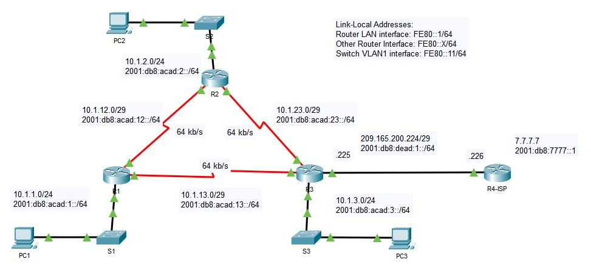

# Specialist 20210130

В курсе рассмотрены основы OSPF для одной области. Протоколы динамической маршрутизации делятся:
- IGP [interior gateway protocols]
- EGP [exterior gateway protocols] - для маршрутизации между провайдерами. Между теми, кто имеет свои AS

| IGP              | |                              |     EGP | 
|------------------|-------------|------------------|-------- |
| Distance Vector  |             | Link-State (SPF)	| BGP v4  |
| RIPv1, RIP v2    |             |OSPFv1, OSPFv2	| MP-BGP  |
| RIPng (для IPv6) |             | IS-IS            |         |
|                  | IGRP, EIGRP |               	|         |
|                  | IGRPv6    ) |OSPFv1 (IPv6)  	|         |


DV
- "+" 
   - не ресурсоемки
   - на них легко учиться принципам маршрутизации
- "-"
   - рассказывают соседях только на основании информации о соседях
   - склонны к петлям (все ссылаются друг на друга) => есть костыли, которые нивелируют это

LS
- "-"
   - ресурсоемкие

Если сеть огромная, то протокол IS-IS
Если сеть - на Cisco - EIGRP
Если сеть мелкая или не на Cisco - OSPF


OSPF - время сходимости меньше чем у RIP, хорошо маштабируется (если OSPF изначально грамотно спланирован). Требует тщательного планирования перед внедрением. Использует понятие AREA для маштрабирования:
- маленькие сети -одна AREA
- большие сети - несколько AREA с нулевой AREA

Для работы OSPF использует набор определенных пакетов:
- Hello (снюхиваются и признают дргу-друга соседями, или нет). 1р/10 сек - hello-timer
- DBD [database description] - обмен ведется небольшими кусками информации о сети. DBD - просто перечисление того, что у меня есть. Дальнейший обмен идет при помощи LSA. 
- LSR - запрос по поводу какого-то кусочка 
- LSU - ответ на LSR
- LSAck - поблагодарим за LSU


Информация OSPF хранится в 3 таблицах:


OSPF - использует протокол Dijkstra:
LSDB - алгоритм SPF - граф сети
каждый R высчитывает все сам.

Работа OSPF - 5 этапов:


LSDB - на всех R совпадает, но чтобы на каждый чих не запускать пересчет сети, бьем пространство сети на области:


R на границе - ABR. R2 анализирует информацию об изменениях в свой AREA и отправляет в соседнюю AREA только обработанную информацию. Все AREA подключаются только через AREA0 (цветок справа)


Рекомендуют начинать строить сетку с AREA 0, К между ФКУФ1;

OSPFv3 - для ipv6, в нем много чего изменилось. OSPFv3 with AF - внедрили поддержку IPv4.

Этапы OSPF


- Down (ничего не происходит)
- INIT (отправляем Hello: RID; список соседей)
- Two-WAY (когда R1 увидел себя в пакете от R2). Если обнюхались и параметры сошлись - начинается обмен


Дальше:


- ExStart State - определение по RID master/slave (со всеми участниками обмена)
- Exchange - обмениваемся информацией, выясняем вкратце что устарело
- Loading state (LSA/LSR/LSU, SPF)
- Full State (появлются маршруты в routing table)

Finit State Machine (FSM) - агрегат с конечным состоянием, математический термин

OSPFv2 - MC 224.0.0.5, 224.0.0.6
RID - 32-bit число, похож на ip, но к ip не имеет никакого отношения:
   - Manual (0.0.0.1, или 1.1.1.1 и т.п.)
   - Loopback
   - Максимальный IP с остальных IF (если IF - down, то никакого ip не возьмется)


Число соседей - впечатляет, когда роутеров уже становится больше пяти-десяти, каждая связь отнимает ресурсы и в итоге вличяет на работоспособность. 

таким образом появляется необходимость выбора центрального соседа (DR), страхующим является (BDR). Те, кто не DR/BDR - DROther. DROther в состоянии Two-way, между ними не будет обмена


таким образом соседских отношений станет 7, а при синхронизации количество связей еще уменьшится (картинка справа)


DR/BDR выбирается автоматически, и в большинстве случаев это значение не имеет, так как роли будут переползать автоматически, чтобы избежать пересинхронизации (как с наследованием престола король/принц и т.д.)

Роль DR/BDR - для каждого конкретного IF, R - может быть на одном IF - DR, на другом IF - BDR, на стетьем - DROther

на IF ставим приоритет 0, если не хотим чтобы он стал DR/BDR

___Лаба___



провайдер может использовать несколько OSPF процессов, например для каждого клиента


# NETACAD

# OSPFv2 Concepts
 Open Shortest Path First (OSPF) - может быть single Area, Multi area. OSPFv2 - Ipv4, OSPFv3 - Ipv6. В данном курсе изучаем  OSPFv2
 OSPF - link-state протокол маршрутизации, в отличии от дастанционно-векторного RIP/ Метрика RIP, ___hop count___ - проблематичная и не подходит для больших сетей с участками работающими на разных скоростях. OSPF - более быстро сходится и лучше работает в таких условиях. 
 
 Концепция ___area___ - разделение областей, которые необходимо разделить по каким-либо признакам для локализации трафика, что приведет к уменьшению количества и объема информации о маршрутах, которыми роутеры обмениваются между собой. ___Link___ - интерфейс роутера, также сетевой сегмент между 2 роутерами или участок между stub area и роутером. Информация о линке-  link-state, включает в себя ___network prefix___, ___prefix length___, ___cost___.

 Роутеры обмениваются информацией, которую затем используют для построения структур данных (3 OSPF базы), которые затем используется в алгоритмах маршрутизации
 ___Сообщения обмена___:
- Hello packet
- Database description packet (DBD)
- Link-state request packet (LSR)
- Link-state update packet (LSU)
- Link-state acknowledgment packet (LSA)

___OSPF databases (Структуры данных)___:
- Adjacency database - создает neighbor table.
- Link-state database (LSDB) - создает topology table с состояниями линков.
- Forwarding database - Создает the routing table.

| Database |	Table |	Description |
|:--------:|:--------:|-------------|
| Adjacency Database | Neighbor Table | Список neighbor routers (соседей) с которыми есть двунаправленное взаимодействие. Таблица уникальна, у каждого роутера - своя. просмотр командой ```show ip ospf neighbor```.
| Link-state Database |	Topology Table | Список всех роутеров в сети. Некоторое отображение/представление сетевой топологии. У всех роутеров в одной AREA - одинаковый ___LSDB___. Просмотр командой ```show ip ospf database```. | 
| Forwarding Database | Routing Table | Список маршрутов, просчитанных по определенному алгоритому на основе данных из ___link-state database___. Routing table каждого роутера - уникальна, содержит информацию как и куда отправлять пакет до других роутеров. Просмотр уже известной командой ```show ip route```. |

___Алгоритм___: Используется алгоритм Дейкстра (Dijkstra) shortest-path first (SPF), в котором из суммарной стоимости всех линков складывается стоимость маршрута от роутера до DST. SPF алгоритм работает на каждом роутере. Считает корнем дерева - сам роутера, пути до различных подсетей - рассчитывается и кладутся в Forwarding database, из которой в последствии лучшие пути берутся и помещаются в таблицу маршрутизации.

### 1.1.3 Link-State Operation

OSPF на роутерах обсчитывает link-state маршруты, чтобы достигнуть "нирваны" - сходимости. Каждый линк обладает ___cost___, на основании каоторой рассчитывается лучший маршрут. Шаги, которые выполняют роутеры:
- Establish Neighbor Adjacencies (установление соседства): каждый роутер узнаёт что происходит вокруг: и отправляет HELLO-пакеты через IF, на которых включен OSPF, а также ждет что и ему прилетит HELLO от соседа по включенному OSPF-порту. Это делается для установления соседства


- Exchange Link-State Advertisements (рассылка состояния линков): делаем после установления соседства. Рассылаем через OSPF-интерф ___LSA (state&cost)___ о всех directly подключенных линках (LSA-флуд по соседям). Зафлуженные соседи флудят полученными LSA в свою очередь своих directly-connected  соседей, пока у каждого не будет всех LSA


- Build the Link State Database (построение БД линков): ниже видно, что роутер строит LSDB (topo database), на основе пришедших LSA. LSDB отражает картину всей топологии.


- Execute the SPF Algorithm (выполнение алгоритма SPF): делаем это для построения SPF-дерева


- Choose the Best Route (выбор лучшего маршрута): после построения SPF становится очевидным какие маршруты являются лучшими и из них строится таблица маршрутизации, куда попадают маршруты с минимальными AD.


### 1.1.4 Single-Area and Multiarea OSPF
Иерархической разделение OSPF на AREA необходимо для лучшего масштабирования, скорости сходимости, уменьшения LSDB-таблицы, уменьшения размера таблиц маршрутизации, уменьшения загрузки CPU, уменьшения количество неполезного (инженерного) трафика и т.д. ___AREA___ - роутеры, у которых одинаковая LSDB. Т.О. есть 2 вида OSPF:
- Single-AREA (все R - в одной AREA)
- Multiarea - несколько AREA, подключенных к нулевой (0), backbone area. Роутеры на границе с 0 AREA - ___Area Border Route (ABR)___


### 1.1.5 Multiarea OSPF
Мужду Area происходит перекладывание пакетов - маршрутизация (interarea routing), хотя и внутри AREA также происходит много событий (например постоянный пересчет ДЫВИ на основании новых LSA). Роутер, получив LSA должен (хотя не все однозначно) немедленно запустить SPF - пересчет топологии, но так как это процесс энергозатратный, роутер до последнего откладывает его. Роутеры в других AREA - не получают оповещения об изменении топологии, только переписывают routing table. В схеме представленной ниже, например, изменения в AREA51 приведет к колбасне внутри AREA, рассылке новых LSA, перестроению LSDB, пересчету SPF и правке таблиц таблиц маршрутизации на роутерах AREA51. При этом При этом, ABR - R2, предотвращает LSA флудинг, и отправляет только некоторое количество LSA из AREA51 в AREA0. На основании этого небольшого количества LSA, роутеры дригих AREA только  обновляют свои LSDB и таблицы маршрутизации.


### 1.1.6 OSPFv3
Это алгоритм для работы с Ipv6 (в нем ip-адрес представлен парой prefix-length). Тут аналогичные процедуры распространения маршрутов по AREA (только адреса другого формата), аналогично строится LSDB. Кроме этого, OSPFv3 поддерживает как Ipv6, так и IPv4. При этом, OSPF v3 будет крутиться в башке роутера отдельным процессом и у каждого процесса будет своя таблица соседей, LSDB, таблица маршрутизации.


Ахтунг-вопрос


## OSPF - пакеты


- ___1___ Hello - для установки соседства и слежки за соседом, на случай если он отвалится
- ___2___ DBD [database description], необходимы для синхронизации LSDB - базы данных между роутерами (записи таблицы link-state). LSDB - должна быть одинаковой на всех R в AREA.
- ___3___ LSR (link-staqte request) - на случай если понадобятся уточнения относительно содержимого DBD - пакетов
- ___4___ LSU (link-state update) - ответ на LSR, либо анонсирование доп. данных по LSR, либо информации, которая была запрошена в LSR. LSU может содержать 11 типов LSA (см. картинку выше).
- ___5___ LSAck (link-state Acknowledgement) - Ack на все типы OSPF-пакетов, за исключением HELLO и самих Ack

На CCNA не рассказывается про все 11 типов LSU, только 1-2-3-4-5:

При начале обмена, в ход идут ___Type2/LSDB___-пакеты, затем, если что-то не ясно, самый глупый начинает разговор ___Type3/LSR___ пакетом и получает чатицу мудрости умного в виде какой-либо ___Type4/LSU___-хи, за которую тупой каждый раз благодарит при помощи ___Type5/LSAck___. Часто такое взаимозаменяемое название пакетов (LSA=LSU) вызывает путаницу...не забываем благодарить, если стало еще непонятнее. На самом деле LSU - это и есть LSA разных типов


## OSPF Hello-пакет
необходим для обнаружения соседей и поддержания соседского состояния (keep-alive), а также участвуют в выборах DR [designated router]/BDR [backup designated router] в multiaccess - средах (ethernet). PPP не используют DR/BDR.
- HEADER-section
- HELLO-section


- Type = 1 - тип пакета: 
   - 1 - HELLO
   - 2 - DBD
   - 3 - LSR
   - 4 - LSU
   - 5 - LSAck
- PackLen
- RouterID - 32-bit значение, dotted-decimal, уникальный идентифиактор Роутера отправившего пакет
- AreaID - номер AREA, откуда взялся этот пакет
- Checksum
- AuthType
- Authentication
- Authentication

- Network Mask - маска сети, откуда взялся пакет
- Hello interval - частота (в сек) с которой R рассылает пакеты -10 сек default
- Option
- Router Priority - для выболра DR/BDR - 1 default, вручную задаем 0 - 255 (чем больше, тем лучше)
- Dead Interval - время, которое надо ждать, чтобы понять что сосед сдох (этот таймер должен быть одинаковым, иначе соседство не установится) - 4 hello-timers, т.е. если 4 раза hello не придет - будем считать что сосед сдох
- DR [designated router] - идентификатор DR.
- BDR [dackup designated router]
- List of neighbors - список всех соседей роутера

## 1.3.1 - OSPF состояния
7 типов состояний


Итак, первое с чего начинают OSPF - процессы - с  "представления" коллегам, то есть с устанавления  соседства.
- Down State - изначальное состояние процесса
- Init State - начинаем флудить и получаем ответ
- Two-state - получили ответ на наше HELLO, с обеих сторон, в мозгу начинаем Выборы DR/BDR в multiaccess - средах (Ethernet) : минимальный RID - побеждает и назначается ответственными за рассылку информации об изменениях в AREA. Выборы не совсем честные и проводятся в мозгу каждого роутера
- ExStart State состояние для PPP сетей (выясняют кто будет DR/BDR) 
- Exchange State (начало обмена DBD о содержимом LSDB, для его синхронизации: DBD - LSR - LSU - LSAck )
- Loading State (продолжаем обмен и вопросы соседям LSR - LSU - LSAck), запускаем процесс SPF, переходим в Full State.
- Full State (LSDB - засинхронена)

## 1.3.4 Синхронизация OSPF базы данных LSDB
Выполняется после перехода в Two-state. Для начала обме5на - надо выбрать кто-же будет первым отдавать свою LSDB:
- Выясняем у кого больше, я про RID, тот и отправляет DBD
- Нудный процесс синхронизации при помощи DBD, LSR, LSU, LSAck: передаем информацию о записях в LSDB:
   - типах и состоянии линков
   - адресах других рассылающих роутеров
   - стоимости линков
   - Sequence num (для анализа возраста записи)
- Отправка LSR, если что-то не понятно. После того как на все LSR будет получен ответ, OSPF на роутере переходит в состояние ___Full state___. В этом спящем состоянии OSPF ничего не отправляет, кроме как LSU 1раз/30 минут или если только что-то изменится и надо будет просыпаться и пересчитывать топологию

## 1.3.5 Need for DR
Если количество роутеров в сети больше двух, а это наши любимые Multiaccess сети - Ethernet, то обмениваться LSA между всему соседями становится затруднительно. То есть, OSPF в таких сетях должен инициировать кучу LSAs флуда:
- Создание соседских отношений - Ethernet в принципе может соединять множество OSPF роутеров. Но если они все будут между собой соседями, то ситуация будет крайне нежелательнаяпо причине большого объема LSA - пакетов, которыми должны они будут обмениваться.
- Extensive flooding of LSAs - OSPF роутеры инициируют LSAs any по любому поводу, как чайки на пляже: OSPF инициируется - LSA флуд, меняется, - опять LSA флуд.


Данное поведение хорошо описывается представленной выше формулой для расчета количества соседских отношений. При увеличении числа роутеров, ситуацию уходшается: например 20 роутеров дадут уже 190 соседств: вот такая жуть получится


Другое дело, если будут выбраны "ответственные"


___конспектировать дальше___

Ахтунг - вопрос

