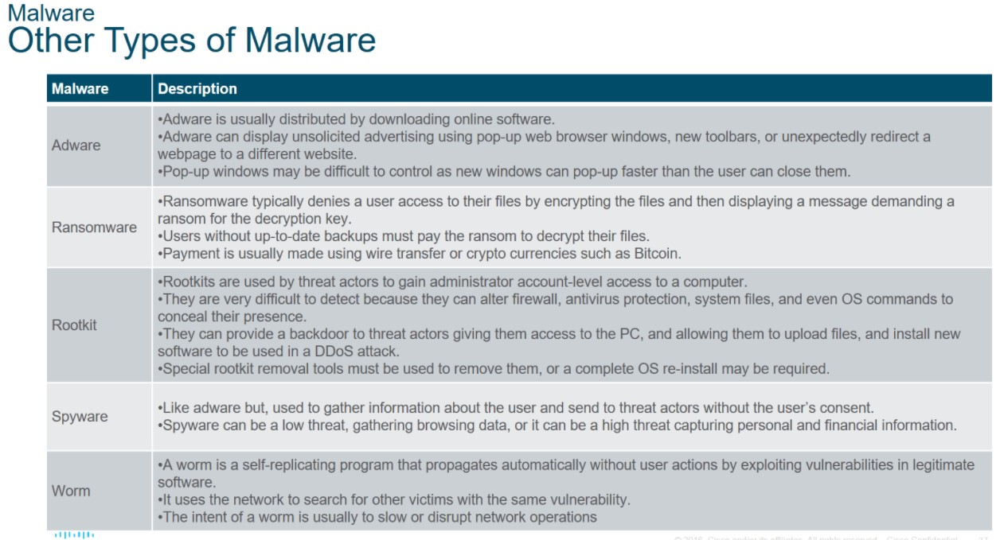
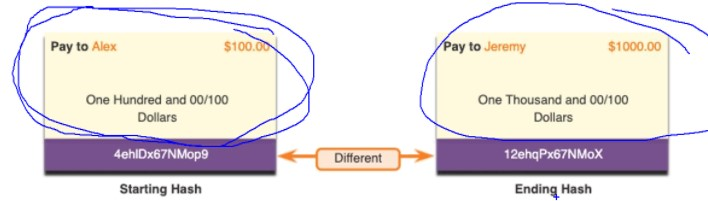
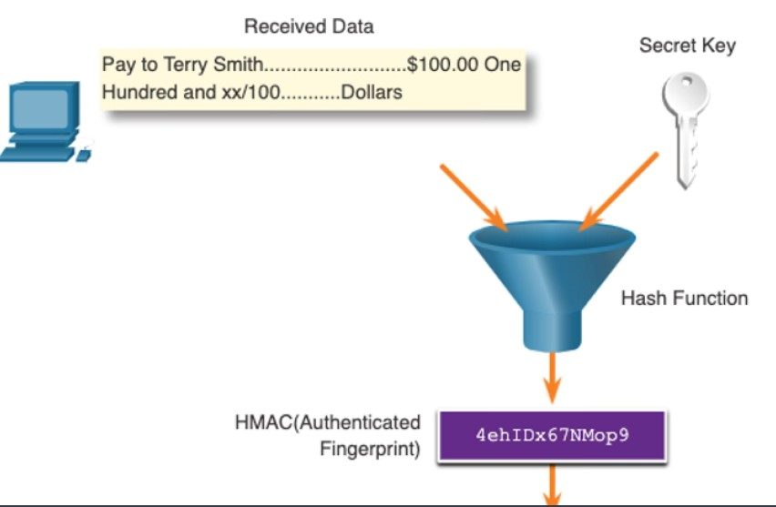
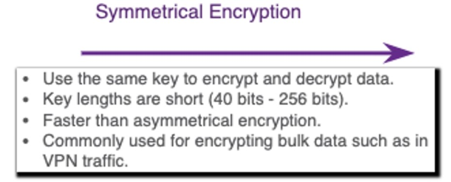
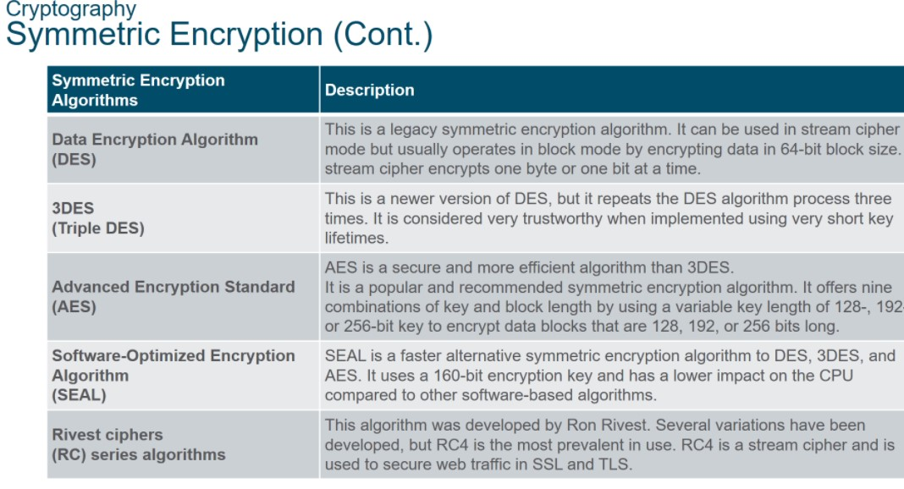
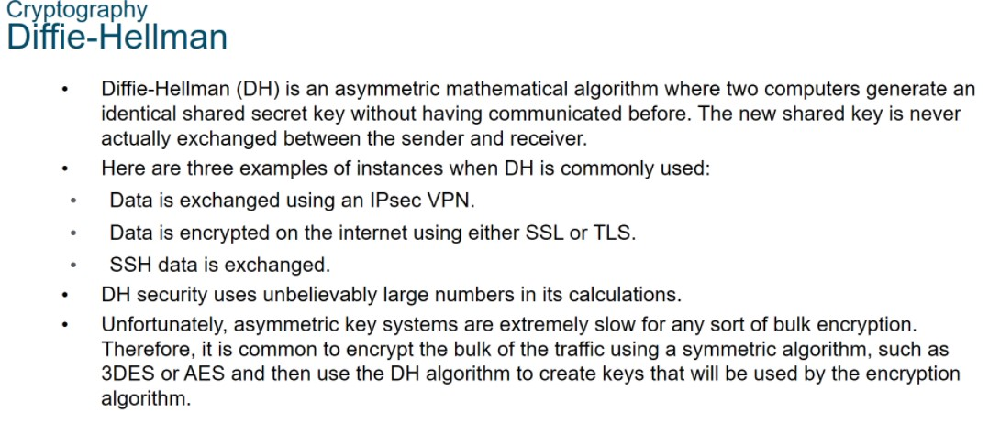
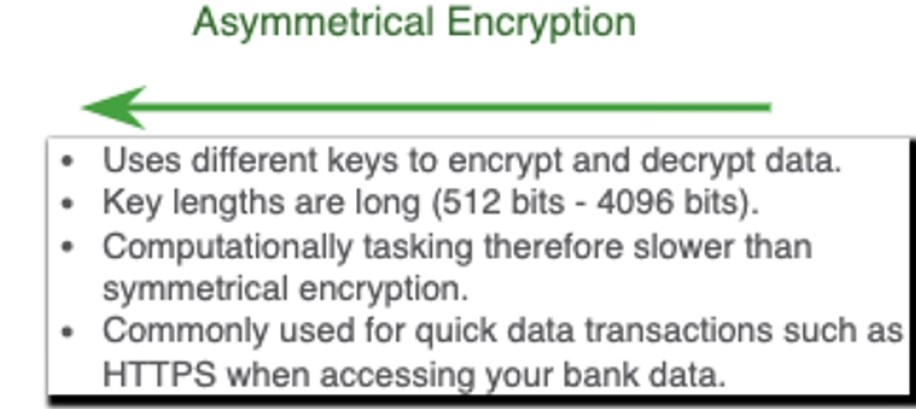

Specialist 20210206
Все лабораторки делаются в песочнице. Этичный хакинг - нельзя хакать всех без разрешения. Надо договариваться и спрашивать.
Термины безопасности:
- ASSETS - активы организации (серверы/сервисы/хосты/сотрудники)
- VULNERABILITY/Уязвимость (Вульнерабилити). Не закрыть всего, надо критически оценивать
   - неправильные настройки
   - неправильные политики
   - ошибки в ПО/ОС
- THREAT/угроза (Срит) - урон, который может быть нанесен активам организации. Есть уязвимости, от которых урон - минимален
- EXPLOIT (Эксплоит) - реализация механизма использования уязвимости. Угроза на которую нет эксплойта - считается безопасной
- MITIGATION/контр-меры (митигейшн) - замена оборудования на новое, патчи ОС и т.д. Надо оценивать работу на закрытие и риск от потерь активов, то есть экономическую целесообразность
- RISK - оценка рисков от потери активов (оценка экономической целесообразности)

Векторы атак:
- внутренние (имея физический доступ - можно навредить гораздо больше)
- внешние (FW, IPS)

Потеря данных:
самая страшная угроза, так как теряются годы наработок, клиенты и т.д. За рубежом -коллективные иски и т.п. У нас - пока тихо/пусто.
Например Cisco DLP (взаимодействие с отделом безопасности)
- оценка исходящего письма/предмодерация отправки.
- контроль печати: распознается текст на основании шаблонов и т.д

Как утекают данные
- email, соцсети
- кража данных с оборудованием
   - включение bitlocker-а
   - шифрование устройств
- Облака. За рубежом организации не разворачивают своих сервисов, все держат в облаках. Но нет гарантий что вся информация автоматически не сливается правительствам других стран и т.д. Яндекс - голландская контора. Сбер - чатсь акционеров - не граждане России
- флэшки, 
- хард/бумажные копии (шредером уничтожать)
- неправильный контроль доступа (дан доступ не в ту папку, не тем людям)

Хакеры
Термин приобрел негативный оттенок
- белые (Гэндальф/этичные хакеры) - пентестинг, договор на взлом, поиск уязвимостей
- серые - вроде не делает ничего плохого, но закон нарушает: ломает ради интереса
- черные (страшные и злые) - те кто совершает преступление за деньги

Хакеры по уровню развития
- Script Kiddies - используют общедоступные скрипты
- Vulnerability Broker - шантажисты. Но Гугл разрешает себя ломать и даже платят деньги за взлом
- Hacktivists - совершение взломов не ради наживы, а ради своих убеждений. Взломали сайт BP после аварии, выложили фото нарушений экологии
- Cyber criminals - те кто рискует ради наживы
- State-Sponsored - есть особые отделы, которые ломают организации по заказу правительства. Червяк, который ломал контроллеры центрифуг атомных предприятий в Иране.

Утилиты взлома (пароли, Wi-Fi сети и т.д.)
- Kali Linux
- дебаггеры
- утилиты шифрования
- утилиты для эксплуатации уязвимости (metasploit)

Malware
- вирусы (могут самокопировать себя в другие файлы, но по сети не уходят)
   - вирусы boot-секторов
   - вирусы прошивок
   - макро-вирусы
   - вирусы, воздействующие на ПО
   - скрипты (написанные на pyton например)
- черви (самораспространяются и копируются, в том числе по сети). Заражается огромное количество устройств.
- трояны (ПО, которое не может распространять свои копии, требует действия от пользователя для запуска)

Социальная инженерия
- Фишинг - подставной сайт с логгирование вводимых логинов/паролей
- Spear phishing - атака направлена на сотров конкретных орагнизаций (письмо официального характера: ваш п/я переполнен, чтобы очистить его нажмите на ссылку ниже. Если пройти по ссылке, входишь на сайт похожий на outlook и вводили логин/пароль)
- Whale phishing - ловля кита. Изучают хобби, интересы топ-смотрудников, стараются использовать его интересы и отправляют письма по интересующим темам
- Baiting - оставление в доступных местах зараженных флэшек
- impersonation - злоумышленники выдают себя за старых друзей, начальников и т.д. Не доверять приходящим письмам с общедоступных аккаунтов, встречаться очно
- Tailgating (хвостик) - пробегают сразу за приложившим карту
- shoulder surfing - подглядывание через плечо. Блокировать экраны, запирать ящик
- dumpster diving - поиск документов в мусорных баках. Все сетевые данные - уничтожать

Правила надо доводить до автоматизма, проводить учения и т.д.

Следующее занятие - NAT, шифрование, хэширование, VPN.

# SPECIALIST 20210213
Криптография и криптоанализ
Безопасное взаимодействие
- Целостность (данные не меняются в процессе передачи), дропаются измененные пакеты. Хэширование MD5 или SHA
- Конфиденциальность (гарантия, что перехваченные данные не могут быть расшифрованы). Алгоритмы шифрования
   - симметр
   - асимметр
- Аутентификация другой стороны (гарантия что пакеты из доверенного, а не подделанного источника). Хэш-функции HMAC (hash-based authentication code)
- data non-repudiation (неотрекаемость) - отправитель не сможет "соскочить" и сказать "это был не я" )) - актуально для цифрового банкинга, когда генычу выделяется цифровой серт, на бухов оформляют гендоверку и каждому буху в банке выделяют сертификат. Но...бухи часто меняются, поэтому геныч отдает токен и пин-код главбуху, тот в свою очередь делегирует бухам, те передают между собой. Токенов становится много, пин-коды ставят простейшими, токены забываются в ПК. ПК компрометируют, злоумышленник взломав ПК буха - подключается, создает платежку, отправляет в банк, и там как повезет. Обнаружится пропажа денег только когда кто-то зайдет в цифровой банкинг и не найдет нужной суммы, или инайдет левую платежку. Вернуть деньги - ОЧЕНЬ СЛОЖНО, если они уже ушли.

___Целостность___
Хэширование - функция/мясорубка, у которой на входе набор бит, на выходе - строка определенной длины. Обратно преобразовать нельзя (фарш не провернуть назад). Изменение даже одного бита в начальных данных - дает значительно изменение хэша. Пример - FCS кадра Ethernet
Функции
- MD5
- Sha
- Sha2
- Sha3
- ГОСТ (чисто российский)

Но хэш - можно подменить, и подделать пакет.
Поэтому применяют HMAC, который сливает входящие данные и определенный секретный ключ, получить верный хэш, не обладая ключом - нереально

Hash функции
- MD5
- SHA
   - SHA1 (очено просто)
   - SHA2 
      - Sha-224
      - SHA-225
      - SHA-256
       и т.д.
   - SHA3 - задел на будущее, когда найдут уязвимости SHA2

Конфиденциальность
алгоритмы шифрования
- симметричные: с использованием общего ключа: чем шифруем, тем и дешифруем. Длина ключа маленькая, работаеют быстро (на скорости провода/wire-speed). Длина ключа 40-256 бит. Применяют при построение VPN-туннелей. Алгоритмы:
   - DES (56 бит)
   - 3DES - 2 или 3 раза DES. Используется, но есть минус: медленно (операция с 3-мя ключами). Доверенный алгоритм, так как ломают с 77 года.
   - AES [advanced encryption standard] - работает быстрее, СЧИТАЕТСЯ надежнее, рекомендуется для использования, 128-256 бит - очень надежно. Ломают с 2001 года, поэтому некоторые не доверяют
   - SEAL [software-optimized encryption] - для обычного ПК (предыдущие алгоритмы хорошо работают на crypto-акселераторах)
   - RC
- асимметричные: используются 2 ключа - закрытый/private key и открытый/public key. Шифруем открытым, тогда расшифровываем только закрытым и наоборот. Если потеряется открытый ключ - ерунда, можно всегда нагенерить много public ключей. Терять закрытый - нельзя. Алгоритм медленнее симметричного. Асимметричный - потому что с разной скоростью выполняется операция шифрования (возведения в степень) и дешифрации (логарифмирование). Применяются при небольших объемах информации:
   - IKE [internet key exchange]
   - SSL [secure socket layer], на самом деле SSL давно уже мерт. Все уже в TLS, а SSL - просто привычное понятие и думают что это аналоги
   - SSH
   - DH не передача ключа по небезопасным каналам, а генерация с двух сторон ключа одновременно, с передачей данных синхронизации. Если злоумышленник и перехватит синхро-данные, то все равно ключ сгенерить не сможет. Русскоязычная ВИКИ хорошо описывает этот алгоритм. Но для экзамена и практики - это не нужно.

