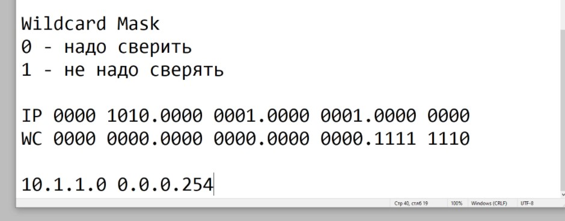
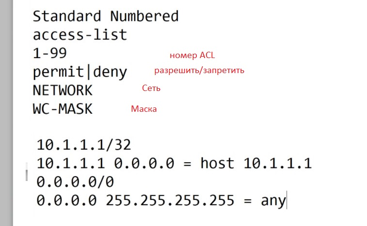
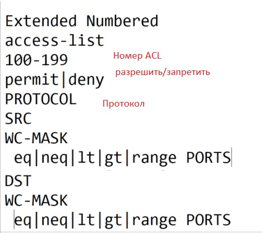
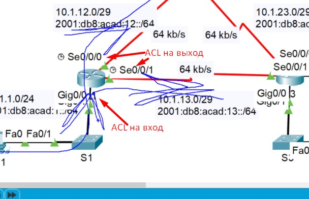
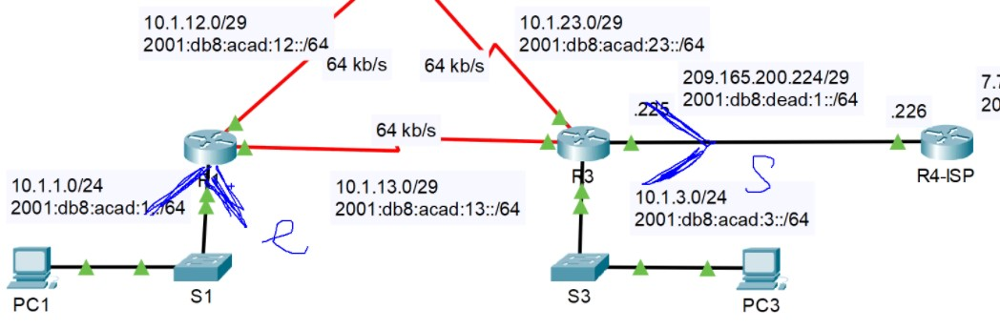
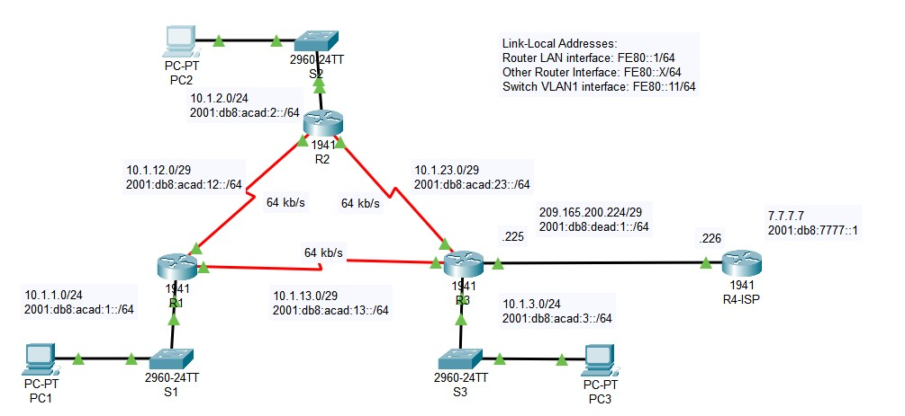
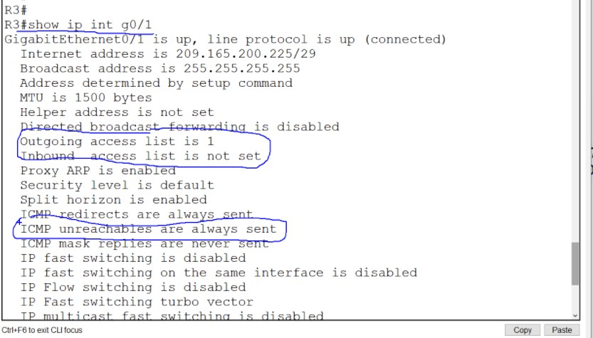
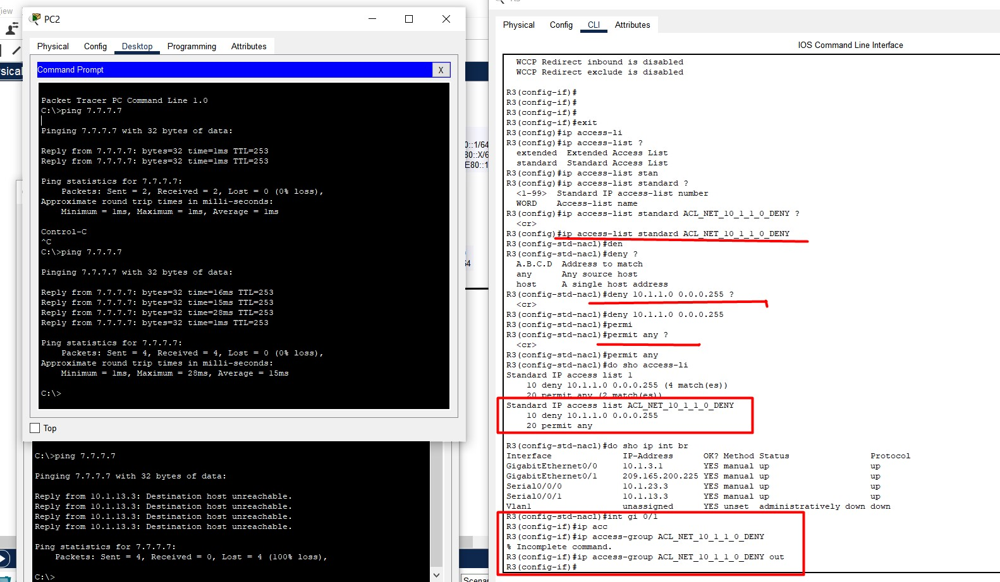

# 20210206 Основы ACL
Запрет/ограничение на доступ выполняется ACL.
Пакетный фильтр проверяет каждый пакет по ACL:
- Пакетов много, ACE много - тормоза
- не открывают обратного прохождения пакетов 
Современная технология - Statefull firewall

ACL все равно надо знать, так как Cisco реаклизует ими в том числе условия/интересующий трафик

ACL задается несколькими ACE, которые состоят из условий ```permit|deny CONDITION```. Внизу каждого списка ACL - неявный deny all => в ACL должно быть хотя бы одно разрешающее правило, иначе трафик дропнется.

ACVL делятся на:
- Standard
    - условия SRC addr
- Extended (5 условий)
    - SRC
    - DST
    - протокол сетевого ур 
    - протокол трансп ур (TCP/UDP)
    - порты
ICMP - поэтому внимательно ограничиваем (icmp echo req, echo reply). Standard ACL раньше экономили ресурсы. Теперь можно все делать EXtended ACL.

В IOS еще есть деление
- Numbered
    - 1-99 - автоматически STANDARD
    - 100-199 - автоматически EXTENDED 
- Named
    - STANDARD
    - EXTENDED

ACL применяются на IF, но:
- 1 ACL на IN
- 1 ACL на OUT
SUB, VLAN - требуют применения ACL именно к ним.

В ACL используется шаблонная маска/обратная/Wildcard. Разница в инверсировании бит. Способ хитрый и для умных: 
- если стоит 0 - надо сверять
- если стоит 1 - сверять не надо

Wildcard для выборки только четных адресов:



Стандартные ACL



Расширенные ACL



Например задача разрешить траф из 10.1.1.0/24, кроме трафика от узхла 10.1.1.101. Если писать как указано в задаче. то получится:
```
access-list 1 permit 10.1.1.0 0.0.0.255
access-list 1 deny host 10.1.1.101
```

Но будет ошибка в логике, так как любой трафик подпадет под 1-ю строчку. Чтобы избежать этого, заперщающие строки надо ставить выше
```
access-list 1 deny host 10.1.1.101
access-list 1 permit 10.1.1.0 0.0.0.255
```
лайфхак для учета неучтенного трафика: задать явно deny any, чтобы видеть число срабатываний. Если на правиле счетчик не растет, то надо задумываться об удалении этого правила.
```
access-li 1 deny any
```
В самом низу - неявный запрет. Но логика может отличаться: во фряхе может ACE перебираться до последнего совпадения.

После создания ACL - его надо повесить на оборудование (по ходу трафика). В FW все что явно не разрешено - запрещено. В FW трафик от самого маршрутизатора ACL  не подпадает. Надо контроллировать self-трафик отдельно
```
int fa0/1
 ip access-group 1 in
```
Гадать о направлении трафика не надо, надло РИСОВАТЬ



По применению ACL есть BestPract:
- Stand ACL вешают ближе к получателю, так как там анализируется SRC адрес
- Ext ACL вешают к отправителю, чтобы трафик не делал лишний путь (не напрягать маршрутизаторы, линкИ)



На SW L3 - есть ограничение на количетсов ACE, по причину ограничения ASIC. На маршрутизаторе такого предела - нет: он ограничен только ресурсами (CPU/MEM)

Лабка на настройку стандартного ACL





Назначение стндартного именованного ACL. Эффект что и от стандартного нумерованного




Почему не рассказывается о ZBPF?
