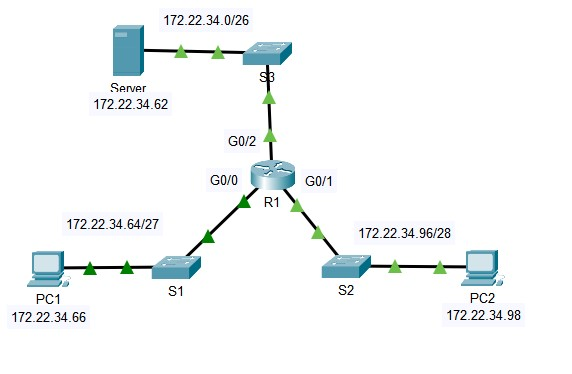

Лаборатока 5.4.12



- [pdf](labs/5.4.12-packet-tracer---configure-extended-ipv4-acls---scenario-1.pdf)
- [pka](labs/5.4.12-packet-tracer---configure-extended-ipv4-acls---scenario-1.pka)

Задачи:
- Part 1: Configure, Apply and Verify an Extended Numbered ACL
- Part 2: Configure, Apply and Verify an Extended Named ACL

Создали 2 ACL:
```
access-list 100 permit tcp 172.22.34.64 0.0.0.31 host 172.22.34.62 eq ftp
access-list 100 permit icmp 172.22.34.64 0.0.0.31 host 172.22.34.62
...
ip access-list extended HTTP_ONLY
 permit tcp 172.22.34.96 0.0.0.15 host 172.22.34.62 eq www
 permit icmp 172.22.34.96 0.0.0.15 host 172.22.34.62
```

повесили их на соответствующие IF, в ближайшем от отправителя месте ( на входе в IF Gi0/0, Gi0/1)
```
interface GigabitEthernet0/0
 ip access-group 100 in
 !
interface GigabitEthernet0/1
 ip access-group HTTP_ONLY in
 ```

  и проверили:
- трафик icmp сохранился от обоих устройств
- с PC1 - не работает http на 172.22.34.62
- c PC2 - не работает ftp на 172.22.34.62