# SPECIALIST 20210213
Диапазоны серых Ipv4 не маршрутизируются провами. Диапазонов серых IP - всего 4. Ппридумалы костыль - NAT. Это очень затратно по ресурсам (пересчет всех кадров). Маршрутизаторы ASR имеют ASIC? который авппаратно работает с большинством NAT? на старых R - все на CPU.

Но:
- не все протоколы любят NAT, например - мультимедиа (голос/видео), протокол rtp.
- не ясно, с кем конкретно мы общаемся (например ping 8.8.8.8 - вообще не ясно кто отвечает).

Термины следующие:
- Inside
   - Local (серый наш ip 192.168.10.10) - внутри, локально
   - Global (белый наш ip 209.165.200.225) - на outside IF   
- Outside (извращенские типы, когда обратное преобразование, не изучаем на курсе)
   - Local (8.8.8.8)
   - Global (8.8.8.8)

Классический NAT - преобразование
Inside Local <->Inside Global

Типы NAT:
- static (серый адрес транслируем в конкретный белый адрес, сопоставление 1:1, используется для выпуска в инет серверов)
- dynamic (серый адрес транслируем в какой-то из диапазлна белых адресов). Пока трафик идет - этот адрес никому не выдается больше. Следующему отправителю дается уже другой ip. Резервация живет не вечно, например TCP - до 24 часов, если NAT лезет глубже - по FIN может высвободить адрес и раньше, ASA - 30 секунд
- PAT (overload/masquerade(Linux/mikrotik)) - перегруженный, NAT лезет внутрь пакета и заглядывает в сегмент L4. Средний роутер умрет от нагрузке 30-40*10^3 сессий. ASR - может потянуть и 200000 сессий. Составляет таблицу соответствия (___таблица трансляций___ - может быть сброшена/очищена, очень быстро набьется заново) для SRC пакетов и для DST пакетов и когда приходит пакет от DST, ищется соответствие входящего сокета - ранее записанному в табличку исходящему сокету.

Группы парметров составляют поток, который затем можно использовать для балансировки нагрузки:
- proto
- srcip
- dstip
- src port
- dst port

Таблица трансляции также должна быть очищена при падении основного провайдера. Для ICMPv4 - нет портов, там вместо портов используется QueryID

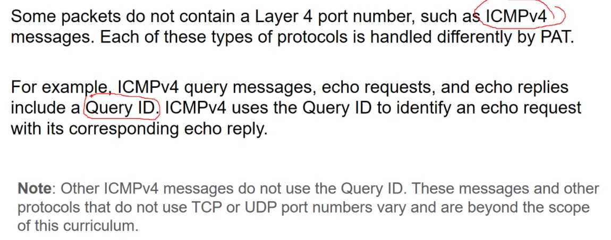

Пример static

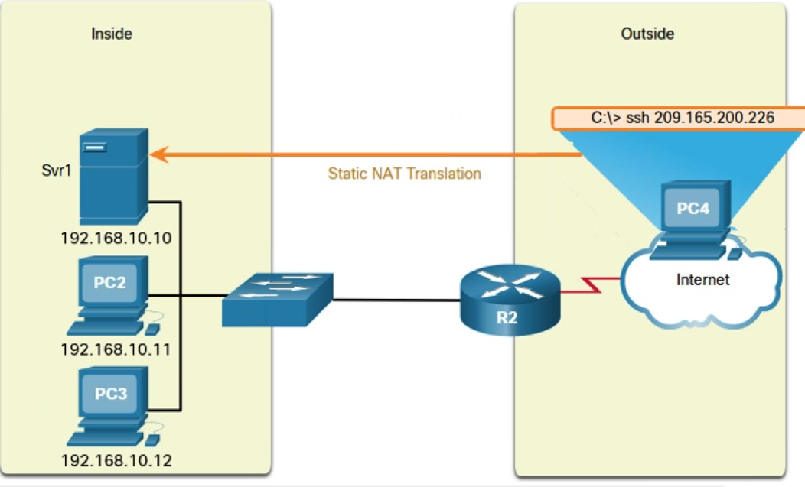

Пример PAT

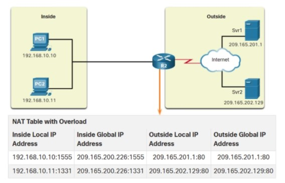

Настройка:
При включении NAT - К может подвиснуть, ждем пару минут. появляется смлужебный IF NVI0 - не трогать его
- Помечаем IF
   - ip nat inside (их может быть много, они могут быть сабами)
   - ip nat outside (если несколько провов - недостаточно пометить вш IF как outside)
   - создать запись связывающую inside и outside
      - static - записей будет много, для каждого ip
      - dynamic
         - создаем ACL интересующего трафика
         - ip nat pool... (список внешних адресов)
         - ip nat inside source list...
      - PAT
         - access-list
         - ip nat inside source list ... overload

___ Лабораторка___
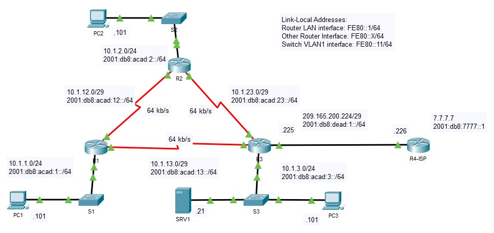

- [pkta](labs/NAT.pkt)
после привязки IF к in/out? просмотреть порты можно ```sho ip nat stat```

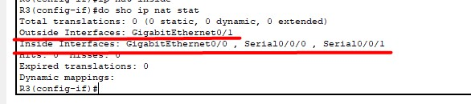

Перед настройкой - разбиваем доступные белые IPv4 по назначению

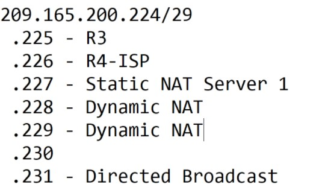

- настройка статики ```ip nat inside static <inside ip сервера> <outside addr нашей подсети>```
сколько нужно резерваций - столько и создаем строчек

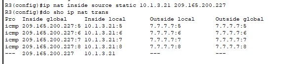

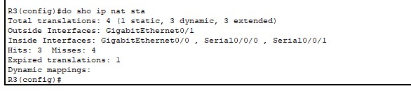

- Настройка Dynamic
   - IF все уже помечены
   - создаем ACL (как минимум суммированием)? что не попадет под ACL - не натится
   -задаем диапазон внешних IP
   - объединяем пул и ACL
```
access-list 1 permit 10.1.0.0 0.0.255.255
ip nat pool POOL1 209.165.200.228 209.165.200.229 netmask 255.255.255.248
ip nat inside source list 1 pool POOL1 
```   
Проверка
```
R3(config)#do sho ip nat statistics
Total translations: 1 (1 static, 0 dynamic, 0 extended)
Outside Interfaces: GigabitEthernet0/1
Inside Interfaces: GigabitEthernet0/0 , Serial0/0/0 , Serial0/0/1
Hits: 3  Misses: 4
Expired translations: 4
Dynamic mappings:
-- Inside Source
access-list 1 pool POOL1 refCount 0
 pool POOL1: netmask 255.255.255.248
       start 209.165.200.228 end 209.165.200.229
       type generic, total addresses 2 , allocated 0 (0%), misses 0
```

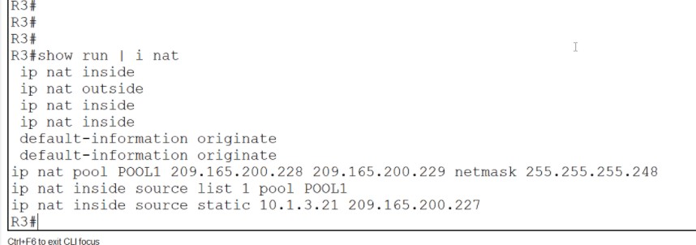

Если захотим удалить NAT, то просто так его не удалить, так как таблица постоянно будет забиваться данными новых сессий.
итак, порядок правки правила:
- гасим все IF inside
- очищаем таблицу трансляций
- удаляем запись правила ```no ip nat inside source list 1 pool POOL1```

- Настройка PAT (ключевое слово overload)
```
ip nat inside source list 1 int g0/1 overload
```
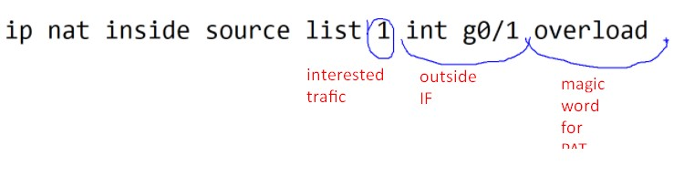

## 6.7 NAT 64
Плавный переход на IPv6. Некий костыль, который преобразует пакет Ipv6 к серверу с IPv4. Не работает без DNS64 (преобразование Ipv4 в служебные Ipv6 адреса вида 64:ff9b::192.0.2.10)

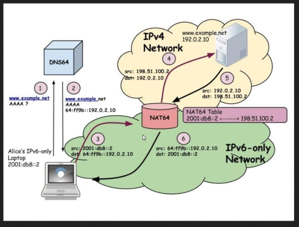

___Для проработки темы с несколькими провайдерами___
есть бесплатный вебинар Павла, искать на youtube: https://www.youtube.com/watch?v=PWLXmojKS08&feature


# NETACAD
## 6.1.1
Нат надо проработать очень плотно, но помнить, что в IPv6 - его нет.

NAT нужен чтобы частные Ipv4 выпускать в интернет, подменяя в пакетах внутренние серые SRC - внешними белыми маршрутизируемыми IP. При этом в башке маршрутизатор создает некую таблицу соответствия пар ___SRC порт/IP___ - ___DST порт/IP___. То етсь роутер, при наличии сконфигурированного NAT, создает некую дырочку, через которую выпускает трафик от SRC и в которой ждет трафик от DST. В случае если трафика долго не будет - дырочка автоматически замазывается. Если же кто-то умный и быстрый поймает нужный момент с открытой дырочкой, то теоретически он может напихать в нее кучу нужной информации, при умении подделать пакеты, подставив ожидаемый нашим NAT DST.

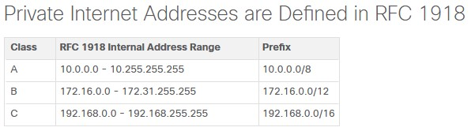


Это тоже NAT

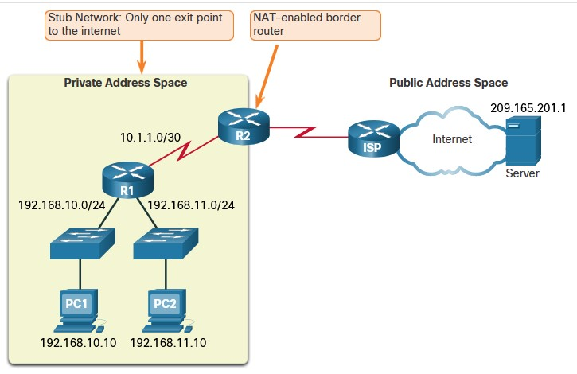

## 6.1.4 Терминология
- Inside local address - серый ip внутри
- Inside global address - наш белый и пушистый ip, outside IF, в пакете перебитом NAT
- Outside local address - DST, куда ломится наш серый друг
- Outside global address - DST, который уже переделан NAT

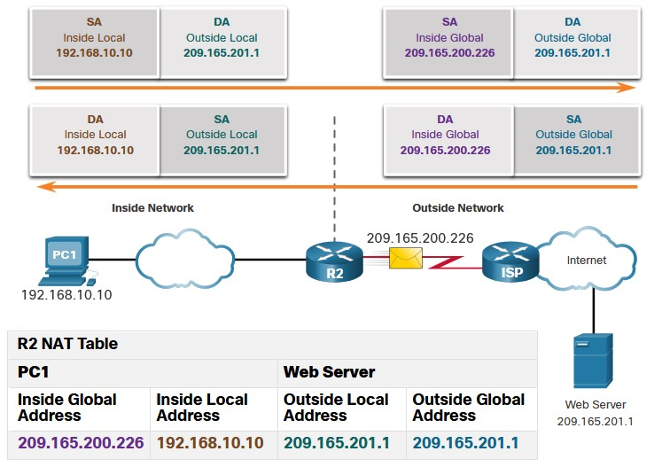
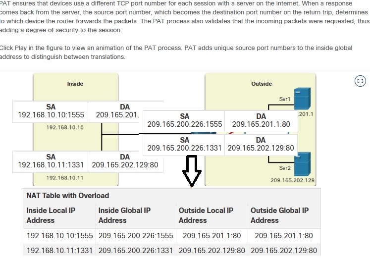


## 6.2.1 Типы NAT
- STATIC
- DYNAMIC
- PAT

## 6.4.2 Configure Static NAT
```
ip nat inside source static 192.168.10.254 209.165.201.5

R2(config)# interface serial 0/1/0
R2(config-if)# ip address 192.168.1.2 255.255.255.252
R2(config-if)# ip nat inside
R2(config-if)# exit
R2(config)# interface serial 0/1/1
R2(config-if)# ip address 209.165.200.1 255.255.255.252
R2(config-if)# ip nat outside
```

Проверка

```
R2# show ip nat translations
Pro  Inside global       Inside local       Outside local     Outside global
---  209.165.201.5       192.168.10.254     ---               ---
Total number of translations: 1

...

R2# show ip nat statistics
Total active translations: 1 (1 static, 0 dynamic; 0 extended)
Outside interfaces:
  Serial0/1/1
Inside interfaces:
  Serial0/1/0
Hits: 0  Misses: 0
(output omitted)
```

