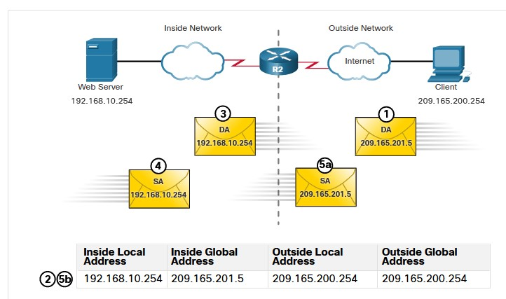
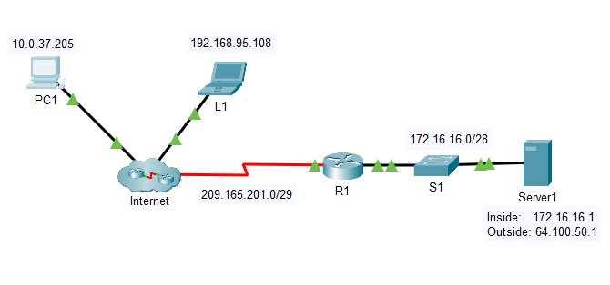
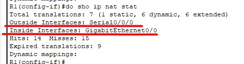
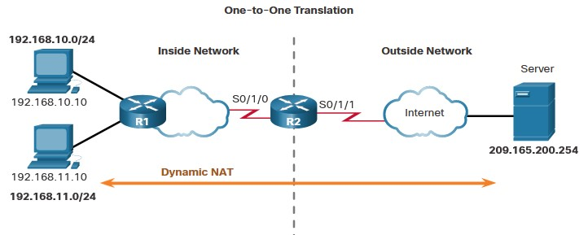
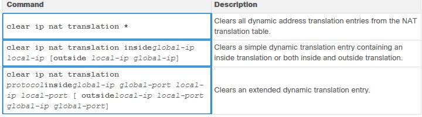
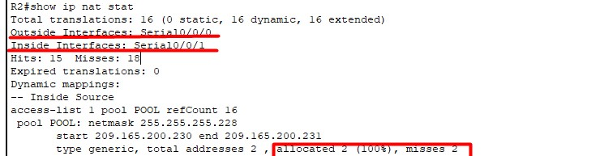
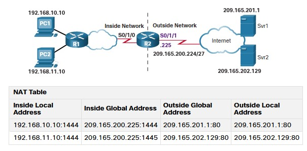
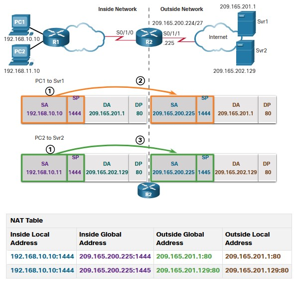
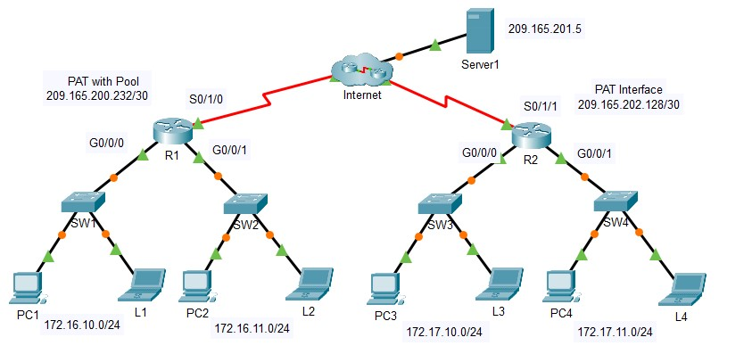

# SPECIALIST 20210213
Диапазоны серых Ipv4 не маршрутизируются провами. Диапазонов серых IP - всего 4. Ппридумалы костыль - NAT. Это очень затратно по ресурсам (пересчет всех кадров). Маршрутизаторы ASR имеют ASIC? который авппаратно работает с большинством NAT? на старых R - все на CPU.

Но:
- не все протоколы любят NAT, например - мультимедиа (голос/видео), протокол rtp.
- не ясно, с кем конкретно мы общаемся (например ping 8.8.8.8 - вообще не ясно кто отвечает).

Термины следующие:
- Inside
   - Local (серый наш ip 192.168.10.10) - внутри, локально
   - Global (белый наш ip 209.165.200.225) - на outside IF   
- Outside (извращенские типы, когда обратное преобразование, не изучаем на курсе)
   - Local (8.8.8.8)
   - Global (8.8.8.8)

Классический NAT - преобразование
Inside Local <->Inside Global

Типы NAT:
- static (серый адрес транслируем в конкретный белый адрес, сопоставление 1:1, используется для выпуска в инет серверов)
- dynamic (серый адрес транслируем в какой-то из диапазлна белых адресов). Пока трафик идет - этот адрес никому не выдается больше. Следующему отправителю дается уже другой ip. Резервация живет не вечно, например TCP - до 24 часов, если NAT лезет глубже - по FIN может высвободить адрес и раньше, ASA - 30 секунд
- PAT (overload/masquerade(Linux/mikrotik)) - перегруженный, NAT лезет внутрь пакета и заглядывает в сегмент L4. Средний роутер умрет от нагрузке 30-40*10^3 сессий. ASR - может потянуть и 200000 сессий. Составляет таблицу соответствия (___таблица трансляций___ - может быть сброшена/очищена, очень быстро набьется заново) для SRC пакетов и для DST пакетов и когда приходит пакет от DST, ищется соответствие входящего сокета - ранее записанному в табличку исходящему сокету.

Группы парметров составляют поток, который затем можно использовать для балансировки нагрузки:
- proto
- srcip
- dstip
- src port
- dst port

Таблица трансляции также должна быть очищена при падении основного провайдера. Для ICMPv4 - нет портов, там вместо портов используется QueryID


Пример static


Пример PAT


Настройка:
При включении NAT - К может подвиснуть, ждем пару минут. появляется смлужебный IF NVI0 - не трогать его
- Помечаем IF
   - ip nat inside (их может быть много, они могут быть сабами)
   - ip nat outside (если несколько провов - недостаточно пометить вш IF как outside)
   - создать запись связывающую inside и outside
      - static - записей будет много, для каждого ip
      - dynamic
         - создаем ACL интересующего трафика
         - ip nat pool... (список внешних адресов)
         - ip nat inside source list...
      - PAT
         - access-list
         - ip nat inside source list ... overload

___ Лабораторка___


- [pkta](labs/NAT.pkt)
после привязки IF к in/out? просмотреть порты можно ```sho ip nat stat```


Перед настройкой - разбиваем доступные белые IPv4 по назначению


- настройка статики ```ip nat inside static <inside ip сервера> <outside addr нашей подсети>```
сколько нужно резерваций - столько и создаем строчек


- Настройка Dynamic
   - IF все уже помечены
   - создаем ACL (как минимум суммированием)? что не попадет под ACL - не натится
   -задаем диапазон внешних IP
   - объединяем пул и ACL
```
access-list 1 permit 10.1.0.0 0.0.255.255
ip nat pool POOL1 209.165.200.228 209.165.200.229 netmask 255.255.255.248
ip nat inside source list 1 pool POOL1 
```   
Проверка
```
R3(config)#do sho ip nat statistics
Total translations: 1 (1 static, 0 dynamic, 0 extended)
Outside Interfaces: GigabitEthernet0/1
Inside Interfaces: GigabitEthernet0/0 , Serial0/0/0 , Serial0/0/1
Hits: 3  Misses: 4
Expired translations: 4
Dynamic mappings:
-- Inside Source
access-list 1 pool POOL1 refCount 0
 pool POOL1: netmask 255.255.255.248
       start 209.165.200.228 end 209.165.200.229
       type generic, total addresses 2 , allocated 0 (0%), misses 0
```


Если захотим удалить NAT, то просто так его не удалить, так как таблица постоянно будет забиваться данными новых сессий.
итак, порядок правки правила:
- гасим все IF inside
- очищаем таблицу трансляций
- удаляем запись правила ```no ip nat inside source list 1 pool POOL1```

- Настройка PAT (ключевое слово overload)
```
ip nat inside source list 1 int g0/1 overload
```


## 6.7 NAT 64
Плавный переход на IPv6. Некий костыль, который преобразует пакет Ipv6 к серверу с IPv4. Не работает без DNS64 (преобразование Ipv4 в служебные Ipv6 адреса вида 64:ff9b::192.0.2.10)


___Для проработки темы с несколькими провайдерами___
есть бесплатный вебинар Павла, искать на youtube: https://www.youtube.com/watch?v=PWLXmojKS08&feature


# NETACAD
## 6.1.1
Нат надо проработать очень плотно, но помнить, что в IPv6 - его нет.

NAT нужен чтобы частные Ipv4 выпускать в интернет, подменяя в пакетах внутренние серые SRC - внешними белыми маршрутизируемыми IP. При этом в башке маршрутизатор создает некую таблицу соответствия пар ___SRC порт/IP___ - ___DST порт/IP___. То етсь роутер, при наличии сконфигурированного NAT, создает некую дырочку, через которую выпускает трафик от SRC и в которой ждет трафик от DST. В случае если трафика долго не будет - дырочка автоматически замазывается. Если же кто-то умный и быстрый поймает нужный момент с открытой дырочкой, то теоретически он может напихать в нее кучу нужной информации, при умении подделать пакеты, подставив ожидаемый нашим NAT DST.


Это тоже NAT


## 6.1.4 Терминология
- Inside local address - серый ip внутри
- Inside global address - наш белый и пушистый ip, outside IF, в пакете перебитом NAT
- Outside local address - DST, куда ломится наш серый друг
- Outside global address - DST, который уже переделан NAT


## 6.2.1 Типы NAT
- STATIC
- DYNAMIC
- PAT

## 6.4.2 Configure Static NAT
```
ip nat inside source static 192.168.10.254 209.165.201.5

R2(config)# interface serial 0/1/0
R2(config-if)# ip address 192.168.1.2 255.255.255.252
R2(config-if)# ip nat inside
R2(config-if)# exit
R2(config)# interface serial 0/1/1
R2(config-if)# ip address 209.165.200.1 255.255.255.252
R2(config-if)# ip nat outside
```

Проверка

```
R2# show ip nat translations
Pro  Inside global       Inside local       Outside local     Outside global
---  209.165.201.5       192.168.10.254     ---               ---
Total number of translations: 1

...

R2# show ip nat statistics
Total active translations: 1 (1 static, 0 dynamic; 0 extended)
Outside interfaces:
  Serial0/1/1
Inside interfaces:
  Serial0/1/0
Hits: 0  Misses: 0
(output omitted)
```

## 6.4.3 Analyze Static NAT (проанализируй это)


Итак, что же это тут делается...
1. Клиент отправляет запрос на сервер 209.165.201.5 На самом деле место назначения где-то в ЦОД слева, а запрос у нас отправляется тупо на какой-то внешний ip, который будет IG адресом для процесса NAT
2. Получив такой пакет, NAT на R2 лезет в свою таблицу и смотрит есть ли в ней что-то подобное. И, о ужас, находит запись о соответствии этого адреса внутреннему IP 192.168.10.254... Придется работать
3. R2 начинает судорожно перебивает во входящих пакетах IG ip на внутренние IL ip и перекладывуать эти пакеты в локалку
4. Web Server в принципе пофиг кому отвечать, а пакеты он получает от 209.165.200.254, поэтому он просто отвечает, подставляе свой 192.168.10.254 как SRC ip
5. R2, получив пакет на INSIDE интерфейс от 192.168.10.254:
   - проверяет строчки в таблице NAT трансляции, на предмет совпадения с IL адресом
   - переделывает выходящие пакеты, подставляя IG адреса вместо IL
   - выплевывает пакеты в OUTSIDE IF


___Лабка 6.4.5___


- [pdf](labs/6.4.5-packet-tracer---configure-static-nat.pdf)
- [pka](6.4.5-packet-tracer---configure-static-nat.pka)

Задачи:
- Part 1: Test Access without NAT
- Part 2: Configure Static NAT
- Part 3: Test Access with NAT

Решение:
Да, без NAT - ничего не работает
сконфигурировал следующим образом, не обращая внимания ни на какие особо тонкости (ибо официально другого на этом курсе не дают):
```
R1(config)#ip nat inside source static 172.16.16.1 64.100.50.1
R1(config)#int gi 0/0
R1(config-if)#ip nat inside 
R1(config-if)#int s0/0/0
R1(config-if)#ip nat outside 
```

После того как ping пошел, проверил таблицу трансляции:
```
R1(config-if)#do show ip nat trans
Pro  Inside global     Inside local       Outside local      Outside global
icmp 64.100.50.1:11    172.16.16.1:11     209.165.201.1:11   209.165.201.1:11
icmp 64.100.50.1:12    172.16.16.1:12     209.165.201.1:12   209.165.201.1:12
icmp 64.100.50.1:13    172.16.16.1:13     209.165.201.1:13   209.165.201.1:13
icmp 64.100.50.1:14    172.16.16.1:14     209.165.201.1:14   209.165.201.1:14
icmp 64.100.50.1:15    172.16.16.1:15     209.165.201.1:15   209.165.201.1:15
icmp 64.100.50.1:16    172.16.16.1:16     209.165.201.1:16   209.165.201.1:16
icmp 64.100.50.1:6     172.16.16.1:6      209.165.201.1:6    209.165.201.1:6
icmp 64.100.50.1:7     172.16.16.1:7      209.165.201.1:7    209.165.201.1:7
---  64.100.50.1       172.16.16.1        ---                ---
```


 100%

## 6.5.1 Dynamic NAT Scenario
Статического NAT редко когда хватает, поэтому сразу будем рассматривать динамический NAT. Он получается тогда, когда есть несколько белых ip и им надо сопоставлять внутренние ip (по крайней мере бизнес просчитал именно такое развитие событий). 

Да, CISCO может сделать и это, задав вместо статической привязки - привязку к такому понятию, как pool ip-адресов (pool IG address)



Конечно, при таком подходе, осчастливлены будут не многие из внутренней  подсети, но спасибо и на этом:
1. Задаем pool: ```ip nat pool NAT-POOL1 209.165.200.226 209.165.200.240 netmask 255.255.255.224```
2. Задаем "интересный" трафик ```access-list 1 permit 192.168.0.0 0.0.255.255``` тут фантазия может разыграться и задать можно не один ACE, соответственно при анализе будут просматриваться указанные пункты и искаться соответствие. Если соответствия найдено будет - NAT-иться трафик не будет, а будет попытка выплюнуть его таким, какой он есть ))
3. Задаем NAT ```ip nat inside source list 1 pool NAT-POOL1```
4. Вешаем на IF inside/outside
```
R2(config)# interface serial 0/1/0
R2(config-if)# ip nat inside
R2(config)# interface serial 0/1/1
R2(config-if)# ip nat outside
```
В результате трафик пойдет так, то есть IG будет не 1, а несколько, причем тот, кто первым обратился - тот и получил первым адрес из pool:


Проверка:
```
show running-config | include NAT
...
R2# show ip nat translations
Pro Inside global      Inside local       Outside local      Outside global
--- 209.165.200.228    192.168.10.10      ---                ---
--- 209.165.200.229    192.168.11.10      ---                ---
...
R2# show ip nat translation verbose
Pro Inside global      Inside local       Outside local      Outside global
tcp 209.165.200.228    192.168.10.10      ---                ---
    create 00:02:11, use 00:02:11 timeout:86400000, left 23:57:48, Map-Id(In): 1, 
    flags: 
none, use_count: 0, entry-id: 10, lc_entries: 0
tcp 209.165.200.229    192.168.11.10      ---                ---
    create 00:02:10, use 00:02:10 timeout:86400000, left 23:57:49, Map-Id(In): 1, 
    flags: 
none, use_count: 0, entry-id: 12, lc_entries: 0
```
Работы с таблицей NAT: ее можно чистить как целиком, так и по конкретным адресам/протоколам


___Лабка 6.5.6___


- [pdf](labs/6.5.6-packet-tracer---configure-dynamic-nat.pdf)
- [pka](labs/6.5.6-packet-tracer---configure-dynamic-nat.pka)

Задачи:
- Part 1: Configure Dynamic NAT
- Part 2: Verify NAT Implementation

Решение:
Настроил динамический NAT
```
access-li 1 permit 172.16.0.0 0.0.0.255
ip nat pool NAT 209.165.200.230 209.165.200.231 netmask 255.255.255.252 - не ошибиться
int s0/0/0
ip nat out
int s0/0/1
ip nat in
exit
ip nat inside sorce list 1 pool POOL
```

При проверке пинги идут. Таблица NAT принимает следующий вид, где хорошо видно какие IL соответствуют каким IG:
```
R2#show ip nat tran
Pro  Inside global     Inside local       Outside local      Outside global
icmp 209.165.200.230:1 172.16.10.2:1      209.165.201.5:1    209.165.201.5:1
icmp 209.165.200.230:2 172.16.10.2:2      209.165.201.5:2    209.165.201.5:2
icmp 209.165.200.230:3 172.16.10.2:3      209.165.201.5:3    209.165.201.5:3
icmp 209.165.200.230:4 172.16.10.2:4      209.165.201.5:4    209.165.201.5:4
icmp 209.165.200.230:5 172.16.10.2:5      209.165.201.5:5    209.165.201.5:5
icmp 209.165.200.230:6 172.16.10.2:6      209.165.201.5:6    209.165.201.5:6
icmp 209.165.200.230:7 172.16.10.2:7      209.165.201.5:7    209.165.201.5:7
icmp 209.165.200.230:8 172.16.10.2:8      209.165.201.5:8    209.165.201.5:8
icmp 209.165.200.231:1 172.16.10.1:1      209.165.201.5:1    209.165.201.5:1
icmp 209.165.200.231:2 172.16.10.1:2      209.165.201.5:2    209.165.201.5:2
icmp 209.165.200.231:3 172.16.10.1:3      209.165.201.5:3    209.165.201.5:3
icmp 209.165.200.231:4 172.16.10.1:4      209.165.201.5:4    209.165.201.5:4
icmp 209.165.200.231:5 172.16.10.1:5      209.165.201.5:5    209.165.201.5:5
icmp 209.165.200.231:6 172.16.10.1:6      209.165.201.5:6    209.165.201.5:6
icmp 209.165.200.231:7 172.16.10.1:7      209.165.201.5:7    209.165.201.5:7
icmp 209.165.200.231:8 172.16.10.1:8      209.165.201.5:8    209.165.201.5:8

```
При этом видно в строчке после Inside IF сколько пакетов не было доставлено NAT? по причине того, что все IG были израсходованы.



## 6.6.1 PAT
Это то, ради чего собственно все и задумывалось: выпустить в инет из серых подсетей кучу народа через 1 Ipv4.



Конфигурится опять все просто
```
R2(config)# ip nat inside source list 1 interface serial 0/1/0 overload
R2(config)# access-list 1 permit 192.168.0.0 0.0.255.255
R2(config)# interface serial0/1/0
R2(config-if)# ip nat inside
R2(config-if)# exit
R2(config)# interface Serial0/1/1
R2(config-if)# ip nat outside
```

Можно также сконфигурировать PAT не через один выходящий ip, а через пул адресов, создав и использовав, как и ранее, пул выделенных белых ip-адресов, а в конце прибавив слово ___overload___.

```
R2(config)# ip nat pool NAT-POOL2 209.165.200.226 209.165.200.240 netmask 255.255.255.224
R2(config)# access-list 1 permit 192.168.0.0 0.0.255.255
R2(config)# ip nat inside source list 1 pool NAT-POOL2 overload
R2(config)# 
R2(config)# interface serial0/1/0
R2(config-if)# ip nat inside
R2(config-if)# exit
R2(config)# interface serial0/1/1
R2(config-if)# ip nat outside
R2(config-if)# end
R2#
```



В результате применения PAT, R2 начнет выполнять следующие вещи:
1. Допустим, PC1,2 оба решили отправить запросы на порт 1444 209.165.202.129
2. R2 пропустит пришедший первым пакет через себя, занесет данные из L3, L4 (сокет)таблицу NAT, заменит IL на IG. Поскольку пакет первый и про других желающих R2 ничгео не знает - в выходном пакете будет фигурировать порт отправителя: 1444.
3. В следующем пакете, от PC2, данная информация уже будет динамически заменена на следующий порт, например 1445, а IG останется прежним, 209.165.200.224.
4. Сервер, при подготовке ответа, будет указывать порт, подставленный PAT, как порт назначения, поэтому, пакеты пришедшие на PAT, будут различаться
5. PAT? получив пакет и заглянув в сегмен, найдет нужный порт, сопоставит его с портом из таблицы NAT и легко перуепакует пакет нужному получателю: для порта 1444 DST - 192.168.10.10, 1445 - 192.168.10.10.

Проверка PAT такая же:
```
show ip nat translations
...
Show ip nat statistics
```


___Лабка 6.6.7___


- [pdf](labs/6.6.7-packet-tracer---configure-pat-instructions.pdf)
- [pka](labs/6.6.7-packet-tracer---configure-pat.pka)

Задачи:
- Part 1: Configure Dynamic NAT with Overload
   - R1 standard ACL 1 172.16.0.0/16
   - R1 pool ANY_POOL_NAME из 2 адресов подсети 209.165.200.232/30
   - R1 nat; interfacess
- Part 2: Verify Dynamic NAT with Overload Implementation
- Part 3: Configure PAT using an Interface
   - R2: ACL 2 172.17.0.0/16 
   - R2: навесить PAT на ACL1 и выходной IF R2
- Part 4: Verify PAT Interface Implementation

Решение:
R1 - настройка динамического пула на 2 ip, с overload
```
interface GigabitEthernet0/0/0
 ip nat inside
interface GigabitEthernet0/0/1
 ip nat inside
interface Serial0/1/0
 ip nat outside
!
access-list 1 permit 172.16.0.0 0.0.255.255
!
ip nat pool ANY_POOL_NAME 209.165.200.233 209.165.200.234 netmask 255.255.255.252
ip nat inside source list 1 pool ANY_POOL_NAME overload
```

R2 - настройка динамического пула на IF, с overload
```
interface GigabitEthernet0/0/0
 ip nat inside
interface GigabitEthernet0/0/1
 ip nat inside
interface Serial0/1/1
 ip nat outside
!
access-list 2 permit 172.17.0.0 0.0.255.255
ip nat inside source list 2 interface Serial0/1/1 overload
```
все узлы пингуют сервер
100%
