# SPECIALIST 20210222
## Протоколы обнаружения устройств

Есть организация - надо в ней разобраться и понять что с чем соединяется. Раньше - руками разбирали патчи, теперь это стало почти нереально. Используем доп. протоколы? протоколы обнаружения устройств (имя, каким портом смотрим и т.д.)

Протокол Cisco - CDP
L2, 1р/60 сек

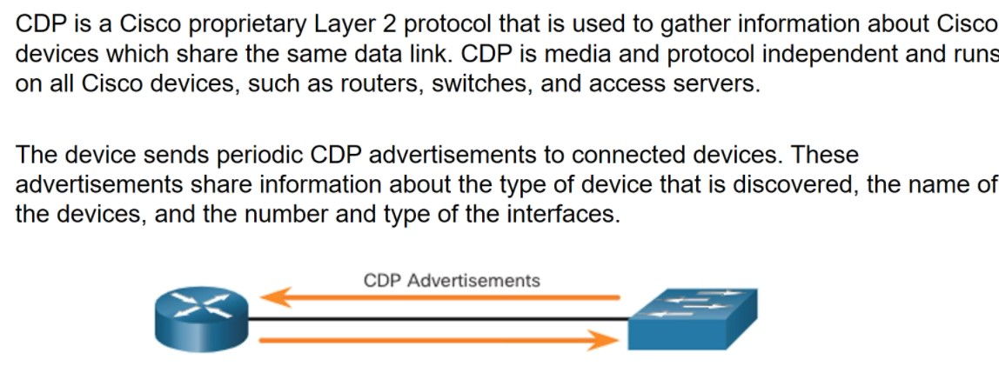

Сейчас общим решением является LLDP. 

Эти протоколы - потенциальная дыра в безопасности, надо ее прикрывать/выключать, или закрывать на access-порты
```
-if)# cdp ensble
или
cond)#
no cdp run
```

cdp по-умолчанию включен, заносит инфу в таблицу соседей:

```

show cdp nei

show cdp nei detail

```

Покажет как модель, так и ip и т.д.

LLDP выключен по-умолчанию, надо включить.

```
show lldp neighb detail
```


## NTP
NTP - первое, с чего стоит настраивать сеть, после получения доступа ко всем устройствам. 
- логи должны быть синхронизированы
- ключи/сертификаты тоже имеют время жизни
- kerberos отказывается работать, если дельта во времени > 5 минут

NTP - стандартные протокол, позволяте синхронизировать время. Часы убегают вперед, если не заданы стратумы/страты/эшелоны. Чем номер страта меньше - тем более доверенное устройство. 

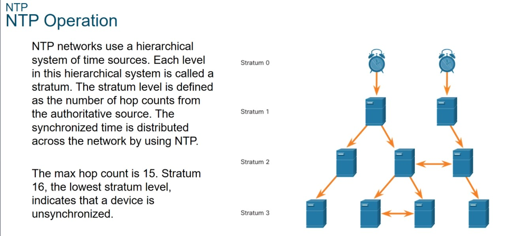

Стратой 0 можно считать либо атомные часы, либо GPS-приемник (настраивал в ряде проектов). Также в каждой стране есть свой пул pool.ntp.org

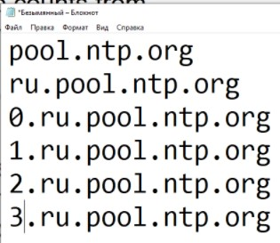

Настраиваем одно устройство в организации, а все остальные - с этим устройством

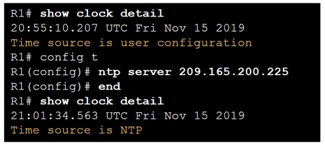

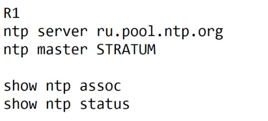

Все аппаратные часы рекомендуют ставить в UTC, затем дополнительно настраивать таймзоны. Актуально для больших организаций, особенно при анализе логов.

NTP - достаточно ресурсоемкий в работе, проще SNTP (simple network time protocol). Есть еще PTP (precision time protocol) - для станков, конвейеров

С актуальным временем можно уже переходить к правильному логгированию

Syslog - побочный продукт, разработанный при поиске ошибок работы сервиса sendmail. Разработчик sendmail - написал под себя данный сервис и просто передает строчки с текстом, в размере не больше 1 кб.


По-умолчанию, cisco сваливает все syslog сообщения в консоль, но удаленно, при подключении по ssh - конечно это все выключено: в удаленную сессию логи не валятся. чтобы включить на сессию:

```
terminal monitor
```

Также логи хранятся какое-то время в буфере и в памяти

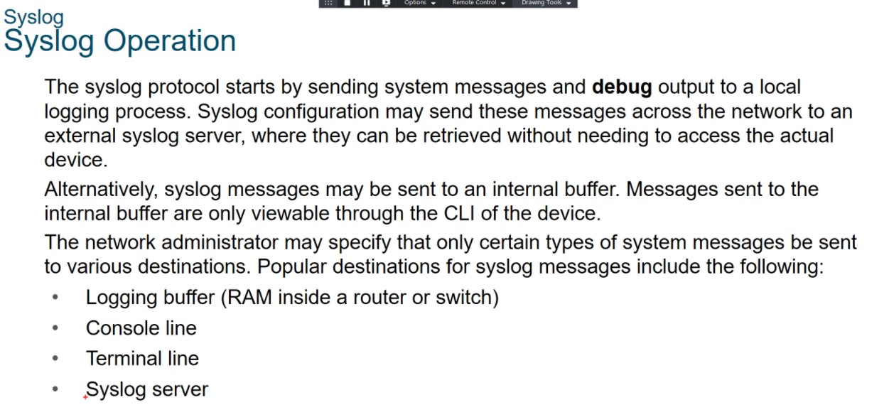

Лучше пересылать логи в syslog сервер.

Формат syslog сообщений

severity
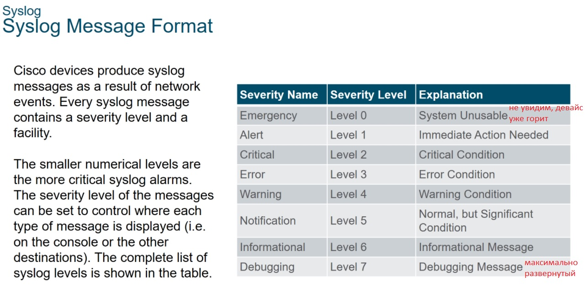

Кроме этого есть facility

Формат самого сообщения:

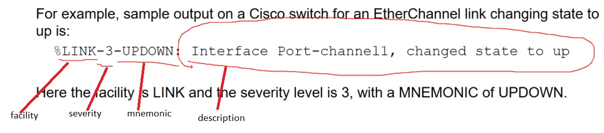

В лог также можно включить отметку времени с устройства

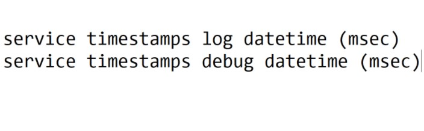

Настройка пересылки в syslog
```
logging host <server>

logging trap <SEVERITY> - по-умолчанию SEVERITY = 6
```

По-умолчанию используем UDP/514

проверка:
```
show logging
```
Syslog - небезопасен, ненадежен, передает текст, который парсить достаточно сложно.


## SNMP simple network management protocol
Это протокол управления, который позволяет настраивать определенные параметры оборудования единым, общим способом

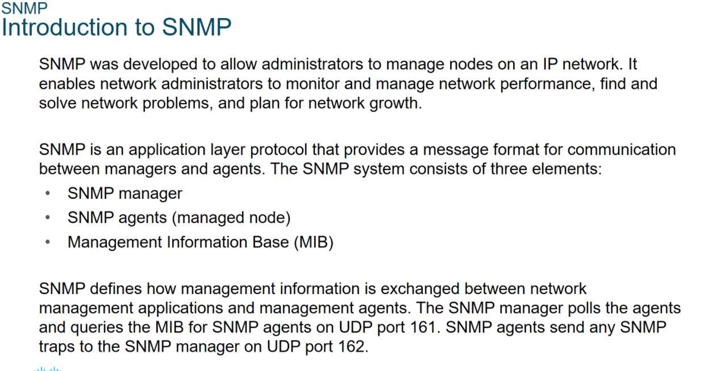

Пока я только получал этим протоколом данные с агентов
- клиент (менеджер)
- агент (сам хост, которым осуществляется управление)
- management information base (MIB) - база данных команд/OID (object ID)
- trap - лог-сообщение/ловушка, которое хост отправляет на SNMP-менеджер. В SNMPv3 появился пакет inform - надежная отправка пакета менеджеру. Значение inform легче распарсивать.

переменные get/set - необходимы для получения / отправки значений OID на устройств

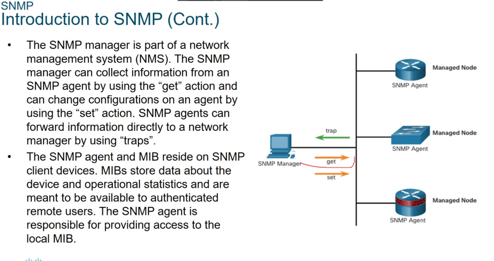

Все объекты - это древовидная структура:

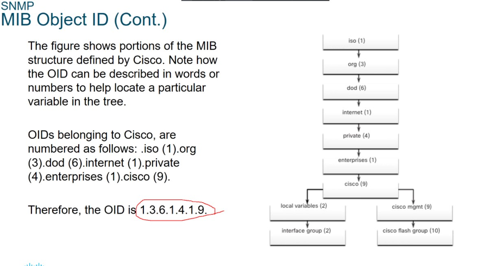

Часть MIB (общая) - совпадает на всех устройствах, а часть - отличается. Файлы MIB - мождно смотреть на сайте проивзодителей, например у CISCO:

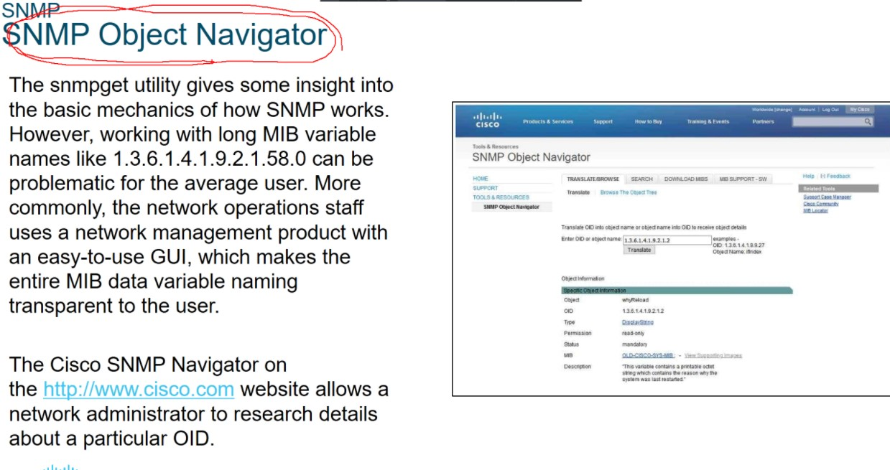

Переменные (OID) бывают чтение или чтение/запись

NMS: PRTG, HPOpenView, позволяют контроллировать состояние OID на устройствах

Версии SNMP:
- SNMPv1(RFC 1157)
- SNMPv2c (с - community) (FRC 1901-1908), community - пароль
- SNMPv3 (КАС 3410-3415) - с авторизацией, аутентификацией. Также реализована полноценная ролевая модель/виды (вид - набор переменных, которому требуется настроить доступ)

Сервера, Павел сказал, желательно использовать IPMI.

Есть какой-то бесплатный семинар от СПЕЦИАЛИСТ по ZABBIX/SNMP

