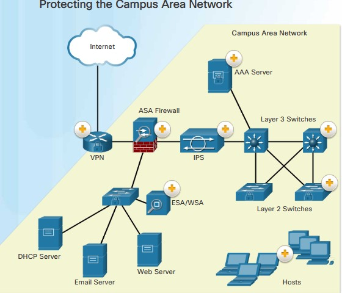
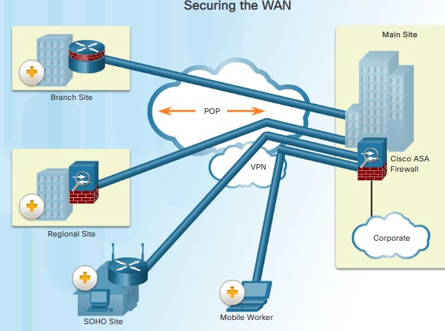
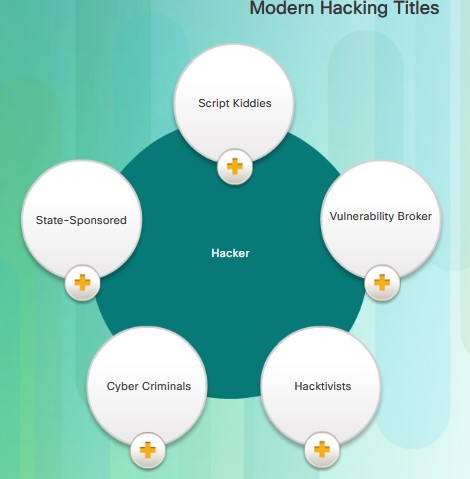
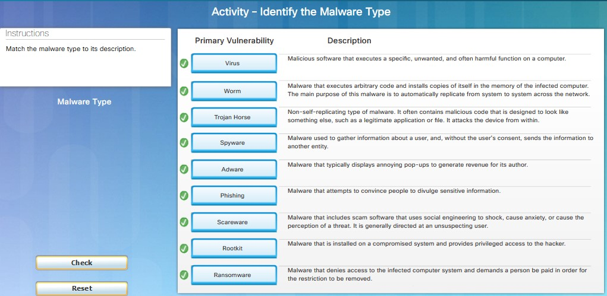
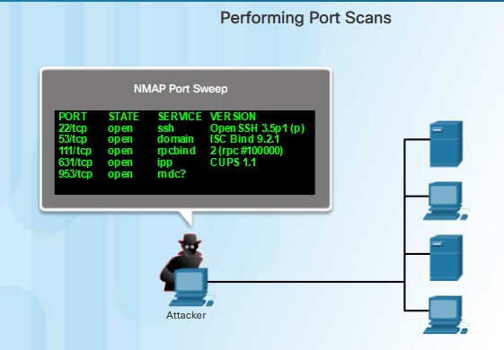

Запись курса - в ЛК, 3 месяца

Ссылка джля активации анкеты выпускника на последнем занятии

# NETACAD 20210225
Как доктор стремится предупредить болезнь, так и безопасник должен предупредить  возникновение инцидентов.

Организации создают разные области знаний, делящих безопасност на различные аспекты, чтобы было легче сосредотачиваться на каких-либо определенных вопросах и классифицировать виды атак.

часть компаний располагают так называемые honeypot, которые становятся ловушками для хакеров, а потом публикуют векторы атак на свои ресурсы

https://habr.com/ru/post/247475/ - ссылки на другие ресурсы

https://norse-corp.com/map/ - ссылки на другие ресурсы

https://cybermap.kaspersky.com/

https://norse-corp.com/map/

https://www.digitalattackmap.com/#anim=1&color=0&country=ALL&list=0&time=18681&view=map

## 1.1.1.3 Векторы атак
Могут быть как внешними, так и внутренними
- Внешние атаки - DDOS
- Внутренние атаки
   - воровство конфетки
   - уомпрометация внутренних серверов или инфры
   - отключение критических подключений, что приводит к отказу сети
   - включение зараженных USB

Безопасники работают с обоими видами угроз

DLP - data lost prevention (предотвращение потерь данных)

## 1.1.1.4 Защита Camp Area Network

CAN - состоят из нескольких географически близких сетей. Прежде чем пропустить кого-то в свою сеть - необходимо проверить его на разных уровнях. На картинки представлены узлы, отвечающие за определенные уровни безопасности:
- ААА
- Firewall

Защищать надо любые сети, даже домашние, так как хакеры любят создавать ботнеты.

В WAN-сетях на границе своей LAN ставят впециальные устройства, например Cisco ASA (adaptive Security appliance), которые могут
- работать Firewall-ом
- организовывать VPN-туннели 

## 1.1.2.6
Cisco в принципе признала что подход BYOD имеет место быть и разработал концепцию Borderless network. Но при этом оказалось что надо защищаться от ряда угроз:
- шифровать данные
- использование PIN 
- Wipe ненужных данных
- Data loss prevention (DLP)
- Jailbrake/root - с этим тоже надо бороться
Mobile Device Management (MDM) - предоставляет доступ к сети только тем устройствам, которые гарантируют шифрование и другие необходимые критерии безопасности.

## 1.2.1.2
Хакеры эволюционируют, но при этом уровень большинства - падает, так как становятся доступны все более простые инструменты все большему числу непрофессионалов:

Утилиты penetration test
- Password cracker - инструменты для подбора/обхода парольной защиты (john the ripper, OphCrack, LophtCrack, Rainbow Crack...)
- Wireless hacking tools - взлом Wi-Fi сетей (Aircrack-ng, Kismet, InSSider...)
- Netw scanning and hacking tools: прощупывание открытых TCP/UDP портов, активных ip (Nmap, SuperScan, Angry IP Scanner, NetScanTools)
- Packet Crafting tools: готовятся/крафтятся пакеты и ими тестируются FW (Hping, Scapy, Socat, Yersinia, Nping...)
- Packet sniffer: собираем  и анализируем пакеты LAN/WLAN (Wireshark, tcpdump, Ettercup, Выршааб EtherApe...)
- Rootkit detectors: Проверка на предмет установленных руткитов (AIDE, Netfilter, PF...)
- Fuzzers to search Vulnerabilities: обнаружение открытых брешей в ОС ПК и серверов(Skipfish, Wapiti...)
- forensic Tools: что-то белые хакреы делают с ОС...почитать
- Debuggers: реверс-кодинг (очень сложно стало парсить, так как программы прямо на лету меняют структуру и т.д.)
- Hacking OS: Спецом наполненные всякими хакерскими штучками ОС (Kali linux, SELinux, Knoppix...)
- Encryption tools: Шифрование данных (VeraCrypt, CipherShed, OpenSSL, Tor, OpenVPN...)
- Vulnerability Exploitation Tools: пробиваем на уязвимости разные ОС (Metasploit, CoreImpact, Sqlmap, netsparker...)
- Vulnerability Scanners: тоже сканим порты железок, VM и т.д. (Nipper, Secunia PC, Core Impact, SAINT...)

## 1.2.2.3 Виды атак
- Eavesdropping attack: слушаем сетевой трафик = sniffing/spoofing
- data modification Attack: захваченный трафик можно менять так, чтобы  отправители/получатели не догадались
- IP addr Spoofing: Подделка адреса отправителя в пакета
- Password-based Attack: Если выцепили логин/пасс юзверя, то стараются по-максимуму полчить инфу о других юзверях/железках/конфигах
- Dinial-of-Service: DOS - прекращаем нормальный доступ у сервису/ресурсу путем зафлуживания паразитным трафиком, так чтобы сам узел, либо промежуточные устройства захлебнулись в нем.
- MITM - заставляем трафик ходить через себя
- Компрометация кулючей: Что-то непонятное, но связанное с подделкой ключей/сертификатов
- Sniffer Attack: Слушаем сетевые пакеты, просмтриваем их,выясняем структуру, маршруты, сервисы сети

## 1.2.3.1 Типы Malware
- вирусы (часто пользователи сами приносят их себе на ПК или скачивают с инета). Вирусы записываются в первые байты исполняемых файлов или другим способом нарушгают нормальную работу программ
- Черви (сами размножаются использую дыры в безопасности, а потом делают что-то, подо что их заточили). Причем делают это сами, не заставляя работать другое ПО. См. инфу:
   - 2001 г. CodeRED worm
   - 2003 г. SQL Slammer (250000 ПК за 30 минут) - админы 6 месяцев забивали болт на опубликованный патч
   - 2004 г. MyDoom - спамил по всем идентифицированным email с зараженных ПК
   - 2880 г. Conficker
- Трояны (сидят на ПК и в нужные моменты активизируются/начинают на тебя стучать или открывают бэкдоры в твоему ПК)
   - remote access - удаленно разрешают что-то делать на ПК
   - data-sending (стучат на твои действия)
   - Destructive (удаляют файлы)
   - Proxy Torjan (зараженные ПК становятся источниками атаки, то есть по-факту маскируют место, откуда идет атака)
   - FTP Trojan (неавторизованная передача файлов)
   - Sec soft disabler (отключение софта безопасности)
   - DoS Trojan (замедляют/стопорят работу всей сети)

Современные Malware
- Ransomware: блокирует доступ к зараженному ПК, требует выкуп
- Spyware: стучит обо всем, что ты делаешь (keylogger)
- Adware: показывает рекламу, анализируя твои интересы
- Scareware - берут на понт, пытаяь отжать бабки испугав тебя
- Phishing - хуеплеты, выдающие себя за уважаемые банки и пытающиеся выудить у тебя логины/пароли/номера кредиток
- Rootkits - создает рута хакеру на твоем ПК

## 1.2.4.1 Типы сетевых атак
чтобы не запутаться в этом все разнообразии, разделим атаки:
- Reconnaissance Attack: Разведка, получение инфы о соседях, тестовые атаки
    - ping-анализ сети, инициация связи, выяснение какие IP-адреса являются активными.
    - сканирование портов активных IP - для определения портов/служб (Nmap, SuperScan, Angry IP Scanner и NetScanTools).

- продолжим
    - Запуск сканеров уязвимостей: выяснили порты - пробиваем тип и версию приложухи и ОС хоста (Nipper, Secuna PSI, Core Impact, Nessus v6, SAINT и Open VAS.)
    - эксплойты: выяснив службы ищем их известные уязвимости (Metasploit, Core Impact, Sqlmap, Social Engineer Toolkit и Netsparker.)

- Access Attack: пытаемся залогиниться под чужим аккаунтом, чтобы получить привилегии/доступы к БД/доступы к данным
   - Pass attack - подбираем/узнаем пароли (социалка, словари)
   - trust exploit: неавторизованные привилегии (что-то мутное)
   - port redirection: используем пораженный ПК, чтобы с него атаковать другие цели
   - MITM: через хакера бегают все пакеты
   - Buffer overflow: в этом случае узел может сбойнуть и начать вести сбея непредсказуемо
   - IP/MAC/DHCP Spoofing: подмена IP/MAC/правильного DHCP, таким образом пытаясь реализовать различные модели атак
- DoS Attack
- Социалка
   - pretexting - звонят и втирают чушь чтобы получить личные/финансовые данные
   - Фишинг - выдаем себя в письме за реальный банк
   - Спам - вкладываем в письмо ссылку на битый ресурс или зараженный файл
   - Tailgating - проскакиваем за кем-то в защищенное место
   - baiting - якобы потерянная флэшка/носитель за вирусом/трояном/червем

## 1.2.4.7 DOS

- Maliciously Formatted Packets: специально сформированные пакеты заставляют цель тупить
- Overwhelming Quantity of Traffic: забивает железку/порт трафиком и все остальные не могут с ней нормально работать

Типы DOS атак:
- Ping of Death - старая атака с использованием пакета 65535 байт: получатель мог загнуться получив такой пакет
- Smurf attack - большое число icmp-запросов получателем, с использованием поддельного ip-адреса отправителя (жертвы). Все разом принимались отвечать на эти запросы как раз жертве и она или промежуточный узел ложились под нагрузкой
- TCP SYN Flood Attack: атакающий генерит кучу TCP Syn и сервер пытается на них на всех ответить. Количетсво портов истощается и в итоге реальные клиенты сервиса не могут установить сессию.

DDOS: Distributed DOS
DOS-атака может усилиться использованием бот-нета из ПК-зомби. Ботнеты сейчас довольно часто продаются именно для DOS атак.
Атака идет на http-ресурсы

___Лабка 1.2.4.12___

- [pdf](labs/1.2.4.12 Lab - Social Engineering.pdf)
- [pka](labs/clear)

Задачи:
Найти способы защититься от социалки

Девих: Тот, кто строит стены - думает не так как тот, кто их обходит, пролезает под ними или проходит сквозь них.

Честно говоря я с интересом прочитал рассказ про парнишку, которые представился банковским работником, позмонил с телефона в якобы ТП и попросил залочить украденную им же самим карту. Жертва согласилась и ввела пин в ответ на просьбу ТП ввести Пин с клавиатуры телефона...капец просто...

## 1.3.1 Защита сетей
Строится на:
- запрете вредоносного трафика
- Защите данных, или криптографии:
   - Конфетка
   - Целостность
   - Доступность

___Дочитать 1.3___