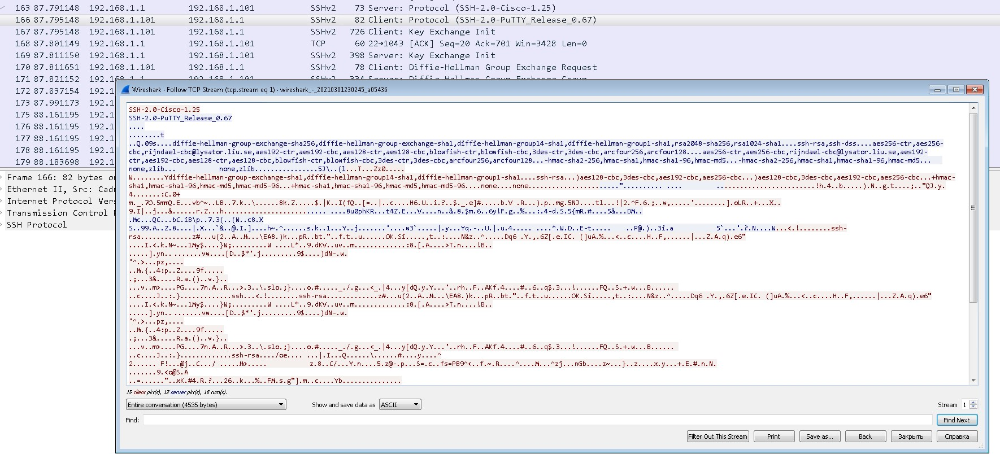

Задать вопрос относительно железок без K9 (Зачем, как обойти, на примере нексуса с прошивкой без K9)

Рекомендации:
- Выделить MGM сеть
- Разрешить вход в MGM-сеть и ПК управления только с определенных админских ПК. через ACL
- Выключать ПК управления на то время, пока нет админских задач

Можно ли сгенерить сертификат SSH для нескольких CN, чтобы обращаться к железке по разным именам?

Ответ:
- Можно, при использовании стороннего центра сертификации, а именно: сгенерить сертификат на несколько имен и после этого установить на нужную железку

Можно ли перенаправить SSH на другой порт, не 22?
- Можно, но при этом понадобится вешать дополнительный ACL, чтобы перекрыть порт 22 и не забыть открыть созданный порт в других ACL:

```
R1(config)#ip ssh port 2001 rota
R1(config)#ip ssh port 2001 rotary 1
R1(config)#line vty 0 4
R1(config-line)#rotary 1
```
Листинг итога лабораторок

```
Тут все ясно:
service password-encryption
security passwords min-length 10
enable algorithm-type scrypt secret cisco12345
username admin algorithm-type scrypt secret cisco12345
...
banner motd #Unauthorized access strictly prohibited!#
...
line con 0
login local
exec-timeout 5
exit
...
line vty 0 4
login local
exec-timeout 5
tran in telnet
...
Тут настраиваем ssh:
ip domain-name acad.local
crypto key generate rsa general-keys modulus 2048
ip ssh version 2
...
line vty 0 4
tran in ssh
end
...
Проверка
show ip ssh 
show control-plane host open-ports
...
Добавим таймстамп в логах
R3#show run | i service
service timestamps debug datetime msec
service timestamps log datetime msec
...
Настроим тормозной логин
R1(config)# login delay 10
...
Срать в логи при входе/неудаче
R1(config)# login on-success log 
R1(config)# login on-failure log
...
"режим тишины"
R1(config)# login block-for 300 attempts 3 within 120
...
ACL обхода "режима тишины"
R1(config)# ip access-list standard ACL-LOGIN-QM 
R1(config-std-nacl)# permit host 192.168.1.101 
R1(config-std-nacl)# exit 
R1(config)# login quiet-mode access-class ACL-LOGIN-QM 
R1(config)# exit 
...
Проверка
show login
show access-list
...
Слать логи на syslog
R1(config)# logging host 192.168.1.101 
R1(config)# logging source-interface fa0/1 
R1(config)# logging on 
R1(config)# exit 

```

# SPECIALIST 20210227
до 24.02.2020 года был отдельный курс CCNA SEC - IINS (implementing network security).Теперь такой сертификации нет, а курс размазан по модулям других курсов.

Также в курс добавлены дополнительные вещи от Павла и его лабы:
- Wireshark
- nmap (ip-сканирование)
- Kali Linux

___Online telnet___ - можно проверить доступность TCP-порта

состояние стенда


Основные теоретические моменты.

1. Защита сетевых устройств - это не только защита R, но и SW. На границе - как правило 1 устройство, это же и является точка отказа. 
2. Расширение - Defense in depth (эшелонированная защита):
- R1 - смотрит на прова, внешняя маршрутизация
- FW - за R1
- R2 - внутренняя маршрутизация, внутренние ACL, с нулевкой на FW


3. Если надо дать доступ извне на сервера, то надо организовать DMZ, но это уже вопросы больше дизайна


- Физически серверные надо защищать. Если защиты нет - все можно взломать.
- Надо иметь копии IOS, конфигов (раз в сутки)
- Router Hardening - конфиг должен быть максимально безопасным, с закрытыми внешними портами, сложными паролями, логгированием попыток доступа, ААА, разделение прав по группам


Конфиденциальность - использование enable secret, также передача всех конфигов в зашифрованном виде

MGM порт - на части R есть такой порт, который либо можно включить в отдельную MGM сеть (ограничени епорта 100 Мбпс), либо использовать как дополнительный порт для LAN

Пароль на R: можно использовать парольную фразу, с пробелами. Пароли надо менять хотя бы 1 раз в год


Для локального хранения паролей - ___keypass___. 

Для группы сотров - ___TeamPass___

У Каспера - свое решение, как для локального, так и для сетевого хранения

В сетях TCP/IP изначально, в ТЗ, не была заложены безопасность => большинство протоколов (arp, telnet и т.д.) - дырявые. Старые протоколы надо заменять на новые.

TPM - в россии запрещен
Bitlocker - пароль на вход
Шифрование файлов и папок - NTFS encryption
AxCrypt, VeraCrypt - стороннее шифрование программными средствами

___Лабораторки 1-12___

## ___Лабораторка 1___

- [pdf](labs/ЛР1_Настройка_общих_параметров_и_проверка связи.pdf)

Настроили R1, R2, R3: конфиги тут:

- [R1](labs/lab1/R1.txt)
- [R2](labs/lab1/R2.txt)
- [R3](labs/lab1/R3.txt)

Проверка показала успешный пинг на все узлы

## ___Лабораторка 2___


- [pdf](labs/ЛР2_Сканирование_сети_и_узлов.pdf)

Nmap – популярный и мощный инструмент для сканирования сетей и узлов. Nmap работает в режиме командной строки, для простоты GUI zenmap https://nmap.org/.
Задание: просканировать с KaliLinux сеть 192.168.1.0/24
Все просто, как 1-2-3


Обнаружил узлы 
- 192.168.1.1
- 192.168.1.3
- 192.168.1.101
- 192.168.1.5

Сканирование узла 192.168.1.1 показало что открыт порт 23:


Также раскусили что данный хост - Cisco IOS 15.1


Попытались подключиться по telnet, но видно что надо установить пароль на вход в IOS


## ___Лабораторка 3___

- [pdf](labs/ЛР3_Изучение_хранения_паролей_и_варианты_взлома.pdf)

Посмотрим как хранятся пароли в Cisco:
- открытом виде
- зашифрованных сервисом шифрования паролей
- захешированных с помощью хеш-функции md5 и scrypt

Попробовать взломать пароли при взломщика паролей John The Ripper (https://www.openwall.com/john/ ).

Открытый пароль зашифровали сервисом шифрования, при этом видно что перед паролем 
будет стоять тип 7. Тип 7 указывает, что этот пароль был получен с помощью сервиса шифрования паролей


```
R1(config)#enable password cisco
R1(config)#do show run | in pass
enable password cisco
...
R1(config)#service password-encryption 
R1(config)#do show run | in pass
service password-encryption
enable password 7 00071A150754

R1(config)#enable password Ci$co       
R1(config)#do show run | in pass
service password-encryption
enable password 7 153102480725
```
Дешифровали 7-й пароль на сайте: https://packetlife.net/toolbox/type7/


Далее попробуем захешировать пароль и взломать его John Ripper:
```
R1(config)#enable secret cisco
R1(config)#do show run | in sec 
R1(config)#do show run | in secret
enable secret 5 $1$96uH$mmnn64oQ.YJDz/t6YMFff/
```


Алгоритм хеширования выбирается с помощью algorithm-type


Хеш MD5 — type 5, SHA256 — type 8 и Scrypt — type 9 (самый устойчивый к взлому). Если не указывать algorithm-type, будет по умолчанию использован MD5. Алгоритмы хеширования доступны как для команды ___enable___, так и для команды ___username___.
```
enable algorithm-type scrypt secret cisco
```

На уже более-менее прилично мпароле ___enable secret Ci$c0_123WS___ я устал ждать подбора.


## ___Лабораторка 4___


- [pdf](labs/ЛР4_Настройка_имён_пользователей_и_паролей.pdf)

Картинка все та же самая.

Задача: 
- Настроить на R1, R3 минимальную длину пароля 10 символов
```
service password-encryption
security passwords min-length 10
enable algorithm-type scrypt secret cisco12345
username admin algorithm-type scrypt secret cisco12345
```
- Включить баннер motd, для ___CONSOLE___ подключения - локальную базу данных, автозакрытие через 5 минут (по-умолчанию 10), 
```
banner motd #Unauthorized access strictly prohibited!#
...
line con 0
login local
exec-timeout 5
exit
```
- Включить для VTY подключения  - локальную базу данных, автозакрытие через 5 минут (по-умолчанию 10)
```
line vty 0 4
login local
exec-timeout 5
tran in telnet
```


## ___Лабораторка 5___

Картинку см. выше

- [pdf](labs/ЛР5_Изучение_протоколов_Telnet_и_SSH.pdf)

Задача:
- Запустить на линке Wireshark и захватить логин/пароль, просмотреть что было введено


Видно, что логинг/пароль передается в незашифрованном виде. 

- установить на R1-R3 транспорт ssh ver 2 (как поменять порт - см. в начале), опять проверить какие пакеты захвачены
```
ip domain-name acad.local
crypto key generate rsa general-keys modulus 2048
ip ssh version 2
...
line vty 0 4
tran in ssh
end
```
вот как будет выглядеть зашифрованная ssh сессия



___проверка:___
```
show ip ssh 
```


```
show control-plane host open-ports
```


Количество линий VTY, для маршрутизатора больше чем 0...4: их обычно по умолчанию 5, так что для оставшихся ```no tran in```. Тогда получим при 6-й сессии входа:


## ___Лабораторка 6___

Картинку см. выше

- [pdf](labs/ЛР6_Усиление_защиты_маршрутизатора_от_атак_на_доступ.pdf)

Настройки могут быть применены как маршрутизатору, так и к свичу

Задача:
1. "тормозной логин" - Настройка задержки при вводе пароля (задержка для замедления подбора пароля)
2. Настройка логгирования успешных/неуспешных попыток входа (фиксация подбора пароля)
3. Настройка "режима тишины" (quiet mode) или блокировки входа после нескольких неудачных попыток ввода пароля (замедление подбора пароля)
4. Настройки ACL для сохранения доступа к хосту во время включения блокировки

```
Включим таймстамп в логах
R3#show run | i service
service timestamps debug datetime msec
service timestamps log datetime msec

1. тормозной логин
R1(config)# login delay 10
2. 
R1(config)# login on-success log 
R1(config)# login on-failure log
3. "режим тишины"
R1(config)# login block-for 300 attempts 3 within 120
4. "ACL обхода режима тишины"
R1(config)# ip access-list standard ACL-LOGIN-QM 
R1(config-std-nacl)# permit host 192.168.1.101 
R1(config-std-nacl)# exit 
R1(config)# login quiet-mode access-class ACL-LOGIN-QM 
R1(config)# exit 
```

___Проверка___

```
show login
show access-list
```
 (будет присутствовать "автоматически созданный acl")

```
R1(config)#do show login
     A login delay of 10 seconds is applied.
     Quiet-Mode access list ACL-LOGIN-QM is applied.
     All successful login is logged.
     All failed login is logged.

     Router enabled to watch for login Attacks.
     If more than 3 login failures occur in 120 seconds or less,
     logins will be disabled for 100 seconds.

     Router presently in Quiet-Mode.
     Will remain in Quiet-Mode for 36 seconds.
     Restricted logins filtered by applied ACL ACL-LOGIN-QM.
```

```
R1(config)#do show access-li
Standard IP access list ACL-LOGIN-QM
    10 permit 192.168.1.101 (6 matches)
Extended IP access list sl_def_acl
    10 deny tcp any any eq telnet log
    20 deny tcp any any eq www log
    30 deny tcp any any eq 22 log
    40 permit tcp any any eq 22 log
```
А вот что происходит при уходе роутера в защиту "режим тишины".
```
*Mar  2 22:24:28.703: %SEC_LOGIN-1-QUIET_MODE_ON: Still timeleft for watching failures is 0 secs, [user: admin] [Source: 192.168.3.101] [localport: 2001] [Reason: Login Authentication Failed] [ACL: ACL_QM] at 22:24:28 UTC Tue Mar 2 2021
...
*Mar  2 22:26:08.703: %SEC_LOGIN-5-QUIET_MODE_OFF: Quiet Mode is OFF, because block period timed out at 22:26:08 UTC Tue Mar 2 2021
```


## ___Лабораторка 7___

Картинку см. выше

- [pdf](labs/ЛР7_Изучение_протокола_Syslog.pdf)

Настройки могут быть применены как маршрутизатору, так и к свичу

Задача:
Настроить пересылку логов на syslog сервер
```
R1(config)# logging host 192.168.1.101 
R1(config)# logging source-interface fa0/1 
R1(config)# logging on 
R1(config)# exit 
```

___Проверка___

```
R1# show logging 
```

Вот что при этом в syslog попадает


## ___Лабораторка 8___

Картинку см. выше. Надо собирать данные с узлов через SNMP UDP:
- порт 161 - пакеты get и set
- порт 162 - пакеты trap

- [pdf](labs/ЛР8_Изучение_протокола_SNMP.pdf)

net-snmp -  http://www.net-snmp.org/ 

PowerSNMP FreeManager  - https://www.dart.com/pages/powersnmp-free-manager 


### Включить SNMPv2c
```
R1(config)# snmp-server contact help@acad.local 
R1(config)# snmp-server location Main Office 
R1(config)# snmp-server community testpassword1 ro 
R1(config)# exit 
...
show control-plane host open-ports 
...
show snmp 
show snmp community
show snmp group
show snmp view
```

```
R1(config)#do sho snmp grou
...
groupname: testpassword1                    security model:v1 
contextname: <no context specified>         storage-type: permanent
readview : v1default                        writeview: <no writeview specified>        
notifyview: <no notifyview specified>       
row status: active

groupname: testpassword1                    security model:v2c 
contextname: <no context specified>         storage-type: permanent
readview : v1default                        writeview: <no writeview specified>        
notifyview: <no notifyview specified>       
row status: active
```

Поработать с железкой по SNMP можно подпрограммами ___snmpget, snmpset___:
- ___snmpget___ – программа отправки get-запросов SNMP; 
   - -v 2c – использовать версию 2c; 
   - -c testpassword1 – использовать строку сообщества testpassword1; 
   - 192.168.1.1 – адрес устройства; 
   - sysName.0 – строковое обозначение переменной. 
```
C:\Users\Student1> snmpget -v 2c -c testpassword1 192.168.1.1 sysName.0 
SNMPv2-MIB::sysName.0 = STRING: R1.acad.local 
```
- ___snmpset___ - программа отправки set-запросов SNMP
  - sysName.0 – строковое обозначение переменной. 
```
C:\Users\Student1>snmpset -v 2c -c testpassword1 192.168.1.1 s sysName.0 R1new 
Error in packet. 
Reason: noAccess 
Failed object: SNMPv2-SMI::snmpV2 
```
При этом  надо помнить, что весь обмен идет нешифрованным, а также на snmp-запросы железка откликнется откуда бы он ни пришел. Также злоумышленник может увидеть snmp comunity-string? поэтому использовать v2c для управления - вредно для здоровья. Максимум - для сбора информации.


чтобы хоть как-то защититься и не отдавать информацию кому попало (в случае если community скомпрометирована) - необходим SNMP ACL, в котором будет указано что доступ с community-string только на чтение, то есть надо переписать строку ___snmp-server___/ Как видно, тут много параметров:

```
R1(config)#snmp-server community testpassword1 ? 
  <1-99>       Std IP accesslist allowing access with this community string
  <1300-1999>  Expanded IP accesslist allowing access with this community
               string
  WORD         Access-list name
  ipv6         Specify IPv6 Named Access-List
  ro           Read-only access with this community string
  rw           Read-write access with this community string
  view         Restrict this community to a named MIB view
```
Итак, сама защита ACL-SNMP
```
R1(config)# ip access-list standard ACL-SNMP 
R1(config-std-nacl)# permit host 192.168.1.101 
R1(config-std-nacl)# exit 
R1(config)# snmp-server community testpassword1 ro ACL-SNMP 
R1(config)# exit 
```
### Включить SNMPv3
SNMPv3 - более сложный и защищенный протокол. При его настройке есть дополнительные параметры, которые помогают защитить обмен между SNMP-участниками. Примеры будем приводить для R1 и R3:

отключим старые настройки и добавим READ view, к которому доступ будет только  с ранее настроенного ACL:

```
no snmp-server community testpassword1 ro ACL-SNMP
snmp-server view SNMP-RO iso included
snmp-server group SNMP-G1 v3 priv read SNMP-RO access ACL-SNMP 

```
Свяжем воедино и проверим:
```
snmp-server user SNMP-Admin SNMP-G1 v3 auth sha Authpass priv aes 128 Encrypass
...
show snmp user 
show snmp group
show snmp view
```

На R3
```
contact+location:
R3(config)# snmp-server contact help@acad.local 
R3(config)# snmp-server location Branch Office 
```
SNMP-ACL - только с PC1
```
R3(config)# ip access-list standard ACL-SNMP 
R3(config-std-nacl)# permit host 192.168.1.101 
R3(config-std-nacl)# exit 
```
view <SNMP-RO> - на все дерево объектов (ветка iso и все её подветки). 
```
R3(config)# snmp-server view SNMP-RO iso included 
```

Теперь свяжем все воедино: 
- пользователи группы SNMP-G1 будут аутентифицироватося по имени/паролю. 
- Обмен SNMPv3 (шифруется и проходит проверку целостности.
- Представление SNMP-RO - read («только чтение»)
- подключение только с узла PC1. 

```
R3(config)# snmp-server group SNMP-G1 v3 priv read SNMP-RO access 
ACL-SNMP 
```

Добавим юзера SNMP-Admin в группу SNMP-G1 со следующими параметрами аутентификации и шифрования: 

```
R3(config)# snmp-server user SNMP-Admin SNMP-G1 v3 auth sha 
Authpass priv aes 128 Encrypass 
R3(config)# end 
```

Проверка: 
```
show snmp user 
show snmp group 
```


# Securing Network Device
## 2.0.1.1
- Защищаем физический доступ к железке
- паролирование доступа по сети
- SSH на вход
- различные уровни досупа персонала
- SNMP v2, v3
- NTP
- Syslog

Отключаем старые сервисы

Внедряем ААА

внедряем аутентификацию протоколов динамической маршрутизации (OSPF MD5/SHA)

## 2.1.2.2
Настраиваем доступ со сложным паролем и ограничиваем время прогстоя
```
security passwo min-len <10> - задаем дилну пароля
service password-encryption - шифруем пароли в конфиге
line vty 0 4
exec-timeout 3 30 - 3,5 минуты на простой, вместо 10
lone con 0
exec-timeout 3 30 - 3,5 минуты на простой, вместо 10
```

Также можно отключить избыточные линии, чтобы никто другой кроме нескольких админов не залез на железку

## 2.1.2.3 - Алгоритмы пароля
0 - незашифрованный
...
9 - SCRYPT HASHED secret - надо ввести хэш пароля, который можно просмотреть на любом уже настроенном устройстве


задается как в secret, так и в con/vty


## 2.1.3.4
```

R2(config)# ip access-list standard PERMIT-ADMIN
R2(config-std-nacl)# permit 192.168.10.10
R2(config-std-nacl)# exit

R2(config)# login block-for 15 attempts 5 within 60 
R2(config)# login quiet-mode access-class PERMIT-ADMIN
R2(config)# login delay 10
R2(config)# login on-success log
R2(config)# login on-failure log
R2(config)# exit
R2#
...
R2# show login 
     A login delay of 10 seconds is applied.
     Quiet-Mode access list PERMIT-ADMIN is applied.
     All successful login is logged.
     All failed login is logged.

     Router enabled to watch for login Attacks.
     If more than 5 login failures occur in 60 seconds or less,
     logins will be disabled for 15 seconds.

     Router presently in Normal-Mode.
     Current Watch Window
         Time remaining: 15 seconds.
         Login failures for current window: 0.
     Total login failures: 0.

R2#
```

## 2.1.4.2 Configuring SSH

## 2.2.2 Role-Based CLI

