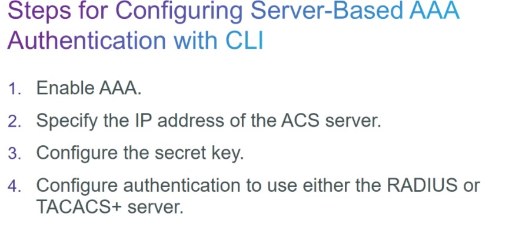

регулярка для отобюражения объфвленных заглавными буквами переменных
show run | i [A-Z]

# SPECIALIST 20210306
# Глава 3 AAA


модель AAA - 2 варианта
- локальная (инфа о юзерах и правах - на конкретном устройстве), подходит для небольших организаций
- серверная (инфа о юзерах и правах - на центральном сервере), подходит дл крупных организаций. Cisco ISE (ACS - старое), WIN NPS и т.д. Сервер - не один, между ними - репликация, на железке - задаем группу AAA серверов


AAA


Порядок настройки: 
- бэкап старого конфига
- сессию не закрываем, пока не опробуем необходимый функционал в новой сессии.
- задаем username
- включаем new-model AAA. после активации, новые команды AAA становятся доступны
- начинаем настройку списков методов


Настройка блокировки УЗ неудачных попыток входа

проверка залоченных УЗ
```
show aaa local user lockout
```
Уровень привилегий 0-15 (0 - минимал. юзер, 15 - УЗ с макс привилегиями). Вышестоящая команда не лочит УЗ с привилегями 15


проверка:
```
show aaa sessions
debug aaa <>
```

После настройки AAA? начнетсая обмен между железкой и сервером AAA по протоколам
- RADIUS (есть ряд недостатков), ему на смену идет DIAMETER. Залогинились, права применились, поменять права пока юзер не отлогинился не получится. Windows NPS - radius. UDP. TCP/IP. При обмене шифруется только пароль. Accounting - развит
- TACACS+ (изначально проприетарный от Cisco). Каждый раз устройство запрашивает сервер можно ли выполнить юзеру какую-то команду, за счет этого можно динамически менять права на сессию. TCP. При обмене шифруется весь обмен. Accounting - не очень развит
- DIAMETER (довольно молодой, начало - 2017 год)


Как работает Radius


Как работает TACACS+ (запрос на AAA-сервер, на каждый чих)


Еще раз про порядок настройки:


Конфигурирование серверов группы: (key - пароль, на сервере настраиваются узлы и в них указываются пароли, на каждую железку - свой пароль, символов 60. Пароли на узлах хранятся в открытом виде)
- TACACS


- RADIUS+ (порты 1812_1813 - новые, 1645_1646 - старые)


Задаем список методов и привязываем к линии


Проверка 
```
debug radius <>
debug tacacs <>
```


# Настройка Авторизации


# Настройка Accounting
- start-stop - Логгинг о попытке выполнения команды записывается
- stop-only - Логгинг только если команды успешно выполняются


___Лабораторки___


В стеевой академии в модуле 2 - конфиг файлы главы 2


Конфиги после 12 лабы

GNS умеет работать с обоими видами конфигов, и при импорте надо указать оба вида конфигов:
- startup-config
- private-config (хранит некоторые вещи: ключи ssh, юзеры SNMP)


## ___Лабораторка 13___

Картинка как раньше

- [pdf](labs/ЛР13-Изучение_локальной_модели_AAA.pdf)

Задача:
- перейти от старой модели к новой
   - ```aaa new-model```
   - включить ```debug aaa authentication```
   - составить список методов AUTHEN1 для аутентификации при входе. Первый используемый метод - local (он не проверяет регистр введенного username)
      ```
       conf t
       aaa authentication login AUTHEN1 local
       line vty 0 4
       login authentication AUTHEN1
       exit
      ```
    - изменить метод на ___local-case___ (теперь надо внимательно относиться к регистру имени пользователя)
       ```
       aaa authentication login AUTHEN1 local-case
       ```
Сделать действия на R1, R2


Ну и после смены ___local-case___ железка нас ожидаемо не пустила.


## ___Лабораторка 14___

Картинка как раньше

- [pdf](labs/ЛР14-Изучение_протокола_SCP.pdf)

Задача:
локальная модель AAA позволит вам работать с устройством по протоколу SCP для безопасного копирования файлов. Протокол SCP работает внутри протокола SSH, который вы настроили ранее.

- Для работы по SCP, создадим пользователь уровня 15 superadmin  и секретным паролем. 
   ```
   username superadmin privilege 15 algorithm-type scrypt secret cisco12345
   ```
- создадим дополнительный ___default___ список методов авторизации (бери разрешения на выполнение команд в контексте exec из local базы данных)  и включим функционал SCP на хосте
   ```
   aaa authorization exec default local   
   ip scp server enable
   ```
- скачаем конфиг командой на PC1^
   ```
   pscp -scp -l superadmin 192.168.1.1:running-config r1.cfg
   ```
Проделываем действия на R1, R3


## ___Лабораторка 15___

Картинка как раньше

- [pdf](labs/ЛР15-Изучение_серверной_модели_AAA_и_протокола_RADIUS.pdf)

/usr/local/etc/raddb/users
su

Настройка 
Перейдём от локальной аутентификации к серверной. Аутентификационным сервером будет выступать виртуальная машина RADIUS. Виртуальная машина уже настроена и готова к приёму запросов от маршрутизаторов R1 и R3 по протоколу RADIUS.

freeRADIUS, https://freeradius.org/

- включи дебаг
   ```
   debug radius
   ```
- задаем настройки RADIUS сервера
   ```
   radius server RAD1
   address ipv4 192.168.1.3 auth-port 1812 acct-port 1813
   key radiussecret
   exit
   ```
- задаем порт-источник RADIUS запросов
   ```
   ip radius source-interface fa0/1
   ```
- меняем список методов AUTHEN1
   ```
   aaa authentication login AUTHEN1 group radius
   ```
- меняем список AUTHEN1, с дополнительным методом local-case? на случай если все rADIUS окажутся недоступными
   ```
   aaa authentication login AUTHEN1 group radius local-case
   ```
Пример ошибочного входа на R1


Корректный вход


Когда загасили радиус, но прописали метод local-case


___Доделать на R3___

## Межсетевые экраны, ZBPF