# SPECIALIST 20210313

## Защита информации
- Аутентификация
- Целостность
- Конфиденциальность (алгоритмы шифроваия). Во время войны - необходимо передавать сообщения только в зашифрованном виде. Шифрованный текст ___Ciphertext___.
Метод Цезаря, метод одноразовых блокнотов (100% защита). На картинке - следующий этап развития, телеграфирование текста в зашифрованном виде

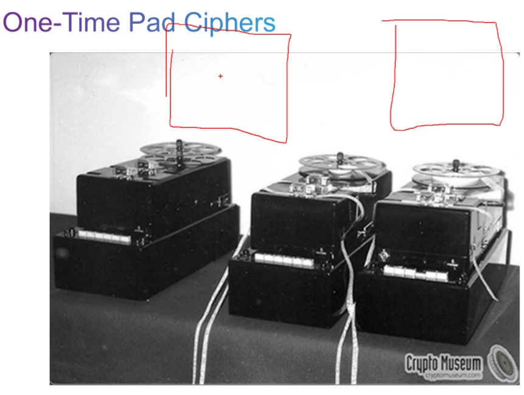

## Взлом защищенной информации
Взлом шифра/Дешифровка - криптоанализ

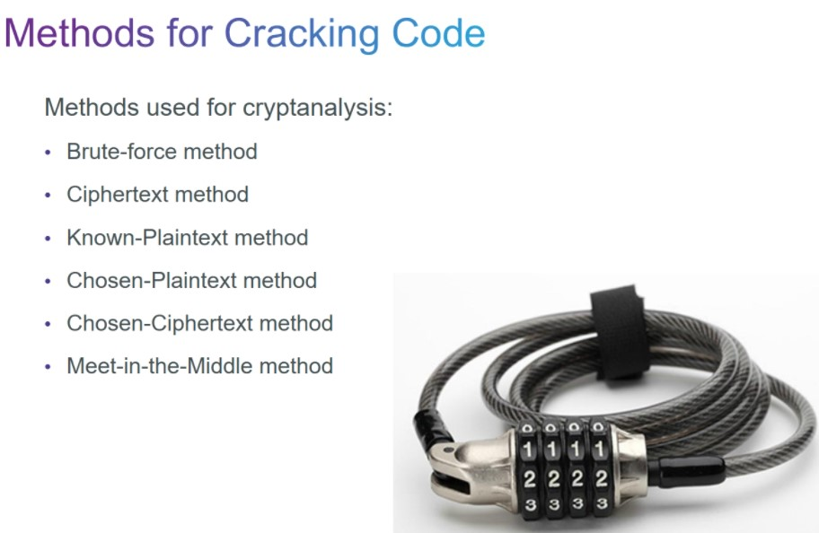

- Брутфорс/перебор
- ...
- Дешифрация на основании кусочка из дешифрованного текста (фильм "игра в имитацию")
- Дешфирация на основе метода частотного анализа (в русском самая частаю - о, в английском - e).

Крипография + криптоанализ = наука криптология

В первую очередь этой наукой занимаются математики

Основной секрет криптоанализа - алгоритм. Цезарь всего лишь сдвигал буквы на 3 влево. Поэтиому раньше алгоритмы держали в тайне.

Теперь алгоритмы - общедоступны, а секретность - заключена в ключе, который при наложении на исходный текст - получаем шифрованный текст

С ключами возможны следующие операции:

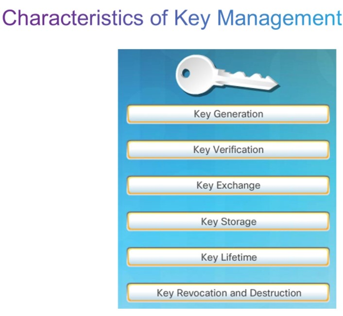

## Особенности ключей
Увеличение длины ключа на 1 - дает увеличение пространства ключей в 2 раза
- Длина ключа - количество бит в ключей
- пространство ключа - общее количество возможных комбинаций ключа

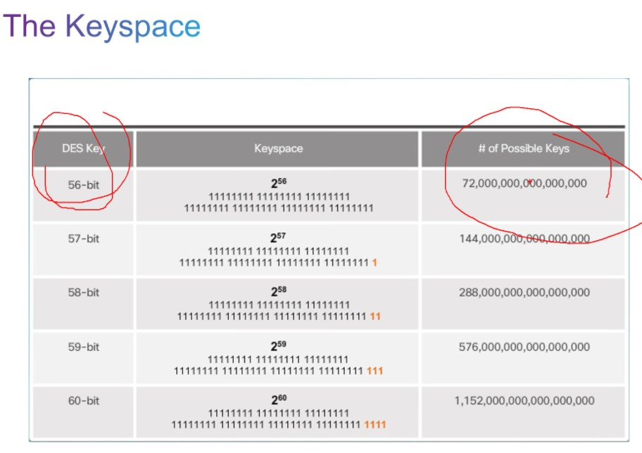

Для разных процедур - разные алгоритмы ключей. Время жизни ключей представлены ниже.

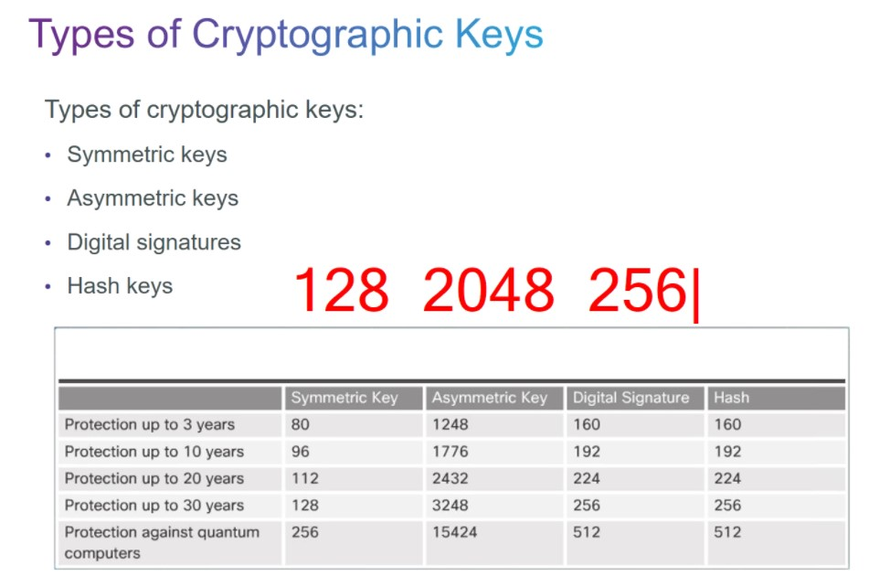

- Симметричные - для шифрования боевого трафика
- Асимметричные - для подготовки шифрованного туннеля. Больше чем 2048 бит - обычно не используются
- Hash - 256 бит

Алгоритм Диффи-хелмана генерит ключи раз в 1 час => "задирать" размер ключа смысла не имеет.

## Хэширование
Алгоритмы - целостность(аутентификация). Хэширование - мясорубка, в которой на выходет определнное число бит: 128/256...

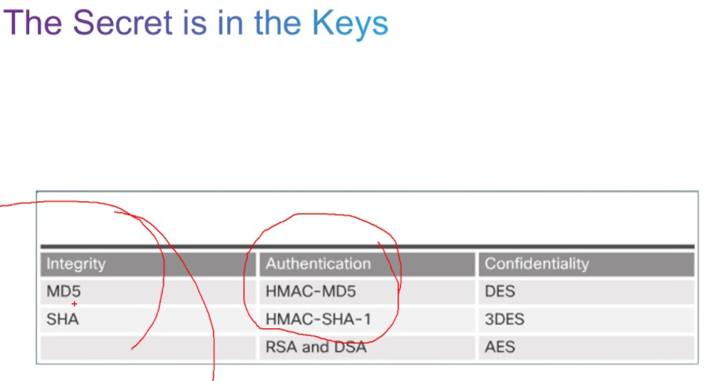

Можно подобрать такой текст, что на выходе получим совпадающий хэш. Это коллизия, хэши должны быть ___коллизионно-устойчивыми___. Для MD5 придумали способ быстрого нахождения коллизий. Даже при налшиции спец ПО/аппаратных устройств, взломать хэши длинных строк - уже сложно. Но даже с учетом этого, надо всегда готовить алгоритмы на замену существующим

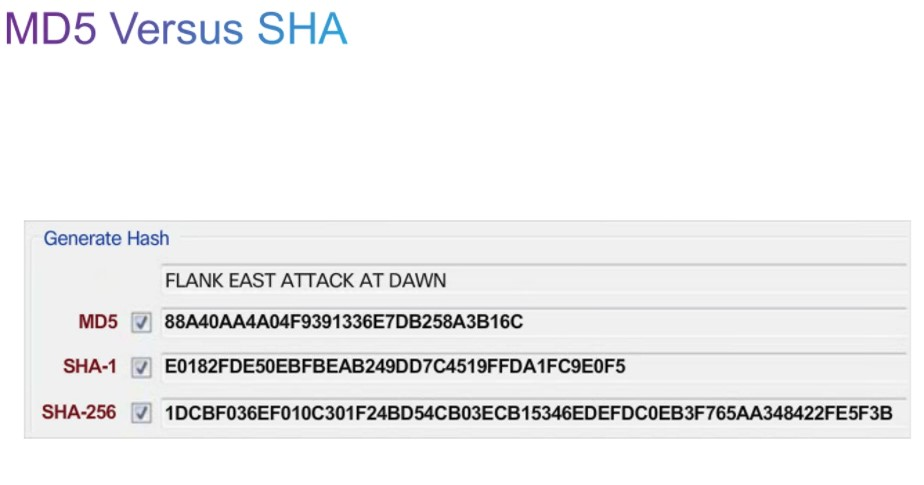

Хорошая программка для подсчета хэшей
- certutil
- QuickHash

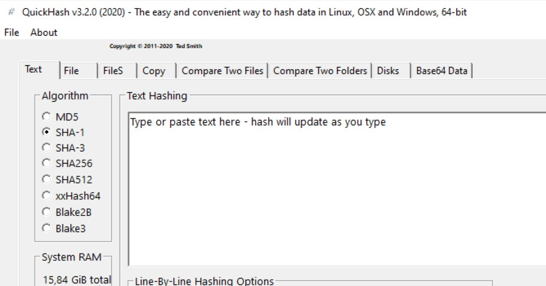

___Лавинообразность___ - кардинальное изменение хэша при смене всего одного символа исходного текста.

Хэши позволяют защититься от непреднамеренных изменений, то есть при изменении в сигнале (побился кадр).

HMAC - hash-based method authentication code. Можно обеспечить целостность и простейшую аутентификацию (ключи должн ыбыть на стороне отправителя и получателя). При отправке сообщения, хэши дописываются в конец сообщения. То есть если хэши совпали, то подписанные данные отправлены именно нужным отправителем

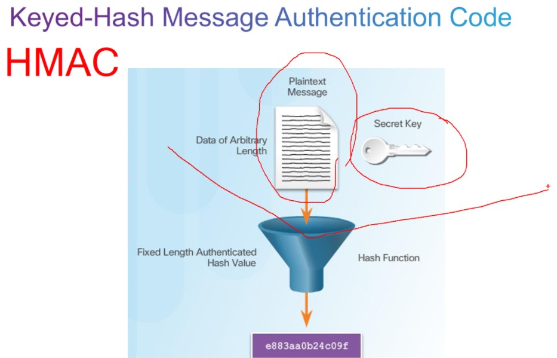

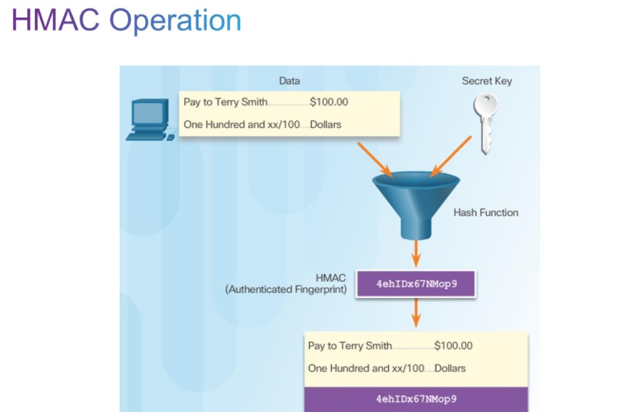

Чем короче ключ, тем быстрее операции шифрования/дешифрования. Чем длиннее - тем ресурсов тратится больше

## 2 класса алгоритмов шифрования

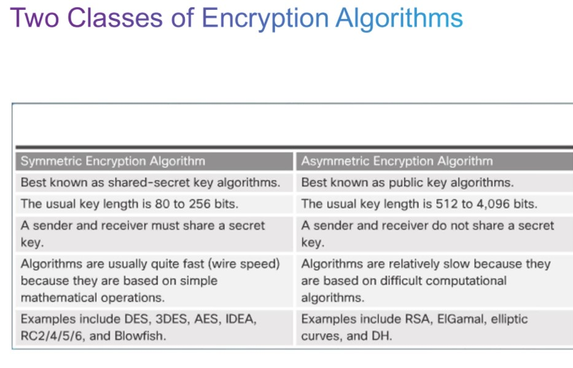

- симметричные - общий ключ у отправителя и получателя, быстрый, скорости шифрования и дешифрования - одинаковы. Проблема - передача общего ключа на другую сторону. Для передачи - используется алгоритм Дифыфи-хеллмана. 
- асимметричные - используется пара ключей: открытый (public) и закрытый (private). Private - никуда передавать не надо, открытый - можно переджавать кому угодно. Алгоритмы медленные (возведение в степень и т.д.) Скорость шифрования - быстрее скорости дешифрования, поэтому алгоритм - асимметричный. Используется при передаче небольшого количества даных. Имея закрытый ключ - всегда можно сгенерить открытый, но из открытого ключа никак не получить закрытый. Если что-то шифруется закрытым, то дешифрование - открытым и наоборот.

## Блочные и поточные алгоритмы шифрования

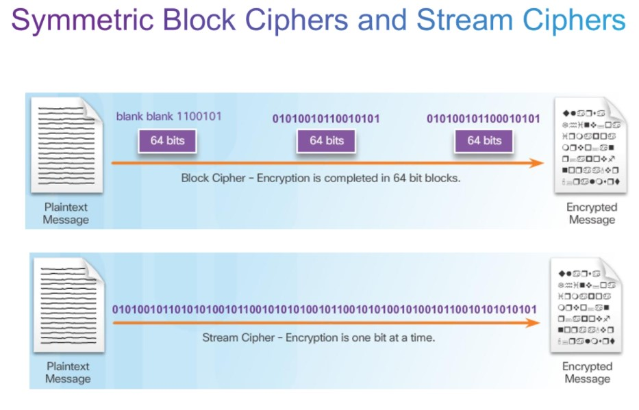

Сейчас на самом деле - используется смешанный: блочно-поточный метод.

## выбор алгоритмов шифрования
 Необходимо учитывать: доверие сообщества к данному алгоритму. AES пока таким доверием не обладает и не совсем понятно почему правительство США продвигает данный алгоритм

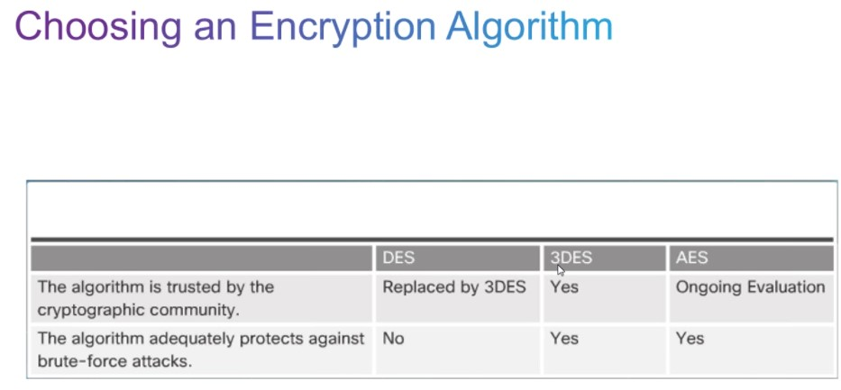

## Улучшение DES-> 3DES
Копакабана может вломать DES за 6,4 дня. Придумали прогонять 3 раза DES

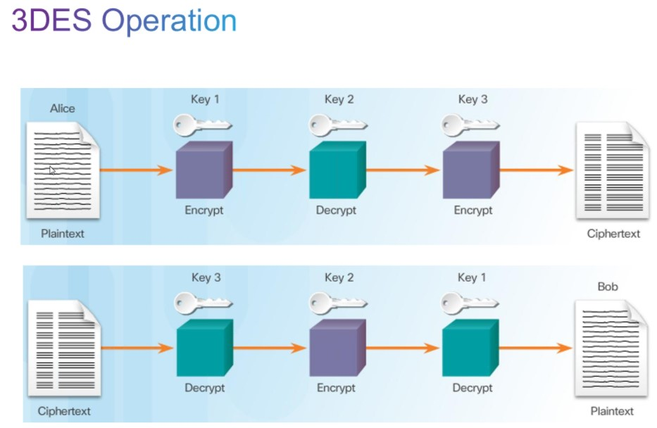

Шифруем(1-й ключ)/дешифруем (2-й ключ)/шифруем(3-й ключ). При получении - обратная процедура, поэтому меджленно

## AES
приняли в 2001 году, продвигают США.

## другие алгоритмы
- SEAL
- ГОСТ
- RC (применяется внутри SSL/TLS)

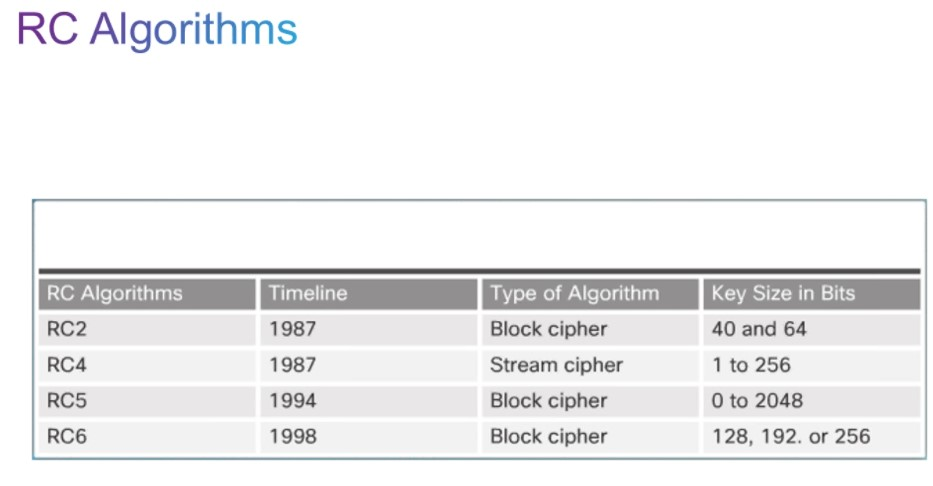

## передача ключа на другую сторону Diffie-hellman

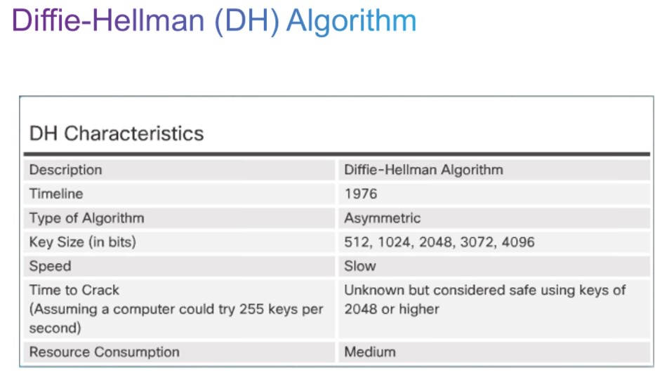

применяется только для генерации ключей. Вариации алгоритма называются группы:
- DH1
- DH2
...

## Алгоритмы асимметричного шифроывания
- IKE (часть IPSec- neyytktq)
- SSL/TLS
- SSH
- PGP (pretty good privacy)
`
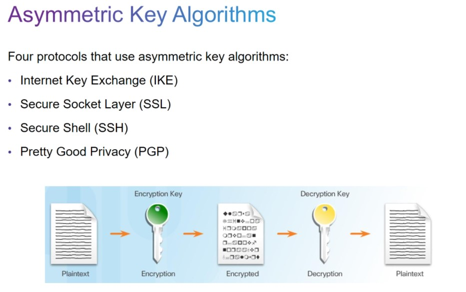

___ПРИМЕР___

решили алиса и Боб обмениваться информацией. Сгенерили 2 пары ключей (по паре откр/закр)- каждому

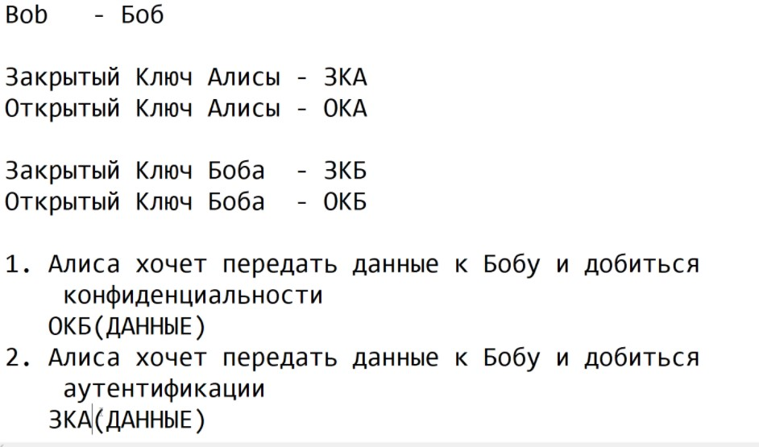

чтобы добиться и конфилденциальности и целостности и аутентификации, Алиса будеш шифровать данные ОКБ (расшифрует ихз только Боб). С данных снимается хэш, шифруется ключом Алисы. 
Боб - расшифровывает хэш Алисы ОКА, а потом данные своим закрытым ключом

Цифровой сертификат - это ключ+набор свойств+сертификат центрального сервера сертификации

При обмене сначал используются асимметричные/тяжелые алгоритмы, затем симметричные (легкие) - уже для передачи данных6н

## PKI - publiс key infrastructure

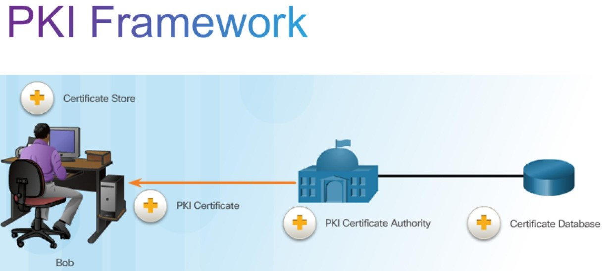

PKI Certificate Authority - УЦ, который занимается проверкой личности и выдает сертификат со своей удостоверяющей подписью (как удостоверение личности/паспорт). 

Доверие выданному сертификату определяется доверием к ключу центра сертификации, а тот в свою очередь может иметь вышестоящие CA. Иерархическая картинка root CA/subordinate CA - ниже.

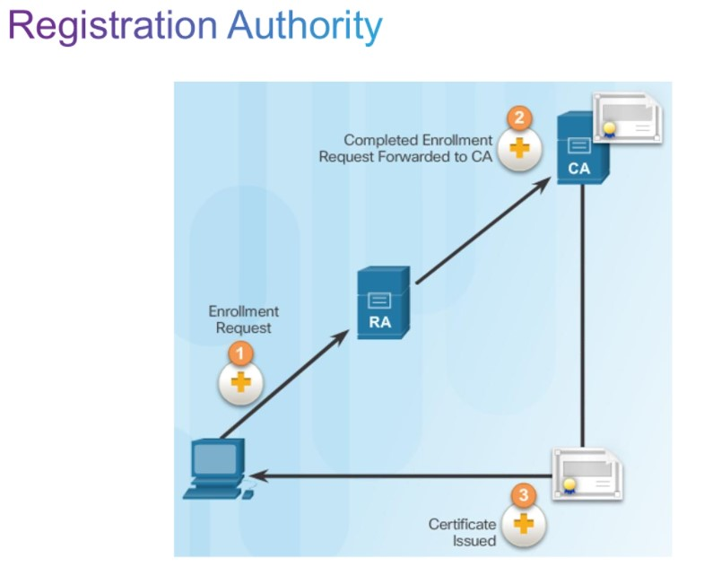

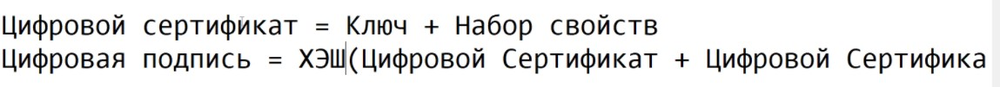

