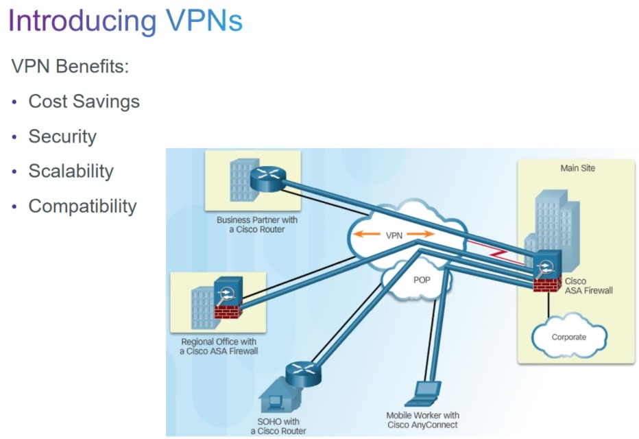
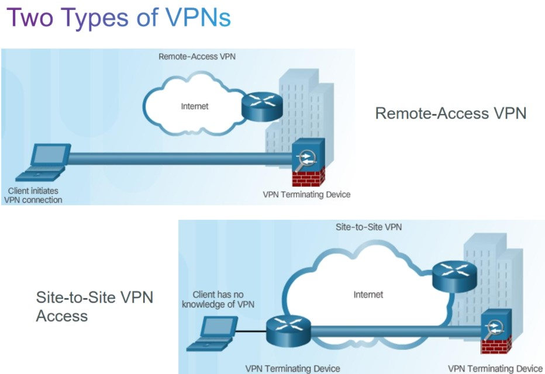
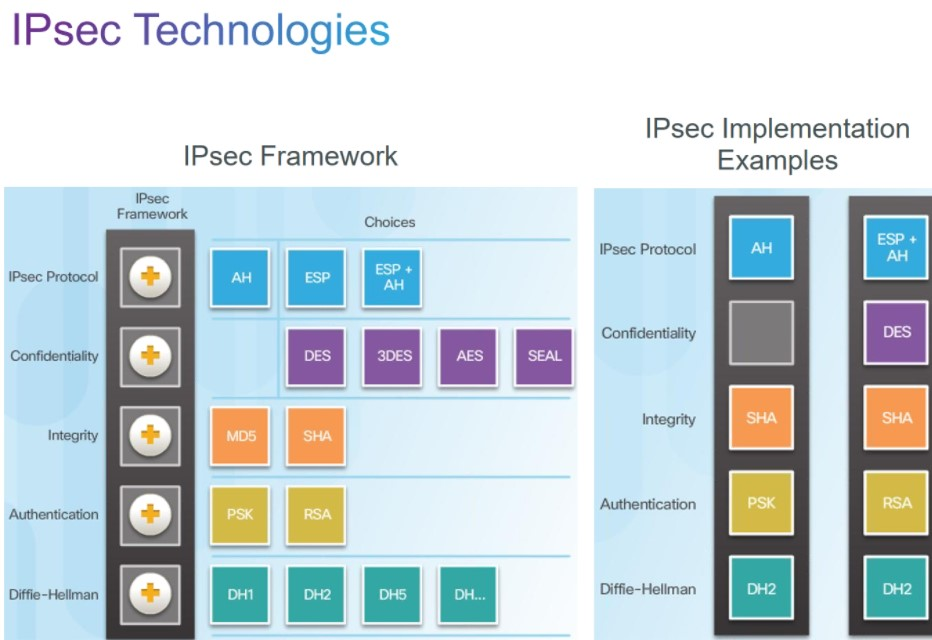
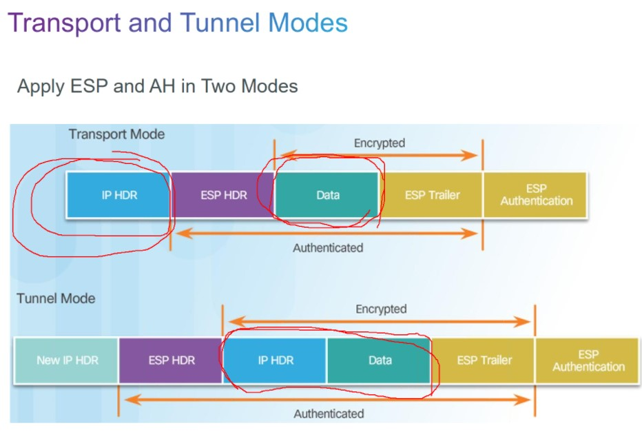
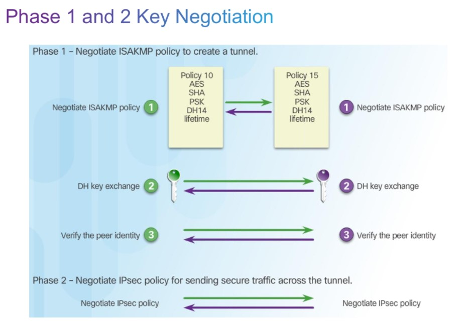
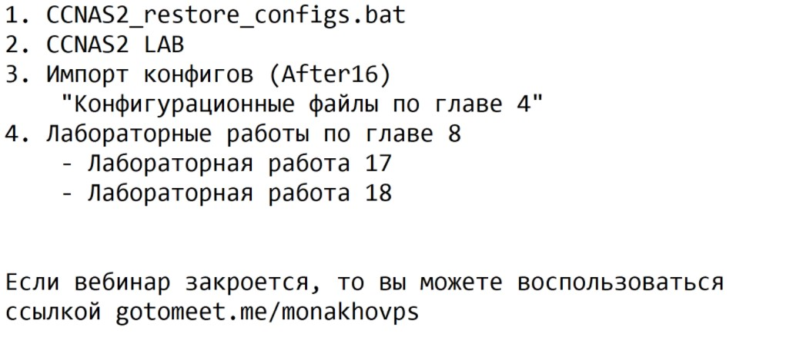

# SPECIALIST 20210313

## VPN

VPN строятся по общим алгоритмам, поэтому можно настраивать VPN между разными устройствами и программами.

# 2 типа VPN
- Remote-Sete
- Site-to-Site

# Конструкция VPN на примере IPSec

- Протоколы IPSEC
   - AH (не обеспечивает конфиденциальность)
   - ESP (наиболеее используемый)
   - ESP+AH
- Конфиденциальногсть
   - DES
   - 3DES
- Целостность
   - MD5
   - SHA
   - ГОСТ
- Аутентификация
   - PSK
   - RSA
- Deffie-hellman Group
   - DH1
   - DH2
   - DH5
   - DH
   ...

Ipsec сам настройкой этих параметров не занимается. IKE (internet key exch), на основе протокола ISAKMP, согласует работу IPSec, после чяего IPSec может работать.

ESP, AH - могут работать в туннельном режиме и транспортном
- транспортный - шифруется только данные. меньше безопасности и меньше накладных расходов.
- туннельный - шифруется все + новый заголовок, уменьшается полезная нагрузка пакета.

## Согласование фаз IPSec VPN

- Фаза 1  - IKE
   - туннель для защиты служебных данных. Работает IKE (согласование ISAKMP политик): то, как будет защищаться служебный трафик (не боевой). 
   - Работа DH: генерятся ключи
   - проверка аутентификации другой стороны (по закрытому служебному туннелю)
- Фаза II - IPSec
   - Согласование политик для защиты боевых данных

Для проверки роаботы VPN - проверяем состояние фаз и если какой-то фазы нет, то значит есть несовпадение политик. В фазе 1 - проверяем аутентификацию

___Лаборатороки___

# NETACAD Implementing VPN
VPN строятся поверх public сетей, и самые первые не имели целью сколько-нибудь шифровать или аутентифицировать передаваемый трафик. Например GRE -протокол которые не делает шифрования. Но все-таки основное назначение - построение PRIVATE сегмента, что подразумевает защиту передаваемых данных. Итак, наиболее общие примеры VPN:
- L3
   - GRE
   - IPSec
-L2
   - MPLS (multiprotocol label switching)