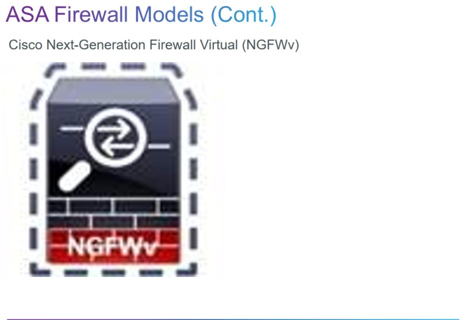
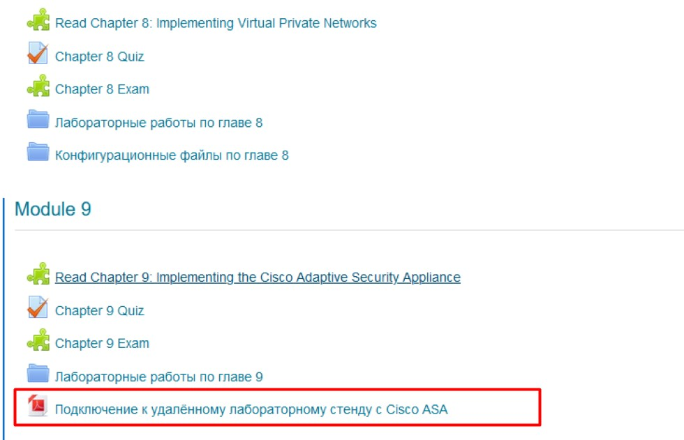

25.03.2021
с 18:00 до 19:00
gotomeet.me/monakhovps


# SPECIALIST 20210320
Cisco ASA 5500 - классическая, со своей ОС, своей архитектурой
   - CLI
   - ASDM (asa sec device manager)

Cisco покупает SourceFire (cisco+snort+WEB), получили Cisco ASA 5500-X with RIREPOWER services. Это сама ASA + SSD с VM
Cisco 5500-X
   - CLI
   - ASDM
   - Firepower - через WEB

Cisco Firepower - x86 решение, единичной железкой - через WEB? а если надо 
   - WWW
   - FMC (forepower management Center)


Клкассическая ASA (например 5505) еще используется. 5500-X - тоже работаем как с классической ASA, общие принципы работают на всех ASA.

Лицйензирование - болото ((. Без подписок любой NGN FW - мусор с DPI/ При покупке - лицензия K8 (DES-56), это сделано для облегчения импорта в другие страны. Через сайт Cisco можно заказать бесплатно K9 (SSH)
- Hardware
    - Base license
    - Security Plus
- Subscription (на год)
   - URL - фильтрация url
   - AMP
   - IPS/IDS
VPN
   - Anyconnect (по количеству пользователей в год) + поддержка новых версий


В 6000 можно вставить модуль с ASA

Железки надо ставить парой, кластером, особенно в Main Office. Есть виртуальные решения




## Железная ASA - контексты безопасности (для каждого клиента)
изолированные пространства правил, интерфейсов. Хотя виртуальны АСЫ не дробят


## Отказойстойчивость


- Active/Standby
- Active/Active
- Clustering (2 ASA работают как одна), рекомендуется для тысяч VPN-сессий. Кластер может быть распределенным, географически разнесенным

## Identity Firewall


ASA интегрируется с AD (ldap) и оперирует уже понятиями групп AD. Можно также настроить CDA (content delivery Agent).

## Режимы работы


- Transparent
- Routed

## ASA Security Level
ASA - похожа на маршрутизатор. Но на IF надо настроить:
- имена ___nameif___, и обращаться к IF по этим алиасам. 
- Security-level (0-100) - это просто число. Чем номер больше, тем IF безопаснее. Тор есть это просто некий вес, определяющий степень необходимой защиты. Трафик из зоны с большим весом (100) в зону с меньшим весом ___Исходящий___ - разрешен, с инспектированием. В обратную сторону, из меньшего веса, в больший - ___Входящий___, трафик не пойдет.


Количество зон определяется лицензированием, ASA позволяет объединять IF в зоны и работать уже с зонами как ZBPF


по-умолчанию трафик между одинаковыми security-level запрещен, надо будет писать ACL.

## ASA объекты
object
   - network
      - host
      - subnet
      - range
      - fqdn
   - Service
      - protocol
      - port

Задача: Три сервера, предоставить по tpcp/80, tcp/443

Решение: Создаем объекты
   - www1
   - www2
   - www3
   - группа WWW-сервера

Создаем объекты
   - tcp/80
   - tcp/443
   - группа ПОРТЫ

Создаем правило
   - разрешить доступ отовсюду в группу WWW-сервера, по группе ПОРТЫ

Лабораторная работа




# Лабораторка
Схема подключения


По тексту задания я - слева, в схеме - есть провайдер, с внешним выходом в инет. ASA - без лицензий, как положена для образовательных, имеет ограничение - 100 кбит/сек. Если в задании есть табличка как ниже, то джелаем свою часть (левую или правую, в моем случае - левую)


В лабе используется ASAv


Команды:
```
sho int ip br
sho nameif
sho ip addr
<IF>
ip add x.x.x.x m.m.m.m
nameif <inside/dmz/outside>
security level <0,50,100>
no shut
</IF>
...
show route
route outside 0 0 10.1.1.6

dns domain-lookup outside
dns name-server 10.1.1.6

...
show clock 
show clock detail 

clock timezone MSK +3 

ntp server 10.1.1.6


```


